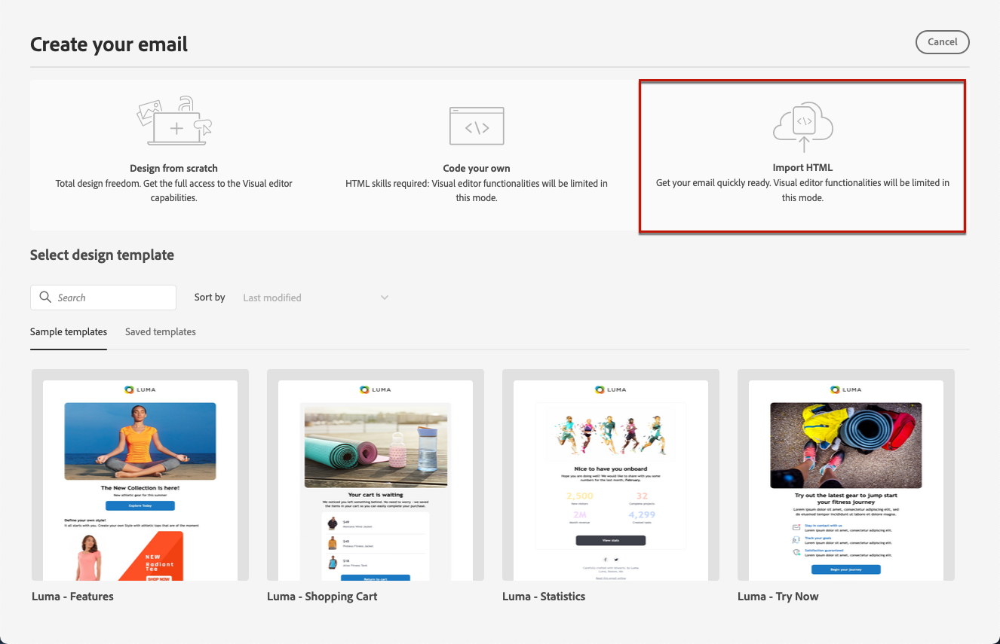

# 使用範本加速器將影像轉換為HTML範本 {#image-to-html}

>[!CONTEXTUALHELP]
>id="ajo_template_accelerator"
>title="範本加速器"
>abstract="使用範本加速器將靜態影像設計(JPEG或PNG)轉換為完全可自訂的HTML電子郵件範本。 此AI支援功能可協助您將視覺設計快速轉換為回應式、可編輯的電子郵件內容。 注意：當您上傳影像進行轉換時，電子郵件中的所有現有內容都會刪除。"

>[!AVAILABILITY]
>
>此功能為「有限可用性」的狀態。請聯絡您的 Adobe 代表以取得存取權。

## 概觀 {#overview}

範本加速器是&#x200B;**內容範本**&#x200B;功能表中提供的AI支援創新功能，可將靜態影像設計轉換為完全可自訂的HTML電子郵件內容範本，大幅加快電子郵件建立速度。 此工具可讓行銷人員將視覺設計從圖形設計工具或設計工具轉換為回應式、可編輯的電子郵件範本，這些範本可儲存至內容範本資料庫，然後在多個歷程及行銷活動中重複使用。

透過運用創作AI技術，Template Accelerator可分析影像中的版面、印刷樣式、顏色和視覺元素，並產生簡潔的結構化HTML程式碼，以維持設計的精確度，同時確保完全可編輯性並與Email Designer相容。

**主要優點：**

* **加速撰寫**：立即將設計模型轉換為可重複使用的內容範本，減少電子郵件建立時間
* **Designer-developer bridge**：使用視覺化設計時，不需要手動HTML編碼
* **設計逼真度**：建立可編輯的內容時，保持原始設計的完整性
* **可重複使用**：將範本儲存至內容範本資料庫，以用於多個歷程和行銷活動
* **電子郵件相容性**：產生HTML，可順暢地與電子郵件Designer及跨電子郵件使用者端運作

## 先決條件 {#prerequisites}

在使用範本加速器之前，請確定您擁有：

* 使用電子郵件Designer存取Adobe Journey Optimizer
* 包含您的電子郵件設計的JPEG或PNG格式影像檔案
* 範本加速器功能的存取許可權有限(請聯絡您的Adobe代表)

>[!NOTE]
>
>為達到最佳效果，請使用具有清晰視覺元素和可讀文字的高品質影像。 影像的寬度最好介於600到800畫素之間，以符合標準的電子郵件尺寸。

## 將影像轉換為HTML範本 {#convert-image}

若要將影像設計轉換為完全可自訂的HTML電子郵件範本，請遵循下列步驟：

1. 從左側功能表選取&#x200B;**[!UICONTROL 內容管理]** > **[!UICONTROL 內容範本]**，以存取「內容範本」清單。

1. 按一下&#x200B;**[!UICONTROL 建立範本]**。

1. 填寫範本詳細資料，並選取&#x200B;**[!UICONTROL 電子郵件]**&#x200B;作為頻道。

1. 按一下&#x200B;**[!UICONTROL 建立]**&#x200B;以存取電子郵件Designer。

1. 在電子郵件Designer首頁上，選取&#x200B;**[!UICONTROL 匯入HTML]**。

   

1. 在匯入對話方塊中，您會看到&#x200B;**[!UICONTROL 將影像轉換為HTML]**&#x200B;區段。

   >[!CAUTION]
   >
   >當您上傳影像以進行轉換時，將會刪除目前新增至電子郵件中的&#x200B;**所有內容，並以**&#x200B;產生的範本取代。 如果您的電子郵件中有現有內容，請務必先儲存內容，再繼續進行影像轉換。

1. 按一下&#x200B;**[!UICONTROL 載入影像]**&#x200B;按鈕以選取您的影像檔案。

1. 拖放您的影像檔案(JPEG或PNG)，或按一下以瀏覽並選取您的影像檔案。

1. 按一下&#x200B;**[!UICONTROL 產生]**&#x200B;以開始AI支援的轉換程式。

   >[!NOTE]
   >
   >根據影像設計的複雜性和大小，產生程式最多可能需要5分鐘。 AI分析並轉換影像時，請耐心等候。

1. 轉換完成後，您的內容範本將自動儲存為草稿。 接著，您可以在電子郵件HTML畫布中檢閱及編輯產生的Designer範本。

1. 轉換後的範本會在Designer電子郵件中開啟，並具備完整的編輯功能。 您現在可以：

   * 編輯文字內容並套用個人化
   * 修改影像並新增連結
   * 調整顏色、字型和樣式
   * 新增、移除或重新排列內容元件
   * 和任何其他範本一樣，善用所有電子郵件Designer功能

   

1. 進行任何必要的調整以調整範本並符合您的品牌方針。

1. 在滿意您的範本後，按一下[儲存]，即可儲存內容範本。**&#x200B;**

1. 您的範本現在可在內容範本資料庫中使用，並可在歷程或行銷活動中建立電子郵件時使用。 [瞭解如何使用內容範本](use-email-templates.md)

## 在電子郵件中使用您轉換的範本 {#use-template}

使用範本加速器建立並儲存內容範本後，您就可以在歷程或行銷活動中設計電子郵件時使用該範本：

1. 在歷程或行銷活動中建立電子郵件時，請從&#x200B;**[!UICONTROL 編輯內容]**&#x200B;畫面存取電子郵件Designer 。

1. 在電子郵件Designer首頁上，前往&#x200B;**[!UICONTROL 儲存的範本]**&#x200B;標籤。

1. 從清單中選取範本加速器產生的範本。

1. 按一下&#x200B;**[!UICONTROL 使用此範本]**&#x200B;以將其套用至您的電子郵件。

1. 視需要繼續編輯及個人化您的電子郵件內容。

深入瞭解[使用電子郵件範本](use-email-templates.md)和[建立內容範本](../content-management/content-templates.md)。

## 最佳做法 {#best-practices}

若要在使用範本加速器時取得最佳結果，請遵循下列建議：

**開始之前**

* **儲存現有內容**：將影像轉換為HTML將會取代您電子郵件中的所有現有內容。 使用此功能前，請務必儲存您目前的工作。
* **規劃您的工作流程**：在電子郵件建立程式的開始使用範本加速器，或確定您已準備好取代所有目前的內容。

**影像準備**

* **解析度**：使用高解析度影像（至少1200px寬），以取得更好的文字辨識和元素偵測
* **清晰度**：確保文字清晰易讀，且視覺元素定義清楚
* **寬度**：以標準電子郵件寬度(600-800px)設計影像，以符合一般電子郵件使用者端需求
* **檔案格式**：使用JPEG或PNG格式 — 避免壓縮或低品質的影像
* **完整設計**：將完整的電子郵件設計包括在單一影像中（從頁首到頁尾）

**設計考量**

* **簡單版面**：較簡單、結構良好的版面轉換比高度複雜的設計更準確
* **標準元素**：使用常見的電子郵件設計模式（頁首、本文區段、CTA、頁尾）
* **文字清晰度**：確保文字與背景有足夠的對比
* **網頁安全字型**：使用一般網頁安全字型的設計將擁有更理想的逼真度
* **避免重疊的元素**：請保持設計元素間的明確分隔，以更清楚辨識結構

**轉換之後**

* **檢閱您的草稿**：轉換完成後，您的範本會自動儲存為草稿。 請花點時間仔細檢閱產生的HTML的準確性
* **徹底測試**：跨不同的電子郵件使用者端與裝置測試電子郵件
* **手動調整**：使用電子郵件Designer的完整編輯功能，視需要進行調整
* **品牌一致性**：確認色彩、字型和樣式符合您的品牌准則
* **Personalization**：視需要新增動態內容和個人化權杖
* **協助工具**：視需要檢閱和增強協助工具功能

## 限制和考量事項 {#limitations}

使用範本加速器時，請注意下列限制：

* **AI解譯**： AI會根據影像的視覺解譯產生HTML。 複雜或不尋常的設計在轉換後可能需要手動調整。

* **文字準確性**：當AI嘗試正確識別和重製文字時，請一律驗證文字內容並根據需要進行更正。

* **動態內容**：轉換程式會根據您的影像建立靜態HTML。 轉換後，您需要手動新增個人化、動態內容和追蹤。

* **複雜版面**：包含複雜分層、不尋常形狀或非標準元素的高度複雜設計，可能無法完全轉換。 較簡單的設計通常會產生更好的結果。

* **處理時間**：視影像的複雜性和大小而定，轉換過程最多可能需要5分鐘。 轉換完成後，範本會自動儲存為草稿。

* **有限可用性**：作為有限可用性功能，範本加速器正在持續改進。 功能和正確性可能會有所不同，您的意見回饋有助於增強功能。

>[!NOTE]
>
>Template Accelerator的設計目的，是要提供建立電子郵件的強大起點。 您應使用電子郵件Designer來檢閱及調整產生的HTML，以確保其符合您的確切需求。

## 常見問題 {#faq}

+++使用範本加速器時，現有的電子郵件內容會發生什麼事？

上傳影像進行轉換時，電子郵件中的所有現有內容將會刪除並取代為新產生的範本。 使用此功能之前，請務必儲存任何重要內容。 您最好在電子郵件建立程式的開頭使用範本加速器。

+++

+++支援哪些檔案格式？

範本加速器支援JPEG (.jpg、.jpeg)和PNG (.png)影像格式。

+++

+++轉換程式需要多久的時間？

轉換最多可能需要5分鐘，視影像設計的複雜性和大小而定。 轉換完成後，您的檔案會自動儲存為草稿，供您檢閱和編輯。

+++

+++是否可以編輯產生的範本？

是！產生的HTML範本會在具有完整編輯功能的電子郵件Designer中開啟。 您可以修改範本的所有方面，包括文字、影像、樣式、版面配置及結構。

+++

+++如果轉換與我的設計不完全相符，會發生什麼情況？

AI會盡最大努力準確地詮釋您的設計，但可能需要一些手動細分。 使用電子郵件Designer來調整任何需要微調的元素。

+++

+++我是否可以將此功能用於登陸頁面或其他內容型別？

範本加速器目前是特別為電子郵件範本設計的。 對於其他內容型別，請使用電子郵件Designer中可用的標準設計和匯入選項。

+++

+++我需要特殊許可權才能使用此功能嗎？

範本加速器在「有限可用性」中提供。 您需要有限可用性存取權(若要取得存取權，請聯絡您的Adobe代表)和標準電子郵件Designer許可權，才能使用此功能。

+++

+++我可以在多個行銷活動中重複使用轉換的範本嗎？

是！使用「範本加速器」建立的範本會自動儲存至「內容範本」資料庫。 您可以在歷程及行銷活動中的任何電子郵件中存取及重複使用它們。 [了解更多](../content-management/content-templates.md)

+++

## 相關主題 {#related-topics}

* [開始使用內容範本](../content-management/content-templates.md)
* [建立內容範本](../content-management/create-content-templates.md)
* [使用電子郵件範本](use-email-templates.md)
* [開始使用電子郵件設計](get-started-email-design.md)
* [匯入電子郵件內容](existing-content.md)
* [從頭開始設計內容](content-from-scratch.md)

