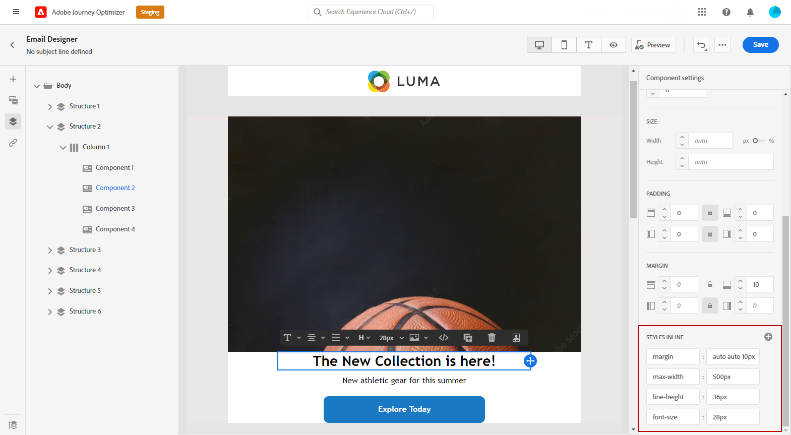

# 新增內嵌樣式屬性 {#inline-styling}

在電子郵件Designer介面中，當您選取元素並在側面板上顯示其設定時，可以自訂該特定元素的內嵌屬性及其值。

1. 選取內容中的元素。

1. 在&#x200B;**[!UICONTROL 樣式]**&#x200B;索引標籤中，尋找&#x200B;**[!UICONTROL 進階]**&#x200B;下拉式清單下的&#x200B;**[!UICONTROL 樣式內嵌]**&#x200B;設定。

   

1. 修改現有屬性的值，或使用&#x200B;**+**&#x200B;按鈕新增屬性。 您可以新增任何符合 CSS 的屬性和值。

   

然後，樣式會套用至選取的元素。 如果子元素沒有定義特定的樣式屬性，則繼承父元素的樣式。
