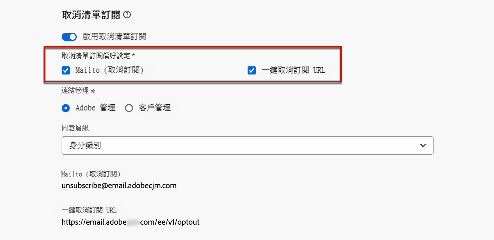

# 清單取消訂閱{#list-unsubscribe}

<!--Do not modify - Legal Review Done -->

在 [!DNL Adobe Journey Optimizer]設定新的電子郵件管道設定時，從清單選取[子網域後](email-settings.md#subdomains-and-ip-pools)，會顯示&#x200B;**[!UICONTROL 啟用取消清單訂閱]**&#x200B;選項。這項設定預設為啟用。


一鍵式清單取消訂閱 URL 是在電子郵件寄件者資訊旁邊顯示的取消訂閱連結或按鈕，可讓收件者只需按一下即可立即選擇退出您的郵寄清單。

例如，一鍵取消訂閱 URL 會在 Gmail 顯示以下連結：


>[!IMPORTANT]
>
>若要在電子郵件標題中顯示一鍵取消訂閱 URL，收件者的電子郵件用戶端必須支援此功能。

根據電子郵件用戶端和電子郵件組態取消訂閱設定，按一下電子郵件標頭的取消訂閱連結將產生下列影響：

* 啟用 **Mailto (取消訂閱)** 功能時，會根據您設定的子網域，將取消訂閱要求傳送至預設取消訂閱位址。
* 啟用&#x200B;**一鍵取消訂閱 URL** 功能時，或如果您在電子郵件內文內容插入取消訂閱 URL，當收件者按一下一鍵取消訂閱 URL (根據您設定的子網域) 時，收件者會直接在頻道層級或 ID 層級 (視同意的設定方式而定) 選擇退出。

>[!NOTE]
>
>請參閱下方[本節](#enable-list-unsubscribe)以瞭解如何管理取消訂閱設定。

在這兩種情況下，當收件者按一下選擇退出連結時，則會據此處理其取消訂閱請求。 會立即退出對應的設定檔，可在[體驗平台](https://experienceleague.adobe.com/docs/experience-platform/profile/ui/user-guide.html?lang=zh-Hant#getting-started){target="_blank"}中更新此選項。

>[!NOTE]
>
>有時，由於下游資料處理的緣故，取消訂閱事件可能需要更長的時間才能反映在設定檔層級。 留出一些時間讓系統更新。

## 啟用清單取消訂閱 {#enable-list-unsubscribe}

>[!CONTEXTUALHELP]
>id="ajo_admin_preset_unsubscribe"
>title="新增取消訂閱 URL 至您的電子郵件"
>abstract="啟用此選項可自動將取消訂閱 URL 新增至電子郵件標頭。透過在電子郵件內容中插入一鍵式選擇退出連結，您也可在訊息中設定取消訂閱 URL。"
>additional-url="https://experienceleague.adobe.com/zh-hant/docs/journey-optimizer/using/channels/email/email-opt-out#one-click-opt-out" text="設定一鍵選擇退出電子郵件內容"

啟用&#x200B;**[!UICONTROL 啟用清單取消訂閱]**&#x200B;選項時，如果收件者的電子郵件用戶端支援，則電子郵件標頭預設會包含收件者可用以取消訂閱您郵寄清單的 mailto 和/或 URL。

>[!NOTE]
>
>如果停用此選項，一鍵取消訂閱 URL 將不會顯示在電子郵件標頭。

「取消清單訂閱」標頭提供兩種功能，除非您取消選取至少一項功能，否則按預設，這兩項功能都會啟用：

{width="80%"}

* **[!UICONTROL Mailto (取消訂閱)]** 位址，這是將取消訂閱要求路由至進行自動處理的目標位址。在 [!DNL Journey Optimizer]，取消訂閱電子郵件地址是根據[選取的子網域](email-settings.md#subdomains)，顯示在管道設定的預設 **[!UICONTROL Mailto (取消訂閱)]** 位址。<!--With this method, clicking the Unsubscribe link sends a pre-filled email to the unsubscribe address specified in the email header.-->

*  **[!UICONTROL 一鍵取消訂閱 URL]**，預設為根據[選取的子網域](email-settings.md#subdomains)產生的一鍵選擇退出 URL 清單取消訂閱標頭。<!--With this method, clicking the Unsubscribe link directly unsubscribes the user, requiring only a single action to unsubscribe.-->

您可以從下拉式清單中，選取&#x200B;**[!UICONTROL 同意層級]**。它可特定於管道或輪廓身分。依據設定，當使用者使用電子郵件標題的「取消清單訂閱」URL 時，同意內容就會在 [!DNL Adobe Journey Optimizer] 中，按管道層級或 ID 層級更新。

## 護欄和推薦 {#list-unsubscribe-guardrails}

一鍵清單取消訂閱 URL 功能可讓您的收件者輕鬆選擇退出通訊。 不過，由於並非所有電子郵件用戶端都在電子郵件標頭中支援此連結，因此 Adobe 建議您也在電子郵件內文新增[一鍵選擇退出連結](email-opt-out.md#one-click-opt-out)或 [取消訂閱連結](email-opt-out.md#add-unsubscribe-link)。

**[!UICONTROL Mailto (取消訂閱)]** 功能和&#x200B;**[!UICONTROL 一鍵取消訂閱 URL]** 功能是選用功能。

* 如果您在[電子郵件組態設定](email-settings.md)中啟用了&#x200B;**[!UICONTROL 啟用清單取消訂閱]**&#x200B;選項，我們建議您同時啟用這兩種方法 — **Mailto (取消訂閱)** 和&#x200B;**一鍵取消訂閱 URL**。 並非所有電子郵件用戶端都支援 HTTP 方法。 透過提供的 Mailto 清單取消訂閱功能，您可以選取替代方案，更好地保護您的寄件者信譽，並且您的所有收件者都能夠使用取消訂閱功能。

* 如果您不想使用預設產生的一鍵取消訂閱 URL，可以取消核取該功能。

   * 在&#x200B;**[!UICONTROL 啟用取消清單訂閱]**&#x200B;選項處於開啟狀態且&#x200B;**[!UICONTROL 一鍵取消訂閱 URL]** 功能處於取消勾選的情況下，如果您在使用此設定所建立的訊息中新增[一鍵選擇退出連結](../email/email-opt-out.md#one-click-opt-out)，則「取消清單訂閱」標頭會取得您在電子郵件內文插入的一鍵選擇退出連結，並將其用作一鍵取消訂閱 URL 值。


     

   * 如果您未在訊息內容加入一鍵選擇退出連結，且管道設定中的預設&#x200B;**[!UICONTROL 一鍵取消訂閱 URL]** 取消勾選，則沒有 URL 會傳遞至「取消清單訂閱」標題的電子郵件標頭。


  >[!NOTE]
  >
  >在 [本章節](../email/email-opt-out.md#unsubscribe-header)之中，進一步了解訊息中的管理取消訂閱功能等更多資訊。

請在 [!DNL Journey Optimizer] 中，同意交由體驗平台 [ 同意結構描述 ](https://experienceleague.adobe.com/docs/experience-platform/xdm/field-groups/profile/consents.html?lang=zh-Hant){target="_blank"} 處理。預設情況下，如「同意」欄位值為空，則視為同意接受通訊。 您可以在上線時將此預設值修改為[此處](https://experienceleague.adobe.com/docs/experience-platform/xdm/data-types/consents.html?lang=zh-Hant#choice-values){target="_blank"}列出的可能數值之一，或使用[同意策略](../action/consent.md)來覆寫預設邏輯。

目前，[!DNL Journey Optimizer]未將特定標籤附加至清單取消訂閱功能所觸發的取消訂閱事件。 如果您需要區分清單取消訂閱點擊與其他取消訂閱操作，則必須在外部實施自訂標記，或利用外部登陸頁面進行追蹤。

## 從外部管理取消訂閱資料 {#custom-managed}

>[!CONTEXTUALHELP]
>id="ajo_email_config_unsubscribe_custom"
>title="定義如何管理取消訂閱的資料"
>abstract="**Adobe 管理**：同意資料由您在 Adobe 系統內進行管理。<br>**客戶管理**：同意資料由您在外部系統中進行管理，除非由您啟動，否則 Adobe 系統中不會同步更新同意資料。"

>[!CONTEXTUALHELP]
>id="ajo_email_config_unsubscribe_custom_url"
>title="輸入您自己一鍵取消訂閱 URL"
>abstract="**一鍵取消訂閱 URL** 必須使用 POST 要求方法。"

如果您在 Adobe 外部管理同意，請選取&#x200B;**[!UICONTROL 客戶管理]**&#x200B;選項，即可輸入自訂取消訂閱電子郵件地址，還有自己的一鍵式取消訂閱 URL。

{width="80%"}

 **[!UICONTROL 一鍵取消訂閱 URL]** 必須是 POST URL。

>[!WARNING]
>
>如果您使用&#x200B;**[!UICONTROL 客戶管理]**&#x200B;的選項，Adobe 就不會儲存任何取消訂閱，或是同意資料。 使用&#x200B;**[!UICONTROL 客戶管理]**&#x200B;選項，組織即選擇使用外部系統，並在此類外部系統中負責管理同意資料。外部系統與 [!DNL Journey Optimizer] 之間不會自動同步處理同意資料。 若同意資料的同步處理作業源自外部系統，以便更新 [!DNL Journey Optimizer] 中的使用者同意資料，則此同步作業必須由組織透過資料傳輸方式啟動，才能將同意資料推播回 [!DNL Journey Optimizer]。

### 將自訂屬性附加至您的端點 {#custom-attributes}

選取&#x200B;**[!UICONTROL 客戶管理]**&#x200B;的選項時，若您輸入會在行銷活動或歷程中使用的自訂端點，當收件者按一下「取消訂閱」連結時，[!DNL Journey Optimizer] 就會將一些輪廓專屬的預設參數新增到同意更新事件上 <!--sent to the custom endpoint -->。

若要進一步個人化您的自訂&#x200B;**[!UICONTROL 一鍵取消訂閱URL]**，您可以定義也會附加至同意事件的自訂屬性。

若要這麼做，請使用&#x200B;**[!UICONTROL URL追蹤引數]**&#x200B;區段。 您在對應區段中定義的所有URL追蹤引數，除了預設引數外，還將附加至自訂一鍵取消訂閱URL的結尾。 [瞭解如何設定自訂URL追蹤](url-tracking.md)

### 設定解密 API {#configure-decrypt-api}

當您的收件者按一下自訂取消訂閱連結時，附加至同意更新事件的引數將以加密方式傳送至端點。 因此，外部同意系統需要透過[Adobe Developer](https://developer.adobe.com){target="_blank"}，才能實施特定 API 來解密從Adobe 傳送的參數。

擷取這些參數的 GET 呼叫大多取決於目前正在使用的取消清單訂閱選項，**[!UICONTROL 一鍵取消訂閱 URL]** 或是 **[!UICONTROL Mailto (取消訂閱)]**。

<!--To configure the API to send back the information to [!DNL Adobe Journey Optimizer] when a recipient has unsubscribed using the List unsubscribe option with custom endpoints, follow the steps below.-->

+++ 一鍵取消訂閱 URL

使用&#x200B;**[!UICONTROL 一鍵取消訂閱 URL]** 選項時，使用者按一下 [取消訂閱] 連結即可直接取消訂閱。

GET 呼叫分述如下：

端點：https://platform.adobe.io/journey/imp/consent/decrypt

查詢參數：

* **params**：包含加密的裝載
* **pid**：加密的輪廓 ID

這兩個參數包含在傳送到自訂端點的同意更新事件中。

標頭要求：

* x-api-key
* x-gw-ims-org-id
* 授權 (用於技術帳戶驗證的使用者權杖)

以下是範例參數及同意回應：

| 查詢參數 | 範例有效承載 |
|---------|----------|
| pid | {<br>&quot;pid&quot;  : &quot;5142733041546020095851529937068211571&quot;,<br>&quot;pns&quot;  : &quot;CRMID&quot;,<br>&quot;e&quot;    : &quot;john@google.com&quot;,<br>&quot;ens&quot;  : &quot;Email&quot;,<br>} |
| 參數 | {<br>&quot;m&quot;  : &quot;messageExecutionId&quot;,<br>&quot;ci&quot;  : &quot;campaignId&quot;,<br>&quot;jv&quot; : &quot;journeyVersionId&quot;,<br>&quot;ja&quot; : &quot;journeyActionId&quot;,<br>&quot;s&quot;  : &quot;sandboxId&quot;,<br>&quot;us&quot; : &quot;unsubscribeScope&quot;<br>} |

同意回應：

```
{
    "profileNameSpace": " CRMID ",
    "profileId": "5142733041546020095851529937068211571",
    "emailAddress": "john@google.com",
    "emailNameSpace": "Email",
    "sandboxId": "sandboxId",
    "optOutLevel": "channel",
    "channelType": "email",
    "timestamp": "2024-11-26T14:25:09.316930Z"
}
```

+++

+++ Mailto (取消訂閱)

使用 **[!UICONTROL Mailto (取消訂閱)]** 選項時，按一下 [取消訂閱] 連結後將開啟一封預先填入的電子郵件，該電子郵件將傳送至指定的取消訂閱電子郵件地址。


GET 呼叫分述如下。

端點：https://platform.adobe.io/journey/imp/consent/decrypt

查詢參數：

* **emailParams**：包含 **params** (加密承載) 和 **pid** (加密輪廓 ID) 參數的字串。


**params** 和 **pid** 參數包含在傳送至自訂端點的同意更新事件中。

標頭要求：

* x-api-key
* x-gw-ims-org-id
* 授權 (用於技術帳戶驗證的使用者權杖)

以下是範例參數及同意回應：

| 查詢參數 | 範例有效承載 |
|---------|----------|
| emailParams | {<br>&quot;p&quot;  : &quot;profileId&quot;,<br>&quot;pn&quot;  : &quot;profileNamespace&quot;,<br>&quot;en&quot;  : &quot;emailNamespace&quot;,<br>&quot;ci&quot;  : &quot;campaignId&quot;,<br>&quot;jv&quot; : &quot;journeyVersionId&quot;,<br>&quot;ja&quot; : &quot;journeyActionId&quot;,<br>&quot;si&quot;  : &quot;sandboxId&quot;,<br>&quot;us&quot;: &quot;unsubscribeScope&quot;<br>} |

同意回應：

```
{
    "profileNameSpace": " CRMID ",
    "profileId": "5142733041546020095851529937068211571",
    "emailAddress": "john@google.com",
    "emailNameSpace": "Email",
    "sandboxId": "sandboxId",
    "optOutLevel": "channel",
    "channelType": "email",
    "timestamp": "2024-11-26T14:25:09.316930Z"
}
```

+++
