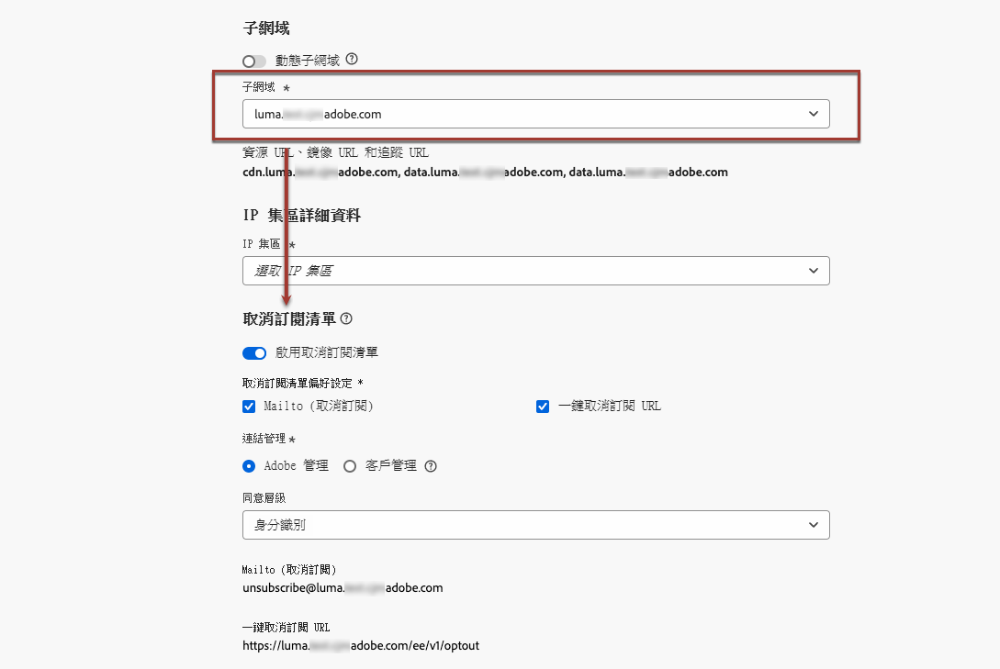
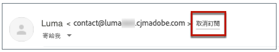
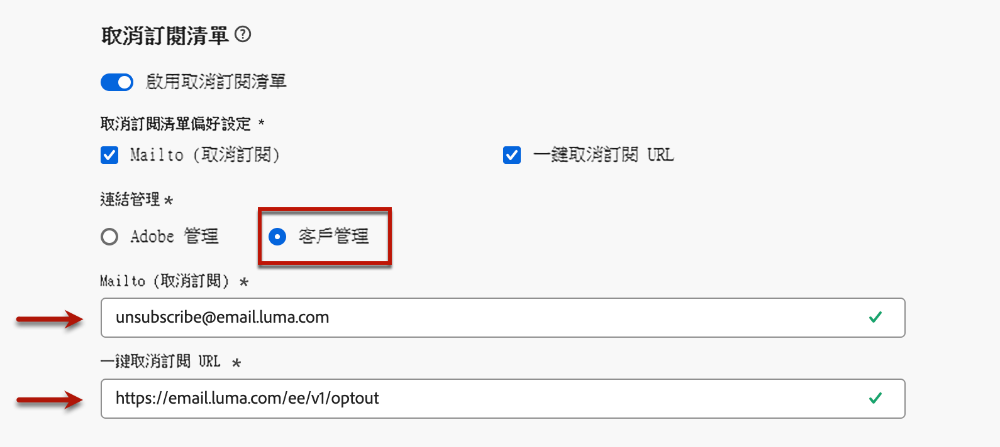

# 清單取消訂閱{#list-unsubscribe}

<!--Do not modify - Legal Review Done -->

設定新的電子郵件頻道設定時，只要從清單中選取[子網域](email-settings.md#subdomains-and-ip-pools)，系統就會顯示&#x200B;**[!UICONTROL 啟用清單取消訂閱]**&#x200B;選項。

## 啟用清單取消訂閱 {#enable-list-unsubscribe}

此選項預設為啟用，以在電子郵件標頭加入一鍵取消訂閱 URL，例如：

>[!NOTE]
>
>如果停用此選項，一鍵取消訂閱 URL 將不會顯示在電子郵件標頭。

清單取消訂閱標題有提供兩種功能，除非您取消核取其中一兩項功能，否則按預設，這兩項功能都會啟用：

{width="80%"}

* **[!UICONTROL Mailto (取消訂閱)]** 位址，這是將取消訂閱要求路由至進行自動處理的目標位址。

  在 [!DNL Journey Optimizer] 中，取消訂閱電子郵件地址是根據[選取的子網域](#subdomains-and-ip-pools)，顯示在頻道設定的預設 **[!UICONTROL Mailto (取消訂閱)]**&#x200B;位址。<!--With this method, clicking the Unsubscribe link sends a pre-filled email to the unsubscribe address specified in the email header.-->

* **[!UICONTROL 一鍵取消訂閱 URL]**，按預設是一鍵退出 URL 產生的清單取消訂閱標題，主要依據您在頻道設定中設定、設定的子網域。<!--With this method, clicking the Unsubscribe link directly unsubscribes the user, requiring only a single action to unsubscribe.-->

您可以從下拉式清單中，選取&#x200B;**[!UICONTROL 同意層級]**。它可特定於頻道或設定檔身分。依據設定，當使用者使用電子郵件標題的清單取消訂閱 URL 時，就會在 [!DNL Adobe Journey Optimizer] 中，按頻道層級或 ID 層級，更新同意內容。

**[!UICONTROL Mailto（取消訂閱）]**&#x200B;功能和&#x200B;**[!UICONTROL 一鍵取消訂閱 URL]** 功能是選用功能。

如果您不想使用預設產生的一鍵取消訂閱 URL，可以取消勾選該功能。在&#x200B;**[!UICONTROL 啟用清單取消訂閱]**&#x200B;選項處於開啟狀態且&#x200B;**[!UICONTROL 一鍵取消訂閱 URL]** 功能處於取消勾選的情況下，如果您在使用此設定所建立的訊息中新增[一鍵退出連結](../email/email-opt-out.md#one-click-opt-out)，則清單取消訂閱標頭會獲取您在電子郵件內文插入的一鍵退出連結，並將其用作一鍵取消訂閱 URL 值。

>[!NOTE]
>
>如果您未在訊息內容加入一鍵退出連結，且頻道組態設定中的預設&#x200B;**[!UICONTROL 一鍵取消訂閱 URL]** 已取消勾選，則清單取消訂閱標題的電子郵件標頭不會傳遞任何 URL。

在 [本章節](../email/email-opt-out.md#unsubscribe-header)中，進一步了解訊息中的管理取消訂閱功能等更多資訊。

## 請從外部管理取消訂閱資料 {#custom-managed}

>[!CONTEXTUALHELP]
>id="ajo_email_config_unsubscribe_custom"
>title="定義如何管理取消訂閱的資料"
>abstract="**Adobe 管理**：同意資料由您在 Adobe 系統內進行管理。 **客戶管理**：同意資料由您在外部系統中進行管理，除非由您啟動，否則 Adobe 系統中不會同步更新同意資料。"

>[!AVAILABILITY]
>
>此功能以有限可用性 (LA) 形式向一小部分客戶發布。

如果您在 Adobe 外部管理同意，請選取 [**[!UICONTROL 客戶管理]**]選項，即可輸入自訂取消訂閱電子郵件地址，還有自己的一鍵式取消訂閱 URL。

{width="80%"}

>[!WARNING]
>
>如果您使用&#x200B;**[!UICONTROL 客戶管理]**&#x200B;的選項，Adobe 就不會儲存任何取消訂閱，或是同意資料。 使用&#x200B;**[!UICONTROL 客戶管理]**&#x200B;的選項，組織會選擇使用外部系統，在這類外部系統中，會負責管理同意資料。 外部系統與 [!DNL Journey Optimizer] 之間並沒有自動同步處理同意資料。 同意資料的任何同步處理作業都源自外部系統，以便更新 [!DNL Journey Optimizer] 中的使用者同意資料，必須由組織透過資料傳輸方式啟動，才能將同意資料推播回[!DNL Journey Optimizer]。

### 設定解密 API {#configure-decrypt-api}

只要選取&#x200B;**[!UICONTROL 客戶管理]**&#x200B;選項，如果您輸入自訂端點，並在行銷活動或歷程中使用這些選項，當收件者按一下 [取消訂閱] 連結時，[!DNL Journey Optimizer] 就會將一些預設設定檔的特定參數附加到同意更新事件上 <!--sent to the custom endpoint -->。

這些參數會透過加密方式，傳送至端點。 因此，外部同意系統必須透過 [Adobe Developer](https://developer.adobe.com){target="_blank"} 實施特定 API，才能解密 Adobe 送出的參數。

擷取這些參數的 GET 呼叫大多取決於目前正在使用的清單取消訂閱選項，**[!UICONTROL 一鍵取消訂閱 URL]** 或是 **[!UICONTROL Mailto (取消訂閱)]**。

<!--To configure the API to send back the information to [!DNL Adobe Journey Optimizer] when a recipient has unsubscribed using the List unsubscribe option with custom endpoints, follow the steps below.-->

+++ 一鍵取消訂閱 URL

使用&#x200B;**[!UICONTROL 一鍵取消訂閱 URL]** 選項，按一下 [取消訂閱] 連結，即可直接取消訂閱使用者。

GET 呼叫分述如下：

端點：https://platform.adobe.io/journey/imp/consent/decrypt

查詢參數：

* **params**：包含加密的裝載
* **pid**：加密的輪廓 ID

會將這兩個參數加入到傳送到的自訂端點同意更新事件中。

頁首需求：

* x-api-key
* x-gw-ims-org-id
* 授權 (來自技術帳戶的使用者權杖)

+++

+++ Mailto (取消訂閱)

使用 **[!UICONTROL Mailto (取消訂閱)]** 選項，按一下 [取消訂閱] 連結，就會將預先填入的電子郵件傳送給指定的取消訂閱地址。

GET 呼叫分述如下。

端點：https://platform.adobe.io/journey/imp/consent/decrypt

查詢參數：

* **emailParams**：包含 **params** (加密承載) 和 **pid** (加密輪廓 ID) 參數的字串。

**參數**&#x200B;和 **pid** 會將參數加入要傳送給自訂端點的同意更新事件中。

頁首需求：

* x-api-key
* x-gw-ims-org-id
* 授權 (來自技術帳戶的使用者權杖)

+++
