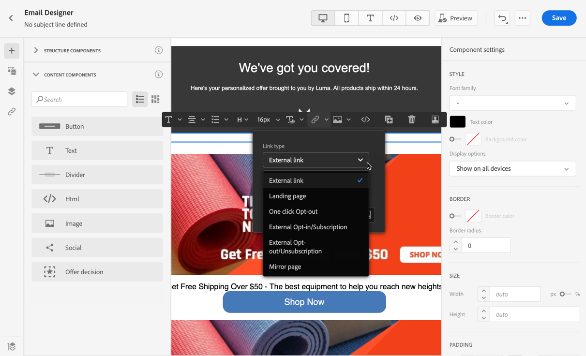

# 新增連結及追蹤訊息 {#tracking}

使用 [!DNL Journey Optimizer] 新增內容連結並追蹤傳送的訊息，以監控收件者的行為。

## 啟用追蹤 {#enable-tracking}

您可以檢查 **[!UICONTROL 電子郵件開啟]** 和/或 **[!UICONTROL 按一下電子郵件]** 選項。

>[!BEGINTABS]

>[!TAB 啟用歷程中的追蹤]

>[!TAB 在促銷活動中啟用追蹤]

>[!ENDTABS]

>[!NOTE]
>
>預設會啟用這兩個選項。

這可讓您透過以下方式追蹤收件者的行為：

* **[!UICONTROL 電子郵件開啟]**:已開啟的訊息。
* **[!UICONTROL 按一下電子郵件]**:點按電子郵件中的連結。

## 插入連結 {#insert-links}

設計訊息時，您可以新增連結至內容。

>[!NOTE]
>
>當 [追蹤已啟用](#enable-tracking)，則會追蹤訊息內容中包含的所有連結。

若要將連結插入電子郵件內容，請遵循下列步驟：

1. 選取元素並按一下 **[!UICONTROL 插入連結]** 中。

   

1. 選擇要建立的連結類型：

   * **[!UICONTROL 外部連結]**:插入外部URL的連結。

   * **[!UICONTROL 登陸頁面]**:插入登錄頁面的連結。 請參閱[本節](../landing-pages/get-started-lp.md)以進一步瞭解

   * **[!UICONTROL 按一下「選擇退出」]**:插入連結，讓使用者無需確認選擇退出即可快速取消訂閱您的通訊內容。 請參閱[此章節](../privacy/opt-out.md#one-click-opt-out)深入瞭解。

   * **[!UICONTROL 外部選擇加入/訂閱]**:插入連結以接受來自您品牌的通訊。

   * **[!UICONTROL 外部選擇退出/取消訂閱]**:插入連結以取消訂閱以免接收來自您品牌的通訊。 進一步瞭解[本章節](../privacy/opt-out.md#opt-out-management)中的選擇退出管理。

   * **[!UICONTROL 鏡像頁面]**:插入連結以在網頁瀏覽器中顯示電子郵件內容。 請參閱[此章節](#mirror-page)深入瞭解。

   

1. 您可以個人化連結。 進一步瞭解[本章節](../personalization/personalization-syntax.md#perso-urls)的個人化 URL。

1. 儲存您的變更。

1. 建立連結後，您仍可從 **[!UICONTROL 元件設定]** 窗格。

   * 您可以編輯連結並變更其類型。
   * 您可以核取對應的選項，選擇是否將連結加底線。

   

>[!NOTE]
>
>行銷類型的電子郵件訊息必須包含 [退出連結](../privacy/opt-out.md#opt-out-management)，這對交易式訊息並非必要。 訊息類別 (**[!UICONTROL 行銷]**&#x200B;或&#x200B;**[!UICONTROL 交易]**) 會在[頻道介面](../configuration/channel-surfaces.md#email-type) (即訊息預設) 層級建立訊息時定義。

## 連結至鏡像頁面 {#mirror-page}

鏡像頁面是可透過網頁瀏覽器線上存取的HTML頁面。 其內容與您的電子郵件內容相同。

若要將連結新增至電子郵件中的鏡像頁面， [插入連結](#insert-links) 選取 **[!UICONTROL 鏡像頁面]** 作為連結的類型。

鏡像頁面會自動建立。

>[!IMPORTANT]
>
>鏡像頁面連結會自動產生，且無法編輯。 它們包含呈現原始電子郵件所需的所有加密個人化資料。 因此，使用具有大值的個人化屬性可能會產生長的鏡像頁面URL，而這會使連結無法在URL長度上限的網頁瀏覽器中運作。

傳送電子郵件後，當收件者按一下鏡像頁面連結時，電子郵件的內容會顯示在其預設的網頁瀏覽器中。

>[!NOTE]
>
>在 [證明](preview.md#send-proofs) 傳送至測試設定檔時，鏡像頁面的連結沒有作用中。 它只會在最終訊息中啟動。

鏡像頁面的保留期為60天。 延遲後，鏡像頁面將不再可用。

## 管理追蹤 {#manage-tracking}

此 [電子郵件設計工具](content-from-scratch.md) 可讓您管理追蹤的URL，例如編輯每個連結的追蹤類型。

1. 按一下 **[!UICONTROL 連結]** 圖示，顯示將被追蹤之內容的所有URL清單。

   此清單可讓您集中檢視，並找出電子郵件內容中的每個URL。

1. 若要編輯連結，請按一下對應的鉛筆圖示。

   

1. 您可以修改 **[!UICONTROL 追蹤類型]** 如有需要：

   

   對於每個追蹤的URL，您可以將追蹤模式設為下列其中一個值：

   * **[!UICONTROL 追蹤]**:在此URL上啟用追蹤。
   * **[!UICONTROL 選擇退出]**:將此URL視為選擇退出或取消訂閱URL。
   * **[!UICONTROL 鏡像頁面]**:將此URL視為鏡像頁面URL。
   * **[!UICONTROL 從不]**:切勿啟用此URL的追蹤。 <!--This information is saved: if the URL appears again in a future message, its tracking is automatically deactivated.-->

可在 [即時報表](../reports/live-report.md) 和 [全域報表](../reports/global-report.md).
