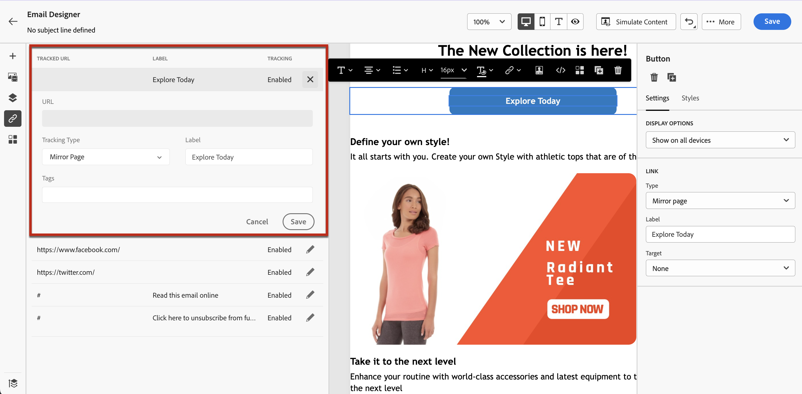
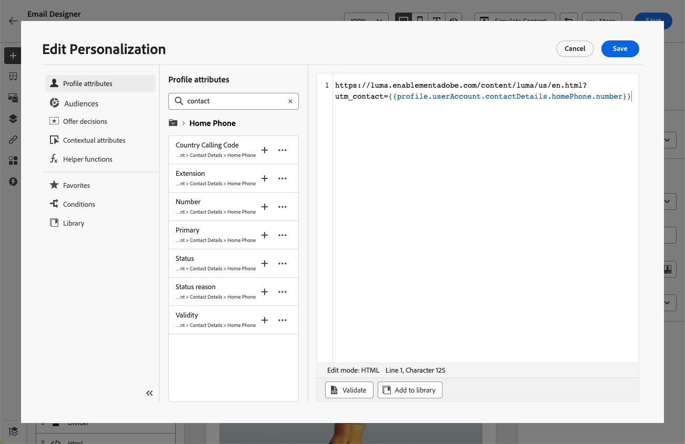

# 新增連結及追蹤訊息 {#tracking}

使用[!DNL Journey Optimizer]新增連結至您的內容並追蹤傳送的訊息，以監視收件者的行為。

>[!NOTE]
>
>當連結包含在您的內容中時，會在訊息傳送後&#x200B;**25個月**&#x200B;過期，但映象頁面的連結除外，其會在&#x200B;**90天**&#x200B;後過期。 延遲過後，這些連結就無法再使用。

## 啟用追蹤 {#enable-tracking}

您可以在電子郵件訊息層級啟用追蹤，方法是勾選&#x200B;**[!UICONTROL 電子郵件開啟次數]**&#x200B;和/或&#x200B;**[!UICONTROL 在歷程或行銷活動中建立訊息時，按一下電子郵件]**&#x200B;選項，如下列標籤所示：

>[!BEGINTABS]

>[!TAB 在歷程中啟用追蹤]

>[!TAB 在行銷活動中啟用追蹤]

>[!ENDTABS]

>[!NOTE]
>
>這兩個選項預設為啟用。

啟用後，這些選項會追蹤訊息收件者的行為：

* **[!UICONTROL 電子郵件開啟]**&#x200B;量度會檢查已開啟的郵件數。
* **[!UICONTROL 點按電子郵件]**&#x200B;量度會計算電子郵件中連結的點按次數。

## 插入連結 {#insert-links}

啟用[追蹤](#enable-tracking)時，會追蹤訊息內容中包含的所有連結。

>[!NOTE]
>
>也會追蹤電子郵件中所用片段的連結。 [進一步瞭解片段](../content-management/fragments.md)

若要將連結插入到電子郵件內容，請依照以下步驟進行：

1. 選取元素（文字或影像），然後按一下內容工具列中的[插入連結]。**&#x200B;**

   

1. 選擇您要建立的連結型別：

   * 選取&#x200B;**[!UICONTROL 外部連結]**&#x200B;以插入外部URL的連結。

   * 選取&#x200B;**[!UICONTROL 登陸頁面]**&#x200B;以插入登陸頁面的連結。 [了解更多](../landing-pages/get-started-lp.md)

   * 選取&#x200B;**[!UICONTROL 按一下[選擇退出]]**&#x200B;插入連結，讓使用者能夠快速取消訂閱您的通訊，而不需要確認選擇退出。 [了解更多](email-opt-out.md#one-click-opt-out)。

   * 選取&#x200B;**[!UICONTROL 外部選擇加入/訂閱]**&#x200B;以插入連結，接受來自您品牌的通訊。

   * 選取&#x200B;**[!UICONTROL 外部選擇退出/取消訂閱]**&#x200B;以插入取消訂閱的連結，以停止接收來自您品牌的通訊。 在[本節](email-opt-out.md#email-opt-out)中進一步瞭解選擇退出管理。

   * 選取&#x200B;**[!UICONTROL 映象頁面]**&#x200B;以新增電子郵件映象頁面的連結。 [了解更多](#mirror-page)

1. 在對應欄位中輸入所需的URL，或選取登入頁面，並定義連結設定和樣式。 [了解更多](#adjust-links)

   >[!NOTE]
   >
   >若要解譯URL，[!DNL Journey Optimizer]符合URI語法（[RFC 3986標準](https://datatracker.ietf.org/doc/html/rfc3986){target="_blank"}），這會停用URL中的某些特殊國際字元。 嘗試傳送校樣或電子郵件時，如果您傳回的錯誤涉及新增到內容的URL，您可以URL編碼字串作為因應措施。

1. 您可以個人化連結。 [了解更多](../personalization/personalization-build-expressions.md)

1. 儲存您的變更。

1. 建立連結後，您仍然可以從右側的&#x200B;**[!UICONTROL 設定]**&#x200B;和&#x200B;**[!UICONTROL 樣式]**&#x200B;窗格修改連結。

   

>[!NOTE]
>
>行銷型別電子郵件訊息必須包含[選擇退出連結](../privacy/opt-out.md#opt-out-decision-management)，交易式訊息不需要此連結。 訊息類別（**[!UICONTROL 行銷]**&#x200B;或&#x200B;**[!UICONTROL 異動]**）在建立訊息時已在[頻道設定](email-settings.md#email-type)中定義。

傳送訊息之後，連結的保留期間為&#x200B;**25個月**。 延遲後，連結將無法再使用。

## 連結至映象頁面 {#mirror-page}

映象頁面是電子郵件的線上版本。 將連結新增至映象頁面是電子郵件行銷的良好做法。 使用者可以瀏覽到電子郵件的鏡像頁面，例如他們在嘗試在收件匣中檢視郵件時遇到轉譯問題或影像毀損。我們建議基於存取性原因或鼓勵社交共享，提供線上版本。

Adobe Journey Optimizer產生的映象頁面包含所有個人化資料。

若要在電子郵件中新增映象頁面的連結，請[插入連結](#insert-links)，並選取&#x200B;**[!UICONTROL 映象頁面]**&#x200B;作為連結型別。

映象頁面會自動建立。 電子郵件傳送後，當收件者按一下鏡像頁面連結時，電子郵件的內容將顯示在他們的預設網頁瀏覽器中。

映象頁面的保留期為&#x200B;**90天**。 該段時間之後，鏡像頁面無法繼續使用。

>[!CAUTION]
>
>* 鏡像頁面連結是自動產生的，無法編輯。它們包含轉譯原始電子郵件所需的所有加密的個人化資料。因此，使用具有大值的個人化屬性可能會產生過長的映象頁面URL，使得連結無法在URL長度上限的網頁瀏覽器中運作。
>
>* 建立高度依賴執行階段個人化的電子郵件時（例如`#each`回圈、巢狀物件、大型裝載資料），映象頁面URL可能會變得過大，尤其是在API觸發的行銷活動使用來自裝載的廣泛內容資料時。 這可能會導致瀏覽器或郵件使用者端發生HTTP錯誤(404、422、502)。 Adobe建議限制動態欄位的廣度和深度，減少對複雜片段的依賴，並將個人化結構扁平化以防止連結失敗。
>
>* 在傳送到測試設定檔的[校訂](../content-management/proofs.md)中，映象頁面的連結未啟用。 它只會在最終訊息中處於活動狀態。

## 自訂連結外觀和目標 {#adjust-links}

您可以調整連結，例如加上底線、變更顏色或選取目標。  這些變更是在內容編輯器右側區段的&#x200B;**[!UICONTROL 設定]**&#x200B;和&#x200B;**[!UICONTROL 樣式]**&#x200B;窗格中設定的。

### Target {#link-target}

**target**&#x200B;屬性是用來控制所連結的頁面將在何處開啟。 在錨點標籤中新增目標屬性，可以指定連結應該在新索引標籤、相同索引標籤還是不同框架中開啟。

若要定義連結的目標，請執行下列步驟：

1. 在插入連結的&#x200B;**[!UICONTROL 文字]**&#x200B;元件中，選取您的連結。

1. 從&#x200B;**[!UICONTROL 設定]**&#x200B;索引標籤中，選取在&#x200B;**[!UICONTROL 目標]**&#x200B;下拉式清單中開啟連結的位置。 可能的值列於下方：

   * **[!UICONTROL 無]**：當框架被點按時在相同框架中開啟連結 (預設)。
   * **[!UICONTROL 空白]**：在新的視窗或索引標籤中開啟連結。
   * **[!UICONTROL 自我]**：當框架被點按時在相同框架中開啟連結。
   * **[!UICONTROL 父系]**：在父框架中開啟連結。
   * **[!UICONTROL 頂端]**：在視窗的完整內文中開啟連結。

   

1. 儲存您的變更。

### 將連結加底線 {#link-underline}

核取&#x200B;**[!UICONTROL 加底線連結]**&#x200B;選項，為您的連結的標籤加底線。

### 連結顏色 {#link-color}

若要變更連結的顏色，請從「**[!UICONTROL 樣式]**&#x200B;索引標籤，按一下「**[!UICONTROL 連結顏色]**」。

## 管理追蹤 {#manage-tracking}

[電子郵件設計工具](content-from-scratch.md) 可讓您管理被追蹤的 URL，例如編輯每個連結的追蹤類型。

1. 從左窗格按一下&#x200B;**[!UICONTROL 連結]**&#x200B;圖示，以顯示您要追蹤之內容的所有URL清單。

   此清單可讓您能夠集中檢視並找到電子郵件內容中的每個 URL。

1. 若要編輯連結，按一下對應的鉛筆圖示。

1. 您可以修改&#x200B;**[!UICONTROL 追蹤類型]** (如果需要)：

   

   對於每個被追蹤的 URL，您可以將追蹤模式設定為以下其中一個值：

   * **[!UICONTROL 已追蹤]**：啟動追蹤此 URL。
   * **[!UICONTROL 選擇退出]**：將此 URL 視為選擇退出或取消訂閱 URL。
   * **[!UICONTROL 鏡像頁面]**：將此 URL 視為鏡像頁面 URL。
   * **[!UICONTROL Never]**：從未啟用此URL的追蹤。

在[即時報告](../reports/live-report.md)和[Customer Journey Analytics報告](../reports/report-gs-cja.md)中都有開啟次數和點按次數報告。

## 個人化URL追蹤 {#url-tracking}

[URL追蹤](email-settings.md#url-tracking)在設定層級管理，並套用至訊息內容中包含的所有URL。

您也可以在電子郵件Designer中個人化個別URL。 若要將個人化URL追蹤引數新增至內容中的單一連結，請遵循下列步驟。

1. 選取連結並按一下內容工具列中的&#x200B;**[!UICONTROL 插入連結]**。

1. 選取個人化圖示。 它僅適用於下列型別的連結： **外部連結**、**取消訂閱連結**&#x200B;和&#x200B;**選擇退出**。

   

1. 新增URL追蹤引數，並從[個人化編輯器](../personalization/personalization-build-expressions.md)中選取您選擇的設定檔屬性。

   

1. 儲存您的變更。

1. 針對您要新增此追蹤引數的每個連結，重複上述步驟。

現在，當電子郵件寄出時，此引數會自動附加至URL的結尾。 接著，您就可以在網站分析工具或效能報表中擷取此引數。

>[!NOTE]
>
>若要驗證最終URL，您可以[傳送校樣](../content-management/proofs.md)，並在收到校樣後按一下電子郵件內容中的連結。 URL應顯示追蹤引數。 在上述範例中，最終URL將為： <https://luma.enablementadobe.com/content/luma/us/en.html?utm_contact=profile.userAccount.contactDetails.homePhone.number>
