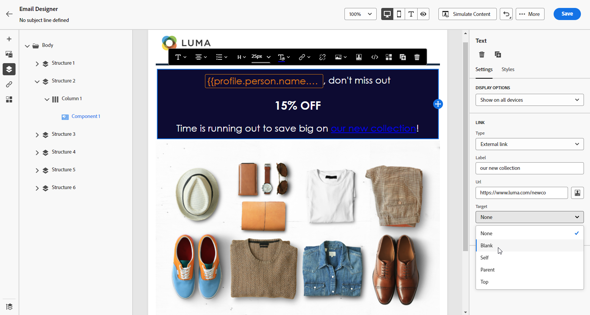

# 新增連結及追蹤訊息 {#tracking}

使用 [!DNL Journey Optimizer] 將連結新增至您的內容並追蹤傳送的訊息，以監控收件者的行為。

## 啟用追蹤 {#enable-tracking}

您可以在電子郵件層級啟用追蹤，方法是檢查 **[!UICONTROL 電子郵件開啟次數]** 和/或 **[!UICONTROL 按一下電子郵件]** 在歷程或促銷活動中建立訊息時的選項。

>[!BEGINTABS]

>[!TAB 在歷程中啟用追蹤]

>[!TAB 在行銷活動中啟用追蹤]

>[!ENDTABS]

>[!NOTE]
>
>這兩個選項預設為啟用。

這可讓您透過以下方式追蹤收件者的行為：

* **[!UICONTROL 電子郵件開啟次數]**：已開啟的訊息。
* **[!UICONTROL 按一下電子郵件]**：按一下電子郵件中的連結。

## 插入連結 {#insert-links}

設計訊息，您可以新增連結到您的內容。

>[!NOTE]
>
>時間 [已啟用追蹤](#enable-tracking)，則會追蹤訊息內容中包含的所有連結。

若要將連結插入到電子郵件內容，請依照以下步驟進行：

1. 選取元素，然後從內容關聯式工具列中按一下「**[!UICONTROL 插入連結]**」。

   

1. 選擇您要建立的連結型別：

   * **[!UICONTROL 外部連結]**：插入外部URL的連結。

   * **[!UICONTROL 登陸頁面]**：插入登入頁面的連結。 [了解更多](../landing-pages/get-started-lp.md)

   * **[!UICONTROL 一鍵選擇退出]**：插入連結讓使用者能夠快速取消訂閱您的通訊，而不需要確認選擇退出。 [了解更多](email-opt-out.md#one-click-opt-out)。

   * **[!UICONTROL 外部選擇加入/訂閱]**：插入連結以接受來自您品牌的通訊。

   * **[!UICONTROL 外部選擇退出/取消訂閱]**：插入連結以取消訂閱來自您品牌的通訊。 進一步瞭解[本章節](email-opt-out.md#opt-out-management)中的選擇退出管理。

   * **[!UICONTROL 映象頁面]**：新增連結以在網頁瀏覽器中顯示電子郵件內容。 [了解更多](#mirror-page)

1. 在對應欄位中輸入所需的URL，或選取登入頁面，並定義連結設定和樣式。 [了解更多](#adjust-links)

   >[!NOTE]
   >
   >若要解譯URL， [!DNL Journey Optimizer] 符合URI語法([RFC 3986標準版](https://datatracker.ietf.org/doc/html/rfc3986){target="_blank"})，這會停用URL中的部分特殊國際字元。 嘗試傳送校樣或電子郵件時，如果您傳回的錯誤涉及新增到內容的URL，您可以URL編碼字串作為因應措施。

1. 您可以個人化連結。 [了解更多](../personalization/personalization-syntax.md#perso-urls)

1. 儲存您的變更。

1. 建立連結後，您仍可從 **[!UICONTROL 設定]** 和 **[!UICONTROL 樣式]** 右邊的窗格。

   

>[!NOTE]
>
>行銷型別的電子郵件訊息必須包括 [退出連結](../privacy/opt-out.md#opt-out-management)，異動訊息不需要此屬性。 訊息類別(**[!UICONTROL 行銷]** 或 **[!UICONTROL 異動]**)在中定義 [頻道介面](../configuration/channel-surfaces.md#email-type) 建立訊息時。

## 調整連結 {#adjust-links}

您可以使用調整連結 **[!UICONTROL 設定]** 和 **[!UICONTROL 樣式]** 右邊的窗格。 您可以為連結加上底線、編輯其顏色並選取其目標。

1. 在插入連結的&#x200B;**[!UICONTROL 文字]**&#x200B;元件中，選取您的連結。

1. 從 **[!UICONTROL 設定]** 索引標籤中，選擇將如何使用將您的對象重新導向 **[!UICONTROL Target]** 下拉式清單：

   * **[!UICONTROL 無]**：當框架被點按時在相同框架中開啟連結 (預設)。
   * **[!UICONTROL 空白]**：在新的視窗或索引標籤中開啟連結。
   * **[!UICONTROL 自我]**：當框架被點按時在相同框架中開啟連結。
   * **[!UICONTROL 父系]**：在父框架中開啟連結。
   * **[!UICONTROL 頂端]**：在視窗的完整內文中開啟連結。

   

1. 檢查 **[!UICONTROL 將連結加底線]** 將連結的標籤文字加底線。

   

1. 若要變更連結的顏色，請從「**[!UICONTROL 樣式]**&#x200B;索引標籤，按一下「**[!UICONTROL 連結顏色]**」。

   

1. 儲存您的變更。

## 連結至映象頁面 {#mirror-page}

鏡像頁面是可透過網頁瀏覽器線上存取的 HTML 頁面。其內容與電子郵件的內容相同。

若要在電子郵件中新增映象頁面的連結， [插入連結](#insert-links) 並選取 **[!UICONTROL 映象頁面]** 做為連結型別。

鏡像頁面會自動建立。

>[!IMPORTANT]
>
>鏡像頁面連結是自動產生的，無法編輯。它們包含轉譯原始電子郵件所需的所有加密的個人化資料。因此，使用具有較大值的個人化屬性可能會產生冗長的鏡像頁面 URL，如果網頁瀏覽器具有最大 URL 長度，將導致連結無法在該網頁瀏覽器中作用。

電子郵件傳送後，當收件者按一下鏡像頁面連結時，電子郵件的內容將顯示在他們的預設網頁瀏覽器中。

>[!NOTE]
>
>在 [證明](../content-management/proofs.md) 傳送至測試設定檔，則映象頁面的連結未啟用。 它僅在最終訊息中啟用。

映象頁面的保留期為60天。 經過此延遲後，將無法再使用映象頁面。

## 管理追蹤 {#manage-tracking}

[電子郵件設計工具](content-from-scratch.md) 可讓您管理被追蹤的 URL，例如編輯每個連結的追蹤類型。

1. 按一下 **[!UICONTROL 連結]** 圖示來顯示要追蹤之內容的所有URL清單。

   此清單可讓您能夠集中檢視並找到電子郵件內容中的每個 URL。

1. 若要編輯連結，按一下對應的鉛筆圖示。

1. 您可以修改&#x200B;**[!UICONTROL 追蹤類型]** (如果需要)：

   

   對於每個被追蹤的 URL，您可以將追蹤模式設定為以下其中一個值：

   * **[!UICONTROL 已追蹤]**：啟動追蹤此 URL。
   * **[!UICONTROL 選擇退出]**：將此 URL 視為選擇退出或取消訂閱 URL。
   * **[!UICONTROL 鏡像頁面]**：將此 URL 視為鏡像頁面 URL。
   * **[!UICONTROL 絕不]**：絕不啟動追蹤此 URL。<!--This information is saved: if the URL appears again in a future message, its tracking is automatically deactivated.-->

有關開啟次數與點按次數的報告，請參閱 [即時報告](../reports/live-report.md) 和 [全域報告](../reports/global-report.md).

## 個人化URL追蹤 {#url-tracking}

通常 [URL追蹤](email-settings.md#url-tracking) 在曲面層級進行管理，但不支援設定檔屬性。 目前唯一的方法是 [個人化URL](../personalization/personalization-syntax.md#perso-urls) 在電子郵件設計工具中。

若要將個人化URL追蹤引數新增至您的連結，請遵循下列步驟。

1. 選取連結並按一下 **[!UICONTROL 插入連結]** 從內容工具列。

1. 選取個人化圖示。 它僅適用於下列型別的連結： **外部連結**， **取消訂閱連結** 和 **選擇退出**.

   

1. 新增URL追蹤引數，並從運算式編輯器中選取您選取的設定檔屬性。

   

1. 儲存您的變更。

1. 針對您要新增此追蹤引數的每個連結，重複上述步驟。

現在，當電子郵件寄出時，此引數會自動附加至URL的結尾。 接著，您就可以在網站分析工具或效能報表中擷取此引數。

>[!NOTE]
>
>若要驗證最終URL，您可以 [傳送證明](../content-management/preview-test.md#send-proofs) 和收到校樣後，按一下電子郵件內容中的連結。 URL應顯示追蹤引數。 在上述範例中，最終URL將為： <https://luma.enablementadobe.com/content/luma/us/en.html?utm_contact=profile.userAccount.contactDetails.homePhone.number>
