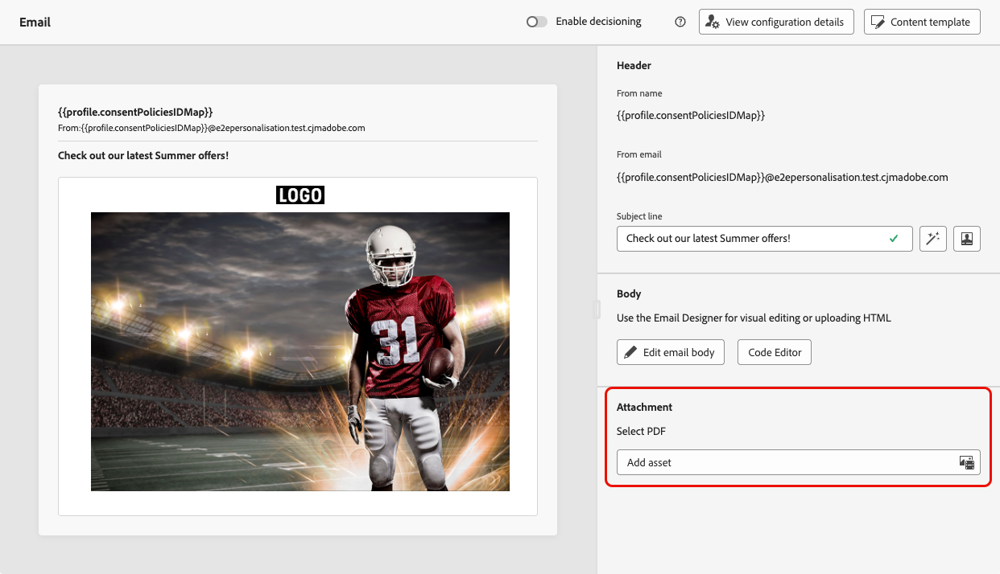
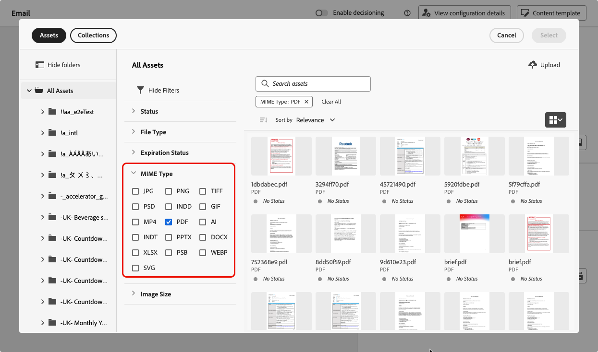
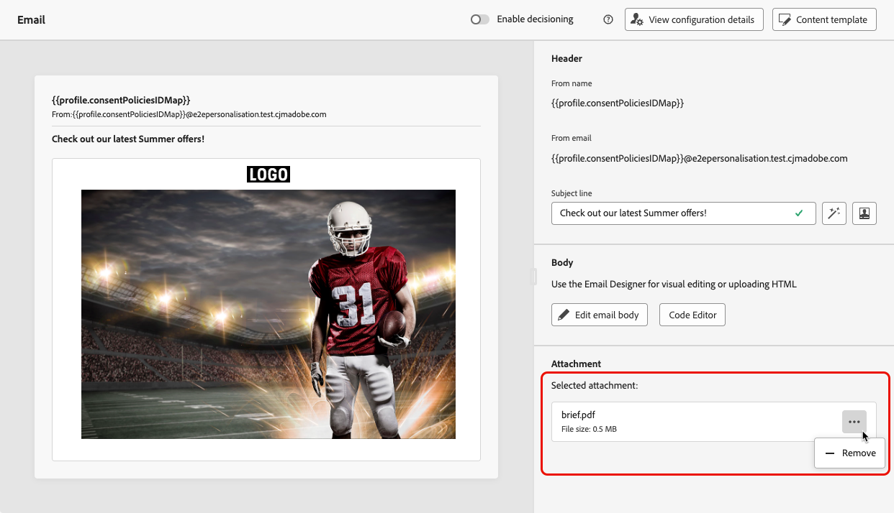

# 將PDF檔案附加至電子郵件 {#pdf-attachments}

>[!CONTEXTUALHELP]
>id="ajo_pdf_attachments"
>title="新增PDF附件"
>abstract="瀏覽以選取要附加至電子郵件的PDF檔案。 每個設定檔每年最多可傳送6則含有PDF附件的訊息。 每個附件允許的大小上限為 5 MB。 若有其他大小或容量，您可以購買附件套件附加元件。 如需詳細資訊，請聯絡您的 Adobe 代表。"

>[!AVAILABILITY]
>
>此功能為「有限可用性」的狀態。請聯絡您的 Adobe 代表以取得存取權。

您可以將靜態PDF檔案附加至您透過[!DNL Journey Optimizer]傳送的電子郵件訊息。

>[!IMPORTANT]
>
>* 您每年最多可以為每個設定檔傳送 6 封含有 PDF 附件的訊息。
>
>* 每個附件允許的大小上限為 5 MB。
>
>如需其他大小或流量，您可以購買附件套組附加元件。 如需詳細資訊，請聯絡您的 Adobe 代表。

若要將PDF檔案附加至電子郵件訊息，請遵循下列步驟。

1. 在歷程或行銷活動中建立電子郵件。 [了解更多](create-email.md)

1. 在歷程或行銷活動&#x200B;**[!UICONTROL 內容]**&#x200B;索引標籤中，從&#x200B;**[!UICONTROL 附件]**&#x200B;區段選取&#x200B;**[!UICONTROL 新增資產]**。

   

1. Assets Essentials存放庫隨即顯示。

   >[!NOTE]
   >
   >設計訊息時，您可以直接從Journey Optimizer介面存取Assets Essentials存放庫。 若要深入瞭解內嵌[!DNL Assets Essentials]使用者介面，請參閱[Experience Manager Assets Essentials檔案](https://experienceleague.adobe.com/docs/experience-manager-assets-essentials/help/introduction.html){target="_blank"}。

1. 使用&#x200B;**[!UICONTROL MIME型別]**&#x200B;區段中的&#x200B;**[!UICONTROL PDF]**&#x200B;篩選器，將選取範圍限製為正確的檔案格式。

   

   >[!NOTE]
   >
   >附件僅允許PDF格式。

1. 選取您選擇的檔案。

   * 您一次只能選取一個檔案。
   * 每個附件允許的大小上限為 5 MB。

1. 完成後，所選檔案的名稱和大小會顯示在&#x200B;**[!UICONTROL 附件]**&#x200B;區段中。

   您可以使用檔案名稱旁邊的更多動作圖示來移除選取的檔案。

   

>[!NOTE]
>
>將郵件儲存為[內容範本](../content-management/create-content-templates.md)時，範本不會保留PDF附件。 如果您從儲存的內容範本建立新電子郵件，則需要重新附加檔案。
