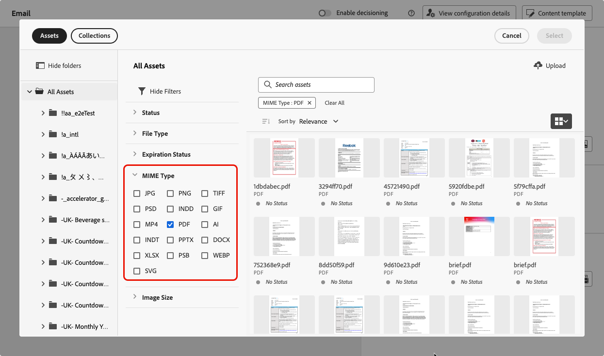
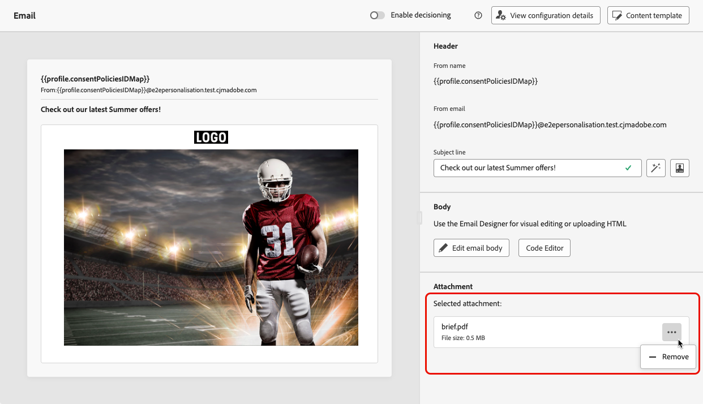

# 在電子郵件中附加 PDF 檔案 {#pdf-attachments}

>[!BEGINSHADEBOX]

**在此頁面上：**&#x200B;瞭解如何將靜態或個人化的PDF檔案附加至電子郵件，包括支援的行銷活動型別以及適用的計數、大小和磁碟區限制。

>[!ENDSHADEBOX]

>[!CONTEXTUALHELP]
>id="ajo_pdf_attachments"
>title="新增PDF附件"
>abstract="瀏覽並選取要附加至電子郵件的 PDF 檔案。</br>您每年最多可以傳送6封含有PDF附件的郵件。 每個附件的允許檔案大小上限為5 MB。</br>對於任何其他大小或磁碟區，您可以購買PDF附件附加元件。 如需詳細資訊，請聯絡您的 Adobe 代表。"

您可以將靜態PDF檔案附加至您透過[!DNL Journey Optimizer]傳送的電子郵件訊息。 如果您使用[API觸發的行銷活動](../campaigns/api-triggered-campaigns.md)，您也可以為每個收件者附加[個人化PDF檔案](#personalized-attachments)。

請注意，個人化的PDF附件需要額外的檔案擷取和處理。 使用它們的行銷活動可能會比沒有附件的行銷活動有更高的處理延遲和較低的輸送量，尤其是在使用多個或更大的PDF檔案時。

>[!IMPORTANT]
>
>* 無論附件為靜態或個人化，您每年最多可以為每個設定檔傳送6封包含PDF附件的郵件。
>
>* 每個附件允許的大小上限為 5 MB。 對於包含[個人化附件](#personalized-attachments)的電子郵件，預設情況下，電子郵件中的所有靜態和個人化PDF附件共用合併的5 MB限制。
>
> 若為任何額外大小或容量，您可以購買PDF附件附加元件，將個人化附件的合併限制提高至10 MB。 如需詳細資訊，請聯絡您的 Adobe 代表。

若要將PDF檔案附加至電子郵件訊息，請遵循下列步驟。

1. 在歷程或行銷活動中建立電子郵件。 [了解更多](create-email.md)

1. 在歷程或行銷活動&#x200B;**[!UICONTROL 內容]**&#x200B;索引標籤中，從&#x200B;**[!UICONTROL 附件]**&#x200B;區段選取&#x200B;**[!UICONTROL 新增資產]**。

   

1. Assets Essentials存放庫隨即顯示。

   >[!NOTE]
   >
   >設計訊息時，您可以直接從Journey Optimizer介面存取Assets Essentials存放庫。 若要深入瞭解內嵌[!DNL Assets Essentials]使用者介面，請參閱[Experience Manager Assets Essentials檔案](https://experienceleague.adobe.com/docs/experience-manager-assets-essentials/help/introduction.html?lang=zh-Hant){target="_blank"}。

1. 使用&#x200B;**[!UICONTROL MIME型別]**&#x200B;區段中的&#x200B;**[!UICONTROL PDF]**&#x200B;篩選器，將選取範圍限製為正確的檔案格式。

   

   >[!NOTE]
   >
   >附件僅允許PDF格式。

1. 選取您選擇的檔案。

   * 您一次只能選取一個檔案。
   * 每個附件允許的大小上限為 5 MB。

1. 完成後，所選檔案的名稱和大小會顯示在&#x200B;**[!UICONTROL 附件]**&#x200B;區段中。

   您可以使用檔案名稱旁邊的更多動作圖示來移除選取的檔案。

   

>[!NOTE]
>
>將郵件儲存為[內容範本](../content-management/create-content-templates.md)時，範本不會保留PDF附件。 如果您從儲存的內容範本建立新電子郵件，則需要重新附加檔案。

## 附加API觸發的行銷活動的個人化PDF檔案 {#personalized-attachments}

您也可以將收件者特定的PDF檔案附加至透過[API觸發的行銷活動](../campaigns/api-triggered-campaigns.md)傳送的單一電子郵件。 不同於靜態附件，每位收件者都能收到不同的檔案，例如發票、登機卡、合約或運送標籤。

依預設，電子郵件中所有靜態和個人化PDF附件的合併大小上限為5 MB。 具有適用PDF附件附加元件的組織可以使用最多10 MB的合併限制。

>[!IMPORTANT]
>
>* 個人化的PDF附件僅支援交易式API觸發的電子郵件行銷活動。
>
>* 您最多可以在電子郵件中包含五個PDF附件。 此限制包含靜態和個人化的附件。 例如，包含單一靜態PDF的電子郵件最多可包含四個個人化PDF。 如果您需要傳送更多訊息，請將其分割為多個通訊。
>
>* 個人化和靜態PDF附件計入相同的配額。 [了解更多](#pdf-attachments)

個人化的PDF附件必須上傳至附件特定的[資料登陸區域](https://experienceleague.adobe.com/zh-hant/docs/experience-platform/sources/connectors/cloud-storage/data-landing-zone){target="_blank"}容器，然後在API裝載中參考。 資料登陸區域是目前唯一支援個人化PDF附件的儲存位置。

1. 使用與執行請求相同的IMS組織和沙箱的`type=ajoemailattachments`，為您的沙箱擷取資料登陸區域認證，如[Adobe Experience Platform檔案](https://experienceleague.adobe.com/zh-hant/docs/experience-platform/sources/connectors/cloud-storage/data-landing-zone){target="_blank"}所述。 根據雲端提供者，使用Azure容器或AWS貯體和資料夾（由API傳回）。

1. 使用您選擇的工具產生PDF檔案，並將其上傳至您的資料登陸區域容器。

   請注意，資料登陸區域會在七天後自動刪除檔案，在訊息傳送及任何重試完成之前，請確保PDF檔案在容器中保持可用。

1. 在API裝載中，針對每個收件者，新增包含要傳送之PDF的檔案名稱、內容型別和資料登陸區域路徑的`attachments`陣列。 [瞭解如何個人化API觸發的行銷活動內容](../campaigns/api-triggered-campaign-content.md#contextual)

   ```json
   "attachments": [
     {
       "name": "invoice-12345.pdf",
       "contentType": "application/pdf",
       "source": {
         "type": "dlzPath",
         "path": "attachments/invoice-12345.pdf"
       }
     }
   ]
   ```

   請注意，`source.path`是相對於`type=ajoemailattachments`擷取的附件特定資料登陸區域容器的物件路徑。 請勿包含Azure容器名稱、AWS貯體或資料夾、憑證或完整儲存體URL。

在傳送時，[!DNL Journey Optimizer]會從指定的位置擷取檔案，並將其附加至該收件者的郵件。 主要區域的[高輸送量](../campaigns/api-triggered-high-throughput.md)行銷活動支援個人化PDF附件。 區域容錯移轉期間不支援這些功能。

如需完整的API裝載參考，請參閱[互動式訊息執行API檔案](https://developer.adobe.com/journey-optimizer-apis/references/messaging#tag/execution){target="_blank"}。
