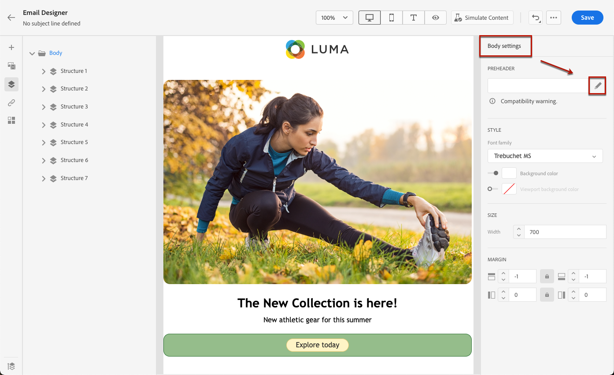

# 加入預告標題 {#preheader}

>[!CONTEXTUALHELP]
>id="ac_edition_preheader"
>title="新增預覽文字"
>abstract="預覽文字指在檢視來自您的電子郵件用戶端的電子郵件時接在主旨行後面的簡短摘要文字。在許多情況下，這段文字會提供電子郵件的簡短摘要，並且長度通常只有一個句子。"

預覽文字指在檢視來自您的電子郵件用戶端的電子郵件時接在主旨行後面的簡短摘要文字。

在許多情況下，這段文字會提供電子郵件的簡短摘要，並且長度通常只有一個句子。

>[!NOTE]
>
>並非所有電子郵件用戶端都支援預覽文字。如果不支援，就不會顯示預覽文字。

若要定義電子郵件預覽文字，請依照以下步驟操作：

1. 從電子郵件設計工具，至少新增一個&#x200B;**[!UICONTROL 結構元件]**&#x200B;以開始設計您的電子郵件。

1. 按一下左窗格中的&#x200B;**[!UICONTROL 導覽樹狀目錄]**&#x200B;圖示，然後選取「**[!UICONTROL 內文]**」。

   

1. 從 **[!UICONTROL 設定]** 的子菜單。 **[!UICONTROL 前標]** 的子菜單。

   

1. 從「**[!UICONTROL 編輯個人化]**」視窗，您可以新增&#x200B;**[!UICONTROL 內容區塊]**、**[!UICONTROL 動態內容]**&#x200B;或&#x200B;**[!UICONTROL 個人化欄位]**。

1. 按一下「**[!UICONTROL 驗證]**」以檢查個人化語法。

   

1. 按一下&#x200B;**[!UICONTROL 儲存]**。

電子郵件的預覽文字現在已設定好了。
