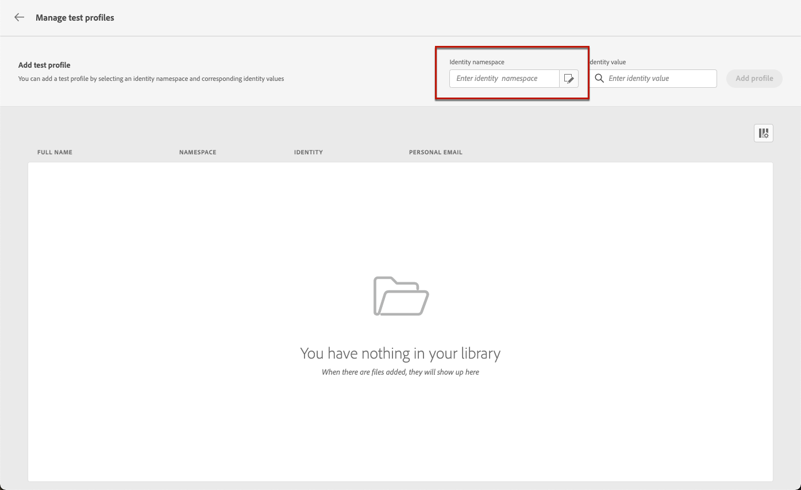

# 預覽和測試您的電子郵件 {#preview-and-proof}

定義電子郵件內容後，您可以使用測試設定檔來預覽和測試。 如果您已插入 [個人化內容](../personalization/personalize.md)，您可使用測試設定檔資料檢查此內容在訊息中的顯示方式。

若要偵測電子郵件內容或個人化設定中可能出現的錯誤，請將校樣傳送至測試設定檔。 每次進行變更時都應傳送校樣，以驗證最新內容。

>[!CAUTION]
>
>您需要有可用的測試設定檔，才能預覽訊息和傳送校樣。
>
>瞭解如何在中建立測試設定檔 [此頁面](../segment/creating-test-profiles.md).

若要測試您的電子郵件內容，您需要：

* [選取測試設定檔](#select-test-profiles)
* [檢查訊息預覽](#preview-your-messages)

然後，您將能夠 [傳送校樣](#send-proofs) 至測試設定檔。

此外，利用您的 **Litmus** 帳戶登入，即可在&#x200B;**常見電子郵件用戶端[!DNL Journey Optimizer]立即預覽**&#x200B;電子郵件呈現。 您可以確保電子郵件內容都能看起來不錯，並且在每個收件匣中都正常運作。 瞭解如何在中解鎖Litmus電子郵件預覽 [本節](#email-rendering).

>[!CAUTION]
>
>預覽訊息或傳送校樣時，只會顯示設定檔個人化資料。 基於內容資料（例如事件資訊）的個人化只能在歷程的內容中測試。 瞭解如何在中測試個人化 [此使用案例](../personalization/personalization-use-case.md).

➡️ [透過此影片瞭解如何預覽和校樣您的電子郵件](#video-preview)

## 選取測試設定檔 {#select-test-profiles}

>[!CONTEXTUALHELP]
>id="ac_preview_testprofiles"
>title="預覽和測試您的訊息"
>abstract="定義訊息內容後，您就可以使用測試設定檔進行預覽及測試。 "
>additional-url="https://experienceleague.adobe.com/docs/journey-optimizer/using/email/preview.html#email-rendering" text="電子郵件轉譯"
>additional-url="https://experienceleague.adobe.com/docs/journey-optimizer/using/email/preview.html#preview-email" text="預覽"

使用 [測試設定檔](../segment/creating-test-profiles.md) 鎖定不符合已定義定位准則的其他收件者。

若要選取測試設定檔，請遵循下列步驟：

1. 在 [編輯內容](create-email.md#define-email-content) 熒幕或在電子郵件設計工具中，按一下 **[!UICONTROL 模擬內容]** 按鈕以存取測試設定檔選項。

   

1. 選取 **[!UICONTROL 管理測試設定檔]**.

   

1. 按一下「 」，選取用於識別測試設定檔的名稱空間 **[!UICONTROL 身分名稱空間]** 選取範圍圖示。

   

   進一步瞭解Adobe Experience Platform身分識別名稱空間 [在本節中](../segment/get-started-identity.md).

   在以下範例中，我們將使用 **電子郵件** 名稱空間。

1. 使用搜尋欄位來尋找名稱空間、選取它並按一下 **[!UICONTROL 選取]**

   

1. 在 **[!UICONTROL 身分值]** 欄位，輸入值（此處為電子郵件地址）以識別測試設定檔，然後按一下 **[!UICONTROL 新增設定檔]**.

   <!---->

1. 如果您將個人化新增至訊息，請新增其他設定檔，以便根據設定檔資料測試訊息的不同變體。 新增後，設定檔會列在選取的欄位下。

   

   此清單會根據訊息個人化元素，在相關欄中顯示每個測試設定檔的資料。

### 電子郵件預覽 {#preview-email}

一次 [測試設定檔](#select-test-profiles) ，即可預覽電子郵件內容。 請遵循下列步驟：

1. 在 [編輯內容](create-email.md#define-email-content) 熒幕或在電子郵件設計工具中，按一下 **[!UICONTROL 模擬內容]** 按鈕。

1. 選取測試設定檔。 您可以檢查欄中可用的值。 使用右/左箭頭來瀏覽資料。

   

   >[!NOTE]
   >
   >若要新增更多測試設定檔，請選取 **[!UICONTROL 管理測試設定檔]**. [了解更多](#select-test-profiles)

1. 按一下 **[!UICONTROL 選取資料]** 圖示來新增或移除欄。

   

   您可在清單末尾看到目前訊息專屬的個人化欄位。 在此範例中，為設定檔城市、名字和姓氏。 選取這些欄位，並確認這些值已填入測試設定檔中。

1. 在訊息預覽中，個人化元素會由選取的測試設定檔資料取代。

   例如，對於此郵件，電子郵件內容和電子郵件主旨都會經過個人化：

   

1. 選取其他測試設定檔，以預覽訊息每個變體的電子郵件呈現。

## 傳送校樣 {#send-proofs}

校樣是一種特定訊息，可讓您在將訊息傳送給主要對象之前先測試訊息。 校樣的收件者負責核准訊息：呈現、內容、個人化設定、設定。

一次 [測試設定檔](#select-test-profiles) ，即可傳送校樣。

1. 在 **[!UICONTROL 模擬]** 熒幕上，按一下 **[!UICONTROL 傳送證明]** 按鈕。

   

1. 從 **[!UICONTROL 傳送證明]** 視窗，輸入收件者的電子郵件並按一下 **[!UICONTROL 新增]** 將校樣傳送給您自己或您組織的成員。

   請注意，您最多可以為校樣傳遞新增10個收件者。

   

1. 然後，選取 **測試設定檔** ，用於個人化訊息內容。

   每個校樣收件者收到的訊息數量都會與所選測試設定檔的數量相同。 例如，如果您新增了5封收件者電子郵件，並選取了10個測試設定檔，則您將傳送50封校樣訊息，而每位收件者將收到其中10封。

1. 如有需要，您可以在校樣的主旨行新增字首。 僅限英數字元和特殊字元，例如。- _ ( ) [ ] 允許作為主旨行的前置詞。

1. 按一下 **[!UICONTROL 傳送證明]**.

   

1. 返回  **[!UICONTROL 模擬]** 熒幕上，按一下  **[!UICONTROL 檢視校樣]** 按鈕以檢查狀態。

   

建議在每次修改訊息內容後傳送校樣。

>[!NOTE]
>
>在傳送的校樣中，指向映象頁面的連結未啟用。 它僅在最終訊息中啟用。

## 使用電子郵件呈現 {#email-rendering}

您可以善用您的 **Litmus** 帳戶至 [!DNL Journey Optimizer] 立即預覽 **電子郵件呈現** 在常用的電子郵件使用者端中。

若要存取電子郵件呈現功能，您需要：

* 擁有Litmus帳戶
* [選取測試設定檔](#select-test-profiles)

然後，請遵循下列步驟：

1. 在 [編輯內容](create-email.md#define-email-content) 熒幕或在電子郵件設計工具中，按一下 **[!UICONTROL 模擬內容]** 按鈕。

1. 選取 **[!UICONTROL 演算電子郵件]** 按鈕。

   

1. 按一下 **連線您的Litmus帳戶** 在右上角。

   

1. 輸入您的憑證並登入。

   

1. 按一下 **執行測試** 按鈕以產生電子郵件預覽。

1. 在熱門的案頭、行動裝置和網頁型使用者端中檢視您的電子郵件內容。

   

>[!CAUTION]
>
>連線時 **Litmus** 帳戶與 [!DNL Journey Optimizer]，您同意將測試訊息傳送至Litmus：傳送後，這些電子郵件將不再由Adobe管理。 因此，Litmus資料保留電子郵件原則適用於這些電子郵件，包括可能包含在這些測試訊息中的個人化資料。

## 操作說明影片 {#video-preview}

瞭解如何測試各收件匣間的電子郵件呈現、如何根據測試設定檔預覽您的個人化電子郵件，以及傳送校樣。

>[!VIDEO](https://video.tv.adobe.com/v/334239?quality=12)
