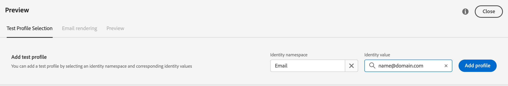

# 預覽和測試您的電子郵件 {#preview-and-proof}

定義電子郵件內容後，您可以使用test配置檔案預覽和test它。 如果插入 [個性化內容](../personalization/personalize.md)，您可以使用test配置檔案資料檢查此內容在消息中的顯示方式。

要檢測電子郵件內容或個性化設定中可能的錯誤，請將校樣發送到test配置檔案。 每次更改時都應發送證明，以驗證最新內容。

>[!CAUTION]
>
>您需要有test配置檔案才能預覽郵件和發送校樣。
>
>瞭解如何在中建立test配置檔案 [此頁](../segment/creating-test-profiles.md)。

要test電子郵件內容，您需要：

* [選取測試設定檔](#select-test-profiles)
* [檢查郵件預覽](#preview-your-messages)

然後你就能 [發送校樣](#send-proofs) 到您的test檔案。

此外，利用您的 **Litmus** 帳戶登入，即可在&#x200B;**常見電子郵件用戶端[!DNL Journey Optimizer]立即預覽**&#x200B;電子郵件呈現。 您可以確保電子郵件內容都能看起來不錯，並且在每個收件匣中都正常運作。 瞭解如何在中解鎖Litmus電子郵件預覽 [此部分](#email-rendering)。

>[!CAUTION]
>
>預覽消息或發送校樣時，只顯示配置檔案個性化資料。 基於上下文資料（例如事件資訊）的個性化只能在旅程的上下文中測試。 瞭解如何test個性化 [此使用案例](../personalization/personalization-use-case.md)。

➡️ [瞭解如何在此視頻中預覽和校驗電子郵件](#video-preview)

## 選取測試設定檔 {#select-test-profiles}

>[!CONTEXTUALHELP]
>id="ac_preview_testprofiles"
>title="預覽和測試您的訊息"
>abstract="定義訊息內容後，您就可以使用測試設定檔進行預覽及測試。 "
>additional-url="https://experienceleague.adobe.com/docs/journey-optimizer/using/email/preview.html?lang=zh-Hant#email-rendering" text="電子郵件轉譯"
>additional-url="https://experienceleague.adobe.com/docs/journey-optimizer/using/email/preview.html?lang=zh-Hant#preview-email" text="預覽"

使用 [Test配置檔案](../segment/creating-test-profiles.md) 目標與定義的目標條件不匹配的其他收件人。

要選擇test配置檔案，請執行以下步驟：

1. 在 [編輯內容](create-email.md#define-email-content) 或在電子郵件設計器中，按一下 **[!UICONTROL 模擬內容]** 按鈕，來查看test配置檔案選擇。

   

1. 選擇 **[!UICONTROL 管理test配置檔案]**。

   

1. 通過按一下以下命令選擇用於標識test配置檔案的命名空間 **[!UICONTROL 標識命名空間]** 的子菜單。

   

   瞭解有關Adobe Experience Platform標識命名空間的詳細資訊 [此部分](../segment/get-started-identity.md)。

   在下面的示例中，我們將使用 **電子郵件** 命名空間。

1. 使用搜索欄位查找命名空間，選擇它並按一下 **[!UICONTROL 選擇]**

   

1. 在 **[!UICONTROL 標識值]** 欄位中，輸入值（此處是電子郵件地址）以標識test配置檔案，然後按一下 **[!UICONTROL 添加配置檔案]**。

   <!---->

1. 如果將個性化設定添加到郵件中，請添加其他配置檔案，以便根據配置檔案資料test郵件的不同變型。 添加後，配置檔案將列在選定欄位下。

   

   根據消息個性化元素，此清單顯示相關列中每個test配置檔案的資料。

### 電子郵件預覽 {#preview-email}

一次 [test配置檔案](#select-test-profiles) ，您可以預覽電子郵件內容。 請遵循下列步驟：

1. 在 [編輯內容](create-email.md#define-email-content) 或在電子郵件設計器中，按一下 **[!UICONTROL 模擬內容]** 按鈕

1. 選擇test配置檔案。 可以檢查列中的可用值。 使用右/左箭頭瀏覽資料。

   

   >[!NOTE]
   >
   >要添加更多test配置檔案，請選擇 **[!UICONTROL 管理test配置檔案]**。 [了解更多](#select-test-profiles)

1. 按一下 **[!UICONTROL 選擇資料]** 表徵圖，以添加或刪除列。

   

   您可以在清單末尾看到特定於當前消息的個性化欄位。 在本示例中，配置檔案城市、名和姓。 選擇這些欄位，並確保這些值填充到您的test配置檔案中。

1. 在消息預覽中，個性化元素被所選test配置檔案資料替換。

   例如，對於此郵件，電子郵件內容和電子郵件主題都是個性化的：

   

1. 選擇其他test配置檔案，以預覽郵件的每個變體的電子郵件呈現。

## 傳送校樣 {#send-proofs}

證明是一條特定的消息，允許您在將消息發送到主受眾之前test該消息。 證明的接收者負責批准郵件：呈現、內容、個性化設定、配置。

一次 [test配置檔案](#select-test-profiles) 的子菜單。

1. 在 **[!UICONTROL 模擬]** 螢幕，按一下 **[!UICONTROL 發送證明]** 按鈕

   

1. 從 **[!UICONTROL 發送證明]** 鍵入收件人的電子郵件，然後按一下 **[!UICONTROL 添加]** 把證據寄給你自己或你的組織成員。

   請注意，您最多可以為憑證交付添加10個收件人。

   

1. 然後，選擇 **Test配置檔案** 用於個性化消息內容。

   證明的每個接收者將接收與所選test配置檔案數量相同的郵件。 例如，如果您添加了五封收件人電子郵件並選擇了十封test配置檔案，則您將發送五十封證明郵件，而每個收件人將收到十封。

1. 如果需要，可以在證明的主題行中添加前置詞。 只有字母數字字元和特殊字元，如。- _() [ ] 作為主題行的前置詞。

1. 按一下 **[!UICONTROL 發送證明]**。

   

1. 回到  **[!UICONTROL 模擬]** 螢幕，按一下  **[!UICONTROL 查看校樣]** 按鈕

   

建議在每次修改消息內容後發送校樣。

>[!NOTE]
>
>在發送的證明中，指向鏡像頁面的連結未處於活動狀態。 它僅在最終訊息中啟用。

## 使用電子郵件呈現 {#email-rendering}

您可以利用 **斜石** 帳戶 [!DNL Journey Optimizer] 立即預覽 **電子郵件呈現** 常用電子郵件客戶端。

要訪問電子郵件呈現功能，您需要：

* 擁有Litmus帳戶
* [選取測試設定檔](#select-test-profiles)

然後，執行以下步驟：

1. 在 [編輯內容](create-email.md#define-email-content) 或在電子郵件設計器中，按一下 **[!UICONTROL 模擬內容]** 按鈕

1. 選擇 **[!UICONTROL 呈現電子郵件]** 按鈕

   

1. 按一下 **連接你的Litmus帳戶** 右上角。

   

1. 輸入您的憑據並登錄。

   

1. 按一下 **運行test** 按鈕以生成電子郵件預覽。

1. 在流行的案頭、移動和基於Web的客戶端中檢查您的電子郵件內容。

   

>[!CAUTION]
>
>連接時 **斜石** 帳戶 [!DNL Journey Optimizer]，您同意將test消息發送到Litmus :一旦發送，這些電子郵件將不再由Adobe管理。 因此， Litmus資料保留電子郵件策略適用於這些電子郵件，包括可能包含在這些test郵件中的個性化資料。

## 操作說明影片 {#video-preview}

瞭解如何在收件箱中test電子郵件呈現，如何根據test配置檔案預覽個性化電子郵件，以及發送校樣。

>[!VIDEO](https://video.tv.adobe.com/v/334239?quality=12)
