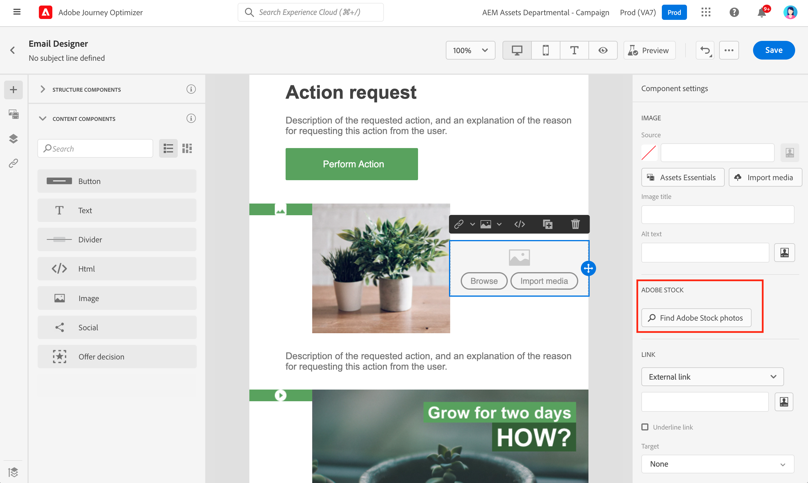
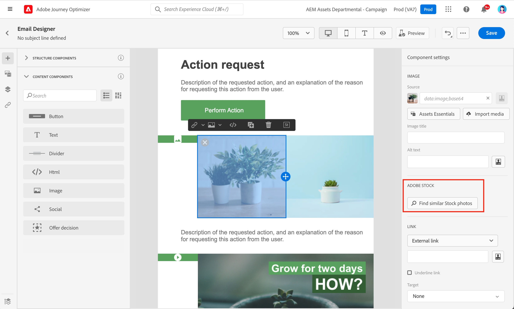

# 使用 [!DNL Adobe Stock] 影像 {#stock}

## 開始使用 [!DNL Adobe Stock] {#get-started-stock}

此 [!DNL Adobe Stock] 和 [!DNL Adobe Journey Optimizer] 電子郵件設計工具整合外掛程式可讓客戶輕鬆導覽、授權和儲存影像，以用於訊息製作。

[Adobe Stock](https://helpx.adobe.com/stock/get-started.html){target=&quot;_blank&quot;}可訪問數百萬張高品質、經過精心整理、免版稅的照片、視頻、插圖和向量圖形。 您可以選擇購買信用包以授權資產，或僅購買一個Standard或Extended授權以取得所需資產。 Adobe Stock也提供免費的資產集合。

使用 [!DNL Adobe Journey Optimizer]您可以直接從 [!DNL Adobe Stock] 將其添加到 **[!UICONTROL Assets]** 資料夾，使用 **[!UICONTROL Find Adobe Stock photos]** 選項。 此外， **[!UICONTROL Find Similar Stock photos]** 選項可協助您尋找符合傳送中所用資產的內容、顏色和組成的影像。

## 權限{#stock-permissions}

此 **[!UICONTROL Find Adobe Stock photos]** 和 **[!UICONTROL Find Similar Image]** 可存取AEM Assets Essentials產品設定檔的使用者可使用選項。

有關詳細資訊，請參閱 [資產基本檔案](https://experienceleague.adobe.com/docs/experience-manager-assets-essentials/help/get-started-admins/deploy-administer.html#add-users-to-essentials){target=&quot;_blank&quot;}。

## 插入影像來自 [!DNL Adobe Stock] {#add-stock-image}

若要從 [!DNL Adobe Stock] 請依照下列步驟，前往您的內容：

1. 從 **[!UICONTROL Content components]** 拖放 **影像**.

1. 按一下 **[!UICONTROL Find Adobe Stock photos]** 按鈕。

   

1. 瀏覽程式庫或在搜尋欄位中輸入詞語。

   

1. 選取所選影像，然後按一下 **[!UICONTROL Save]**.

   如果您選擇的映像未獲得許可，則必須 [拿到許可證](#license-stock-image).

## 查找類似照片 {#similar-stock-image}

您可以透過照片取代電子郵件內容中任何現有影像 [!DNL Adobe Stock]. 請注意，此選項適用於所有影像：從您的Assets資料夾取得授權/未授權的Stock影像和影像。

要瀏覽類似照片，請執行以下步驟：

1. 選取要取代的影像。
1. 按一下 **[!UICONTROL Find similar Stock photos]** 按鈕，在中顯示資產 [!DNL Adobe Stock] 與影像的內容、顏色和組成相符。

   

1. 選取所選影像，然後按一下 **[!UICONTROL Save]**.

   

   如果您選擇的映像未獲得許可，則必須 [拿到許可證](#license-stock-image).

1. 視需要使用 **[!UICONTROL Components settings]** 功能表。 [進一步了解元件設定](content-components.md).

## 從取得授權 [!DNL Adobe Stock] {#license-stock-image}

如果您的影像已獲得許可，則會以  表徵圖。 否則，您必須獲得許可。

若要授權並下載您的影像，請遵循下列步驟：

1. 選取它，然後按一下 **[!UICONTROL License Adobe Stock image]** 表徵圖。

   

   接著，系統會將您重新導向至 [!DNL Adobe Stock] 除了許可證。

   

1. 從 [!DNL Adobe Stock] 網站上，您需要購買資產才能下載影像並移除浮水印。

   此購買取決於您的Adobe Stock計畫或訂閱。 請注意，如果您有多個Adobe Stock帳戶，系統會將您重新導向至上次使用的Stock ID。 在此情況下，在授權資產之前，請確定您已登入正確的帳戶。

   如需Adobe Stock計畫和價格的詳細資訊，請參閱 [Adobe Stock檔案](https://stock.adobe.com/plans){target=&quot;_blank&quot;}。

   >[!WARNING]
   > 如果發送了包含未授權影像的電子郵件，則影像會使用水印保留其未授權的表單。

1. 完成購買後，您現在可以回到 [!DNL Adobe Journey Optimizer] 選取 **[!UICONTROL Import stock image]** 將授權的影像匯入資產。

   

1. 選取要儲存資產的資料夾。 如需 [!DNL Assets Essentials]，請參閱 [頁面](assets-essentials.md#get-started-assets-essentials).

## 相關主題{#stock-related-topics}

* [Journey Optimizer中的電子郵件設計](get-started-email-design.md)
* [電子郵件設計的元件設定](content-components.md)
* [Adobe Stock快速入門](https://helpx.adobe.com/stock/get-started.html){target=&quot;_blank&quot;}。

