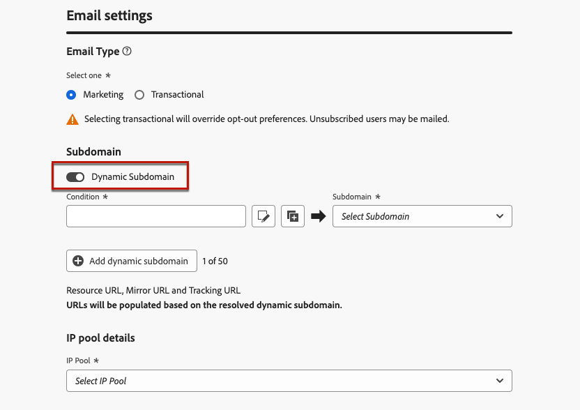
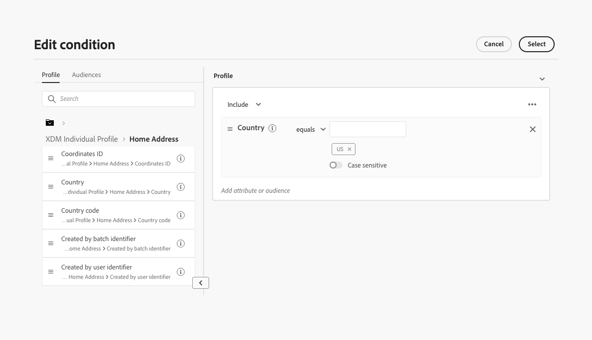
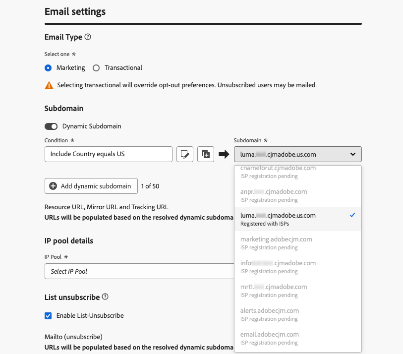
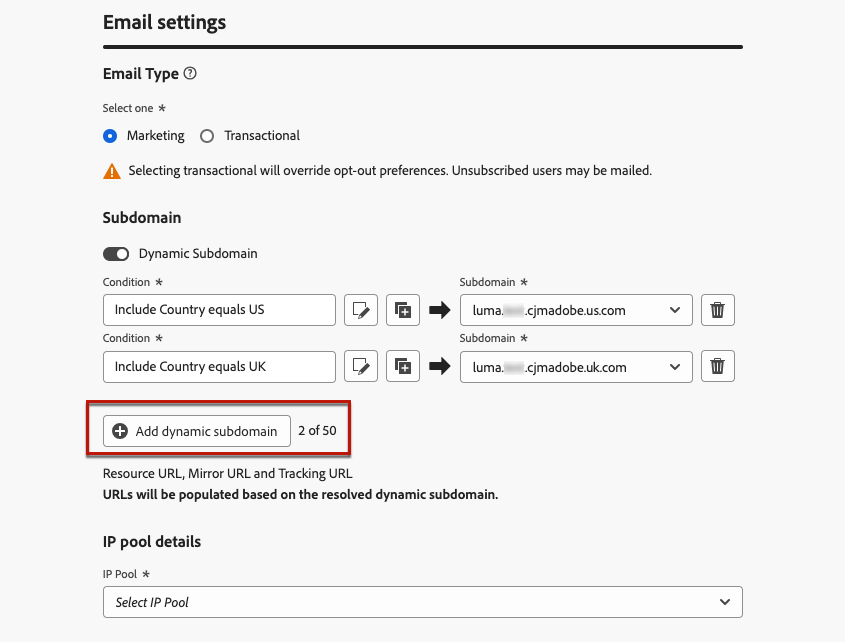
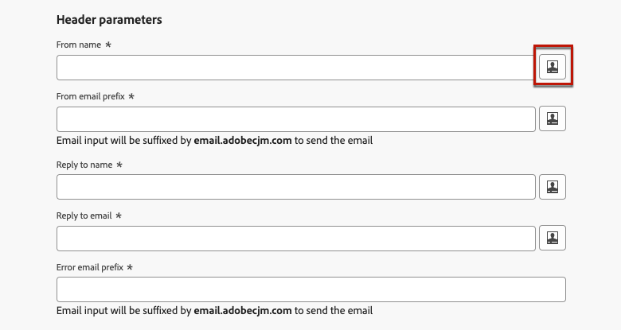
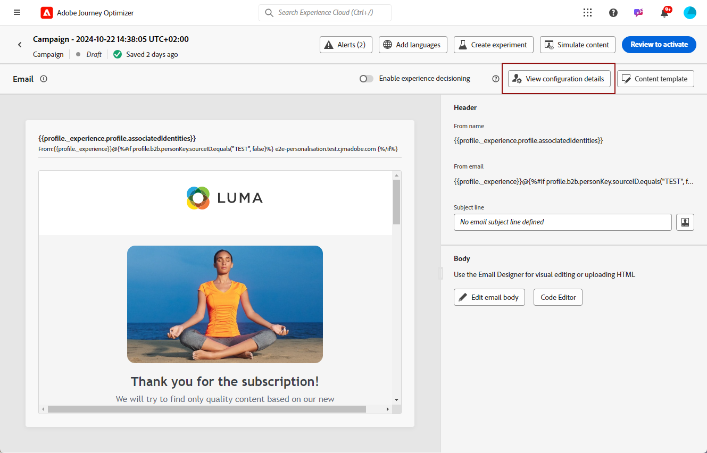
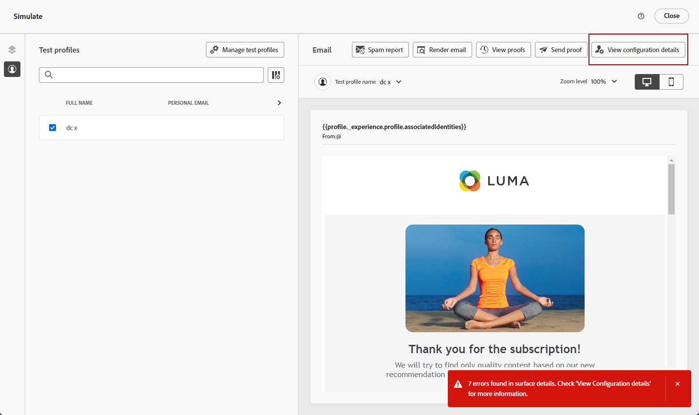
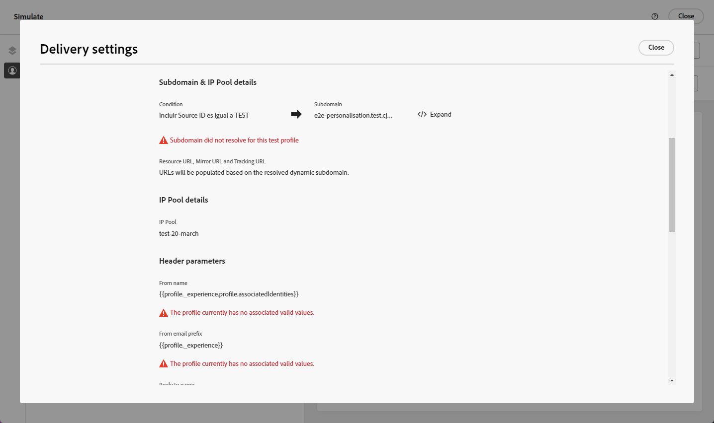

# 個人化電子郵件組態設定 {#surface-personalization}

為了提高彈性並控制電子郵件設定，[!DNL Journey Optimizer]可讓您在建立電子郵件設定時，定義子網域、標題和URL追蹤引數的個人化值。

## 新增動態子網域 {#dynamic-subdomains}

>[!CONTEXTUALHELP]
>id="ajo_surface_perso_not_available"
>title="個人化不可用"
>abstract="此設定建立時沒有任何個人化屬性。如果需要個人化，請參閱文件以了解解決步驟。"

>[!CONTEXTUALHELP]
>id="ajo_surface_dynamic_subdomain"
>title="啟用動態子網域"
>abstract="建立電子郵件設定時，您可以根據使用個人化編輯器定義的條件來設定動態子網域。您最多可以新增 50 個動態子網域。"

建立電子郵件設定時，您可以根據特定條件設定動態子網域。

例如，如果您有從每個國家/地區的專屬電子郵件地址傳送訊息的法律限制，則可以使用動態子網域。 這可讓您建立單一設定，並針對不同國家/地區使用數個傳送子網域，而非針對每個國家/地區建立多個設定。 然後，您可以將不同國家/地區的目標客戶整合為單一行銷活動。

若要定義電子郵件通道設定中的動態子網域，請遵循下列步驟。

1. 在建立設定之前，請先根據您的使用案例設定您要用於傳送電子郵件的子網域。 [了解作法](../configuration/about-subdomain-delegation.md)

   例如，假設您想針對不同的國家/地區使用不同的子網域：設定一個美國特定的子網域、一個英國特定的子網域等。

1. 建立管道設定。 [了解作法](../configuration/channel-surfaces.md)

1. 選取&#x200B;**[!UICONTROL 電子郵件]**&#x200B;頻道。

1. 在&#x200B;**子網域**&#x200B;區段中，啟用&#x200B;**[!UICONTROL 動態子網域]**&#x200B;選項。

   

1. 選取第一個&#x200B;**[!UICONTROL 條件]**&#x200B;欄位旁的編輯圖示。

1. [個人化編輯器](../personalization/personalization-build-expressions.md)開啟。 在此範例中，設定`Country`等同於`US`的條件。

   

1. 選取您要與此條件關聯的子網域。 [進一步瞭解子網域](../configuration/about-subdomain-delegation.md)

   >[!NOTE]
   >
   >某些子網域目前無法選取，因為[回饋迴路](../reports/deliverability.md#feedback-loops)註冊擱置中。 此程序可能需要長達 10 個工作天。完成後，您可以從所有可用的子網域中進行選擇。<!--where FL registration happens? is it when delegating a subdomain and you are awaiting from subdomain validation? or is it on ISP side only?-->

   

   所有位於美國的收件者都會收到使用該國家/地區所選子網域的訊息，這表示所有相關的URL （例如映象頁面、追蹤URL或取消訂閱連結）都會根據該子網域填入。

1. 視需要設定其他動態子網域。 您最多可以新增50個專案。

   

   <!--Select the [IP pool](../configuration/ip-pools.md) to associate with the configuration. [Learn more](email-settings.md#ip-pools)-->

1. 定義所有其他[電子郵件設定](email-settings.md)和[送出](../configuration/channel-surfaces.md#create-channel-surface)您的設定。

將一或多個動態子網域新增至設定後，系統會根據此設定的已解析動態子網域填入下列專案：

* 所有URL （資源URL、映象頁面URL和追蹤URL）

* [取消訂閱URL](email-settings.md#list-unsubscribe)

* **來自電子郵件**&#x200B;和&#x200B;**錯誤電子郵件**&#x200B;尾碼

>[!NOTE]
>
>如果您設定動態子網域，然後停用&#x200B;**[!UICONTROL 動態子網域]**&#x200B;選項，則會移除所有動態值。 選取子網域並提交設定以使變更生效。

## 個人化您的頁首 {#personalize-header}

您也可以針對設定中定義的所有標頭引數使用個人化。

例如，如果您有多個品牌，您可以建立單一設定，並對電子郵件標題使用個人化值。 這可讓您確保從不同品牌傳送的所有電子郵件都會以正確的&#x200B;**寄件者**&#x200B;名稱和電子郵件傳送給每個客戶。 同樣地，當您的收件者按一下電子郵件使用者端軟體中的&#x200B;**回覆**&#x200B;按鈕時，您希望&#x200B;**回覆**&#x200B;名稱和電子郵件對應至正確使用者的正確品牌。

若要針對設定標題引數使用個人化變數，請遵循下列步驟。

>[!NOTE]
>
>您可以個人化所有&#x200B;**[!UICONTROL 標頭引數]**&#x200B;欄位，**[!UICONTROL 錯誤電子郵件首碼]**&#x200B;欄位除外。

1. 依照您通常的作法定義標頭引數。 [了解作法](email-settings.md#email-header)

1. 對於每個欄位，選取編輯圖示。

   

1. [個人化編輯器](../personalization/personalization-build-expressions.md)開啟。 視需要定義您的條件並儲存變更。

   <!--For example, set a condition such as each recipient receives an email from their own brand representative.-->

   >[!NOTE]
   >
   >您只能選取&#x200B;**[!UICONTROL 設定檔屬性]**&#x200B;和&#x200B;**[!UICONTROL 協助程式函式]**。

   例如，您想要動態處理代表關係經理傳送的電子郵件，其詳細資料儲存在客戶設定檔中，以便每個客戶都與關係經理連結。 在[歷程](../building-journeys/journey-gs.md)中，電子郵件標題（寄件者名稱、寄件者電子郵件、回覆地址）可以個人化關係管理員的引數，這些引數取自設定檔屬性。

   <!--The examples below use event parameters, which are currently not available.
    
    Let's say you want to handle dynamically emails sent on behalf of a sales assistant, where the sales assistant is retrieved from an event or campaign contextual parameters. For example: In a [journey](../building-journeys/journey-gs.md), when a purchase event is linked to the sales assistant of a specific shop, the email header (sender name, sender email, reply to address) can be personalized with the sales assistant parameters, taken from the event attributes. In an [API-triggered campaign](../campaigns/api-triggered-campaigns.md), initiated externally by a sales assistant, the triggered email can be sent on behalf of the sales assistant and the header personalization values taken from campaign contextual parameters.-->

1. 針對您想要新增個人化的每個引數，重複上述步驟。

>[!NOTE]
>
>如果您新增一或多個動態子網域至您的設定，將會根據解析的&#x200B;**動態子網域**&#x200B;填入&#x200B;**寄件者電子郵件**&#x200B;和[錯誤電子郵件](#dynamic-subdomains)尾碼。

## 使用個人化URL追蹤 {#personalize-url-tracking}

若要使用個人化URL追蹤引數，請遵循下列步驟。

1. 移至電子郵件通道設定的&#x200B;**[!UICONTROL URL追蹤引數]**&#x200B;區段。 [了解更多](url-tracking.md)

1. 按一下每個欄位旁的編輯圖示。 除了內容屬性之外，您還可以選取設定檔屬性。

1. 從[個人化編輯器](../personalization/personalization-build-expressions.md)中選取您選擇的設定檔屬性。

1. 針對您要個人化的每個追蹤引數，重複上述步驟。

現在，當電子郵件寄出時，個人化引數會自動附加至URL結尾。 接著，您就可以在網站分析工具或效能報表中擷取此引數。

## 檢視設定詳細資料 {#view-surface-details}

在行銷活動或歷程中使用具有個人化設定的設定時，您可以直接在行銷活動或歷程中顯示設定詳細資料。 請遵循下列步驟。

1. 建立電子郵件[行銷活動](../campaigns/create-campaign.md)或[歷程](../building-journeys/journey-gs.md)。

1. 選取&#x200B;**[!UICONTROL 編輯內容]**&#x200B;按鈕。

1. 按一下&#x200B;**[!UICONTROL 檢視組態詳細資料]**&#x200B;按鈕。

   

1. 顯示&#x200B;**[!UICONTROL 傳遞設定]**&#x200B;視窗。 您可以檢視所有組態設定，包括動態子網域和個人化的標頭引數。

   >[!NOTE]
   >
   >此畫面上的所有資訊都是唯讀的。

1. 選取&#x200B;**[!UICONTROL 展開]**&#x200B;以顯示動態子網域的詳細資料。

   

## 檢查您的設定 {#check-configuration}

在行銷活動或歷程中使用個人化設定時，您可以使用測試設定檔來預覽電子郵件內容，以檢查您定義的動態設定是否可能錯誤。 請遵循下列步驟。

>[!NOTE]
>
>除了測試設定檔之外，[!DNL Journey optimizer]也可讓您使用從CSV / JSON檔案上傳或手動新增的範例輸入資料，透過預覽和傳送校樣來測試內容的不同變體。 [瞭解如何模擬內容變化](../test-approve/simulate-sample-input.md)

若要使用測試設定檔預覽您的內容，請執行下列步驟：

1. 從訊息的編輯內容畫面或電子郵件Designer中，按一下&#x200B;**[!UICONTROL 模擬內容]**&#x200B;按鈕。 [了解更多](../content-management/preview.md)

1. 選取[測試設定檔](../content-management/test-profiles.md)。

1. 如果顯示錯誤，請按一下&#x200B;**[!UICONTROL 檢視組態詳細資料]**&#x200B;按鈕。

   

1. 檢查&#x200B;**[!UICONTROL 傳遞設定]**&#x200B;畫面以取得錯誤詳細資料。

   

可能的錯誤如下：

* 未針對選取的測試設定檔解析&#x200B;**子網域**。 例如，您的設定使用數個對應不同國家/地區的傳送子網域，但選取的設定檔並未針對`Country`屬性定義任何值，或是屬性已設為`France`，但此值未與該設定中的任何子網域相關聯。

* 選取的設定檔沒有一或多個&#x200B;**標頭引數**&#x200B;的相關值。

出現任何這些錯誤時，都不會將電子郵件傳送至選取的測試設定檔。

若要避免這類錯誤，請確定您定義的標頭引數會將個人化屬性與大部分設定檔的值搭配使用。 缺少值可能會影響您的電子郵件傳遞能力。

>[!NOTE]
>
>在[本節](../reports/deliverability.md)中進一步瞭解傳遞能力
