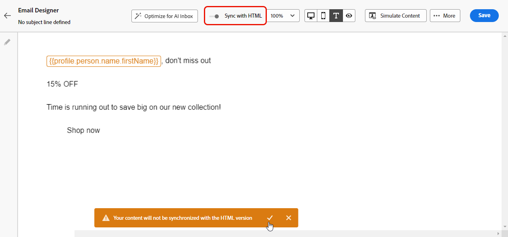
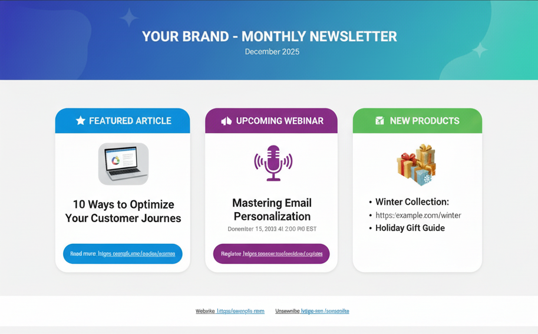
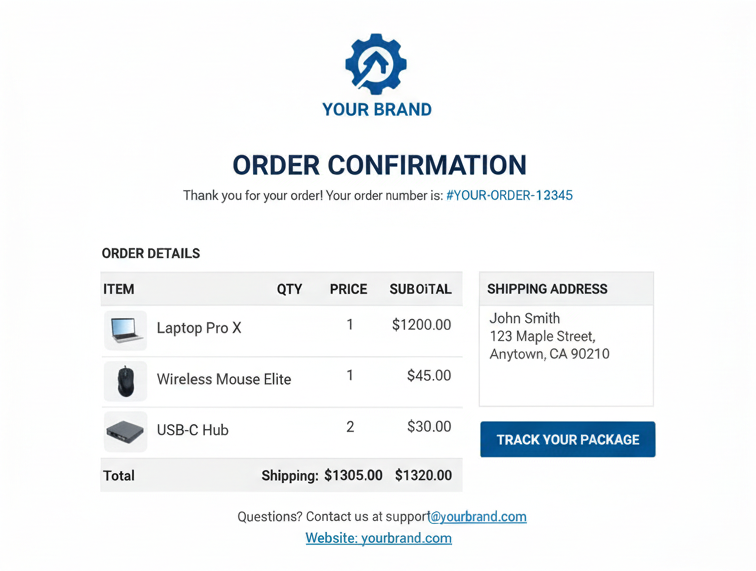

# 建立電子郵件的文字版本 {#text-version-email}

建議建立電子郵件內文的文字版本，當 HTML 內容無法顯示時可使用。

依預設，電子郵件設計工具會建立電子郵件的&#x200B;**[!UICONTROL 純文字]**&#x200B;版本，包括個人化欄位。此版本是自動產生，並與內容的 HTML 版本同步。

如果您偏好為純文字版本使用不同的內容，請依照以下步驟操作：

1. 從您的電子郵件中選取&#x200B;**[!UICONTROL 純文字]**&#x200B;圖示。

   

1. 使用&#x200B;**[!UICONTROL 與HTML同步]**&#x200B;切換以停用同步。 按一下勾選記號以確認您的選擇。

   

1. 然後，您可以視需要編輯純文字版本。

>[!CAUTION]
>
> * 停用同步時，在&#x200B;**[!UICONTROL 純文字]**&#x200B;檢視中所做的變更不會反映在HTML檢視中。
>
>* 如果您在更新純文字內容後重新啟用「**[!UICONTROL 與HTML同步]**」選項，您的變更將會遺失，並以HTML版本產生的文字內容取代。

## 何時使用自訂純文字版本 {#when-to-use}

瞭解何時應建立自訂純文字版本與使用自動同步處理，有助於確保最佳電子郵件傳遞和可讀性。

### 在下列情況下使用自訂純文字（停用同步）：

* **複雜的HTML版面配置** — 您的HTML電子郵件包含多欄版面配置、表格，或無法妥善轉譯為純文字的複雜CSS。
* **大量視覺內容** — 您的電子郵件嚴重依賴影像，而且您想要為停用影像的使用者端提供描述性文字替代方案。
* **不同的訊息結構** — 您想要提供針對純文字閱讀程式最佳化的簡化或重新組織訊息結構。
* **協助工具需求** — 您需要特定的純文字格式，以符合協助工具標準。
* **舊版電子郵件使用者端** — 您的對象包括需要特殊格式內容的舊版電子郵件使用者端（例如Outlook 2003、純文字行動使用者端）的使用者。
* **ASCII格式** — 您想要包含特定的純文字格式，例如ASCII圖案、表格或特定的分行符號。

### 在下列情況下使用自動同步（預設）：

* **簡單的HTML設計** — 您的HTML電子郵件具有簡單線性結構，可妥善轉譯為純文字。
* **一致的內容** — 您想要維持HTML和純文字版本之間的完全一致。
* **經常更新** — 您會定期更新電子郵件內容，希望避免手動重複。
* **Personalization運作良好** — 您的個人化欄位在這兩種格式中都正常運作。
* **時間限制** — 您需要快速啟動電子郵件，而不需要額外的純文字自訂。

## 實用範例 {#practical-examples}

下列範例示範真實世界的情境，協助您決定使用自訂純文字還是自動同步。 每個範例都會說明內容、建議方法以及決定背後的理由。

+++範例1：具有複雜版面的行銷電子報

**案例：**&#x200B;包含影像、樣式按鈕和顏色編碼區段的多欄電子報。



**建議：**&#x200B;使用自訂純文字（停用同步）。

**為何選擇自訂純文字：** HTML版本使用三欄格線版面配置，包含橫幅影像、樣式按鈕及色碼區段。 這些視覺元素無法透過自動同步很好地轉換為純文字，導致內容雜亂、難以閱讀。 自訂純文字版本可讓您將內容重新建構為線性、易於掃描的格式，具有清晰的區段標題和正確格式化的連結。

**自訂純文字範例：**

```
================================================
YOUR BRAND - MONTHLY NEWSLETTER
December 2025
================================================

🌟 FEATURED ARTICLE
"10 Ways to Optimize Your Customer Journeys"
Read more: https://example.com/articles/optimize-journeys

📢 UPCOMING WEBINAR
"Mastering Email Personalization"
December 15, 2025 at 2:00 PM EST
Register: https://example.com/webinar/register

📦 NEW PRODUCTS
- Winter Collection: https://example.com/winter
- Holiday Gift Guide: https://example.com/gifts

================================================
Website: https://example.com
Unsubscribe: https://example.com/unsubscribe
================================================
```

+++

+++範例2：異動訂單確認

**案例：**&#x200B;包含結構化資料（訂單編號、料號、價格、送貨詳細資料）的訂單確認。



**建議：**&#x200B;使用自動同步。

**為什麼自動同步可以運作：**&#x200B;訂單確認具有簡單線性結構，可自然從HTML轉譯為純文字。 資訊會邏輯地流動(訂單明細→料號→送貨總→)，而個人化欄位（如訂單編號與客戶名稱）在兩個格式中的運作方式相同。 結構化、表格式資料可完全轉換，無需手動調整，既節省時間，又保持清晰度。

+++

+++範例3：使用豐富媒體的活動邀請

**案例：**&#x200B;包含背景影像、內嵌影片和互動式元素的活動邀請。


**建議：**&#x200B;使用自訂純文字（停用同步）。

**為何選擇自訂純文字：** HTML版本仰賴視覺效果，例如背景影像、視訊內嵌及互動式RSVP按鈕。 自動同步會移除這些元素，留下含有中斷參照的混淆文字版本。 自訂純文字版本可讓您以組織良好的格式提供清楚的事件詳細資料、演講者資訊和直接註冊連結，不需要視覺元素即可運作。

**自訂純文字範例：**

```
YOU'RE INVITED!
Annual Customer Summit 2025

📅 When: March 15-17, 2025
📍 Where: San Francisco Convention Center
         123 Market Street, San Francisco, CA

KEYNOTE SPEAKERS
- Jane Smith, CEO TechCorp: "The Future of Digital Marketing"
- John Doe, Chief Innovation Officer: "AI and Customer Experience"

REGISTER NOW: https://example.com/summit/register
Early bird discount ends February 1st

Full agenda: https://example.com/summit/agenda
Questions: events@example.com | 1-800-555-0123
```

+++

## 常見使用實例 {#common-use-cases}

下列使用案例示範建立自訂純文字版本（停用sync）有益的情況。 每個範例都會顯示HTML版本帶來的挑戰，以及自訂純文字解決方案如何解決它。

+++使用案例1：產品目錄電子郵件

**挑戰：** HTML顯示含有影像、價格和購買按鈕的產品格線

**純文字解決方案：**&#x200B;建立包含明確產品名稱、價格和直接連結的結構化清單

```
FEATURED PRODUCTS
=================

1. Premium Leather Wallet
   Price: $89.99
   View product: https://example.com/product/wallet
   
2. Designer Sunglasses
   Price: $129.99
   View product: https://example.com/product/sunglasses
```

+++

+++使用案例2：歡迎電子郵件系列

**挑戰：**&#x200B;品牌歡迎電子郵件，含公司標誌及樣式格式

**純文字解決方案：**&#x200B;使用ASCII圖案或文字格式來建立視覺階層

```
***************************************************
*                                                 *
*     WELCOME TO [BRAND NAME]                    *
*     We're thrilled to have you!                *
*                                                 *
***************************************************
```

+++

+++使用案例3：調查或意見回饋請求

**挑戰：** HTML包含樣式按鈕和表單元素

**純文字解決方案：**&#x200B;提供包含指示的純文字連結

```
We'd love your feedback!
------------------------

Please take 2 minutes to complete our survey:
https://example.com/survey/customer-feedback

Your input helps us improve our service.
```

+++

## 常見問題 {#faq}

**我的個人化欄位是否會以純文字運作？**\
是，類似`{{profile.firstName}}`的個人化欄位在HTML和純文字版本中的運作方式相同。

**如何測試我的純文字版本？**
* 在電子郵件Designer中切換為&#x200B;**[!UICONTROL 純文字]**&#x200B;檢視。 [了解作法](#text-version-email)
* 傳送測試電子郵件給純文字電子郵件使用者端，例如舊版Pine或基本行動電子郵件應用程式。

**如果我忘記建立純文字版本，會發生什麼事？**\
系統會自動從您的HTML產生純文字版本，這可能不是最佳格式化，但將確保傳遞到純文字使用者端。

**我可以在HTML中使用與純文字不同的個人化嗎？**\
可以，一旦您停用同步，您就可以獨立自訂每個版本，包括使用不同的個人化欄位或內容。

**哪些電子郵件使用者端僅支援純文字？**\
現代的使用者端很少是純文字，但有些公司電子郵件原則、協助工具及舊版行動裝置可能會顯示純文字。 這也是HTML轉譯失敗時的遞補內容。

**我應該多久更新一次純文字版本？**\
每當您對HTML內容進行重大變更時，請更新它。 如果核心訊息維持不變，微幅調整HTML可能不需要更新純文字。

**我可以在純文字電子郵件中包含連結嗎？**\
是！包含完整URL (例如https://example.com/page)，且大多數電子郵件使用者端會自動使其可點選。

**我是否應該包含純文字的影像？**\
否，純文字不支援影像。 請改為說明影像所顯示的內容，或提供線上檢視影像的連結。
