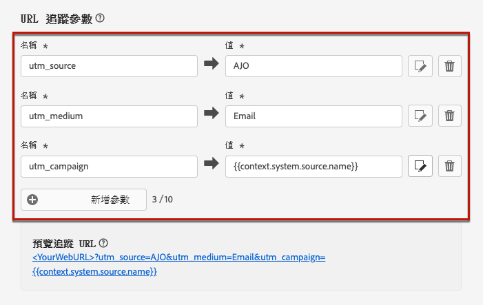
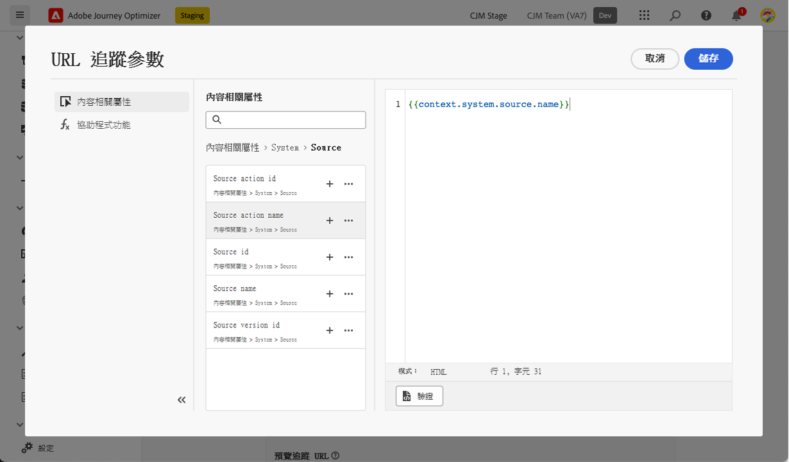
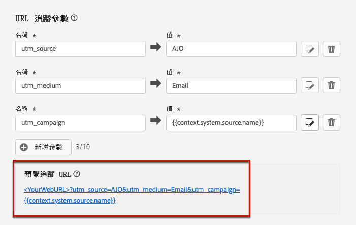

# URL 追蹤 {#url-tracking}

>[!CONTEXTUALHELP]
>id="ajo_admin_preset_utm"
>title="定義 URL 追蹤參數"
>abstract="使用此區段以將追蹤參數自動附加到電子郵件內容中的 URL。此功能為選用。"

>[!CONTEXTUALHELP]
>id="ajo_admin_preset_url_preview"
>title="預覽 URL 追蹤參數"
>abstract="重新探討要如何將追蹤參數附加到電子郵件內容中出現的 URL。"

設定新的[電子郵件通道設定](email-settings.md)時，您可以定義&#x200B;**[!UICONTROL URL追蹤引數]**，以評估您跨通道行銷工作的有效性。 啟用此功能為選填。

對應區段中定義的引數將會附加至電子郵件內容中所包含的URL結尾。 接著，您就可以在 Adobe Analytics 或 Google Analytics 等網站分析工具中擷取這些參數，並建立各種效能報告。

您可使用&#x200B;**[!UICONTROL 新增參數]**&#x200B;按鈕，新增最多 10 個追蹤參數。

{width="80%"}

若要設定 URL 追蹤參數，您可以在&#x200B;**[!UICONTROL 名稱]**&#x200B;和&#x200B;**[!UICONTROL 值]**&#x200B;欄位中直接輸入所需的值。

您也可以使用[個人化編輯器](../personalization/personalization-build-expressions.md)來編輯每個&#x200B;**[!UICONTROL 值]**&#x200B;欄位。按一下版本圖示以開啟編輯器。從那裡，您可以選取可用的內容屬性和/或直接編輯文字。

下列預先定義的值可透過個人化編輯器取得：

* **訊息設定檔識別碼**：訊息導向屬性會識別傳送中傳送給每個目標設定檔的每一個訊息的唯一性。

* **優惠方案 ID**：電子郵件中使用的優惠方案 ID。

* **來源動作 ID**：新增至歷程或行銷活動電子郵件動作的 ID。

* **來源動作名稱**：新增至歷程或行銷活動電子郵件動作的名稱。

* **來源 ID**：傳送電子郵件歷程或行銷活動的 ID。

* **來源名稱**：傳送電子郵件歷程或行銷活動的名稱。

* **來源版本 ID**：傳送電子郵件歷程或行銷活動版本的 ID。

>[!NOTE]
>
>您可以結合輸入文字值並使用個人化編輯器中的內容屬性。每個&#x200B;**[!UICONTROL 值]**&#x200B;欄位可包含的字元數最多為 5 KB。

<!--You can drag and drop the parameters to reorder them.-->

以下是 Adobe Analytics 和 Google Analytics 相容 URL 的範例。

* 與 Adobe Analytics 相容的 URL：`www.YourLandingURL.com?cid=email_AJO_{{context.system.source.id}}_image_{{context.system.source.name}}`

* 與 Google Analytics 相容的 URL：`www.YourLandingURL.com?utm_medium=email&utm_source=AJO&utm_campaign={{context.system.source.id}}&utm_content=image`

您可以動態預覽產生的追蹤 URL。每次新增、編輯或移除參數時，預覽都會自動更新。

>[!NOTE]
>
>您也可以將動態個人化追蹤引數新增至電子郵件內容呈現的連結。 [了解更多](surface-personalization.md#personalize-url-tracking)
