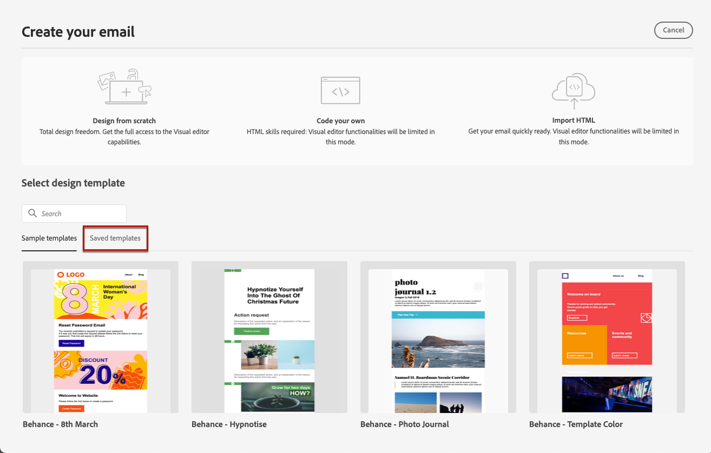

# 使用電子郵件範本 {#email-templates}

>[!CONTEXTUALHELP]
>id="ajo_use_template"
>title="從範本建置內容"
>abstract="若要開始建立您的電子郵件內容，請選取一個立即可用範本或自訂的現有範本，可能是從頭開始建立的或將以前的電子郵件另存為範本。"
>additional-url="https://experienceleague.adobe.com/docs/journey-optimizer/using/content-management/reusable-content/content-templates.html#create-content-templates" text="建立內容範本"

從 **[!UICONTROL 建立您的電子郵件]** 熒幕，使用 **[!UICONTROL 選取設計範本]** 區段，以開始從範本建立您的內容。

您可以選擇以下選項：

* **範例範本**. 此 [!DNL Journey Optimizer] 介面提供20個立即可用的電子郵件範本，供您選擇。

* **已儲存的範本**. 您也可以使用自訂範本，執行以下動作之一：

   * 使用從頭開始建立 **[!UICONTROL 內容範本]** 功能表。 [了解更多](../content-management/content-templates.md#create-template-from-scratch)

   * 使用從歷程或行銷活動中的電子郵件儲存 **[!UICONTROL 另存為內容範本]** 選項。 [了解更多](../content-management/content-templates.md#save-as-template)

若要使用其中一個範例或儲存的範本開始建立您的內容，請遵循下列步驟。

1. [存取電子郵件設計工具](get-started-email-design.md) 從電子郵件 **[!UICONTROL 編輯內容]** 畫面。

1. 在「**[!UICONTROL 建立您的電子郵件]**」畫面，「**[!UICONTROL 範例範本]**」索引標籤預設為選取狀態。

1. 若要使用自訂範本，請前往 **[!UICONTROL 已儲存的範本]** 標籤。

   

1. 所有專案的清單 [內容範本](../content-management/content-templates.md#create-content-templates) 隨即顯示在目前沙箱上建立。 你可以&#x200B;**[!UICONTROL 依名稱]**、**[!UICONTROL 上次修改日期]**&#x200B;和&#x200B;**[!UICONTROL 上次建立日期]**&#x200B;來排序儲存的範本。

   

1. 從清單中選取您選擇的範本。

1. 選取後，您可以使用左右箭頭在某個類別的所有範本之間導覽（根據您的選擇而儲存或範例）。

   

1. 按一下 **[!UICONTROL 使用此範本]** 在熒幕的右上方。

1. 視需要使用電子郵件設計工具編輯您的內容。
