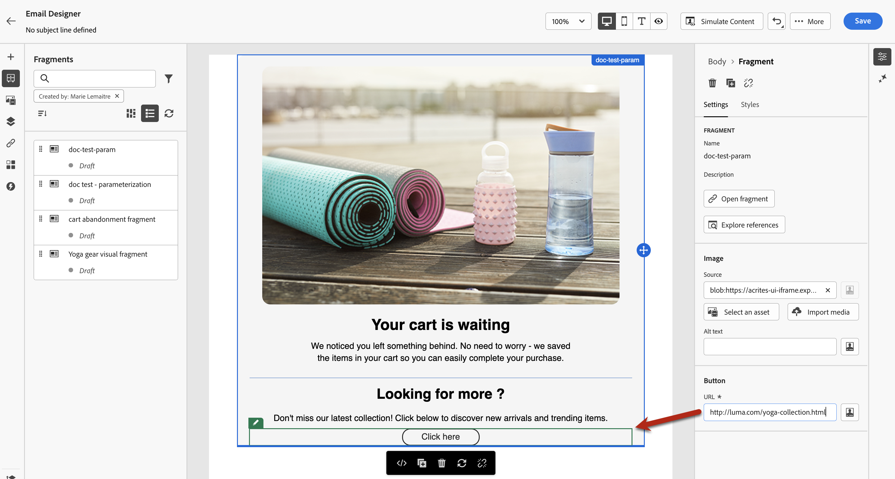

# 在您的電子郵件中新增視覺片段 {#use-visual-fragments}

片段是可重複使用的元件，可在跨Journey Optimizer行銷活動、歷程或內容範本的一封或多封電子郵件中參考。 此功能允許預先建立多個自訂內容區塊，可供行銷使用者在改良的設計流程中快速組合電子郵件內容。 [瞭解如何建立和管理片段](../content-management/fragments.md)。

➡️ [在此影片中瞭解如何管理、編寫和使用片段](../content-management/fragments.md#video-fragments)

## 使用片段 {#use-fragment}

若要在電子郵件中使用片段，請遵循下列步驟。

>[!NOTE]
>
>您最多可以在給定傳送中新增30個片段。 片段最多只能巢狀1個層級。

1. 使用[電子郵件Designer](get-started-email-design.md)開啟任何電子郵件或範本內容。

1. 從左側邊欄選取&#x200B;**[!UICONTROL 片段]**&#x200B;圖示。

   

1. 將會顯示在目前沙箱上建立的所有視覺化片段清單。 它們會依建立日期排序：最近新增的視覺片段會先顯示在清單中。 您可以：

   * 透過開始輸入其標籤來搜尋特定片段。
   * 以遞增或遞減順序排序片段。
   * 變更片段的顯示方式（卡片或清單檢視）。
   * 重新整理清單。

   >[!NOTE]
   >
   >如果您在編輯內容時修改或新增了某些片段，清單會以最新變更更新。

1. 從清單拖放任何片段到您要插入它的區域。

   

   >[!CAUTION]
   >
   >您可以將任何&#x200B;**草稿**&#x200B;或&#x200B;**即時**&#x200B;片段新增至您的內容。 但是，如果正在使用狀態為草稿的片段，您將無法啟用您的歷程或行銷活動。 在歷程或行銷活動發佈中，草稿片段將顯示錯誤，您需要核准它們才能發佈。

1. 如同任何其他元件，您可以在內容中移動片段。

1. 選取片段以在右側顯示對應的窗格。 從那裡，您可以從您的內容中刪除片段或複製它。 您也可以從片段上方顯示的內容功能表直接執行這些動作。

   

1. 從&#x200B;**[!UICONTROL 設定]**&#x200B;索引標籤，您可以：

   * 選擇您要顯示片段的裝置。
   * 視需要在新索引標籤中開啟片段以編輯。 [了解更多](../content-management/fragments.md#fragments)
   * 探索引用。 [了解更多](../content-management/fragments.md#visual-expression)

1. 您可以使用&#x200B;**[!UICONTROL 樣式]**&#x200B;索引標籤進一步自訂您的片段。

1. 如有需要，您可以中斷具有原始片段的繼承。 [了解更多](#break-inheritance)

1. 新增您想要的片段數，然後&#x200B;**[!UICONTROL 儲存]**&#x200B;您的變更。

### 在片段中使用動態內容時的限制 {#fragment-dynamic-content}

>[!CAUTION]
>
>使用包含動態內容（條件內容）的片段時，請注意以下限制：
>
>**不支援使用動態內容巢狀片段。**&#x200B;您無法將包含動態內容的片段放在也包含動態內容的已解除鎖定片段中。 此不受支援的設定可能導致：
>
>* 遺失條件式內容對應
>* 電子郵件Designer中的相容性模式警告
>* 不一致的電子郵件呈現
>
>**建議的方法：**&#x200B;當您在電子郵件中使用多個具有動態內容的片段時，請在電子郵件層級將每個片段直接新增到自己的結構區塊中。 這可確保正常運作並防止上述問題。

## 具有動態內容的片段的最佳實務 {#fragment-best-practices}

使用視覺片段和動態內容（條件式內容）時，請遵循下列最佳作法：

* **正確建構您的電子郵件**：使用包含動態內容的片段建置電子郵件時，請在電子郵件層級將每個片段新增到專屬的結構區塊中。 避免將包含動態內容的片段巢狀內嵌在其他也包含動態內容的已解鎖片段中。

* **提前計畫**：在將片段新增至您的電子郵件之前，請先識別哪些片段包含動態內容，並據此計畫您的版面。 這有助於防止設定問題，並確保從一開始就是乾淨的結構。

* **仔細設計可重複使用的片段**：建立包含動態內容的片段時，請考慮其使用方式。 如果片段需要巢狀內嵌在其他片段中，請避免將動態內容新增到父片段和子片段。

* **疑難排解**：如果您遺失條件式內容對應或相容性模式警告：
   * 檢查包含動態內容的巢狀片段的電子郵件結構
   * 透過在電子郵件層級將每個包含動態內容的片段移動到其自己的結構區塊中來重新構建
   * 儲存並驗證條件式內容對應是否已正確還原

## 使用隱含變數 {#implicit-variables-in-fragments}

隱含變數可增強現有片段功能，以提升內容重複使用性及指令碼使用案例的效率。 片段可以使用輸入變數，並建立可用於行銷活動和歷程內容的輸出變數。

瞭解如何在[本節](../personalization/use-expression-fragments.md#implicit-variables)中使用隱含變數。

## 自訂可編輯欄位 {#customize-fields}

如果所選片段的某些部分已變為可編輯，您可以在將片段新增到內容中後覆寫其預設值。 [瞭解如何使您的片段可自訂](../content-management/customizable-fragments.md)

若要自訂片段中可編輯的欄位，請遵循下列步驟：

1. 將片段新增至您的內容。

1. 選取它以開啟右側的屬性窗格。

   片段中的所有可編輯欄位會顯示在&#x200B;**片段**&#x200B;區段下的&#x200B;**設定**&#x200B;標籤中。

1. 當您在右窗格中選取可編輯的欄位時，它會在中央預覽窗格中以綠色反白顯示，讓您輕鬆識別它在內容中的位置。

   在下列範例中，可以編輯影像&#x200B;**來源**&#x200B;和&#x200B;**替代文字**，以及[按一下這裡]按鈕&#x200B;**URL**。

   

>[!CAUTION]
>
>當按鈕元件的&#x200B;**標籤**&#x200B;和&#x200B;**URL**&#x200B;在片段中都可以編輯時，追蹤報告會顯示URL而非按鈕標籤。 [進一步瞭解追蹤](../email/message-tracking.md)

## 中斷繼承 {#break-inheritance}

當您編輯視覺片段時，變更會同步。 它們會自動傳播到包含該片段的所有草稿或即時歷程/行銷活動和內容範本。

新增至電子郵件或內容範本時，預設會同步片段。 不過，您可以中斷原始片段的繼承。 在這種情況下，片段的內容會複製到目前的設計中，且變更不再同步。

若要中斷繼承，請遵循下列步驟：

1. 選取片段。

1. 按一下內容工具列中的解鎖圖示。

   

1. 該片段會成為不再連結至原始片段的獨立元素。 編輯它，就像內容中的任何其他內容元件一樣。 [了解更多](content-components.md)
