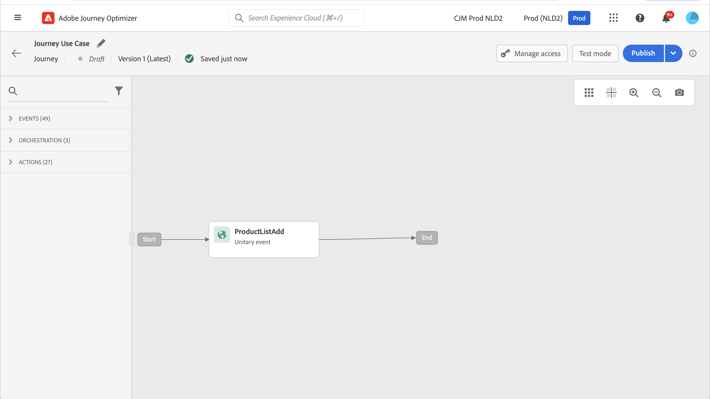
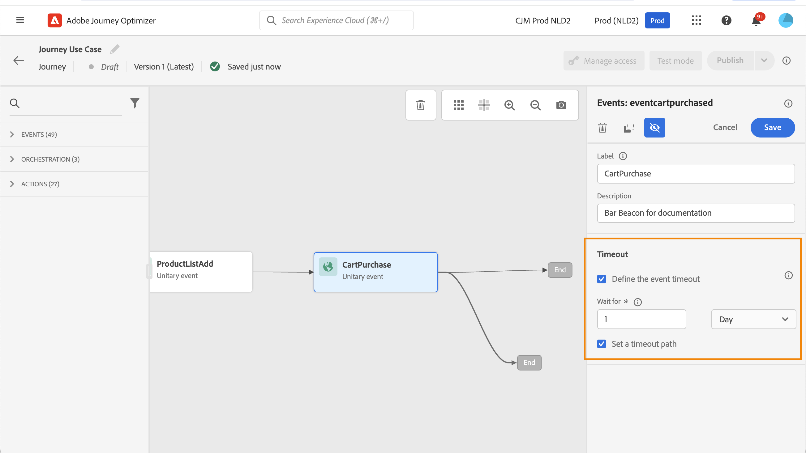
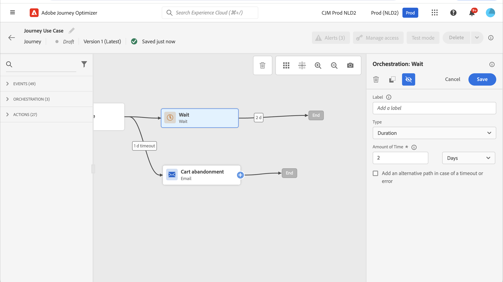
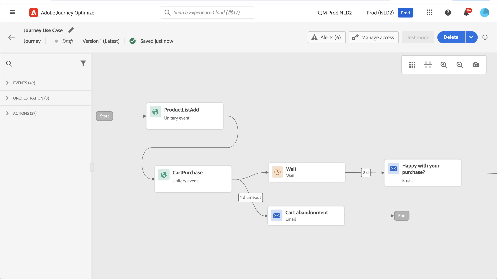

# 使用Adobe Analytics資料 {#analytics-data}

您可以善用已透過Adobe Analytics或Web SDK擷取並串流至Adobe Experience Platform的所有網頁行為事件資料，以觸發歷程並自動化客戶體驗。

為了讓此功能與Adobe Analytics搭配使用，您必須：

1. 啟用您要使用的報表套裝。 [了解更多](#leverage-analytics-data)
1. 啟用Journey Optimizer以使用您的Adobe Analytics資料來源。 [了解更多](#activate-analytics-data)
1. 在歷程中新增特定事件。 [了解更多](#event-analytic)

>[!NOTE]
>
>本節僅適用於規則型事件，以及需要使用Adobe Analytics或Web SDK資料的客戶。
> 
>如果您使用Adobe Customer Journey Analytics，請參閱 [此頁面](../reports/cja-ajo.md).
>

## 設定Adobe Analytics或Web SDK資料 {#leverage-analytics-data}

您必須啟用來自Adobe Analytics或Adobe Experience Platform Web SDK的資料，才能在歷程中使用。

請依照下列步驟執行此操作：

1. 瀏覽至 **[!UICONTROL 來源]** 功能表。

1. 在Adobe Analytics區段中，選取 **[!UICONTROL 新增資料]**

   

1. 從可用的Adobe Analytics報表套裝清單中，選取 **[!UICONTROL 報告套裝]** 以啟用。 然後，按一下 **[!UICONTROL 下一個]**.

   

1. 選擇您要使用預設或自訂結構描述。

1. 從 **[!UICONTROL 資料流詳細資料]** 熒幕，選擇 **[!UICONTROL 資料流名稱]**.

1. 完成設定後，按一下 **[!UICONTROL 完成]**.

   

如此將可啟用該報表套裝的Analytics來源聯結器。 只要有資料進來，就會轉換為Experience事件並傳送到Adobe Experience Platform。

在中進一步瞭解Adobe Analytics來源聯結器  [Adobe Experience Platform檔案](https://experienceleague.adobe.com/docs/experience-platform/sources/connectors/adobe-applications/analytics.html){target="_blank"} and [tutorial](https://experienceleague.adobe.com/docs/experience-platform/sources/ui-tutorials/create/adobe-applications/analytics.html){target="_blank"}.

## 啟用此設定 {#activate-analytics-data}

完成此設定後，請聯絡Adobe以啟用您的Journey Optimizer環境來使用此資料來源。 只有Adobe Analytics資料來源才需要此步驟。 若要執行此動作：

1. 取得資料來源識別碼。 此資訊可在使用者介面中取得：瀏覽至您建立的資料來源 **資料流** 的標籤 **來源** 功能表。 要找到該變數，最簡單的方式是篩選Adobe Analytics來源。
1. 請聯絡Adobe客戶服務，提供下列詳細資訊：

   * 主旨：為歷程啟用Adobe Analytics事件

   * 內容：請啟用我的環境以使用AA事件。

      * 組織ID： &quot;XXX@AdobeOrg&quot;

      * 資料來源ID： &quot;ID： xxxxx&quot;

1. 一旦您確認環境準備就緒，即可在您的歷程中使用Adobe Analytics資料。

## 使用Adobe Analytics或Web SDK資料建立包含事件的歷程 {#event-analytics}

您現在可以根據Adobe Analytics或Adobe Experience Platform Web SDK資料建立事件，以用於歷程中。

在下列範例中，瞭解如何鎖定在購物車中新增產品的使用者：

* 如果訂單已完成，使用者會在兩天後收到後續電子郵件，要求您提供意見。
* 如果訂單未完成，使用者會收到一封電子郵件，提醒他們完成訂單。

1. 從Adobe Journey Optimizer存取 **[!UICONTROL 設定]** 功能表。

1. 然後，選取 **[!UICONTROL 管理]** 從 **[!UICONTROL 活動]** 卡片。

   

1. 按一下 **[!UICONTROL 建立事件]**. 事件設定窗格會在畫面右側開啟。

1. 填入 **[!UICONTROL 事件]** 引數：

   * **[!UICONTROL 名稱]**：個人化您的名稱 **[!UICONTROL 事件]**.
   * **[!UICONTROL 型別]**：選擇 **[!UICONTROL 單一]** 型別。 [了解更多](../event/about-events.md)
   * **[!UICONTROL 事件ID型別]**：選擇 **[!UICONTROL 以規則為基礎]** 事件ID型別。 [了解更多](../event/about-events.md#event-id-type)
   * **[!UICONTROL 結構描述]**：選取Analytics或WebSDK結構描述 [建立於以下時間之前：](#leverage-analytics-data).
   * **[!UICONTROL 欄位]**：選取裝載欄位。 [了解更多](../event/about-creating.md#define-the-payload-fields)
   * **[!UICONTROL 事件ID條件]**：定義條件以識別將觸發歷程的事件。

     在此，當客戶將專案新增至購物車時會觸發事件。
   * **[!UICONTROL 設定檔識別碼]**：從您的裝載欄位選擇一個欄位，或定義一個公式以識別與事件相關聯的人員。

   

1. 設定後，選取 **[!UICONTROL 儲存]**.

現在事件已準備就緒，請建立歷程以使用它。

1. 從 **[!UICONTROL 歷程]** 選單，開啟或建立歷程。 如需詳細資訊，請參閱[本章節](../building-journeys/journey-gs.md)。

1. 將您先前設定的Analytics事件新增至您的歷程。

   

1. 新增完成訂購時觸發的事件。

1. 從您的 **[!UICONTROL 事件功能表]**，選取 **[!UICONTROL 定義事件逾時]** 和 **[!UICONTROL 設定逾時路徑]** 選項。

   

1. 從逾時路徑中新增 **[!UICONTROL 電子郵件]** 動作。 此路徑將用來傳送電子郵件給未完成訂單的客戶，以提醒他們其購物車仍然可用。

1. 新增 **[!UICONTROL 等待]** 活動，並將它設定為所需的持續時間。

   

1. 然後，新增 **[!UICONTROL 電子郵件動作]**. 在這封電子郵件中，系統會提示客戶對所下訂單提供意見。

您現在可以測試並發佈您的歷程。 [了解更多](../building-journeys/publishing-the-journey.md)

