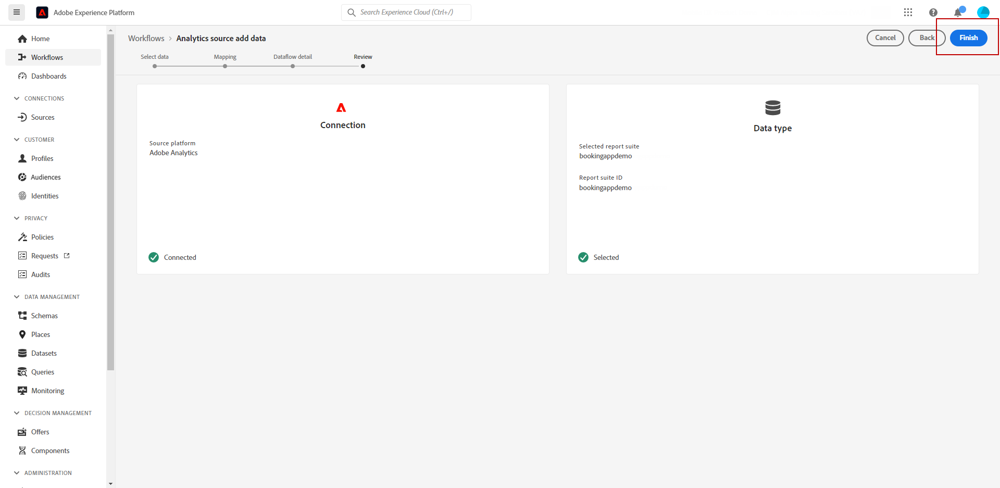

# Adobe Analytics 整合 {#analytics-data}

## 運用Adobe Analytics或Web SDK資料 {#leverage-analytics-data}

您可以運用您已擷取並串流至Adobe Experience Platform的所有Web行為事件資料(透過Adobe Analytics或Web SDK)，以觸發歷程並自動化客戶體驗。

>[!NOTE]
>
>本節僅適用於需使用Adobe Analytics或WebSDK資料的規則型事件和客戶。

若要讓此功能與Adobe Analytics搭配使用，您必須在Adobe Experience Platform中啟用您要使用的報表套裝。 請依照下列步驟執行此操作：

1. 連線至Adobe Experience Platform並瀏覽至 **[!UICONTROL 來源]**.

1. 在Adobe Analytics區段中，選取 **[!UICONTROL 新增資料]**

   

1. 從可用的Adobe Analytics報表套裝清單中，選取 **[!UICONTROL 報表套裝]** 啟用。 然後，按一下 **[!UICONTROL 下一個]**.

   

1. 選擇要使用預設架構還是自定義架構。

1. 從 **[!UICONTROL 資料流詳細資訊]** 螢幕，選擇 **[!UICONTROL 資料流名稱]**.

1. 完成設定後，按一下 **[!UICONTROL 完成]**.

   

如此可啟用該報表套裝的Analytics來源連接器。 每當資料傳入時，都會轉換為Experience事件並傳送至Adobe Experience Platform。

進一步了解Adobe Analytics來源連接器，位於  [Adobe Experience Platform檔案](https://experienceleague.adobe.com/docs/experience-platform/sources/connectors/adobe-applications/analytics.html){target=&quot;_blank&quot;}和 [教學課程](https://experienceleague.adobe.com/docs/experience-platform/sources/ui-tutorials/create/adobe-applications/analytics.html){target=&quot;_blank&quot;}。

## 使用Adobe Analytics或Web SDK資料建立具有事件的歷程 {#event-analytics}

實作與Adobe Analytics的整合後， [Adobe Analytics來源](#leverage-analytics-data) 或 [Adobe Experience Platform Web SDK](https://experienceleague.adobe.com/docs/experience-platform/edge/home.html)，您可以建立事件，以便稍後用於歷程。

在此範例中，我們會鎖定將產品新增至購物車的使用者：

* 如果訂單完成，兩天後他們會收到後續電子郵件，要求提供回饋。
* 如果訂單未完成，他們會收到電子郵件以提醒他們完成訂單。

1. 從Adobe Journey Optimizer存取 **[!UICONTROL 設定]** 功能表。

1. 然後，選取 **[!UICONTROL 管理]** 從 **[!UICONTROL 事件]** 卡片。

   

1. 按一下 **[!UICONTROL 建立事件]**. 事件設定窗格會在畫面右側開啟。

1. 填入 **[!UICONTROL 事件]** 參數：

   * **[!UICONTROL 名稱]**:個人化您的 **[!UICONTROL 事件]**.
   * **[!UICONTROL 類型]**:選擇 **[!UICONTROL 單一]** 類型。 [了解更多](../event/about-events.md)
   * **[!UICONTROL 事件ID類型]**:選擇 **[!UICONTROL 規則型]** 事件ID類型。 [了解更多](../event/about-events.md#event-id-type)
   * **[!UICONTROL 結構]**:選取在上節中建立的Analytics或WebSDK結構。
   * **[!UICONTROL 欄位]**:選取「裝載」欄位。 [了解更多](../event/about-creating.md#define-the-payload-fields)
   * **[!UICONTROL 事件ID條件]**:定義系統將用來識別將觸發歷程之事件的條件。

      在此，當客戶新增項目至購物車時，就會觸發事件。
   * **[!UICONTROL 設定檔識別碼]**:從您的裝載欄位中選擇欄位，或定義公式以識別與事件相關聯的人員。

   

1. 設定後，請選取 **[!UICONTROL 儲存]**. 您的事件現在已準備好用於歷程中。

1. 從 **[!UICONTROL 歷程]**，您現在可以開始建立您的歷程。 如需詳細資訊，請參閱[本章節](../building-journeys/journey-gs.md)。

1. 將先前設定的Analytics事件新增至歷程。

   

1. 新增訂單完成時將觸發的事件。

1. 從 **[!UICONTROL 事件功能表]**，請選取 **[!UICONTROL 定義事件逾時]** 和 **[!UICONTROL 設定逾時路徑]** 選項。

   

1. 從逾時路徑新增 **[!UICONTROL 電子郵件]** 動作。 此路徑將用來傳送電子郵件給未完成訂單的客戶，提醒他們購物車仍然可用。

1. 新增 **[!UICONTROL 等待]** 活動（在主路徑後），並將其設為所需的持續時間。

   

1. 然後，新增 **[!UICONTROL 電子郵件動作]**. 在此電子郵件中，系統會提示客戶提供已下單的回饋。

您現在可以在測試歷程的有效性之後發佈歷程。 [了解更多](../building-journeys/publishing-the-journey.md)

