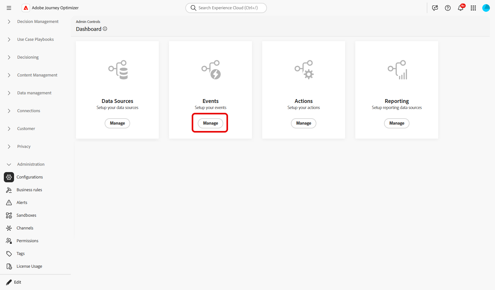
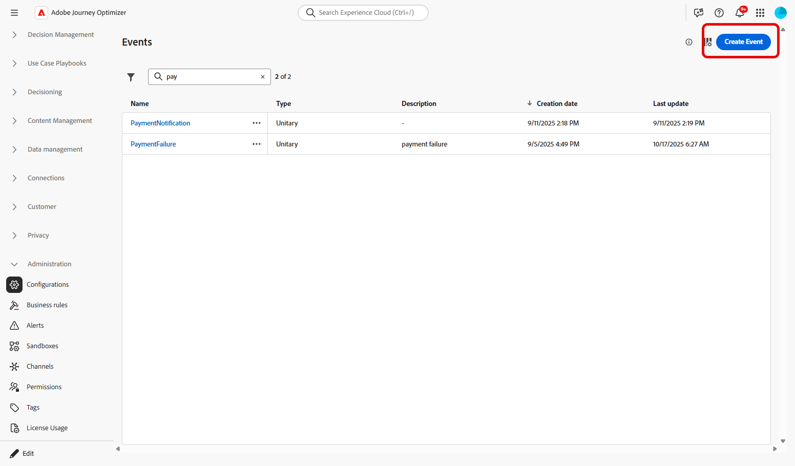
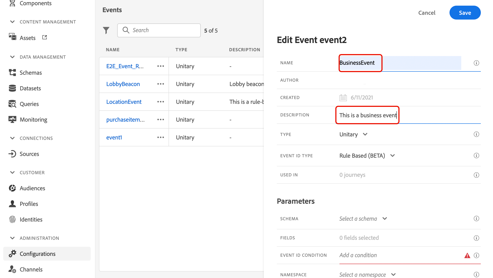
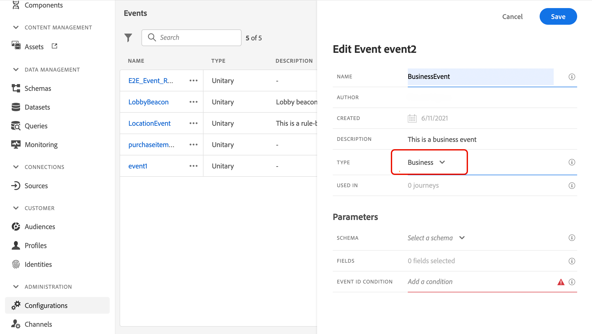
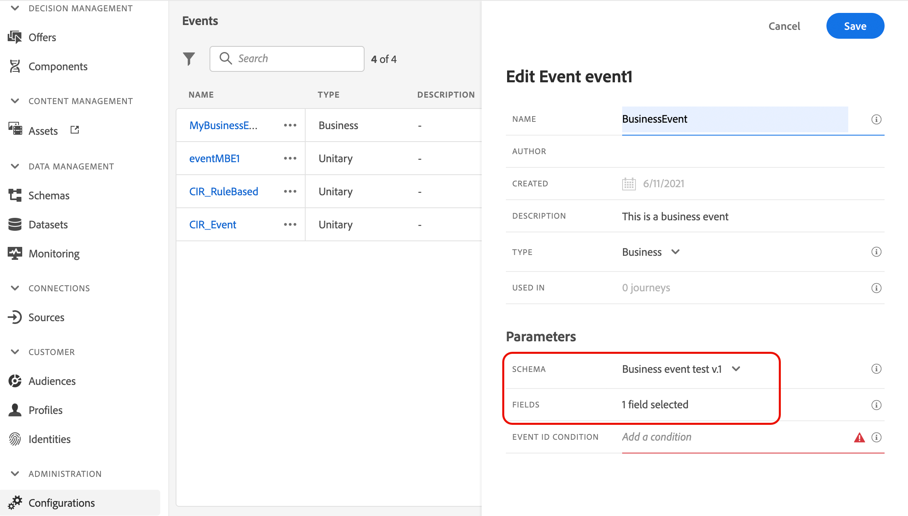
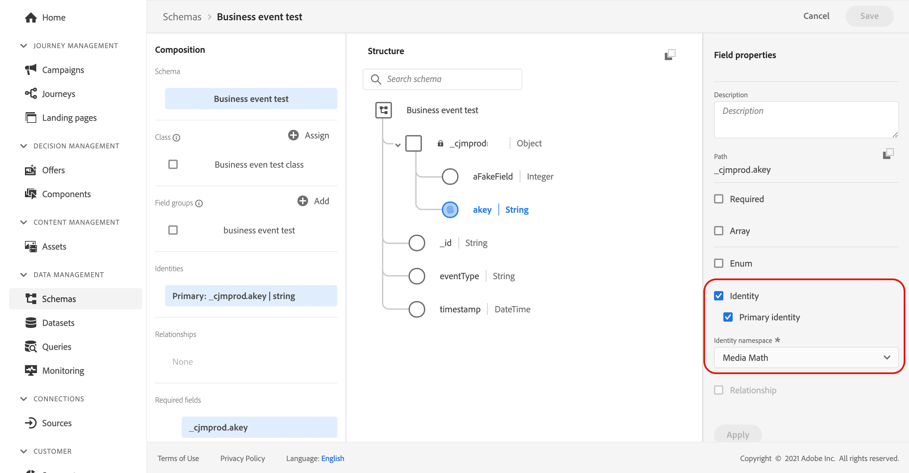
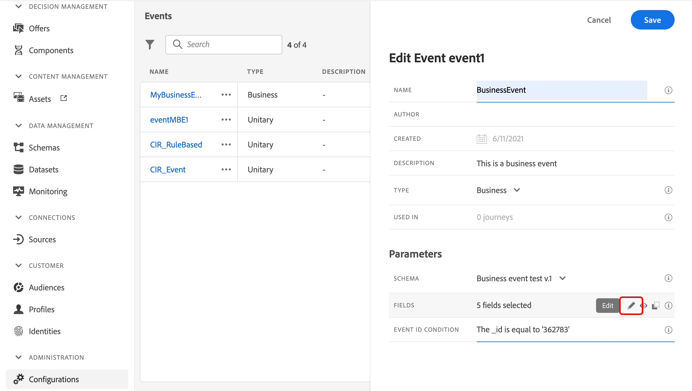
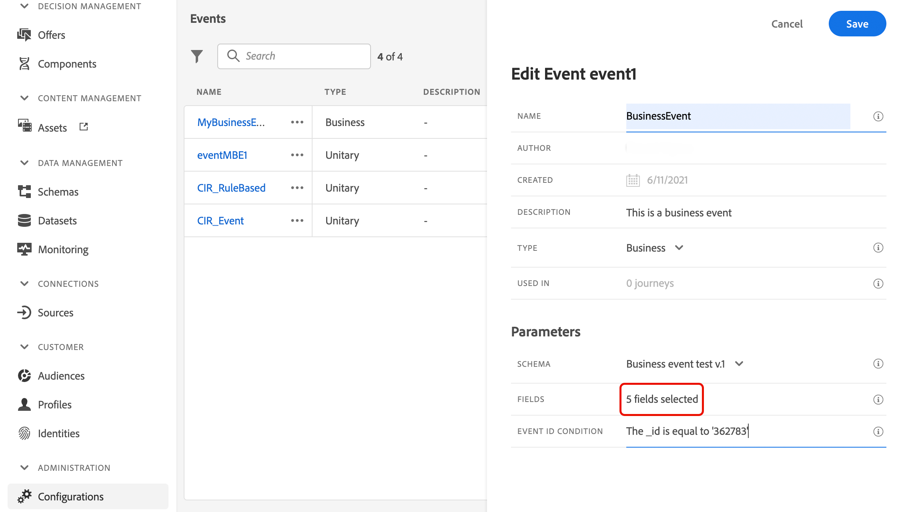
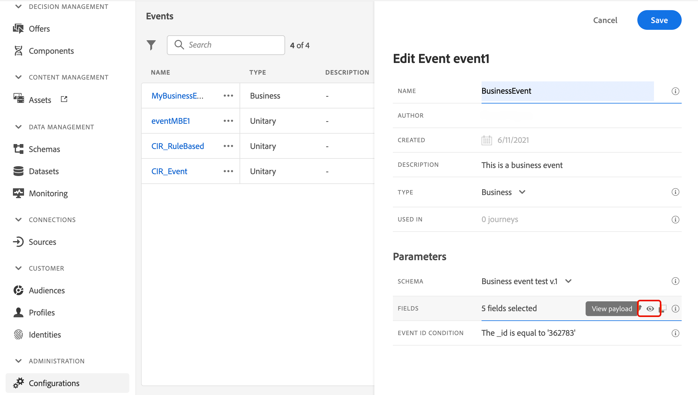

# 設定業務事件 {#configure-a-business-event}

>[!CONTEXTUALHELP]
>id="ajo_journey_event_business"
>title="商業事件 "
>abstract="事件設定可讓您定義 Journey Optimizer 會接收為事件的資訊。您可以使用多個事件 (在歷程的不同步驟中)，而好幾個歷程可以使用同一個事件。和單一事件不同，商業事件並不會連結到特定的設定檔。事件 ID 類型一直都會以規則為基礎。"

和單一事件不同，商業事件並不會連結到特定的設定檔。事件ID型別一律以規則為基礎。 在[本節](../event/about-events.md)閱讀更多有關商務活動的資訊。

讀取以對象為基礎的歷程可以在事件發生時由排程器定期觸發，或由業務事件觸發。

業務事件可以是「產品有貨」、「公司股價達到特定值」等。

>[!NOTE]
>
>您也可以觀看業務事件使用案例[教學課程](https://experienceleague.adobe.com/docs/journey-optimizer-learn/tutorials/create-journeys/use-case-business-event.html)。 請注意，該結構描述不需要為設定檔啟用。

## 重要備註 {#important-notes}

* 僅時間序列結構描述可用。 體驗事件、決定事件和歷程步驟事件結構描述無法使用。
* 事件結構描述必須包含非以人員為基礎的主要身分。 定義事件時必須選取下列欄位： `_id`和`timestamp`
* 業務事件只能作為歷程的第一步捨棄。
* 將商業事件作為歷程的第一步捨棄時，歷程的排程器型別將為「商業事件」。
* 業務事件後只能捨棄讀取對象活動。 它會自動新增為下一個步驟。
* 若要允許多個業務事件執行，請啟動歷程屬性的&#x200B;**[!UICONTROL 執行]**&#x200B;區段中的對應選項。
* 觸發業務事件後，匯出對象會有延遲，從15分鐘延遲至最多1小時。
* 測試業務事件時，您必須傳遞事件引數，以及將進入測試中歷程之測試設定檔的識別碼。 此外，在測試業務事件型歷程時，您只能觸發單一設定檔入口。 請參閱[此節](../building-journeys/testing-the-journey.md#test-business)。 在測試模式中，沒有「程式碼檢視」模式可用。
* 如果新的業務事件到來，目前處於歷程中的個人會發生什麼事？ 其行為與當新的週期發生時，個人仍在循環歷程中的情況相同。 其路徑已結束。 因此，行銷人員如果預期業務事件頻繁，必須注意避免建立太長的歷程。
* 業務事件不能與單一事件或客群資格篩選活動結合使用。

## 多個業務事件 {#multiple-business-events}

以下是一列收到多個業務事件時適用的幾個重要注意事項。

**在歷程處理期間，接收業務事件時的行為為何？**

業務事件會遵循與單一事件相同的重新進入規則。 如果歷程允許重新進入，將處理下一個業務事件。

**避免過度載入具體化對象的護欄是什麼？**

如果是拍攝中的業務事件，對於指定的歷程，第一個事件工作推送的資料會在1小時時段內重複使用。 對於已排程的歷程，沒有護欄。 在[Adobe Experience Platform Segmentation Service檔案](https://experienceleague.adobe.com/docs/experience-platform/segmentation/home.html?lang=zh-Hant)中進一步瞭解對象。

## 開始使用商業活動 {#gs-business-events}

以下是設定業務事件的第一步：

1. 在「管理」功能表區段中，選取&#x200B;**[!UICONTROL 組態]**。 在&#x200B;**[!UICONTROL 事件]**&#x200B;區段中，按一下&#x200B;**[!UICONTROL 管理]**。 畫面隨即顯示事件清單。

   

1. 按一下&#x200B;**[!UICONTROL 建立事件]**&#x200B;以建立新事件。 事件設定窗格會在畫面右側開啟。

   

1. 輸入事件的名稱。 您也可以新增說明。

   

   >[!NOTE]
   >
   >只允許使用英數字元和底線。 長度上限為30個字元。

1. 在&#x200B;**[!UICONTROL 型別]**&#x200B;欄位中，選擇&#x200B;**企業**。

   

1. 使用此事件的歷程次數會顯示在&#x200B;**[!UICONTROL 用於]**&#x200B;欄位中。 您可以按一下&#x200B;**[!UICONTROL 檢視歷程]**&#x200B;圖示，以顯示使用此事件的歷程清單。

1. 定義結構和裝載欄位：您可以在此處選取歷程預期會收到的事件資訊（或裝載）。 您稍後將在歷程中使用此資訊。 請參閱[本節](../event/about-creating-business.md#define-the-payload-fields)。

   

   僅時間序列結構描述可用。 `Experience Events`、`Decision Events`和`Journey Step Events`結構描述無法使用。 事件結構描述必須包含非以人員為基礎的主要身分。 定義事件時必須選取下列欄位： `_id`和`timestamp`

   

1. 在&#x200B;**[!UICONTROL 事件識別碼條件]**&#x200B;欄位內按一下。 使用簡單運算式編輯器來定義條件，系統會使用它來識別觸發您歷程的事件。

   

   在我們的範例中，我們根據產品ID來撰寫條件。 這表示每當系統收到符合此條件的事件時，就會將其傳遞至歷程。

   >[!NOTE]
   >
   >在簡單運算式編輯器中，並非所有運運算元都可使用，它們取決於資料型別。 例如，對於欄位的字串型別，您可以使用「包含」或「等於」。

1. 按一下&#x200B;**[!UICONTROL 儲存]**。

   

   條件現在已設定完畢，且準備好放入歷程中。若要接收事件，則需要完成其他設定步驟。請在[此頁面](../event/additional-steps-to-send-events-to-journey.md)了解更多。

## 定義裝載欄位 {#define-the-payload-fields}

裝載定義可讓您選擇系統預期從歷程中的事件接收的資訊，以及識別與事件相關聯之人員的金鑰。 裝載是根據Experience Cloud XDM欄位定義。 如需XDM的詳細資訊，請參閱[Adobe Experience Platform檔案](https://experienceleague.adobe.com/docs/experience-platform/xdm/home.html?lang=zh-Hant){target="_blank"}。

1. 從清單中選取XDM結構描述，然後按一下&#x200B;**[!UICONTROL 欄位]**&#x200B;欄位或&#x200B;**[!UICONTROL 編輯]**&#x200B;圖示。

   

   結構描述中定義的所有欄位都會顯示。 欄位清單會因結構描述而異。 您可以搜尋特定欄位，或使用篩選器來顯示所有節點和欄位，或僅顯示選定的欄位。 根據結構描述定義，某些欄位可能是必填欄位並預先選取。 您無法取消選取它們。 依預設，系統會選取歷程正確接收事件所必須的所有欄位。

   

   >[!NOTE]
   >
   > 確定已選取下列欄位： `_id`和`timestamp`

1. 選取您預期會從事件接收的欄位。 這些是業務使用者將在歷程中善用的欄位。

1. 選取完所需的欄位後，按一下&#x200B;**[!UICONTROL 儲存]**&#x200B;或按&#x200B;**[!UICONTROL Enter]**。

   選取的欄位數會顯示在&#x200B;**[!UICONTROL 欄位]**&#x200B;中。

   

## 預覽裝載 {#preview-the-payload}

使用裝載預覽以驗證裝載定義。

1. 按一下&#x200B;**[!UICONTROL 檢視裝載]**&#x200B;圖示以預覽系統預期的裝載。

   

   您可以注意到已選取的欄位已顯示。

   

1. 檢查預覽以驗證裝載定義。

1. 然後，您可以將裝載預覽與共用給負責事件傳送的人員。 此承載可協助他們設計推送至[!DNL Journey Optimizer]之事件的設定。 請參閱[此頁面](../event/additional-steps-to-send-events-to-journey.md)。
