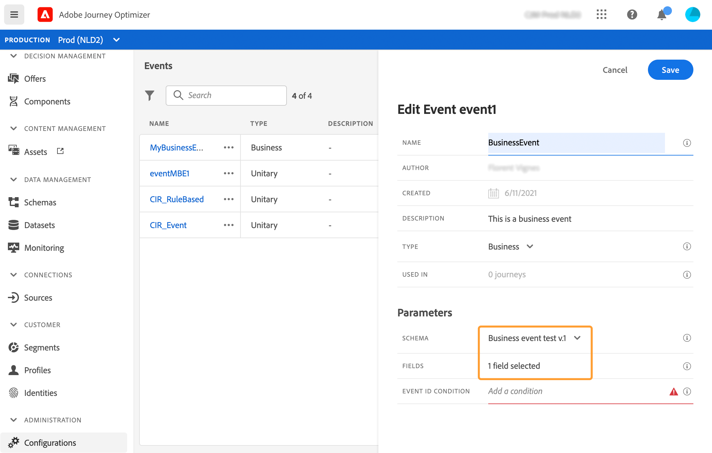
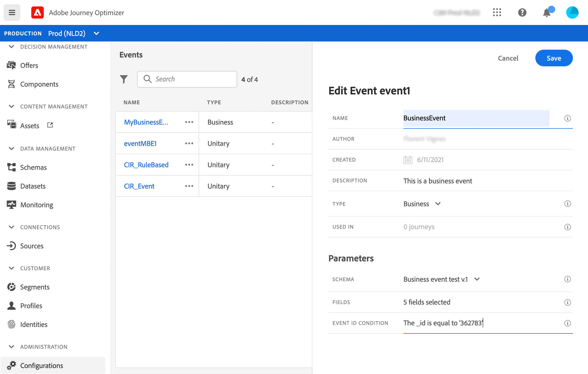

# 配置業務事件{#configure-a-business-event}

與單一事件不同，商業事件不會連結至特定個人檔案。 事件ID類型一律以規則為基礎。 閱讀[本節](../event/about-events.md)中有關商業事件的更多資訊。

讀取區段型歷程可由排程器定期觸發，或在事件發生時由業務事件觸發。

商業事件可以是「產品回頭流通」、「公司股價達到一定值」等。

## 重要附註

* 事件模式必須包含主要標識。
* 商業活動只能作為旅程的第一步而丟棄。
* 將業務事件作為旅程的第一步，行程的排程器類型將是「業務事件」。
* 業務事件後，只能丟棄讀取段活動。 它會自動新增為下一個步驟。
* 商業事件的觸發頻率不能超過一小時。
* 觸發業務事件後，將區段從15分鐘匯出至最多1小時會有延遲。
* 測試商業事件時，您必須傳遞事件參數和測試設定檔的識別碼，以便輸入測試中的歷程。 此外，在測試以商業活動為基礎的歷程時，您只能觸發單一描述檔入口。 請參閱[本節](../building-journeys/testing-the-journey.md#test-business)。在測試模式中，沒有可用的「程式碼檢視」模式。
* 如果有新的商業活動到來，目前正在體驗此行程的個人會發生什麼情況？ 它的運作方式與當新的重複發生時，個人仍在循環的歷程中時相同。 他們的路終了。 因此，如果行銷人員預期經常發生商業活動，就必須注意避免造成過長的歷程。

## 開始使用商業活動

以下是設定商業事件的第一步：

1. 從左側功能表，按一下&#x200B;**[!UICONTROL Admin]**&#x200B;圖示，然後按一下&#x200B;**[!UICONTROL Events]**。 畫面隨即顯示事件清單。

   

1. 按一下 **[!UICONTROL Add]** 以建立新事件。事件設定窗格會在畫面右側開啟。

   

1. 輸入事件的名稱。 您也可以新增說明。

   

   >[!NOTE]
   >
   >請勿使用空格或特殊字元。請勿使用超過 30 個字元。

1. 在&#x200B;**[!UICONTROL Type]**&#x200B;欄位中，選擇&#x200B;**業務**。

   

1. 使用此事件的歷程次數會顯示在 **[!UICONTROL Used in]** 欄位中。您可以按一下 **[!UICONTROL View journeys]** 圖示，以顯示使用此事件的歷程清單。

1. 定義架構和裝載欄位：這是您選擇預期接收的事件資訊（通常稱為裝載）歷程的位置。 接著，您就可以在歷程中使用這項資訊。請參閱[本節](../event/about-creating-business.md#define-the-payload-fields)。

   

   只有時間系列方案可用。 體驗事件、決策事件和歷程步驟事件結構不可用。 事件模式必須包含主要標識。

   

1. 在&#x200B;**[!UICONTROL Event ID condition]**欄位內按一下。 使用簡單運算式編輯器，定義系統將用來識別將觸發您旅程的事件的條件。
   

   在我們的範例中，我們根據產品的ID編寫條件。 這表示每當系統收到符合此條件的事件時，就會將它傳遞至歷程。

1. 按一下「**[!UICONTROL Save]**」。

   

   條件現在已設定完畢，且準備好放入歷程中。若要接收事件，則需要完成其他設定步驟。請參閱[本頁](../event/additional-steps-to-send-events-to-journey-orchestration.md)。

## 定義裝載欄位{#define-the-payload-fields}

有效負載定義可讓您選擇系統預期從歷程中的事件接收的資訊，以及識別與事件相關聯的人員的金鑰。 裝載基於Experience CloudXDM欄位定義。 有關XDM的詳細資訊，請參閱[本頁](https://experienceleague.adobe.com/docs/experience-platform/xdm/home.html?lang=zh-Hant)。

1. 從清單中選擇XDM方案，然後按一下&#x200B;**[!UICONTROL Payload]**&#x200B;欄位或&#x200B;**[!UICONTROL Edit]**&#x200B;表徵圖。

   

   將顯示架構中定義的所有欄位。 欄位清單會依不同的架構而有所不同。 您可以搜尋特定欄位，或使用篩選器來顯示所有節點和欄位，或僅顯示選取的欄位。 根據架構定義，某些欄位可能是必填和預選的。 您無法取消選取它們。 預設會選取事件必須由歷程正確接收的所有欄位。

   

1. 選擇您希望從事件接收的欄位。 這些是商業使用者在歷程中將運用的欄位。

   

1. 選擇完所需欄位後，按一下&#x200B;**[!UICONTROL Save]**&#x200B;或按&#x200B;**[!UICONTROL Enter]**。

   選擇的欄位數顯示在&#x200B;**[!UICONTROL Payload]**&#x200B;欄位中。

   

## 預覽裝載{#preview-the-payload}

裝載預覽可讓您驗證裝載定義。

1. 按一下&#x200B;**[!UICONTROL View Payload]**&#x200B;表徵圖可預覽系統預期的裝載。

   

   您可以注意到選取的欄位會顯示。

   

1. 勾選預覽以驗證裝載定義。

1. 然後，您可以將裝載預覽共用給負責事件傳送的人員。 此裝載可協助他設計推送至[!DNL Journey Optimizer]之事件的設定。 請參閱[本頁](../event/additional-steps-to-send-events-to-journey-orchestration.md)。
