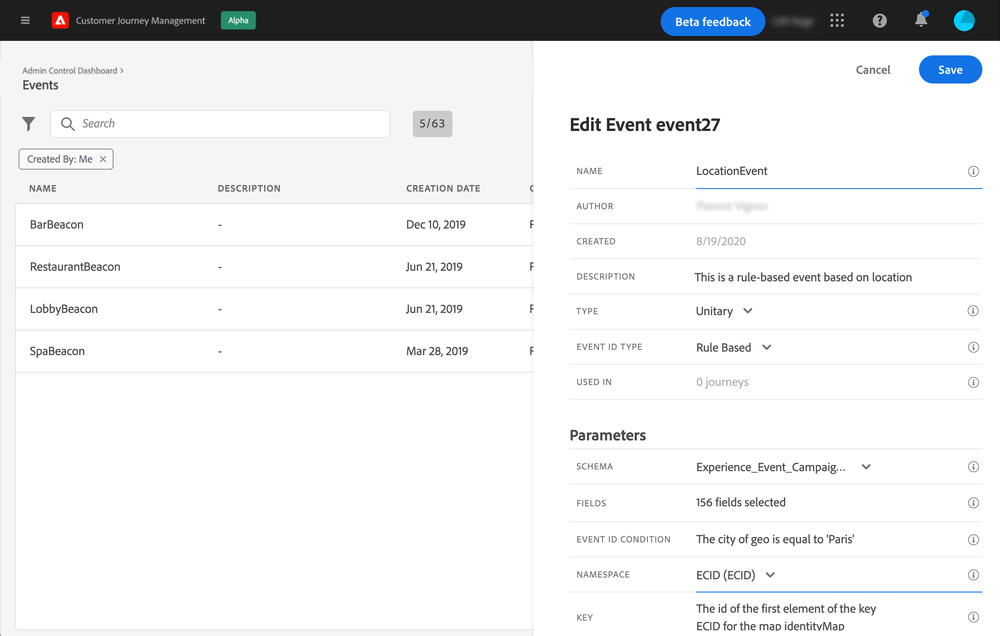
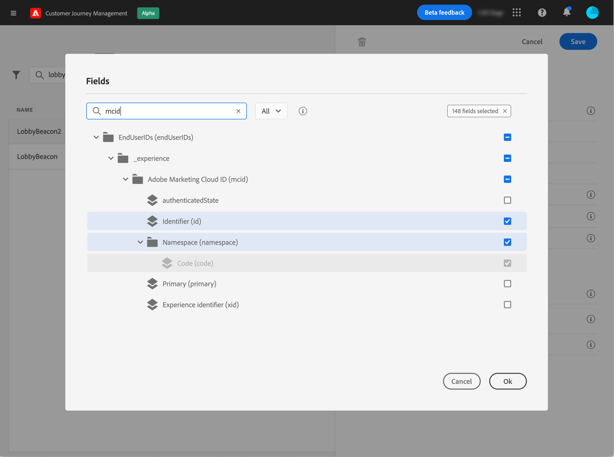
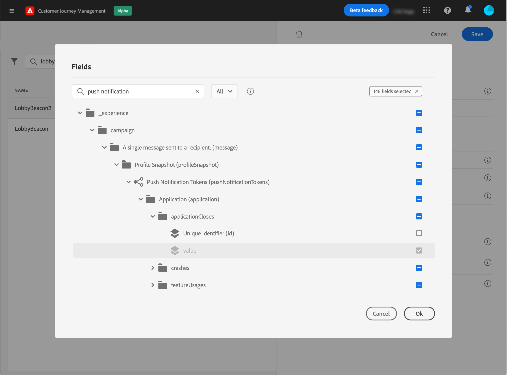

# 配置單一事件{#configure-an-event}

單一事件會連結至特定的描述檔。 它們可以是規則型或系統產生的。  閱讀更多有關酉事件[本節](../event/about-events.md)的資訊。

以下是設定新事件的第一步：

1. 從左側功能表，按一下&#x200B;**[!UICONTROL Admin]**&#x200B;圖示，然後按一下&#x200B;**[!UICONTROL Events]**。 畫面隨即顯示事件清單。

   

1. 按一下 **[!UICONTROL Add]** 以建立新事件。事件設定窗格會在畫面右側開啟。

   

1. 輸入事件的名稱。 您也可以新增說明。

   

   >[!NOTE]
   >
   >請勿使用空格或特殊字元。請勿使用超過 30 個字元。

1. 在&#x200B;**[!UICONTROL Type]**&#x200B;欄位中，選擇&#x200B;**酉事件**。

   

1. 在&#x200B;**[!UICONTROL Event ID type]**&#x200B;欄位中，選取您要使用的事件ID類型：**基於規則的**&#x200B;或&#x200B;**系統生成的**。 閱讀有關[本節](../event/about-events.md#event-id-type)中事件ID類型的更多資訊。

   

1. 使用此事件的歷程次數會顯示在 **[!UICONTROL Used in]** 欄位中。您可以按一下 **[!UICONTROL View journeys]** 圖示，以顯示使用此事件的歷程清單。

1. 定義架構和裝載欄位：這是您選擇預期接收的事件資訊（通常稱為裝載）歷程的位置。 接著，您就可以在歷程中使用這項資訊。請參閱[本節](../event/about-creating.md#define-the-payload-fields)。

   

   >[!NOTE]
   >
   >選擇&#x200B;**[!UICONTROL System Generated]**&#x200B;類型時，只有具有eventID類型混合的架構可用。 選擇&#x200B;**[!UICONTROL Rule Based]**&#x200B;類型時，所有Experience Event結構都可用。

1. 對於規則型事件，請在&#x200B;**[!UICONTROL Event ID condition]**欄位內按一下。 使用簡單運算式編輯器，定義系統將用來識別將觸發您旅程的事件的條件。
   

   在我們的例子中，我們根據個人檔案的城市寫了一個條件。 這表示每當系統收到符合此條件（**[!UICONTROL City]**&#x200B;欄位和&#x200B;**[!UICONTROL Paris]**&#x200B;值）的事件時，就會將它傳遞至歷程。

1. 新增命名空間。此步驟為選填，但建議您新增命名空間，以便運用儲存在「即時客戶個人檔案服務」的資訊。它會定義事件具備的金鑰類型。請參閱[本節](../event/about-creating.md#select-the-namespace)。
1. 定義金鑰：從您的有效負載欄位選擇一個欄位，或是定義一個公式以識別與事件相關聯的人員。如果您選取命名空間，系統便會自動設定此金鑰（但您仍可加以編輯）。實際上，reyures會選擇應該對應於命名空間的索引鍵（例如，如果您選取電子郵件名稱空間，則會選取電子郵件索引鍵）。 請參閱[本節](../event/about-creating.md#define-the-event-key)。

   

1. 對於系統產生的事件，您可以新增條件。 此步驟為選填。這可讓系統僅處理符合條件的事件。您只能根據事件含有之資訊設定條件。請參閱[本節](../event/about-creating.md#add-a-condition)。
1. 按一下「**[!UICONTROL Save]**」。

   

   條件現在已設定完畢，且準備好放入歷程中。若要接收事件，則需要完成其他設定步驟。請參閱[本頁](../event/additional-steps-to-send-events-to-journey-orchestration.md)。

## 定義裝載欄位{#define-the-payload-fields}

有效負載定義可讓您選擇系統預期從歷程中的事件接收的資訊，以及識別與事件相關聯的人員的金鑰。 裝載基於Experience CloudXDM欄位定義。 有關XDM的詳細資訊，請參閱[本頁](https://experienceleague.adobe.com/docs/experience-platform/xdm/home.html?lang=zh-Hant)。

1. 從清單中選擇XDM方案，然後按一下&#x200B;**[!UICONTROL Payload]**&#x200B;欄位或&#x200B;**[!UICONTROL Edit]**&#x200B;表徵圖。

   

   將顯示架構中定義的所有欄位。 欄位清單會依不同的架構而有所不同。 您可以搜尋特定欄位，或使用篩選器來顯示所有節點和欄位，或僅顯示選取的欄位。 根據架構定義，某些欄位可能是必填和預選的。 您無法取消選取它們。 預設會選取事件必須由歷程正確接收的所有欄位。

   >[!NOTE]
   >
   >請確定您已將「協調」混合加入XDM架構。 這將確保您的架構包含所有使用[!DNL Journey Optimizer]所需的資訊。

   

1. 選擇您希望從事件接收的欄位。 這些是商業使用者在歷程中將運用的欄位。 它們還必須包含用於識別與事件關聯的人員的密鑰（請參閱[本節](../event/about-creating.md#define-the-event-key)）。

   

   >[!NOTE]
   >
   >對於系統生成的事件，**[!UICONTROL eventID]**&#x200B;欄位會自動添加到選定欄位的清單中，以便[!DNL Journey Optimizer]能夠識別事件。 推送事件的系統不應產生ID，而應使用裝載預覽中可用的ID。 請參閱[本節](../event/about-creating.md#preview-the-payload)。

1. 選擇完所需欄位後，按一下&#x200B;**[!UICONTROL Save]**&#x200B;或按&#x200B;**[!UICONTROL Enter]**。

   

   選擇的欄位數顯示在&#x200B;**[!UICONTROL Payload]**&#x200B;欄位中。

   

## 選擇命名空間{#select-the-namespace}

命名空間可讓您定義用來識別與事件關聯之人員的索引鍵類型。 其配置是可選的。 如果您想在歷程中擷取來自[即時客戶資料](https://experienceleague.adobe.com/docs/experience-platform/profile/home.html)的其他資訊，則此為必要項。 如果您僅使用來自第三方系統的資料透過自訂資料來源，則不需要命名空間定義。

您可以使用其中一個預先定義的名稱空間，或使用Identity Namespace服務建立新的名稱空間。 請參閱此[頁](https://experienceleague.adobe.com/docs/experience-platform/identity/home.html)。

如果選擇具有主標識的方案，則預填充&#x200B;**[!UICONTROL Key]**&#x200B;和&#x200B;**[!UICONTROL Namespace]**&#x200B;欄位。 如果未定義身份，我們將選擇&#x200B;_identityMap > id_&#x200B;作為主鍵。 然後，您必須選擇命名空間，然後使用&#x200B;_identityMap > id_&#x200B;預先填入索引鍵（位於&#x200B;**[!UICONTROL Namespace]**&#x200B;欄位下方）。

選擇欄位時，標籤主標識欄位。

從下拉式清單中選取命名空間。

每個歷程僅允許一個命名空間。 如果您在同一歷程中使用數個事件，它們需要使用相同的命名空間。 請參閱[本頁](../building-journeys/journey.md)。

## 定義事件鍵{#define-the-event-key}

關鍵字是欄位或欄位組合是事件裝載資料的一部分，可讓系統識別與事件相關聯的人員。 金鑰可以是Experience CloudID、CRM ID或電子郵件地址。

如果您打算利用儲存在即時客戶配置檔案資料庫中的資料，則必須選擇在[即時客戶配置檔案服務](https://experienceleague.adobe.com/docs/experience-platform/profile/home.html)中定義為配置檔案標識的資訊作為事件鍵。

它可讓系統執行事件與個人設定檔之間的協調。 如果選擇具有主標識的方案，則預填充&#x200B;**[!UICONTROL Key]**&#x200B;和&#x200B;**[!UICONTROL Namespace]**&#x200B;欄位。 如果未定義身份，我們將選擇&#x200B;_identityMap > id_&#x200B;作為主鍵。 然後，您必須選擇命名空間，然後使用&#x200B;_identityMap > id_&#x200B;預先填入索引鍵（位於&#x200B;**[!UICONTROL Namespace]**&#x200B;欄位下方）。

選擇欄位時，標籤主標識欄位。

如果您需要使用不同的金鑰，例如CRM ID或電子郵件地址，則需手動新增：

1. 在&#x200B;**[!UICONTROL Key]**&#x200B;欄位內按一下，或在鉛筆圖示上按一下。

   

1. 在裝載欄位清單中選擇作為鍵的欄位。 您也可以切換至進階運算式編輯器，以建立更複雜的索引鍵（例如，事件的兩個欄位串連）。 請參閱以下章節。

   

收到事件時，鍵值將允許系統識別與事件相關聯的人。 與命名空間相關聯（請參閱[本節](../event/about-creating.md#select-the-namespace)），該鍵可用於對Adobe Experience Platform執行查詢。 請參閱[本頁](../building-journeys/about-journey-activities.md#orchestration-activities)。鑰匙也用來檢查一個人是否在旅程中。 事實上，一個人不可能在同一旅程的兩個不同地方。 因此，系統不允許相同的密鑰（例如，密鑰CRMID=3224）在同一行程的不同位置。

如果您想要執行其他操作，也可以訪問高級表達式函式(**[!UICONTROL Advanced mode]**)。 這些函式可讓您控制用於執行特定查詢的值，例如變更格式、執行欄位串連，只考慮欄位的一部分（例如10個前字元）。 請參閱[本頁](https://experienceleague.adobe.com/docs/journeys/using/building-advanced-conditions-journeys/expressionadvanced.html)。

## 添加條件{#add-a-condition}

條件僅適用於系統生成的事件。 您可以定義事件條件，讓系統篩選事件的處理。 如果條件為true，則處理事件。 如果條件不成立，則忽略事件。

事件條件只能根據事件裝載中傳遞的資料。 行銷人員無法在畫布中變更在事件層級定義的條件。 其目的是在使用此事件時強化此條件。 例如，如果您不希望行銷人員在購物車值太小時使用購物車放棄事件，您可以在「購物車值」事件欄位上建立條件，並強加超過100美元的值。

您可以使用簡單運算式編輯器或進階運算式編輯器來設定事件的條件。 請參閱[本頁](https://experienceleague.adobe.com/docs/journeys/using/building-advanced-conditions-journeys/expressionadvanced.html)。

例如，您可以定義條件，僅處理特定事件類型的事件，並忽略其他類型。 或者，如果您的事件是購物車放棄，而裝載包含購物車值欄位，則您可以定義事件條件，只有在購物車值大於100美元時，才能處理事件。

## 預覽裝載{#preview-the-payload}

裝載預覽可讓您驗證裝載定義。

>[!NOTE]
>
>對於系統產生的事件，當您建立事件時，在檢視裝載預覽之前，請先儲存事件並重新開啟它。 需要此步驟，才能在裝載中產生事件ID。

1. 按一下&#x200B;**[!UICONTROL View Payload]**&#x200B;表徵圖可預覽系統預期的裝載。

   

   您可以注意到選取的欄位會顯示。

   

1. 勾選預覽以驗證裝載定義。

1. 然後，您可以將裝載預覽共用給負責事件傳送的人員。 此裝載可協助他設計推送至[!DNL Journey Optimizer]之事件的設定。 請參閱[本頁](../event/additional-steps-to-send-events-to-journey-orchestration.md)。
