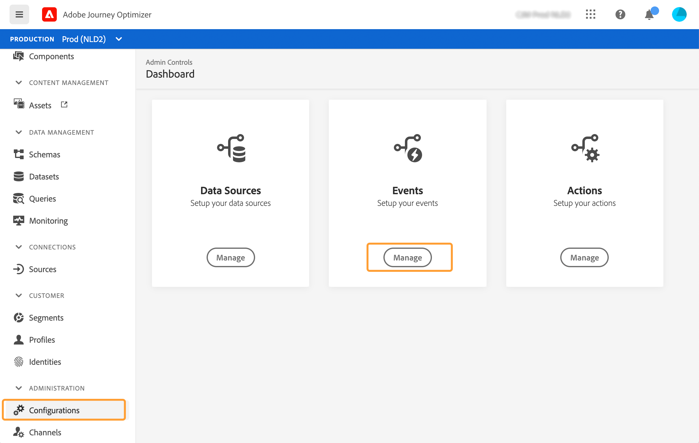

# 設定單一事件 {#configure-an-event}

單一事件會連結至特定設定檔。 可由規則型或系統產生。  有關單一事件[此部分](../event/about-events.md)的詳細資訊。

以下是設定新事件的前幾個步驟：

1. 在「管理」菜單部分，選擇&#x200B;**[!UICONTROL Configurations]**。 在&#x200B;**[!UICONTROL Events]**&#x200B;區段中，按一下&#x200B;**[!UICONTROL Manage]**。 畫面隨即顯示事件清單。

   

1. 按一下 **[!UICONTROL Create Event]** 以建立新事件。事件設定窗格會在畫面右側開啟。

   

1. 輸入事件名稱。 您也可以新增說明。

   

   >[!NOTE]
   >
   >請勿使用空格或特殊字元。請勿使用超過 30 個字元。

1. 在&#x200B;**[!UICONTROL Type]**&#x200B;欄位中，選擇&#x200B;**Unigaly**。

   

1. 在&#x200B;**[!UICONTROL Event ID type]**&#x200B;欄位中，選取您要使用的事件ID類型：**基於規則**&#x200B;或&#x200B;**系統生成**。 請詳閱[此區段](../event/about-events.md#event-id-type)中事件ID類型的詳細資訊。

   

1. 使用此事件的歷程次數會顯示在 **[!UICONTROL Used in]** 欄位中。您可以按一下 **[!UICONTROL View journeys]** 圖示，以顯示使用此事件的歷程清單。

1. 定義結構和裝載欄位：這是您選取歷程預期會收到的事件資訊（通常稱為裝載）的位置。 接著，您就可以在歷程中使用這項資訊。請參閱[本節](../event/about-creating.md#define-the-payload-fields)。

   

   >[!NOTE]
   >
   >選取&#x200B;**[!UICONTROL System Generated]**&#x200B;類型時，只有具有eventID類型欄位的結構才可用。 選取&#x200B;**[!UICONTROL Rule Based]**&#x200B;類型時，所有體驗事件結構皆可使用。

1. 若是規則型事件，請按一下&#x200B;**[!UICONTROL Event ID condition]**欄位內的。 使用簡單運算式編輯器，定義系統將使用的條件，以識別將觸發您歷程的事件。
   

   在範例中，我們根據設定檔的城市寫了條件。 這表示，每當系統收到符合此條件（**[!UICONTROL City]**&#x200B;欄位和&#x200B;**[!UICONTROL Paris]**&#x200B;值）的事件時，就會將其傳遞至歷程。

   >[!NOTE]
   >
   >定義&#x200B;**[!UICONTROL Event ID condition]**&#x200B;時，進階運算式編輯器無法使用。

1. 新增命名空間。此步驟為選填，但建議您新增命名空間，以便運用儲存在「即時客戶個人檔案服務」的資訊。它會定義事件具備的金鑰類型。請參閱[本節](../event/about-creating.md#select-the-namespace)。
1. 定義設定檔識別碼：從您的裝載欄位中選擇欄位，或定義公式以識別與事件相關聯的人員。 如果您選取命名空間，系統便會自動設定此金鑰（但您仍可加以編輯）。事實上，歷程會挑選應該與命名空間對應的金鑰（例如，如果您選取電子郵件命名空間，系統便會選取電子郵件金鑰）。 請參閱[本節](../event/about-creating.md#define-the-event-key)。

   

1. 對於系統產生的事件，您可以新增條件。 此步驟為選填。這可讓系統僅處理符合條件的事件。您只能根據事件含有之資訊設定條件。請參閱[本節](../event/about-creating.md#add-a-condition)。
1. 按一下「**[!UICONTROL Save]**」。

   條件現在已設定完畢，且準備好放入歷程中。若要接收事件，則需要完成其他設定步驟。請參閱[此頁面](../event/additional-steps-to-send-events-to-journey-orchestration.md)。

## 定義裝載欄位 {#define-the-payload-fields}

有效負載定義可讓您選擇系統預期從歷程中的事件接收的資訊，以及識別與事件相關聯之人員的金鑰。 裝載以Experience CloudXDM欄位定義為基礎。 如需XDM的詳細資訊，請參閱[Adobe Experience Platform檔案](https://experienceleague.adobe.com/docs/experience-platform/xdm/home.html?lang=zh-Hant){target=&quot;_blank&quot;}。

1. 從清單中選取XDM架構，然後按一下&#x200B;**[!UICONTROL Fields]**&#x200B;欄位或&#x200B;**[!UICONTROL Edit]**&#x200B;圖示。

   

   架構中定義的所有欄位都會顯示。 欄位清單因結構而異。 您可以搜尋特定欄位，或使用篩選器來顯示所有節點和欄位，或僅顯示選取的欄位。 根據架構定義，某些欄位可能是必填欄位，且已預先選取。 您無法取消選取它們。 依預設，會選取所有對於歷程正確接收事件而言為必要的欄位。

   >[!NOTE]
   >
   >針對系統產生的事件，請確定您已將「協調」欄位群組新增至XDM架構。 這將確保您的架構包含使用[!DNL Journey Optimizer]所需的所有資訊。

   

1. 選取您要從事件接收的欄位。 這些是業務使用者在歷程中將利用的欄位。 它們還必須包含用於識別與事件相關聯的人員的金鑰（請參閱[此區段](../event/about-creating.md#define-the-event-key)）。

   >[!NOTE]
   >
   >對於系統產生的事件，**[!UICONTROL eventID]**&#x200B;欄位會自動新增至選取的欄位清單中，以便[!DNL Journey Optimizer]可識別事件。 推送事件的系統不應產生ID，而應使用有效負載預覽中可用的ID。 請參閱[本節](../event/about-creating.md#preview-the-payload)。

1. 選擇完所需欄位後，按一下&#x200B;**[!UICONTROL Ok]**&#x200B;或按&#x200B;**[!UICONTROL Enter]**&#x200B;鍵。

   選定欄位的數量顯示在&#x200B;**[!UICONTROL Fields]**&#x200B;欄位中。

   

## 選取命名空間 {#select-the-namespace}

命名空間可讓您定義用於識別與事件相關聯之人員的索引鍵類型。 其設定為選用。 如果您想在歷程中擷取來自[即時客戶設定檔](https://experienceleague.adobe.com/docs/experience-platform/profile/home.html){target=&quot;_blank&quot;}的其他資訊，則此為必要項目。 如果您只使用來自協力廠商系統的資料（透過自訂資料來源），則不需要命名空間定義。

您可以使用其中一個預先定義的命名空間，或使用身分命名空間服務建立新的一個。 請參閱[Adobe Experience Platform檔案](https://experienceleague.adobe.com/docs/experience-platform/identity/home.html){target=&quot;_blank&quot;}。

如果選擇具有主要身份的架構，則預填&#x200B;**[!UICONTROL Profiler identifier]**&#x200B;和&#x200B;**[!UICONTROL Namespace]**&#x200B;欄位。 如果沒有定義標識，則選擇&#x200B;_identityMap > id_&#x200B;作為主鍵。 然後，您必須選取命名空間，並使用&#x200B;_identityMap > id_&#x200B;預先填入索引鍵（在&#x200B;**[!UICONTROL Namespace]**&#x200B;欄位下方）。

選取欄位時，會標籤主要身分欄位。

從下拉式清單中選取命名空間。

每個歷程僅允許一個命名空間。 如果您在相同歷程中使用數個事件，則這些事件需要使用相同的命名空間。 請參閱[此頁面](../building-journeys/journey.md)。

## 定義設定檔識別碼 {#define-the-event-key}

金鑰是欄位或欄位組合是事件有效負載資料的一部分，且將允許系統識別與事件相關聯的人員。 金鑰可以是Experience CloudID、CRM ID或電子郵件地址。

如果您打算利用儲存在即時客戶配置檔案資料庫中的資料，則必須選擇在[即時客戶配置檔案服務](https://experienceleague.adobe.com/docs/experience-platform/profile/home.html){target=&quot;_blank&quot;}中定義為配置檔案標識的資訊作為事件鍵。

它可讓系統執行事件與個人設定檔之間的調解。 如果選擇具有主要身份的架構，則預填&#x200B;**[!UICONTROL Profile identifier]**&#x200B;和&#x200B;**[!UICONTROL Namespace]**&#x200B;欄位。 如果沒有定義標識，則選擇&#x200B;_identityMap > id_&#x200B;作為主鍵。 然後，您必須選取命名空間，並使用&#x200B;_identityMap > id_&#x200B;預先填入索引鍵（在&#x200B;**[!UICONTROL Namespace]**&#x200B;欄位下方）。

選取欄位時，會標籤主要身分欄位。

如果您需要使用不同的金鑰（例如CRM ID或電子郵件地址），則需要手動新增金鑰：

1. 按一下&#x200B;**[!UICONTROL Profile identifier]**&#x200B;欄位內或鉛筆圖示。

   

1. 在有效負載欄位清單中選取作為索引鍵的欄位。 您也可以切換至進階運算式編輯器，以建立更複雜的索引鍵（例如，事件的兩個欄位串連）。 請參閱下文的本節。

   

收到事件時，索引鍵的值可讓系統識別與事件相關聯的人員。 與命名空間相關聯（請參閱[此區段](../event/about-creating.md#select-the-namespace)），索引鍵可用於在Adobe Experience Platform上執行查詢。 請參閱[此頁面](../building-journeys/about-journey-activities.md#orchestration-activities)。金鑰也可用來檢查人員是否在歷程中。 事實上，一個人不可能在同一個旅程中處於兩個不同的位置。 因此，系統不允許相同的索引鍵（例如CRMID=3224）位於相同歷程中的不同位置。

如果要執行其他操作，您也可以訪問高級表達式函式(**[!UICONTROL Advanced mode]**)。 這些函式可讓您操控用於執行特定查詢的值，例如更改格式、執行欄位串連，而僅考慮欄位的一部分（例如10個前字元）。 請參閱[Journey Orchestration檔案](https://experienceleague.adobe.com/docs/journeys/using/building-advanced-conditions-journeys/expressionadvanced.html?lang=zh-Hant){target=&quot;_blank&quot;}。

## 新增條件 {#add-a-condition}

條件僅適用於系統產生的事件。 您可以定義事件條件，讓系統可篩選事件的處理。 若條件為true，則會處理事件。 若條件不為true，則會忽略事件。

事件的條件只能根據事件有效負載中傳遞的資料。 行銷人員無法在畫布中變更在事件層級定義的條件。 其目的在於在使用此事件時強化此條件。 例如，如果您不希望行銷人員在購物車值太小時使用購物車放棄事件，您可以在「購物車值」事件欄位中建立條件，並強加超過100美元的值。

您可以使用簡單運算式編輯器或進階運算式編輯器來設定事件的條件。 請參閱[Journey Orchestration檔案](https://experienceleague.adobe.com/docs/journeys/using/building-advanced-conditions-journeys/expressionadvanced.html){target=&quot;_blank&quot;}。

例如，您可以定義條件，僅處理特定事件類型的事件，並忽略其他類型。 或者，如果您的事件是購物車放棄，且裝載包含購物車值欄位，則您可以定義事件條件，只有在購物車值大於100美元時才處理事件。

## 預覽裝載 {#preview-the-payload}

有效負載預覽可讓您驗證有效負載定義。

>[!NOTE]
>
>對於系統產生的事件，當您建立事件時，在檢視裝載預覽之前，請先儲存事件並重新開啟它。 需要執行此步驟，才能在裝載中產生事件ID。

1. 按一下&#x200B;**[!UICONTROL View Payload]**&#x200B;圖示可預覽系統預期的有效負載。

   

   您可以注意到已顯示選取的欄位。

   

1. 檢查預覽以驗證有效負載定義。

1. 接著，您可以將裝載預覽與事件傳送的負責人共用。 此裝載可協助他設計推送至[!DNL Journey Optimizer]之事件的設定。 請參閱[此頁面](../event/additional-steps-to-send-events-to-journey-orchestration.md)。
