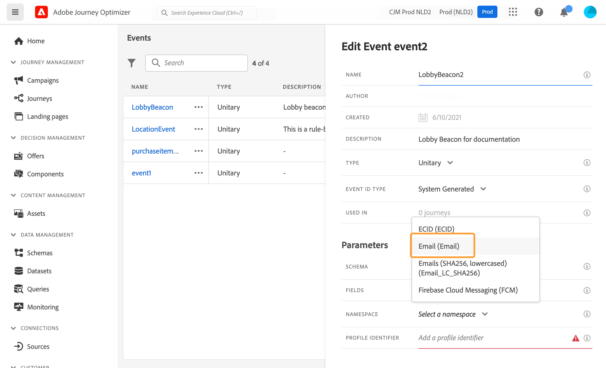

# 設定單一事件 {#configure-an-event}

>[!CONTEXTUALHELP]
>id="ajo_journey_event_unitary"
>title="酉事件"
>abstract="事件配置允許您定義Journey Optimizer將作為事件接收的資訊。 您可以使用多個事件（在行程的不同步驟中），而多個行程可以使用同一事件。 單一事件被連結到特定簡檔。 它們可以是基於規則或系統生成的。"

單一事件被連結到特定簡檔。 它們可以是基於規則或系統生成的。  更多關於酉事件的內容 [此部分](../event/about-events.md)。

以下是配置新事件的第一步：

1. 在「管理」(ADMINISTRATION)菜單部分，選擇 **[!UICONTROL Configurations]**。 在  **[!UICONTROL Events]** ，按一下 **[!UICONTROL Manage]**。 畫面隨即顯示事件清單。

   

1. 按一下 **[!UICONTROL Create Event]** 以建立新事件。事件設定窗格會在畫面右側開啟。

   

1. 輸入事件名稱。 也可以添加說明。

   

   >[!NOTE]
   >
   >請勿使用空格或特殊字元。請勿使用超過 30 個字元。

1. 在 **[!UICONTROL Type]** ，選擇 **酉**。

   

1. 在 **[!UICONTROL Event ID type]** 欄位中，選擇要使用的事件ID類型： **基於規則** 或 **系統生成**。 在中閱讀有關事件ID類型的更多資訊 [此部分](../event/about-events.md#event-id-type)。

   

1. 使用此事件的歷程次數會顯示在 **[!UICONTROL Used in]** 欄位中。您可以按一下 **[!UICONTROL View journeys]** 圖示，以顯示使用此事件的歷程清單。

1. 定義架構和負載欄位：這是您選擇事件資訊（通常稱為有效負載）旅行預期接收的地方。 接著，您就可以在歷程中使用這項資訊。請參閱[本節](../event/about-creating.md#define-the-payload-fields)。

   

   >[!NOTE]
   >
   >選擇 **[!UICONTROL System Generated]** 類型，只有具有eventID類型欄位的架構可用。 選擇 **[!UICONTROL Rule Based]** 類型，所有體驗事件架構都可用。

1. 對於基於規則的事件，按一下 **[!UICONTROL Event ID condition]** 的子菜單。 使用簡單表達式編輯器，定義系統將用於標識將觸發行程的事件的條件。
   

   在我們的例子中，我們根據檔案的城市寫了一個條件。 這意味著，每當系統收到與此條件匹配的事件(**[!UICONTROL City]** 欄位和 **[!UICONTROL Paris]** 價值)，它會傳到旅程。

   >[!NOTE]
   >
   >定義高級表達式編輯器時不可用 **[!UICONTROL Event ID condition]**。 在簡單表達式編輯器中，並非所有運算子都可用，它們取決於資料類型。 例如，對於欄位的字串類型，可以使用&quot;contains&quot;或&quot;equal to&quot;。

1. 新增命名空間。此步驟為選填，但建議您新增命名空間，以便運用儲存在「即時客戶個人檔案服務」的資訊。它會定義事件具備的金鑰類型。請參閱[本節](../event/about-creating.md#select-the-namespace)。
1. 定義配置檔案標識符：從有效負載欄位中選擇一個欄位，或定義一個公式以標識與事件關聯的人員。 如果您選取命名空間，系統便會自動設定此金鑰（但您仍可加以編輯）。事實上，「行程」會選擇應與命名空間對應的鍵（例如，如果選擇了電子郵件命名空間，則將選擇電子郵件密鑰）。 請參閱[本節](../event/about-creating.md#define-the-event-key)。

   

1. 按一下「**[!UICONTROL Save]**」。

   條件現在已設定完畢，且準備好放入歷程中。若要接收事件，則需要完成其他設定步驟。請參閱[此頁面](../event/additional-steps-to-send-events-to-journey-orchestration.md)。

## 定義負載欄位 {#define-the-payload-fields}

有效負載定義允許您選擇系統希望從行程中的事件接收的資訊以及確定與事件關聯的人員的密鑰。 負載基於Experience CloudXDM欄位定義。 有關XDM的詳細資訊，請參閱 [Adobe Experience Platform文檔](https://experienceleague.adobe.com/docs/experience-platform/xdm/home.html?lang=zh-Hant){target=&quot;_blank&quot;}。

1. 從清單中選擇XDM架構，然後按一下 **[!UICONTROL Fields]** 或 **[!UICONTROL Edit]** 表徵圖

   

   將顯示架構中定義的所有欄位。 欄位清單因方案而異。 您可以搜索特定欄位，或使用篩選器顯示所有節點和欄位，或僅顯示選定欄位。 根據架構定義，某些欄位可能是必需的並且預先選定。 不能取消選擇它們。 預設情況下，對於要由行程正確接收的事件，必須選擇的所有欄位。

   >[!NOTE]
   >
   >對於系統生成的事件，請確保已將「業務流程」欄位組添加到XDM架構。 這將確保您的架構包含要使用的所有必需資訊 [!DNL Journey Optimizer]。

   

1. 選擇要從事件接收的欄位。 這些是業務用戶在旅途中將利用的欄位。 它們還必須包括用於標識與事件關聯的人員的密鑰(請參閱 [此部分](../event/about-creating.md#define-the-event-key))。

   >[!NOTE]
   >
   >對於系統生成的事件， **[!UICONTROL eventID]** 欄位將自動添加到選定欄位清單中，以便 [!DNL Journey Optimizer] 可以識別事件。 推送事件的系統不應生成ID，它應使用負載預覽中可用的ID。 請參閱[本節](../event/about-creating.md#preview-the-payload)。

1. 選擇完所需欄位後，按一下 **[!UICONTROL Ok]** 按 **[!UICONTROL Enter]**。

   所選欄位的數量顯示在 **[!UICONTROL Fields]** 的子菜單。

   

## 選擇命名空間 {#select-the-namespace}

命名空間允許您定義用於標識與事件關聯的人員的密鑰類型。 其配置是可選的。 如果要在您的行程中檢索來自 [即時客戶概要資訊](https://experienceleague.adobe.com/docs/experience-platform/profile/home.html?lang=zh-Hant){target=&quot;_blank&quot;}。 如果您僅使用來自第三方系統的通過自定義資料源的資料，則不需要命名空間定義。

您可以使用其中一個預定義名稱，或使用Identity Namespace服務建立新名稱。 請參閱 [Adobe Experience Platform文檔](https://experienceleague.adobe.com/docs/experience-platform/identity/home.html?lang=zh-Hant){target=&quot;_blank&quot;}。

如果選擇具有主標識的架構，則 **[!UICONTROL Profiler identifier]** 和 **[!UICONTROL Namespace]** 欄位已預填充。 如果沒有定義標識，我們將選擇 _identityMap > id_ 鍵。 然後，必須選擇一個命名空間，並且該鍵將預填充(位於 **[!UICONTROL Namespace]** 欄位使用 _identityMap > id_。

選擇欄位時，將標籤主標識欄位。

從下拉清單中選擇一個命名空間。

每個行程只允許一個命名空間。 如果在同一行程中使用多個事件，則它們需要使用相同的命名空間。 請參閱[此頁面](../building-journeys/journey.md)。

## 定義配置檔案標識符 {#define-the-event-key}

關鍵字是欄位或欄位組合是事件負載資料的一部分，它將允許系統標識與事件關聯的人員。 密鑰可以是Experience CloudID、CRM ID或電子郵件地址。

如果您計畫利用儲存在Real-time Customer Profile資料庫中的資料，則必須選擇在中定義為配置檔案標識的資訊作為事件鍵 [即時客戶配置檔案服務](https://experienceleague.adobe.com/docs/experience-platform/profile/home.html){target=&quot;_blank&quot;}。

它將允許系統執行事件與個人配置檔案之間的協調。 如果選擇具有主標識的架構，則 **[!UICONTROL Profile identifier]** 和 **[!UICONTROL Namespace]** 欄位已預填充。 如果沒有定義標識，我們將選擇 _identityMap > id_ 鍵。 然後，必須選擇一個命名空間，並且該鍵將預填充(位於 **[!UICONTROL Namespace]** 欄位使用 _identityMap > id_。

選擇欄位時，將標籤主標識欄位。

如果您需要使用其他密鑰，例如CRM ID或電子郵件地址，則需要手動添加：

1. 在 **[!UICONTROL Profile identifier]** 表徵圖。

   

1. 在有效負載欄位清單中選擇作為鍵的欄位。 您還可以切換到高級表達式編輯器來建立更複雜的鍵（例如，兩個事件欄位的串聯）。 請參閱下面的本節。

   

當收到事件時，該鍵的值將允許系統標識與該事件關聯的人員。 與命名空間關聯(請參見 [此部分](../event/about-creating.md#select-the-namespace))，該鍵可用於對Adobe Experience Platform執行查詢。 請參閱[此頁面](../building-journeys/about-journey-activities.md#orchestration-activities)。鑰匙還用於檢查人是否在旅途中。 事實上，一個人不可能在同一旅程中處於兩個不同的位置。 因此，系統不允許相同的密鑰（例如，密鑰CRMID=3224）在相同行程的不同位置處。

您還可以訪問高級表達式函式(**[!UICONTROL Advanced mode]**)。 通過這些函式，您可以處理用於執行特定查詢的值，例如更改格式、執行欄位連接，只考慮欄位的一部分（例如10個首字元）。 請參閱 [Journey Orchestration文檔](../building-journeys/expression/expressionadvanced.md)。

## 預覽負載 {#preview-the-payload}

負載預覽允許您驗證負載定義。

>[!NOTE]
>
>對於系統生成的事件，在建立事件時，在查看負載預覽之前，請保存事件並重新開啟它。 需要此步驟才能在負載中生成事件ID。

1. 按一下 **[!UICONTROL View Payload]** 表徵圖，預覽系統所需的負載。

   

   您可以注意到，所選欄位將顯示。

   

1. 檢查預覽以驗證負載定義。

1. 然後，您可以與負責事件發送的人員共用負載預覽。 此負載可以幫助他們設計推送到的事件的設定 [!DNL Journey Optimizer]。 請參閱[此頁面](../event/additional-steps-to-send-events-to-journey-orchestration.md)。
