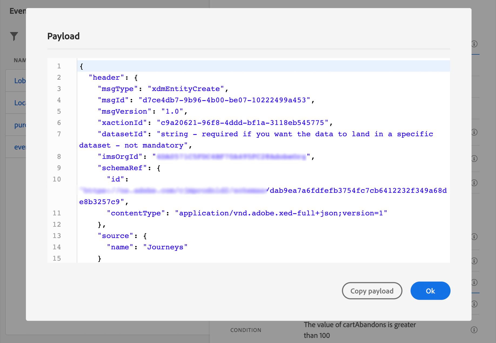

# 設定單一事件 {#configure-an-event}

>[!CONTEXTUALHELP]
>id="ajo_journey_event_unitary"
>title="單一事件"
>abstract="事件設定可讓您定義 Journey Optimizer 會接收為事件的資訊。您可以使用多個事件 (在歷程的不同步驟中)，而好幾個歷程可以使用同一個事件。單一事件會連結到特定的設定檔。它們可能是以規則為基礎或由系統產生。"

單一事件會連結到特定的設定檔。可以是規則型或系統產生。  閱讀有關單一事件的詳細資訊 [本節](../event/about-events.md).

以下是設定新事件的第一步：

1. 在「管理」功能表區段中，選取 **[!UICONTROL 設定]**. 在  **[!UICONTROL 活動]** 區段，按一下 **[!UICONTROL 管理]**. 畫面隨即顯示事件清單。

   

1. 按一下 **[!UICONTROL 建立事件]** 以建立新事件。 事件設定窗格會在畫面右側開啟。

   

1. 輸入事件的名稱。 您也可以新增說明。

   

   >[!NOTE]
   >
   >只允許使用英數字元和底線。 長度上限為30個字元。

1. 在 **[!UICONTROL 型別]** 欄位，選擇 **單一**.

   

1. 在 **[!UICONTROL 事件ID型別]** 欄位中，選取您要使用的事件ID型別： **以規則為基礎** 或 **系統產生**. 深入瞭解中的事件ID型別 [本節](../event/about-events.md#event-id-type).

   

1. 使用此事件的歷程次數會顯示在 **[!UICONTROL 使用位置]** 欄位。 您可以按一下 **[!UICONTROL 檢視歷程]** 圖示來顯示使用此事件的歷程清單。

1. 定義結構和裝載欄位：您可以在此處選取歷程預期會收到的事件資訊（通常稱為裝載）。 接著，您就可以在歷程中使用這項資訊。請參閱[本節](../event/about-creating.md#define-the-payload-fields)。

   

   >[!NOTE]
   >
   >當您選取 **[!UICONTROL 系統產生]** 型別，只有具有eventID型別欄位的結構描述才可使用。 當您選取 **[!UICONTROL 以規則為基礎]** 型別，則所有體驗事件結構描述都可使用。

1. 針對規則型事件，按一下 **[!UICONTROL 事件ID條件]** 欄位。 使用簡單或進階運算式編輯器，定義系統將使用的條件，以識別將觸發您歷程的事件。

在我們的範例中，我們根據設定檔的城市來撰寫條件。 這表示每當系統收到符合此條件的事件時(**[!UICONTROL 城市]** 欄位和 **[!UICONTROL 巴黎]** 值)，則會將其傳遞至歷程。

>[!NOTE]
>
>在簡單運算式編輯器中，並非所有運運算元都可使用，它們取決於資料型別。 例如，對於欄位的字串型別，您可以使用「包含」或「等於」。
>
>如果您在建立事件後，使用新的列舉值修改綱要，則需要按照以下步驟將變更套用至現有事件：從事件欄位中取消選取列舉欄位，確認選擇，然後再次選取列舉欄位。 現在會顯示新的分項清單。

1. 新增命名空間。此步驟為選填，但建議您新增命名空間，以便運用儲存在「即時客戶個人檔案服務」的資訊。它會定義事件具備的金鑰類型。請參閱[本節](../event/about-creating.md#select-the-namespace)。

1. 定義設定檔識別碼：從您的裝載欄位選擇一個欄位，或定義一個公式以識別與事件相關聯的人員。 如果您選取命名空間，系統便會自動設定此金鑰（但您仍可加以編輯）。事實上，歷程會挑選應該與名稱空間對應的金鑰（例如，如果您選取電子郵件名稱空間，系統便會選取電子郵件金鑰）。 請參閱[本節](../event/about-creating.md#define-the-event-key)。

   

1. 按一下&#x200B;**[!UICONTROL 儲存]**。

   條件現在已設定完畢，且準備好放入歷程中。若要接收事件，則需要完成其他設定步驟。請參閱[此頁面](../event/additional-steps-to-send-events-to-journey.md)。

## 定義裝載欄位 {#define-the-payload-fields}

裝載定義可讓您選擇系統預期從歷程中的事件接收的資訊，以及識別與事件相關聯之人員的金鑰。 裝載是以Experience CloudXDM欄位定義為基礎。 如需XDM的詳細資訊，請參閱 [Adobe Experience Platform檔案](https://experienceleague.adobe.com/docs/experience-platform/xdm/home.html?lang=zh-Hant){target="_blank"}.

1. 從清單中選取XDM結構描述，然後按一下 **[!UICONTROL 欄位]** 欄位或位於 **[!UICONTROL 編輯]** 圖示。

   

   結構描述中定義的所有欄位都會顯示。 欄位清單會因結構描述而異。 您可以搜尋特定欄位，或使用篩選器來顯示所有節點和欄位，或僅顯示選定的欄位。 根據結構描述定義，某些欄位可能是必填欄位並預先選取。 您無法取消選取它們。 依預設，系統會選取歷程正確接收事件所必須的所有欄位。

   >[!NOTE]
   >
   >對於系統產生的事件，請確定您已將「協調流程」欄位群組新增至XDM結構描述。 這將確保您的結構描述包含使用的所有必要資訊 [!DNL Journey Optimizer].

   

1. 選取您預期會從事件接收的欄位。 這些是業務使用者將在歷程中善用的欄位。 它們也必須包含用來識別與事件相關聯之人員的金鑰(請參閱 [本節](../event/about-creating.md#define-the-event-key))。

   >[!NOTE]
   >
   >對於系統產生的事件， **[!UICONTROL eventID]** 欄位會自動新增到所選欄位清單中，以便 [!DNL Journey Optimizer] 可以識別事件。 推播事件的系統不應產生ID，而應使用裝載預覽中可用的ID。 請參閱[本節](../event/about-creating.md#preview-the-payload)。

1. 選取完所需欄位後，按一下 **[!UICONTROL 確定]** 或按 **[!UICONTROL 輸入]**.

   所選欄位的數量會出現在 **[!UICONTROL 欄位]** 欄位。

   

## 選取命名空間 {#select-the-namespace}

>[!CONTEXTUALHELP]
>id="ajo_journey_namespace"
>title="身分識別命名空間"
>abstract="選取索引鍵以識別和事件相關聯的客戶設定檔。"

名稱空間可讓您定義用來識別與事件相關聯之人員的金鑰型別。 其設定是選用的。 如果您想在歷程中擷取其他資訊，這些資訊來自 [即時客戶個人檔案](https://experienceleague.adobe.com/docs/experience-platform/profile/home.html?lang=zh-Hant){target="_blank"}. 如果您僅使用來自協力廠商系統的資料，透過自訂資料來源，則不需要名稱空間定義。

您可以使用其中一個預先定義的名稱空間，或使用「身分名稱空間」服務建立新的名稱空間。 請參閱 [Adobe Experience Platform檔案](https://experienceleague.adobe.com/docs/experience-platform/identity/home.html?lang=zh-Hant){target="_blank"}.

如果您選取具有主要身分的綱要，則 **[!UICONTROL 效能分析工具識別碼]** 和 **[!UICONTROL 名稱空間]** 欄位會預先填寫。 如果沒有定義身分，我們會選取 _identityMap > id_ 作為主索引鍵。 接著，您必須選取名稱空間，系統便會預先填入金鑰(位於 **[!UICONTROL 名稱空間]** 欄位)，使用 _identityMap > id_.

選取欄位時，會標籤主要身分欄位。

從下拉式清單中選取名稱空間。

每個歷程只允許一個名稱空間。 如果您在同一個歷程中使用數個事件，則需要使用相同的名稱空間。 請參閱[此頁面](../building-journeys/journey.md)。

>[!NOTE]
>
>您只能選取以人物為基礎的身分名稱空間。 如果您已定義查閱表格的名稱空間（例如：產品查閱的ProductID名稱空間），將無法在 **名稱空間** 下拉式清單。

## 定義設定檔識別碼 {#define-the-event-key}

索引鍵是欄位或欄位組合，這是事件裝載資料的一部分，可讓系統識別與事件相關聯的人員。 例如，索引鍵可以是Experience CloudID、CRM ID或電子郵件地址。

若要使用儲存在Adobe即時客戶設定檔資料庫中的資料，事件索引鍵必須是您在 [即時客戶個人檔案服務](https://experienceleague.adobe.com/docs/experience-platform/profile/home.html?lang=zh-Hant){target="_blank"}.

設定檔識別碼可讓系統在事件和個人設定檔之間執行調解。 如果您選取具有主要身分的綱要，則 **[!UICONTROL 設定檔識別碼]** 和 **[!UICONTROL 名稱空間]** 欄位會預先填寫。 如果沒有定義身分， _identityMap > id_ 是主索引鍵。 接著，您必須選取名稱空間，系統會自動使用預先填入金鑰 _identityMap > id_.

選取欄位時，會標籤主要身分欄位。

如果您需要使用不同的金鑰，例如CRM ID或電子郵件地址，您需要手動新增，如下所述：

1. 按一下 **[!UICONTROL 設定檔識別碼]** 欄位或鉛筆圖示上。

   

1. 選取在裝載欄位清單中選為索引鍵的欄位。

收到事件時，機碼的值可讓系統識別與事件相關聯的人員。 與名稱空間相關聯(請參閱 [本節](../event/about-creating.md#select-the-namespace))，則金鑰可用來在Adobe Experience Platform上執行查詢。 另請參閱 [此頁面](../building-journeys/about-journey-activities.md#orchestration-activities).
金鑰也可用來檢查個人是否在歷程中。 事實上，一個人在同一歷程中不能位於兩個不同的位置。 因此，系統不允許相同的金鑰（例如金鑰CRMID=3224）位於相同歷程中的不同位置。

### 進階運算式編輯器 {#adv-exp-editor}

定義設定檔識別碼時，您可以切換至進階運算式編輯器以建立更複雜的索引鍵（例如，兩個事件欄位的串連）。

您可以從存取進階運算式函式 **[!UICONTROL 進階模式]** 按鈕。 這些函式可讓您控制用於執行特定查詢的值，例如變更格式、執行欄位串連，僅考慮欄位的一部分（例如10個第一個字元）。 請參閱此[頁面](../building-journeys/expression/expressionadvanced.md)。

>[!AVAILABILITY]
>
>進階運算式編輯器僅適用於一組組織(LA)。

## 預覽裝載 {#preview-the-payload}

裝載預覽可讓您驗證裝載定義。

>[!NOTE]
>
>對於系統產生的事件，當您建立事件時，在檢視裝載預覽之前，請儲存事件並重新開啟。 在裝載中產生事件ID時，需要執行此步驟。

1. 按一下 **[!UICONTROL 檢視裝載]** 圖示可預覽系統預期的裝載。

   

   您可以注意到已選取的欄位已顯示。

   

1. 檢查預覽以驗證裝載定義。

1. 然後，您可以將裝載預覽與共用給負責事件傳送的人員。 此裝載可協助他們設計推送至的事件設定 [!DNL Journey Optimizer]. 請參閱[此頁面](../event/additional-steps-to-send-events-to-journey.md)。
