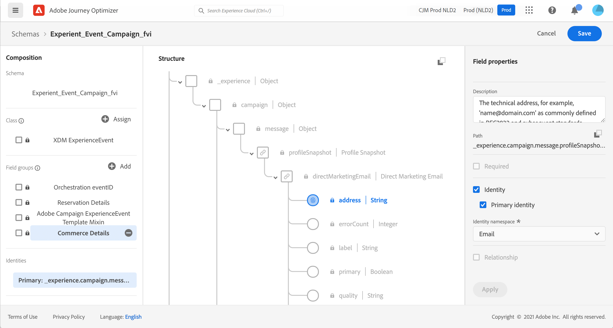

# 關於[!DNL Journey Optimizer]事件的ExperienceEvent結構描述 {#about-experienceevent-schemas}

[!DNL Journey Optimizer]事件是指透過串流擷取傳送至Adobe Experience Platform的XDM體驗事件。

因此，為[!DNL Journey Optimizer]設定事件的重要先決條件是，您熟悉Adobe Experience Platform的體驗資料模型（或XDM）、如何組成XDM體驗事件結構，以及如何將XDM格式的資料串流到Adobe Experience Platform。

>[!CAUTION]
>
>不再支援歷程條件中的體驗事件查閱。 請在這裡尋找替代最佳實務。 如果您的事件觸發歷程使用案例仍需要體驗事件查閱，且無法透過列出的任何替代方案取得支援，請聯絡您的Adobe代表，我們將協助您達成目標。
>
>從歷程的開始事件存取內容不受影響。

## [!DNL Journey Optimizer]個事件的結構描述需求  {#schema-requirements}

為[!DNL Journey Optimizer]設定事件的第一步是確保您已定義代表該事件的XDM結構描述，以及已建立資料集以在Adobe Experience Platform上記錄該事件的執行個體。 嚴格來說，沒有必要為事件建立資料集，但將事件傳送至特定資料集可讓您維護使用者的事件歷史記錄，以供日後參考和分析，因此總是不錯的做法。 如果您還沒有適合事件的結構描述和資料集，這兩項工作都可以在Adobe Experience Platform網頁介面中完成。

將用於[!DNL Journey Optimizer]事件的任何XDM結構描述都應符合下列要求：

* 結構描述必須是XDM ExperienceEvent類別。

  

* 對於系統產生的事件，結構描述必須包括Orchestration eventID欄位群組。 [!DNL Journey Optimizer]使用此欄位來識別歷程中使用的事件。

  

* 宣告身分欄位，以識別事件中的個別設定檔。 如果未指定身分，則可使用身分對應。 不建議採用此做法。

  

* 如果您希望此資料可用於設定檔，請標籤設定檔的結構描述和資料集。 [了解更多](../data/lookup-aep-data.md)

  

  

* 您可以隨意加入資料欄位，以擷取您要與事件一併加入的任何其他內容資料，例如關於使用者的資訊、產生事件的裝置、位置或與事件相關的任何其他有意義的情況。

  

  

<!--
## Leverage schema relationships{#leverage_schema_relationships}

Adobe Experience Platform allows you to define relationships between schemas in order to use one dataset as a lookup table for another. 

Let's say your brand data model has a schema capturing purchases. You also have a schema for the product catalog. You can capture the product ID in the purchase schema and use a relationship to look up more complete product details from the product catalog. This allows you to create an audience for all customers who bought a laptop, for example, without having to explicitly list out all laptop IDs or capture every single product details in transactional systems.

To define a relationship, you need to have a dedicated field in the source schema, in this case the product ID field in the purchase schema. This field needs to reference the product ID field in the destination schema. The source and destination tables must be enabled for profiles and the destination schema must have that common field defined as its primary identity. 

Here is the product catalog schema enabled for profile with the product ID defined as the primary identity. 

Here is the purchase schema with the relationship defined on the product ID field.

>[!NOTE]
>
>Learn more about schema relationships in the [Experience Platform documentation](https://experienceleague.adobe.com/docs/platform-learn/tutorials/schemas/configure-relationships-between-schemas.html).

In Journey Optimizer, you can then leverage all the fields from the linked tables:

* when configuring a business or unitary event, [Read more](../event/experience-event-schema.md#unitary_event_configuration) 
* when using conditions in a journey, [Read more](../event/experience-event-schema.md#journey_conditions_using_event_context) 
* in message personalization, [Read more](../event/experience-event-schema.md#message_personalization) 
* in custom action personalization, [Read more](../event/experience-event-schema.md#custom_action_personalization_with_journey_event_context) 

### Arrays{#relationships_limitations}

You can define a schema relationship on an array of strings, for example, a list of product IDs.

You can also define a schema relationship with an attribute inside of an array of objects, for example a list of purchase information (product ID, product name, price, discount). The lookup values will be available in journeys (conditions, custom actions, etc.) and message personalization. 

### Event configuration{#unitary_event_configuration}

The linked schema fields are available in unitary and business event configuration:

* when browsing through the event schema fields in the event configuration screen.
* when defining a condition for system-generated events.

The linked fields are not available:

* in the event key formula
* in event id condition (rule-based events)

To learn how to configure a unitary event, refer to this [page](../event/about-creating.md).

### Journey conditions using event context{#journey_conditions_using_event_context}

You can use data from a lookup table linked to an event used in a journey for condition building (expression editor).

Add a condition in a journey, edit the expression and unfold the event node in the expression editor. 

To learn how to define journey conditions, refer to this [page](../building-journeys/condition-activity.md).

### Message personalization{#message_personalization}

The linked fields are available when personalizing a message. The related fields are displayed in the context passed from the journey to the message.

To learn how to personalize a message with contextual journey information, refer to this [page](../personalization/personalization-use-case.md).

### Custom action personalization with journey event context{#custom_action_personalization_with_journey_event_context}

The linked fields are available when configuring the action parameters of a journey custom action activity. 

To learn how to use custom actions, refer to this [page](../building-journeys/using-custom-actions.md).
-->
