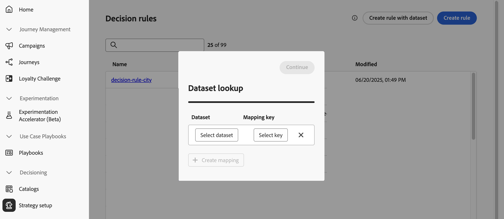
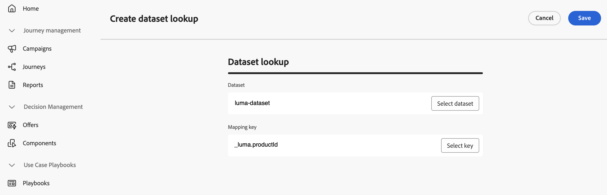
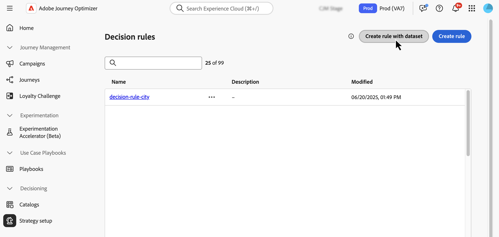
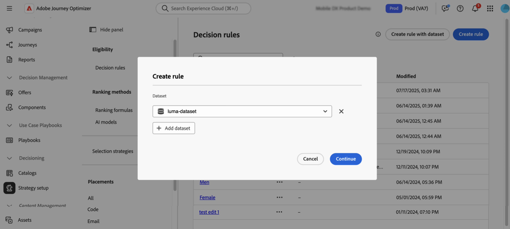
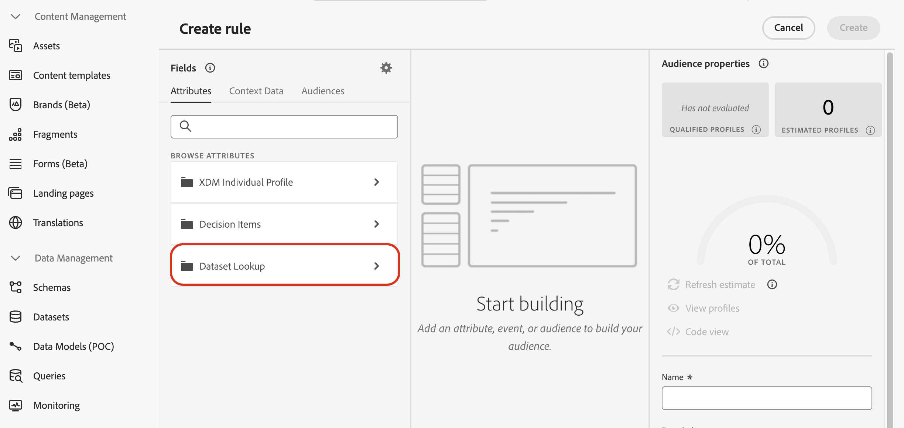
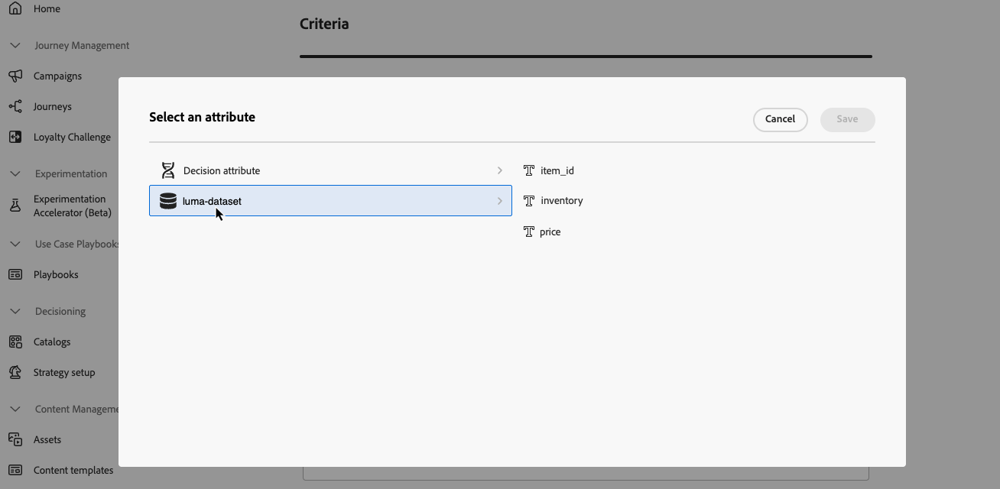
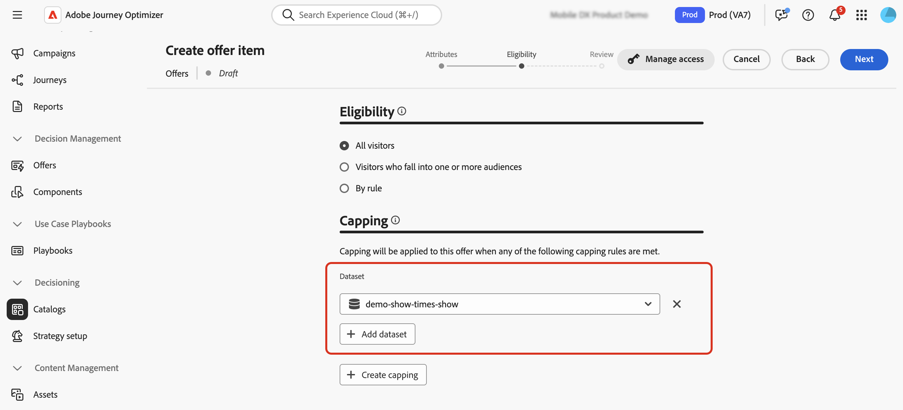
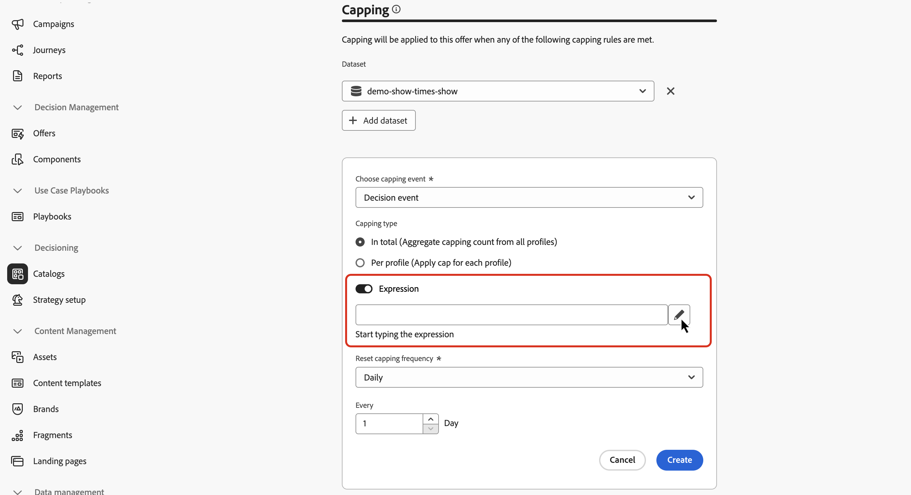
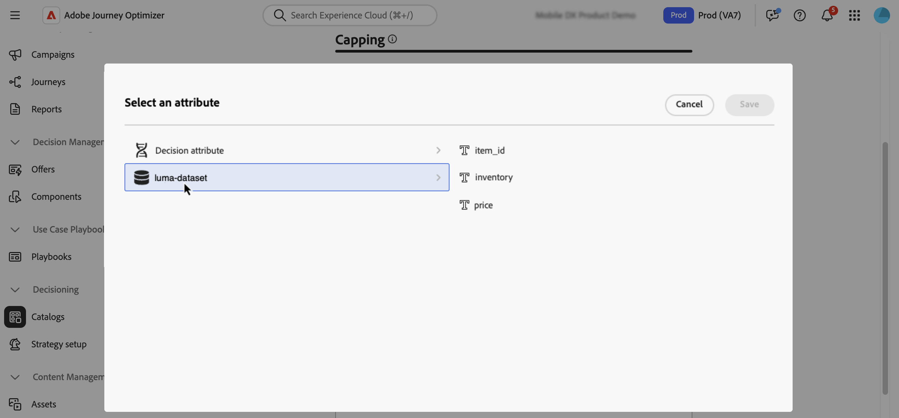

# 使用 Adobe Experience Platform 資料進行決策 {#aep-data}

>[!CONTEXTUALHELP]
>id="ajo_exd_rules_dataset_lookup"
>title="資料集查詢"
>abstract="在決策規則中使用 Adobe Experience Platform 資料可讓您根據動態的外部屬性來定義適用性條件，確保決策項目只會在相關時顯示。建立對應來定義 Adobe Experience Platform 資料集如何與 [!DNL Journey Optimizer] 中的資料聯結。選取具有所需屬性的資料集，並選擇決策項目屬性和資料集中都存在的聯結索引鍵。"

>[!CONTEXTUALHELP]
>id="ajo_exd_formula_dataset_lookup"
>title="資料集查詢"
>abstract="排名公式定義了決策項目的優先等級。透過使用 [!DNL Adobe Experience Platform] 資料集屬性，您就能動態地調整排名邏輯以反映現實世界的情況。建立對應來定義 Adobe Experience Platform 資料集如何與 [!DNL Journey Optimizer] 中的資料聯結。選取具有所需屬性的資料集，並選擇決策項目屬性和資料集中都存在的聯結索引鍵"

>[!AVAILABILITY]
>
>此功能目前以有限可用性版本的形式提供給所有客戶。

[!DNL Journey Optimizer]可讓您利用來自[!DNL Adobe Experience Platform]的資料進行決策。 這可讓您將決策屬性的定義擴充至資料集中的其他資料，以便進行定期變更的大量更新，而無需一次手動更新一個屬性。例如，可用性、等待時間等。

>[!IMPORTANT]
>
>[!DNL Journey Optimizer]支援單一決定原則最多1000個查詢。

## 先決條件

### 啟用資料集以供查詢

開始之前，必須先啟用決策所需的資料集以進行查詢。 請依照本節詳述的步驟操作： [使用Adobe Experience Platform資料](../data/lookup-aep-data.md)。

### 建立對應

為了使用Adobe Experience Platform的屬性來做出決策，您需要建立對應來定義Adobe Experience Platform資料集如何與[!DNL Journey Optimizer]中的資料結合。 若要這麼做，請依照以下步驟進行：

1. 導覽至&#x200B;**[!UICONTROL 目錄]** / **[!UICONTROL 資料集查詢]**，然後按一下&#x200B;**[!UICONTROL 建立]**。

   

1. 設定對應：

   1. 按一下「**[!UICONTROL 選取資料集]**」以顯示所有已啟用查閱的Adobe Experience Platform。 選取具有所需屬性的資料集。

   1. 按一下&#x200B;**[!UICONTROL 選取索引鍵]**&#x200B;以選擇存在於決定專案屬性和資料集中的加入索引鍵（例如，航班號碼或客戶ID）。

   

1. 按一下&#x200B;**[!UICONTROL 儲存]**。

## 善用Adobe Experience Platform資料 {#leverage-aep-data}

在資料集啟用查閱並建立對應後，您就可以使用該資料以透過外部資料擴充您的決策邏輯。 這對於經常變更的屬性（例如產品可用性或即時定價）特別有用。

來自Adobe Experience Platform資料集的屬性可用於決定邏輯的兩個部分：

* **決定規則**：定義決定專案是否符合顯示條件。
* **排名公式**：根據外部資料排定決策專案的優先順序。
* **上限規則**：使用外部資料來計算上限規則的臨界值。

下一節將說明如何在這些內容中使用Adobe Experience Platform資料。

### 決定規則 {#rules}

在決定規則中使用Adobe Experience Platform資料可讓您根據動態的外部屬性定義資格標準，以確保僅在相關時顯示決定專案。

例如，假設線上retailer想要根據當地商店詳細目錄來促銷產品推薦。 只有在最近位置已有庫存的產品時，才符合建議資格。 包含每日詳細目錄更新的資料集已上傳至Adobe Experience Platform。 規則邏輯會檢查指定產品的`inventory_count`是否大於客戶偏好存放區的0。 如果是，則決定專案符合資格。

若要將Adobe Experience Platform資料用於決定規則，請遵循下列步驟：

1. 移至&#x200B;**[!UICONTROL 策略設定]** / **[!UICONTROL 決定規則]**&#x200B;功能表，然後選取&#x200B;**[!UICONTROL 使用資料集]**&#x200B;建立規則。

   

1. 按一下&#x200B;**[!UICONTROL 新增資料集]**，然後選取含有您所需屬性的資料集。

   

1. 按一下&#x200B;**[!UICONTROL 繼續]**。 您現在可以在&#x200B;**[!UICONTROL 資料集查閱]**&#x200B;功能表中存取資料集屬性，並在規則條件中使用這些屬性。 [瞭解如何建立決定規則](../experience-decisioning/rules.md#create)

   

### 排名公式 {#ranking-formulas}

排名公式定義了決策項目的優先等級。使用[!DNL Adobe Experience Platform]資料集屬性，您可以動態調整排名邏輯，以反映真實世界的狀況。

例如，假設一家航空公司使用排名公式來排定升級優惠方案的優先順序。 如果客戶具有較高的忠誠度等級，且目前座位可用性低（根據每小時更新的資料集），則會給予他們較高的優先順序。 資料集包含`flight_number`、`available_seats`和`loyalty_score`等欄位。

若要將Adobe Experience Platform資料用於排名公式，請執行下列步驟：

1. 建立或編輯排名公式。

1. 在&#x200B;**[!UICONTROL 資料集查詢]**&#x200B;區段中，按一下&#x200B;**[!UICONTROL 新增資料集]**。

1. 選取適當的資料集。

   

   >[!NOTE]
   >
   >如果您要尋找的資料集未顯示在清單中，請確定您已啟用它以進行查詢，並已建立資料集查詢對應。 如需詳細資訊，請參閱[必要條件](#prerequisites)區段。

1. 照常使用資料集欄位來建立排名公式。 [瞭解如何建立排名公式](ranking/ranking-formulas.md#create-ranking-formula)

   

### 上限規則 {#capping-rules}

上限規則用作限制，以定義可顯示決定專案的最大次數。 在上限規則中使用Adobe Experience Platform資料，可讓您根據動態的外部屬性來定義上限條件。 這是透過在上限規則中使用運算式來計算所需的上限臨界值來完成的。

例如，retailer可能會想要根據即時產品詳細目錄來限制優惠方案。 他們使用參照Adobe Experience Platform資料集中`inventory_count`欄位的運算式，而不是設定500的固定臨界值。 如果資料集顯示275個專案仍有庫存，則選件最多只會傳送該數字。

>[!NOTE]
>
>上限規則&#x200B;**運算式**&#x200B;目前是所有使用者的有限可用性功能，僅支援&#x200B;**[!UICONTROL 總共]**&#x200B;個上限型別。

若要使用Adobe Experience Platform資料來設定規則運算式的上限，請遵循下列步驟：

1. 建立或編輯決定專案。

1. 定義專案適用性時，請按一下&#x200B;**[!UICONTROL 新增資料集]**&#x200B;並選取適當的資料集。

   

   >[!NOTE]
   >
   >如果您要尋找的資料集未顯示在清單中，請確定您已啟用它以進行查詢，並已建立資料集查詢對應。 如需詳細資訊，請參閱[必要條件](#prerequisites)區段。

1. 選取&#x200B;**[!UICONTROL In總計]**&#x200B;上限型別，然後啟用&#x200B;**[!UICONTROL 運算式]**&#x200B;選項。

   

   >[!NOTE]
   >
   >如果您要尋找的資料集未顯示在清單中，請確定您已啟用它以進行查詢，並已建立資料集查詢對應。 如需詳細資訊，請參閱[必要條件](#prerequisites)區段。

1. 編輯運算式，並使用資料集欄位來建置運算式。

   

1. 照常完成上限和規則決定專案的設定。 [瞭解如何設定上限規則](../experience-decisioning/items.md#capping)
