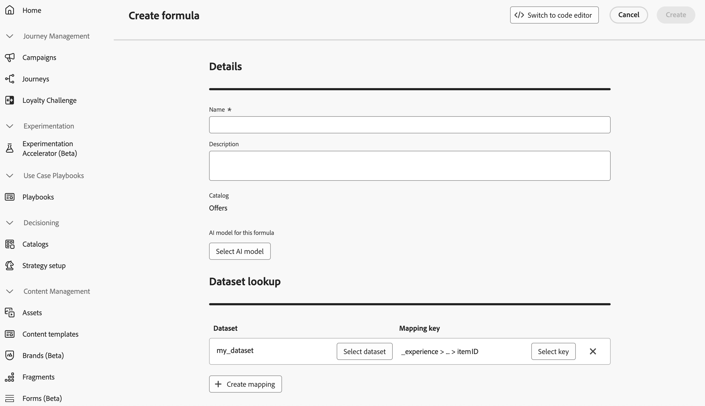

# 使用 Adobe Experience Platform 資料進行決策 {#aep-data}

>[!CONTEXTUALHELP]
>id="ajo_exd_rules_dataset_lookup"
>title="資料集查詢"
>abstract="在決策規則中使用 Adobe Experience Platform 資料可讓您根據動態的外部屬性來定義適用性條件，確保決策項目只會在相關時顯示。建立對應來定義 Adobe Experience Platform 資料集如何與 [!DNL Journey Optimizer] 中的資料聯結。選取具有所需屬性的資料集，並選擇決策項目屬性和資料集中都存在的聯結索引鍵。"

>[!CONTEXTUALHELP]
>id="ajo_exd_formula_dataset_lookup"
>title="資料集查詢"
>abstract="排名公式定義了決策項目的優先等級。透過使用 [!DNL Adobe Experience Platform] 資料集屬性，您就能動態地調整排名邏輯以反映現實世界的情況。建立對應來定義 Adobe Experience Platform 資料集如何與 [!DNL Journey Optimizer] 中的資料聯結。選取具有所需屬性的資料集，並選擇決策項目屬性和資料集中都存在的聯結索引鍵"

>[!AVAILABILITY]
>
>所有客戶都可在公開測試版中，使用此功能。如果您想要存取權，請聯絡您的客戶代表。

[!DNL Journey Optimizer]可讓您利用來自[!DNL Adobe Experience Platform]的資料進行決策。 這可讓您將決策屬性的定義擴充至資料集中的其他資料，以便進行定期變更的大量更新，而無需一次手動更新一個屬性。例如，可用性、等待時間等。

## 護欄和限制 {#guidelines}

開始之前，請注意下列限制和准則：

* 一個決定原則最多可以參考3個資料集，涵蓋其所有決定規則和排名公式的總和。 例如，如果規則使用2個資料集，則公式只能使用1個額外的資料集。
* 一個決定規則可以使用3個資料集。
* 排名公式可以使用3個資料集。
* 評估決定原則時，系統將總共執行最多1000個資料集查詢（查詢）。 決策專案使用的每個資料集對應都會計為一個查詢。 範例：如果決定專案使用2個資料集，評估該選件時會計為2個查詢，以達到1000個查詢的限制。

## 啟用資料集以進行資料查詢 {#enable}

若要使用[!DNL Adobe Experience Platform]資料集中的資料進行決策，您必須先透過API呼叫啟用它以進行查詢。 如需詳細指示，請參閱本節： [在Journey Optimizer中運用Adobe Experience Platform資料集](../data/lookup-aep-data.md)。

## 善用Adobe Experience Platform資料 {#leverage-aep-data}

資料集啟用查閱後，您可使用其屬性，以外部資料擴充您的決策邏輯。 這對於經常變更的屬性（例如產品可用性或即時定價）特別有用。

來自Adobe Experience Platform資料集的屬性可用於決定邏輯的兩個部分：

* **決定規則**：定義決定專案是否符合顯示條件。
* **排名公式**：根據外部資料排定決策專案的優先順序。

下一節將說明如何在兩個內容中使用Adobe Experience Platform資料。

### 決定規則 {#rules}

在決定規則中使用Adobe Experience Platform資料可讓您根據動態的外部屬性定義資格標準，以確保僅在相關時顯示決定專案。

例如，假設線上retailer想要根據當地商店詳細目錄來促銷產品推薦。 只有在最近位置已有庫存的產品時，才符合建議資格。 包含每日詳細目錄更新的資料集已上傳至Adobe Experience Platform。 規則邏輯會檢查指定產品的`inventory_count`是否大於客戶偏好存放區的0。 如果是，則決定專案符合資格。

若要將Adobe Experience Platform資料用於決定規則，請遵循下列步驟：

1. 移至&#x200B;**[!UICONTROL 策略設定]** / **[!UICONTROL 決定規則]**&#x200B;功能表，然後選取&#x200B;**[!UICONTROL 使用資料集]**&#x200B;建立規則。

   

1. 按一下&#x200B;**[!UICONTROL 建立對應]**&#x200B;以定義Adobe Experience Platform資料集如何與[!DNL Journey Optimizer]中的資料聯結。

   * 選取具有所需屬性的資料集。
   * 選擇同時存在於決定專案屬性和資料集中的加入金鑰（例如產品ID或商店ID）。

   

   >[!NOTE]
   >
   >每個規則最多可建立3個對應。

1. 按一下&#x200B;**[!UICONTROL 繼續]**。 您現在可以在&#x200B;**[!UICONTROL 資料集查閱]**&#x200B;功能表中存取資料集屬性，並在規則條件中使用這些屬性。 [瞭解如何建立決定規則](../experience-decisioning/rules.md#create)

   

### 排名公式 {#ranking-formulas}

排名公式定義了決策項目的優先等級。使用[!DNL Adobe Experience Platform]資料集屬性，您可以動態調整排名邏輯，以反映真實世界的狀況。

例如，假設一家航空公司使用排名公式來排定升級優惠方案的優先順序。 如果客戶具有較高的忠誠度等級，且目前座位可用性低（根據每小時更新的資料集），則會給予他們較高的優先順序。 資料集包含`flight_number`、`available_seats`和`loyalty_score`等欄位。

若要將Adobe Experience Platform資料用於排名公式，請執行下列步驟：

1. 建立或編輯排名公式。 在&#x200B;**[!UICONTROL 資料集查詢]**&#x200B;區段中，按一下&#x200B;**[!UICONTROL 建立對應]**。

1. 定義資料集對應：

   * 選取適當的資料集（例如，航班的座位可用性）。
   * 選擇同時存在於決定專案屬性和資料集中的加入索引鍵（例如航班號碼或客戶ID）。

   

   >[!NOTE]
   >
   >您最多可以為每個排名公式建立3個對應。

1. 照常使用資料集欄位來建立排名公式。 [瞭解如何建立排名公式](ranking/ranking-formulas.md#create-ranking-formula)

   
