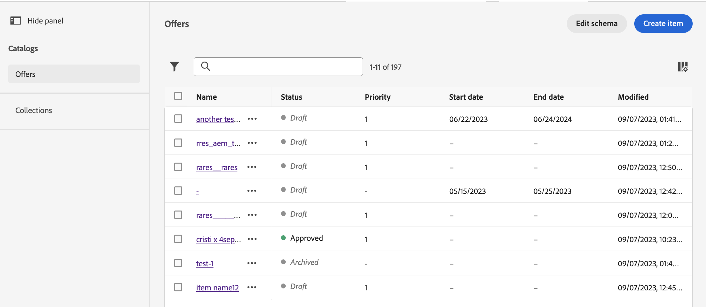
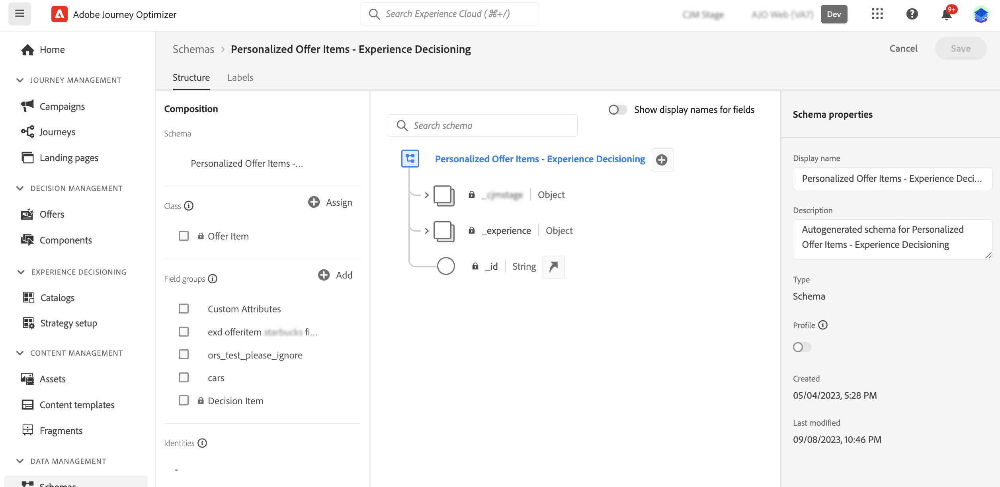
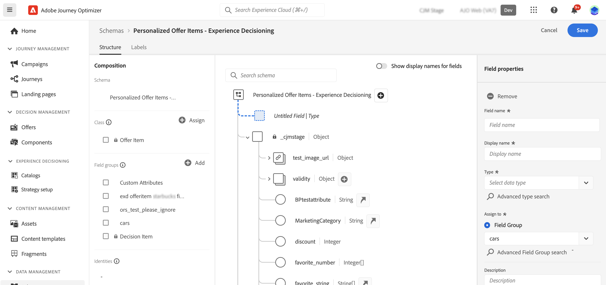
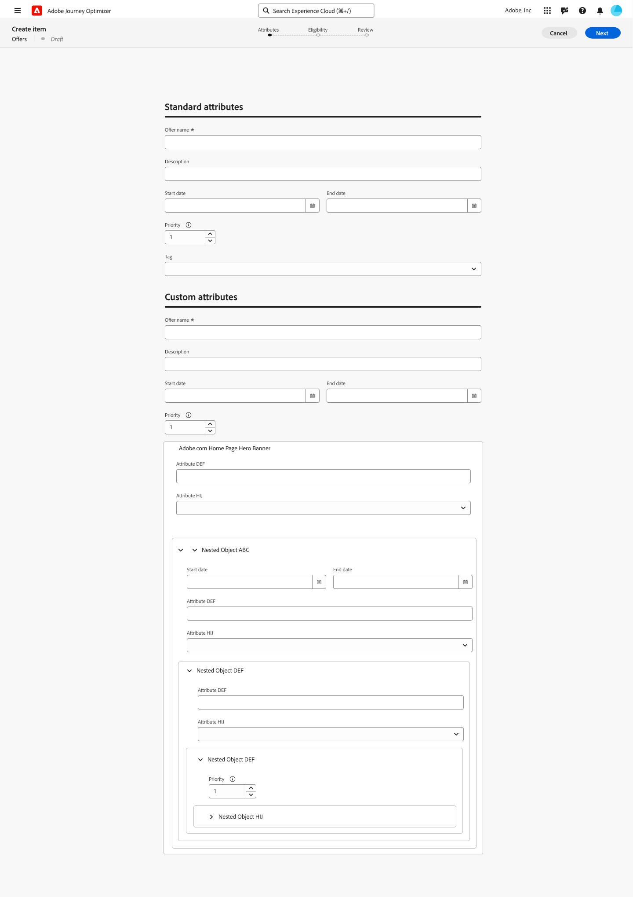

# 設定項目目錄 {#catalog}

>[!CONTEXTUALHELP]
>id="ajo_exd_item_custom_attributes"
>title="定義自訂屬性"
>abstract="自訂屬性是根據您的需求訂製並且可以指派給決定項目的特定屬性。 它們會在決定專案的目錄結構描述中建立。"

在決策中，目錄可作為中央容器來組織決策專案。 每個目錄都會連結至Adobe Experience Platform結構描述，包含可指派給決定專案的所有屬性。

目前，所有已建立的決定專案已整合至單一「優惠」目錄中，可透過&#x200B;**[!UICONTROL 目錄]**&#x200B;功能表存取。

## 護欄與限制

為了確保最佳效能和一致性，Decisioning會強制實行下列護欄和限制：

* **支援的資料型別**

  目前，Decisioning僅支援下列資料型別：字串、整數、布林值、日期、日期時間、Decisioning資產和物件。 在製作決定專案或目錄時，落在這些資料型別之外的任何欄位都無法使用。

* **自訂屬性限制**

  每個決定專案最多可包含100個自訂屬性。

* **巢狀限制**

  最多支援四個巢狀層級。 最後層級不支援影像。

## 存取及編輯目錄的結構描述 {#access-catalog-schema}

若要存取儲存決定專案屬性的目錄結構，請執行下列步驟：

1. 從專案清單中，按一下&#x200B;**[!UICONTROL 建立專案]**&#x200B;按鈕旁的&#x200B;**[!UICONTROL 編輯結構描述]**&#x200B;按鈕。

1. 目錄的結構會在新標籤中開啟，遵循以下結構：

   * **`_experience`**&#x200B;節點包含標準決定專案屬性，例如名稱、開始和結束日期以及說明。
   * **`_<imsOrg>`**&#x200B;節點可容納自訂決策專案屬性。 預設不會設定自訂屬性，但您可以視需要新增更多屬性以符合您的需求。 完成後，自訂屬性會與標準屬性一起出現在決定專案建立畫面中。

   

1. 若要將自訂屬性新增到結構描述中，請展開&#x200B;**`_<imsOrg>`**&#x200B;節點，然後按一下結構中所需位置的「+」按鈕。

   

1. 填寫新增屬性的必要欄位，然後按一下&#x200B;**[!UICONTROL 套用]**。

   在含有決策資產屬性的屬性上輸入的值是公共url。 大部分時間這會指向影像。

   有關如何使用Adobe Experience Platform結構描述的詳細資訊，請參閱[XDM系統檔案](https://experienceleague.adobe.com/docs/experience-platform/xdm/ui/overview.html?lang=zh-Hant)。

1. 新增您所需的自訂屬性後，請儲存結構。 新欄位現在可在&#x200B;**[!UICONTROL 自訂屬性]**&#x200B;區段的決定專案建立畫面中使用。

   下列範例顯示具有自訂屬性（例如結構描述中定義的物件）的專案建立畫面。

   

