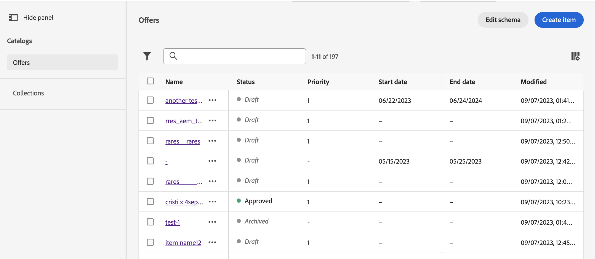
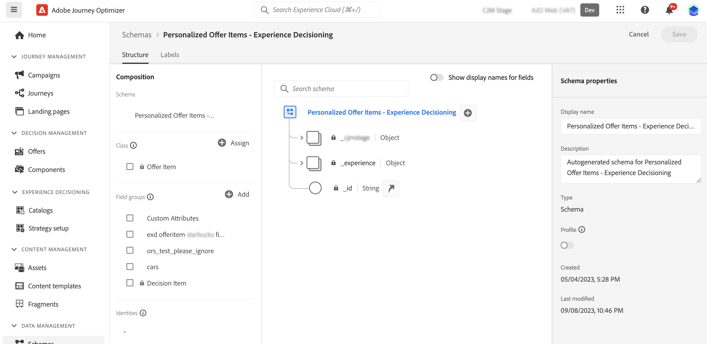
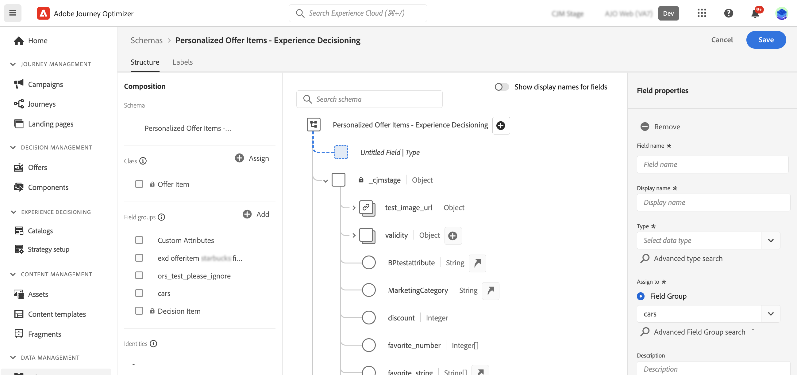
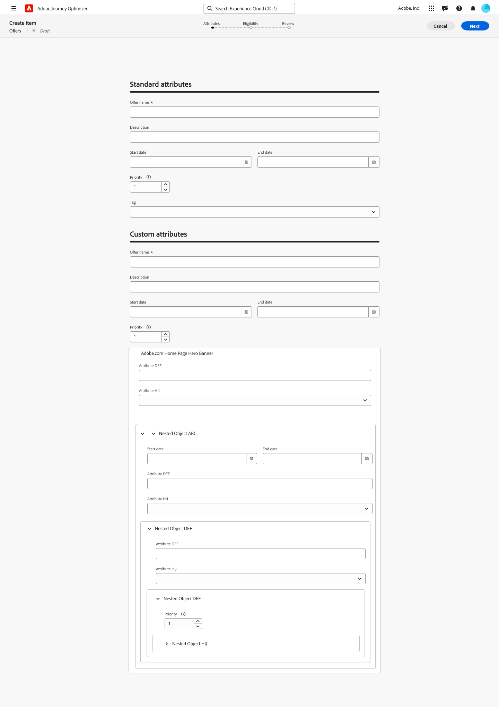

# 設定項目目錄 {#catalog}

>[!CONTEXTUALHELP]
>id="ajo_exd_item_custom_attributes"
>title="存取及編輯目錄的結構描述"
>abstract="自訂屬性是根據您的需求訂製並且可以指派給決定項目的特定屬性。 其是在決定項目的目錄結構描述中建立的。"

在決策中，目錄可作為中央容器來組織決策專案。 每個目錄都連結到[!DNL Adobe Experience Platform]結構描述，包含可指派給決定專案的所有屬性。

目前，所有已建立的決定專案已整合至單一「優惠」目錄中，可透過&#x200B;**[!UICONTROL 目錄]**&#x200B;功能表存取。

顯示優惠方案目錄的

## 護欄與限制

為了確保最佳效能和一致性，Decisioning會強制實行下列護欄和限制：

* **支援的資料型別**

  For now, Decisioning exclusively supports the following data types: String, Integer, Boolean, Date, DateTime, Decisioning Asset, and Object. 在製作決定專案或目錄時，落在這些資料型別之外的任何欄位都無法使用。

* **Custom attribute limit**

  每個決定專案最多可包含100個自訂屬性。

* **巢狀限制**

  最多支援四個巢狀層級。 最後層級不支援影像。

## 存取及編輯目錄的結構描述 {#access-catalog-schema}

若要存取儲存決定專案屬性的目錄結構，請執行下列步驟：

1. 從專案清單中，按一下&#x200B;**[!UICONTROL 建立專案]**&#x200B;按鈕旁的&#x200B;**[!UICONTROL 編輯結構描述]**&#x200B;按鈕。

1. 目錄的結構會在新標籤中開啟，遵循以下結構：

   * **`_experience`**&#x200B;節點包含標準決定專案屬性，例如名稱、開始和結束日期以及說明。
   * The **`_<imsOrg>`** node houses custom decision items attributes, where `<imsOrg>` is replaced by your organization&#39;s name (for example, `_luma` for the Luma company). By default, no custom attributes are configured, but you can add as many as needed to suit your requirements. Once done, custom attributes appear in the decision item creation screen alongside the standard attributes.

   

1. 若要將自訂屬性新增到結構描述中，請展開您組織的節點（例如&#x200B;**`_luma`**），然後按一下結構中所需位置的「+」按鈕。

   

1. 填寫新增屬性的必要欄位，然後按一下&#x200B;**[!UICONTROL 套用]**。

   在具有決策資產屬性的屬性上輸入的值是公用URL。 在大多數情況下，這會指向影像。 有關如何使用[!DNL Adobe Experience Platform]結構描述的詳細資訊，請參閱[XDM系統檔案](https://experienceleague.adobe.com/docs/experience-platform/xdm/ui/overview.html?lang=zh-Hant)。

1. 新增您所需的自訂屬性後，請儲存結構。 新欄位現在可在&#x200B;**[!UICONTROL 自訂屬性]**&#x200B;區段的決定專案建立畫面中使用。

   下列範例顯示具有自訂屬性（例如結構描述中定義的物件）的專案建立畫面。

   
