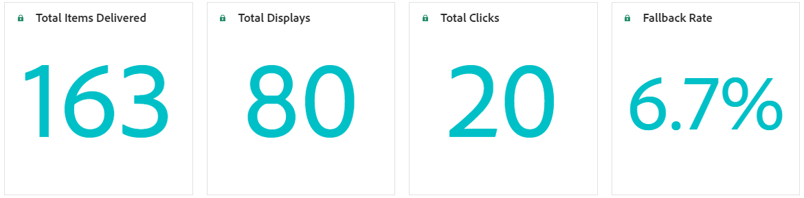

# Decisioning 上的報告 {#decisioning-report}

## 決策報告 {#campaigns}

一旦程式碼型體驗或具有選取策略的電子郵件上線，您就可以存取專用報告來監視決策關鍵績效指標(KPI)。

<!--Once code-based experiences are live, you can access dedicated reports to monitor Key Performance Indicators (KPIs) as an all-encompassing dashboard, delivering an analysis of essential metrics associated with your campaign.

This encompasses details related to the decision items performances and how users interacted with them. [Learn how to work with Code-based experience reports](../reports/campaign-global-report-cja-code.md)-->

您也可以存取與決策專案效能以及使用者如何與其互動相關的詳細資訊，提供與您的行銷活動相關之基本量度的分析。

在[本節](../reports/campaign-global-report-cja-code.md#decisioning-reporting)中瞭解如何使用程式碼型體驗報告來進行Decisioning。

## 客戶歷程分析報告 {#cja}

如果您使用Customer Journey Analytics，可以利用Decisioning為您的程式碼型行銷活動建立自訂報告儀表板。

主要步驟列於下方。 有關如何使用Customer Journey Analytics的詳細資訊，請參閱[Customer Journey Analytics檔案](https://experienceleague.adobe.com/zh-hant/docs/analytics-platform/using/cja-landing){target="_blank"}。

1. 在Customer Journey Analytics中建立並設定&#x200B;**連線**。 這可讓您連線至您要製作報表的資料集。 [瞭解如何建立連線](https://experienceleague.adobe.com/zh-hant/docs/analytics-platform/using/cja-connections/create-connection){target="_blank"}

1. 建立&#x200B;**資料檢視**，並將其與先前建立的連線建立關聯。 在&#x200B;**[!UICONTROL 元件]**&#x200B;索引標籤中，選擇您要顯示在報告中的相關結構描述欄位。 針對決策，請確定您包含&#x200B;**propositioninteract**&#x200B;和&#x200B;**propositiondisplay**&#x200B;欄位。 [瞭解如何建立和設定資料檢視](https://experienceleague.adobe.com/zh-hant/docs/analytics-platform/using/cja-dataviews/create-dataview){target="_blank"}

1. 在&#x200B;**工作區專案**&#x200B;中結合資料元件、表格和視覺效果，以建立和共用程式碼型行銷活動的報告。 [瞭解如何建立工作區專案](https://experienceleague.adobe.com/zh-hant/docs/analytics-platform/using/cja-workspace/build-workspace-project/create-projects){target="_blank"}
