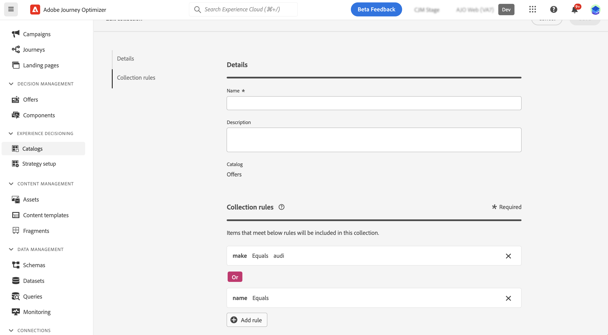

# 集合 {#collections}

>[!CONTEXTUALHELP]
>id="ajo_exd_item_collections"
>title="建立集合"
>abstract="集合可讓您根據自己的喜好對決定項目進行分類和分組。 這些類別是透過制定利用決定項目屬性的規則所建立的。"

>[!CONTEXTUALHELP]
>id="ajo_exd_item_collection_rules"
>title="為您的集合定義規則"
>abstract="新增一項或多項規則以決定要包含在集合中的項目。 選擇一個項目屬性作為標準。 選取所需的運算子並輸入要篩選的值。 視需要新增盡可能多的規則。"

>[!CONTEXTUALHELP]
>id="ajo_exd_strategy_collection"
>title="選擇一個集合"
>abstract="選取包含要考慮的產品建議的集合。 建立選擇策略時必須執行此步驟。 集合可讓您根據自己的喜好對決定項目進行分類和分組。 例如，您可以建立一個集合，其中包含在「類別」自訂屬性中具有「瑜珈」值的所有決定項目。"

集合可讓您根據自己的喜好對決定項目進行分類和分組。 這些類別是透過制定利用決定項目屬性的規則所建立的。

例如，假設您已將「類別」自訂屬性新增至決定專案的目錄結構描述。 這可讓您建立包含「類別」屬性中具有「瑜伽」值的所有決定專案的集合。

集合清單可從&#x200B;**[!UICONTROL 目錄]**&#x200B;功能表存取。

若要建立集合，請依照下列步驟進行：

1. 瀏覽至&#x200B;**[!UICONTROL 目錄]** > **[!UICONTROL 集合]**，然後按一下&#x200B;**[!UICONTROL 建立集合]**。
1. 提供集合的名稱和說明。
1. 新增一項或多項規則以決定要包含在集合中的項目。 操作步驟：

   1. 選擇一個項目屬性作為標準。 屬性清單包含在目錄結構描述中定義的所有標準和自訂屬性。 [進一步瞭解專案的目錄](catalogs.md)
   1. 選取所需的運運算元，並輸入篩選依據的值。
   1. 重複這些步驟，視需要新增任意數量的規則。 新增多個規則時，您可以選擇&#x200B;**And**&#x200B;和&#x200B;**Or**&#x200B;運運算元以組合它們。 若要這麼做，請按一下運運算元徽章，在兩個選項之間切換。
   1. 按一下&#x200B;**[!UICONTROL 預覽集合]**&#x200B;按鈕，顯示符合您定義之規則的專案。

   

1. 定義集合規則後，按一下[建立]。**&#x200B;** 集合現在會顯示在清單中。

>[!NOTE]
>
>每個專案集合最多可包含500個選件專案。 [進一步瞭解Decisioning護欄和限制](gs-experience-decisioning.md#guardrails)
