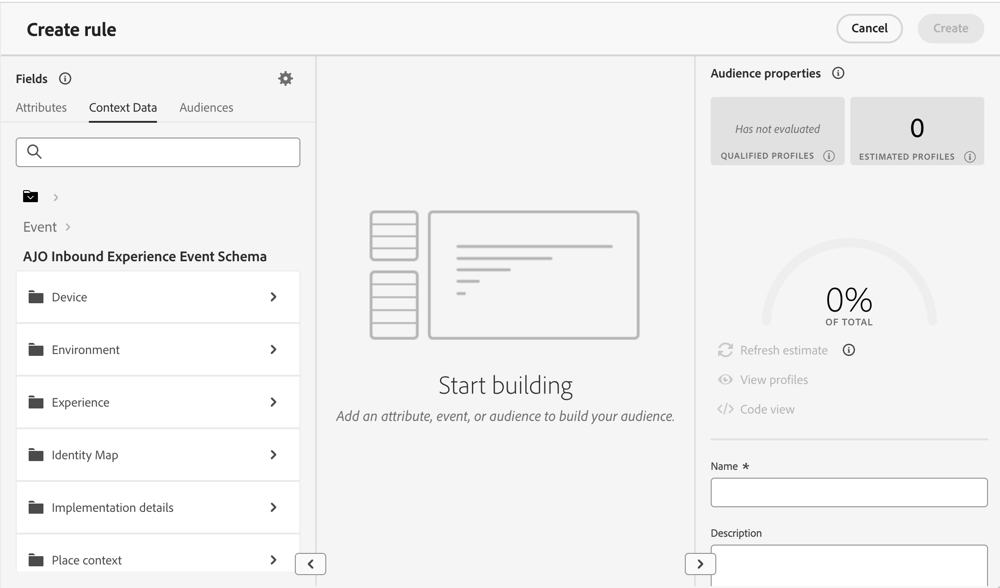
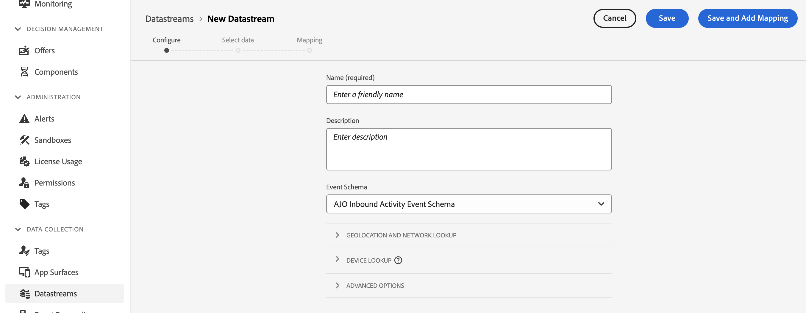
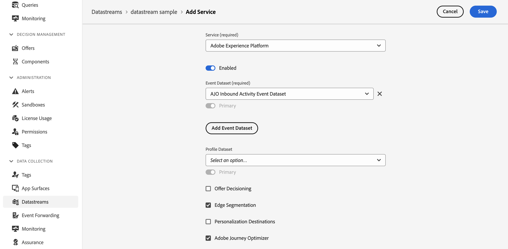

# 在決策中善用內容資料 {#context}

透過決策，您可以利用Adobe Experience Platform中任何可用的資訊來執行各種動作，例如建立[決策規則](rules.md)或[排名公式](ranking/ranking.md)。

例如，您可以設計決定規則，要求進行決定請求時目前的天氣為≥80度。

>[!NOTE]
>
>內容資料是在Adobe Experience Platform中定義，並在進行決定請求時傳送到。 其中不包含歷史資料。

若要使用內容資料，您必須先定義要在Decisioning中提供的資料。 完成後，此資料會順暢地整合到建立決定規則時可用的&#x200B;**[!UICONTROL 內容資料]**&#x200B;索引標籤中的決定中。 您也可以在編輯排名公式時運用資料。

使用Adobe Experience Platform資料來摘要決策，步驟如下：

1. 在Adobe Experience Platform及其相關之&#x200B;**資料集**&#x200B;中建立&#x200B;**體驗事件結構描述**。 [瞭解如何建立結構描述](https://experienceleague.adobe.com/zh-hant/docs/experience-platform/xdm/ui/resources/schemas){target="_blank"}

1. 建立新的Adobe Experience Platform資料流：

   1. 導覽至&#x200B;**[!UICONTROL 資料串流]**&#x200B;功能表，然後選取&#x200B;**[!UICONTROL 新增資料串流]**。

   1. 在&#x200B;**[!UICONTROL 事件結構描述]**&#x200B;下拉式清單中，選取先前建立的體驗事件結構描述，然後按一下&#x200B;**[!UICONTROL 儲存]**。

      

   1. 按一下&#x200B;**[!UICONTROL 新增服務]**，然後選取「Adobe Experience Platform」作為服務。 在&#x200B;**[!UICONTROL 事件資料集]**&#x200B;下拉式清單中，選取先前建立的事件資料集並啟用&#x200B;**[!UICONTROL Adobe Journey Optimizer]**&#x200B;選項。

      

資料流儲存後，系統會自動擷取所選資料集的資訊並整合至決策中，且通常會在24小時內提供使用。

如需如何使用Adobe Experience Platform的詳細指引，請探索下列資源：

* [體驗資料模型(XDM)結構描述](https://experienceleague.adobe.com/zh-hant/docs/experience-platform/xdm/schema/composition){target="_blank"}
* [資料集](https://experienceleague.adobe.com/zh-hant/docs/experience-platform/catalog/datasets/overview){target="_blank"}
* [資料串流](https://experienceleague.adobe.com/zh-hant/docs/experience-platform/datastreams/overview){target="_blank"}
