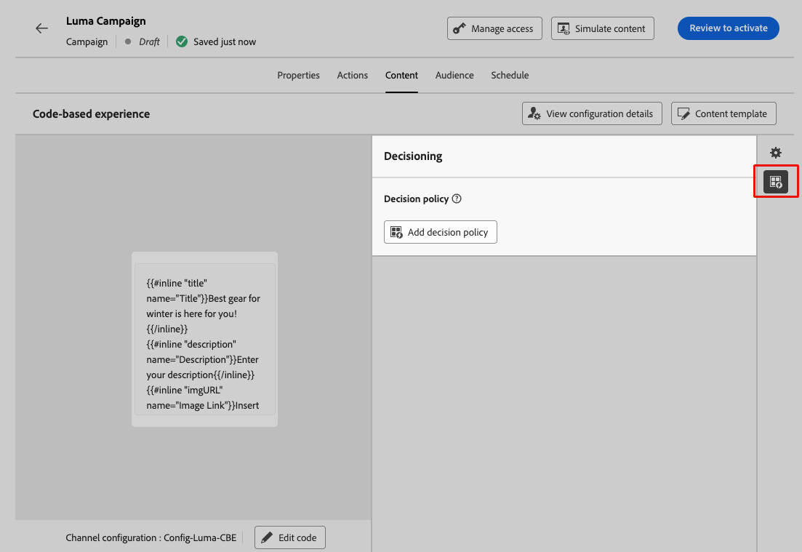
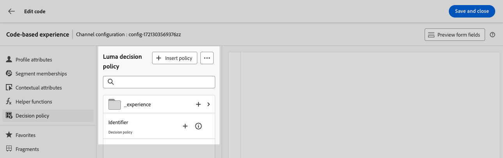

# 建立決定原則 {#create-decision}

>[!CONTEXTUALHELP]
>id="ajo_code_based_decision"
>title="什麼是決定？"
>abstract="決定原則包含決策引擎選擇最佳內容的所有選擇邏輯。決定原則是針對行銷活動的。其目標是為每個設定檔選擇最佳產品建議，而行銷活動製作允許您指明如何呈現所選決定項目，包括要在訊息中包含哪些項目屬性。"
>additional-url="https://experienceleague.adobe.com/zh-hant/docs/journey-optimizer/using/decisioning/offer-decisioning/get-started-decision/starting-offer-decisioning" text="關於決策"

>[!CONTEXTUALHELP]
>id="ajo_journey_decision_policy"
>title="定義決策原則"
>abstract="決策原則可讓您從決策引擎中挑選最佳項目，並將其傳遞給合適的客群。"
>additional-url="https://experienceleague.adobe.com/zh-hant/docs/journey-optimizer/using/decisioning/offer-decisioning/get-started-decision/starting-offer-decisioning" text="關於決策"

>[!CONTEXTUALHELP]
>id="ajo_exd_decision_policy"
>title="決策原則"
>abstract="決策原則可讓您先從決策引擎中挑選出最佳項目，再傳遞給所有客群。"

>[!CONTEXTUALHELP]
>id="ajo_exd_placements"
>title="刊登"
>abstract="產品建議放置環境決定從決策引擎傳回的項目出現在訊息中的位置。您可以在報告中追蹤他們在不同產品建議放置環境的效能。"

決策原則是優惠方案的容器，可運用決策引擎，根據對象挑選最佳內容進行傳遞。

<!--Decision policies contain all of the selection logic for the decisioning engine to pick the best content. Decision policies are campaign specific. -->其目標是為每個設定檔選取最佳優惠方案，而行銷活動/歷程製作可讓您指示應如何顯示選取的決策專案，包括要包含在訊息中的專案屬性。

>[!NOTE]
>
>在[!DNL Journey Optimizer]使用者介面中，決定原則會標示為決定<!--but they are decision policies. TBC if this note is needed-->。

將決定政策用於程式碼型行銷活動的主要步驟如下：

1. [新增決定原則至程式碼型體驗](#add-decision)
1. [使用決定原則](#use-decision-policy)
1. [建立自訂Customer Journey Analytics報告儀表板](cja-reporting.md)

## 新增決定原則至程式碼型體驗 {#add-decision}

>[!CONTEXTUALHELP]
>id="ajo_code_based_item_number"
>title="定義要傳回的項目數量"
>abstract="選取您想要傳回的決定項目數量。例如，如果您選取 2，則目前設定將顯示最佳的 2 個符合資格的產品建議。"

>[!CONTEXTUALHELP]
>id="ajo_code_based_fallback"
>title="選取遞補"
>abstract="當為該決定原則定義的所有選擇策略都不合格時，會向使用者顯示遞補項目。"

>[!CONTEXTUALHELP]
>id="ajo_code_based_strategy"
>title="什麼是策略？"
>abstract="選擇策略的順序決定了先評估哪個策略。至少需要一個策略。組合策略中的決定項目將一起評估。"
>additional-url="https://experienceleague.adobe.com/zh-hant/docs/journey-optimizer/using/decisioning/offer-decisioning/get-started-decision/starting-offer-decisioning" text="建立策略"

若要在您的網站或行動應用程式上向訪客呈現最佳動態優惠和體驗，請將決定原則新增至程式碼型促銷活動或歷程。 若要執行此操作，請遵循下列步驟。

### 建立決定原則 {#add}

1. 建立行銷活動並選取&#x200B;**[!UICONTROL 程式碼型體驗]**&#x200B;動作。 [了解更多](../code-based/create-code-based.md)

1. 從[程式碼編輯器](../code-based/create-code-based.md#edit-code)，選取&#x200B;**[!UICONTROL 決定原則]**，然後按一下&#x200B;**[!UICONTROL 新增決定原則]**。

   

   從歷程或行銷活動版本畫面，您還可以直接新增決定原則，而不開啟個人化編輯器。 使用右側邊欄上的專用圖示來顯示&#x200B;**[!UICONTROL 決策]**&#x200B;區段。

   

1. 依預設，建立新原則。

   >[!NOTE]
   >
   >您也可以選擇選取現有的原則。

1. 填寫決策原則的詳細資訊：新增名稱並選取目錄。

   >[!NOTE]
   >
   >目前僅提供預設的&#x200B;**[!UICONTROL 選件]**&#x200B;目錄。

1. 選取要傳回的專案數。 例如，如果您選取2，則會針對目前設定顯示最佳的2個合格優惠方案。 按一下&#x200B;**[!UICONTROL 下一步]**。

   

### 選取專案與選取策略 {#select}

**[!UICONTROL 策略順序]**&#x200B;區段可讓您選取要與決策原則一起呈現的決定專案與選取策略。

1. 按一下&#x200B;**[!UICONTROL 新增]**&#x200B;按鈕。

1. 選擇要包含在原則中的物件型別：

   * **[!UICONTROL 選取策略]**：新增一或多個選取策略。 決策策略會運用與適用性限制和排名方法相關的集合，以決定要顯示的專案。 您可以選取現有的選取策略，或使用&#x200B;**[!UICONTROL 建立選取策略]**&#x200B;按鈕建立新的選取策略。 [瞭解如何建立選擇策略](selection-strategies.md)

   * **[!UICONTROL 決定專案]**：新增單一決定專案以呈現，而不需執行選取策略。 您一次只能選取一個決定專案。 任何針對專案設定的適用性限制都會套用。

   

   >[!NOTE]
   >
   >決策原則可支援最多10個合併的選擇策略和決策專案。 [進一步瞭解Decisioning護欄和限制](gs-experience-decisioning.md#guardrails)

1. 新增多個決定專案和/或策略時，將會以特定順序評估它們。 將先評估新增至序列的第一個物件，依此類推。

   若要變更預設順序，您可以拖放物件和/或群組以視需要重新排序。 [了解更多](#evaluation-order)

### 管理決定原則中的評估順序 {#evaluation-order}

將決定專案和選取策略新增到原則之後，您可以安排它們的順序以決定它們的評估順序，並將選取策略組合在一起以一起評估。

每個物件或物件群組左邊會以數字表示要評估專案與策略的&#x200B;**循序順序**。 若要在序列中移動選取策略（或一組策略）的位置，請將其拖放到另一個位置。

>[!NOTE]
>
>在序列中只能拖放選取策略。 若要變更決定專案的位置，您必須移除它，並在新增您之前要評估的其他專案之後，使用&#x200B;**[!UICONTROL 新增]**&#x200B;按鈕將其重新新增。

您也可以&#x200B;**將**&#x200B;多個選取策略組合成群組，以便一起評估而不是分別評估。 若要這麼做，請按一下選取策略下方的&#x200B;**`+`**&#x200B;按鈕，將其與另一個策略結合。 您也可以將選取策略拖放至另一個策略上，將兩個策略組成群組。

>[!NOTE]
>
>決策專案無法與其他專案或選取策略一起分組。

多個策略及其分組決定策略的優先順序以及合格優惠的排名。 第一個策略具有最高優先順序，且在相同群組內合併的策略具有相同優先順序。

例如，您有兩個集合，一個在策略A中，另一個在策略B中。此請求是為了傳回兩個決定專案。 假設有兩個來自策略A的合格優惠方案和三個來自策略B的合格優惠方案。

* 如果兩個策略&#x200B;**未合併**&#x200B;或依序順序（1和2），則第一列中會傳回第一個策略中前兩個符合資格的優惠。 如果第一個策略沒有兩個符合資格的優惠，決定引擎會依序移至下一個策略，以找出仍需要多少優惠方案，最終在需要時傳回遞補。

  

* 如果兩個集合約時進行&#x200B;**評估**，因為有來自策略A的兩個合格優惠和來自策略B的三個合格優惠，這五個優惠都將根據各自排名方法決定的值棧疊在一起。 已要求兩個優惠方案，因此將傳回這五個優惠方案中的前兩個合格優惠方案。

  

+++ 具有多個策略的&#x200B;**範例**

現在，讓我們舉一個例子，您有劃分為不同群組的多個策略。

您定義了三種策略。 策略1和策略2在群組1中結合，而策略3是獨立的（群組2）。

每個策略的合格優惠方案及其優先順序（用於排名函式評估）如下：

* 群組1：
   * 策略1 - （選件1、選件2、選件3） — 優先順序1
   * 策略2 - （選件3、選件4、選件5） — 優先順序1

* 群組2：
   * 策略3 - （選件5、選件6） — 優先順序0

系統會先評估最高優先順序的策略選件，並將其新增至排名選件清單。

**反複專案1：**

策略1和策略2選件會一起評估（選件1、選件2、選件3、選件4、選件5）。 假設結果為：

選件1 - 10
選件2 - 20
策略1的優惠3 - 30，策略2的優惠45。 兩者中的最高會納入考量，因此會考慮45。
選件4 - 40
選件5 - 50

排名優惠方案現在如下：優惠方案5、優惠方案3、優惠方案4、優惠方案2、優惠方案1。

**反複專案2：**

已評估策略3選件（選件5、選件6）。 假設結果為：

* 選件5 — 將不進行評估，因為它已存在於上述結果中。
* 選件6 - 60

排名優惠方案現在如下：優惠方案5 、優惠方案3、優惠方案4、優惠方案2、優惠方案1、優惠方案6。

+++

### 新增遞補優惠 {#fallback}

選取決定專案和/或選取策略後，如果上述專案或選取策略均不合格，您可以新增對使用者顯示的遞補優惠。

您可以從清單中選取任何專案，這會顯示在目前沙箱上建立的所有決定專案。 如果沒有合格的選取策略，則無論套用至所選專案<!--nor frequency capping when available - TO CLARIFY-->的日期和適用性限制，都會對使用者顯示遞補。

>[!NOTE]
>
>遞補內容為選用。 如果未選取遞補策略，且沒有符合資格的策略，[!DNL Journey Optimizer]將不會顯示任何內容。 您最多可以新增決定原則請求的專案數。 這保證了在使用案例需要時可傳回特定數量的專案。

當您的決定原則準備就緒時，請儲存並按一下&#x200B;**[!UICONTROL 建立]**。 現在決定原則已建立，您可以在程式碼型體驗內容中使用決定屬性。 [了解更多](#use-decision-policy)

## 在程式碼編輯器中使用決定原則 {#use-decision-policy}

建立後，決定原則便可用於[個人化編輯器](../code-based/create-code-based.md#edit-code)。 若要執行此操作，請遵循下列步驟。

>[!NOTE]
>
>程式碼型體驗運用[!DNL Journey Optimizer]個人化編輯器及其所有個人化和編寫功能。 [了解更多](../personalization/personalization-build-expressions.md)

1. 按一下&#x200B;**[!UICONTROL 插入原則]**&#x200B;按鈕。 已新增與決定原則對應的程式碼。

   

   >[!NOTE]
   >
   >此序列將重複執行您想要傳回決定原則的次數。 例如，如果您選擇在[建立決定](#add-decision)時傳回2個專案，則相同的順序將重複兩次。

1. 現在，您可以在該程式碼中新增所有需要的決定屬性。 可用的屬性儲存在&#x200B;**[!UICONTROL 選件]**&#x200B;目錄的結構描述中。 自訂屬性儲存在&#x200B;**`_<imsOrg`>**&#x200B;資料夾中，而標準屬性儲存在&#x200B;**`_experience`**&#x200B;資料夾中。 [進一步瞭解優惠方案目錄的結構描述](catalogs.md)

   

   >[!NOTE]
   >
   >針對決定原則專案追蹤，決策原則內容需要新增`trackingToken`屬性，如下所示：
   >`trackingToken: {{item._experience.decisioning.decisionitem.trackingToken}}`

1. 按一下每個資料夾以展開。 將滑鼠游標置於所需位置，然後按一下您要新增的屬性旁的+圖示。 您可以對程式碼新增任意數量的屬性。

   

1. 請務必將`#each`回圈包裝在一對方括弧`[ ]`內，並在結尾的`/each`前加上逗號。

   

1. 您也可以新增個人化編輯器中可用的任何其他屬性，例如設定檔屬性。

   

1. 按一下&#x200B;**[!UICONTROL 儲存並關閉]**&#x200B;以確認您的變更。

1. 檢閱並發佈您的程式碼型體驗行銷活動或歷程。 [了解作法](../code-based/publish-code-based.md)

   現在，當您的開發人員執行API或SDK呼叫，擷取您頻道設定中定義之表面的內容時，變更就會套用至您的網頁或應用程式。

   >[!NOTE]
   >
   >目前您無法在[程式碼型體驗](../code-based/create-code-based.md)促銷活動或歷程中使用決定，從使用者介面模擬內容。 [此區段](../code-based/code-based-decisioning-implementations.md)中有因應措施。

1. 若要檢視決策的執行方式，您可以建立自訂[Customer Journey Analytics報告控制面板](cja-reporting.md)。

