# 建立決定原則 {#create-decision}

>[!CONTEXTUALHELP]
>id="ajo_code_based_decision"
>title="什麼是決定？"
>abstract="決定原則包含決策引擎選擇最佳內容的所有選擇邏輯。決定原則是針對行銷活動的。其目標是為每個設定檔選擇最佳產品建議，而行銷活動製作允許您指明如何呈現所選決定項目，包括要在訊息中包含哪些項目屬性。"
>additional-url="https://experienceleague.adobe.com/zh-hant/docs/journey-optimizer/using/decisioning/offer-decisioning/get-started-decision/starting-offer-decisioning" text="關於決策"

>[!CONTEXTUALHELP]
>id="ajo_journey_decision_policy"
>title="定義決策原則"
>abstract="決策原則可讓您從決策引擎中挑選最佳項目，並將其傳遞給合適的客群。"
>additional-url="https://experienceleague.adobe.com/zh-hant/docs/journey-optimizer/using/decisioning/offer-decisioning/get-started-decision/starting-offer-decisioning" text="關於決策"

>[!CONTEXTUALHELP]
>id="ajo_exd_decision_policy"
>title="決策原則"
>abstract="決策原則可讓您先從決策引擎中挑選出最佳項目，再傳遞給所有客群。"

>[!CONTEXTUALHELP]
>id="ajo_exd_placements"
>title="刊登"
>abstract="產品建議放置環境決定從決策引擎傳回的項目出現在訊息中的位置。您可以在報告中追蹤他們在不同產品建議放置環境的效能。"

>[!CONTEXTUALHELP]
>id="ajo_exd_decision_attribute"
>title="從目錄選取決定的屬性"
>abstract="會將決定屬性儲存在目錄的結構描述中。 從選取的目錄中，選取想在此處使用的屬性。"

決策原則是優惠方案的容器，可運用決策引擎以動態方式傳回最佳內容，供每個受眾成員傳送。 其目標是為每個設定檔選取最佳優惠方案，而行銷活動/歷程製作可讓您指示應如何顯示選取的決策專案，包括要包含在訊息中的專案屬性。

## 主要步驟 {#key}

將決定政策運用於訊息的主要步驟如下：

1. [在電子郵件或程式碼型體驗中建立決策原則](#add-decision)

   選取要傳回的專案數、設定選擇策略、遞補選項和評估順序，以在電子郵件或程式碼型體驗中設定決定原則。

1. [在您的內容中使用決定原則](#use-decision-policy)

   使用決定原則輸出和您要在訊息中顯示的決定專案屬性，個人化您的內容。

1. [建立報告儀表板](cja-reporting.md)

   建立自訂Customer Journey Analytics儀表板，以測量效能並深入瞭解您的決定政策和優惠的提供及參與方式。

## 護欄和限制

* **有限可用性 — 電子郵件中的決定原則** — 目前，電子郵件中的決定原則建立可在有限可用性中取得。 請聯絡您的 Adobe 代表以取得存取權。
* **映象頁面** — 目前，決定專案不會在電子郵件映象頁面中呈現。
* **追蹤和連結型別** — 若要追蹤由決定產生的連結，請在結構描述中將其定義為「決定Assets」。 無法追蹤屬性型連結。
* **在電子郵件中巢狀內嵌決定原則** — 您無法在已經有關聯決定原則的父級電子郵件元件中巢狀內嵌多個決定原則。
* **含決策的重複歷程/行銷活動** — 如果您重複包含決策原則的歷程或行銷活動，重複版本會參考原始電子郵件或程式碼型體驗，而造成錯誤。 複製後請一律重新設定決定原則。
* **同意原則** — 同意原則的更新最多需要48小時才會生效。 如果決定原則參考與最近更新的同意原則關聯的屬性，變更將不會立即套用。

  同樣地，如果受同意原則約束的新設定檔屬性新增到決定原則中，這些設定檔屬性將可供使用，但關聯的同意原則在延遲過去後才會執行。

  同意原則僅適用於具有Adobe Healthcare Shield或Privacy and Security Shield附加元件的組織。

* **AI排名** — 目前，使用決策的歷程中的電子郵件管道不支援AI排名。

## 在電子郵件或程式碼型體驗中建立決策原則 {#add-decision}

>[!CONTEXTUALHELP]
>id="ajo_code_based_item_number"
>title="定義要傳回的項目數量"
>abstract="選取您想要傳回的決定項目數量。例如，如果您選取 2，則目前設定將顯示最佳的 2 個符合資格的產品建議。"

>[!CONTEXTUALHELP]
>id="ajo_code_based_fallback"
>title="選取遞補"
>abstract="當為該決定原則定義的所有選擇策略都不合格時，會向使用者顯示遞補項目。"

>[!CONTEXTUALHELP]
>id="ajo_code_based_strategy"
>title="什麼是策略？"
>abstract="選擇策略的順序決定了先評估哪個策略。至少需要一個策略。組合策略中的決定項目將一起評估。"
>additional-url="https://experienceleague.adobe.com/zh-hant/docs/journey-optimizer/using/decisioning/offer-decisioning/get-started-decision/starting-offer-decisioning" text="建立策略"

若要向網站或行動應用程式上的電子郵件收件者和訪客呈現最佳動態優惠和體驗，請將決定原則新增至電子郵件或程式碼型行銷活動或歷程。 若要執行此操作，請遵循下列步驟。

### 建立決定原則 {#add}

1. 在歷程或行銷活動中，新增&#x200B;**[!UICONTROL 電子郵件]**&#x200B;或&#x200B;**[!UICONTROL 程式碼型體驗]**&#x200B;動作。

1. 針對電子郵件，切換設定畫面中的&#x200B;**[!UICONTROL 啟用決策]**。

   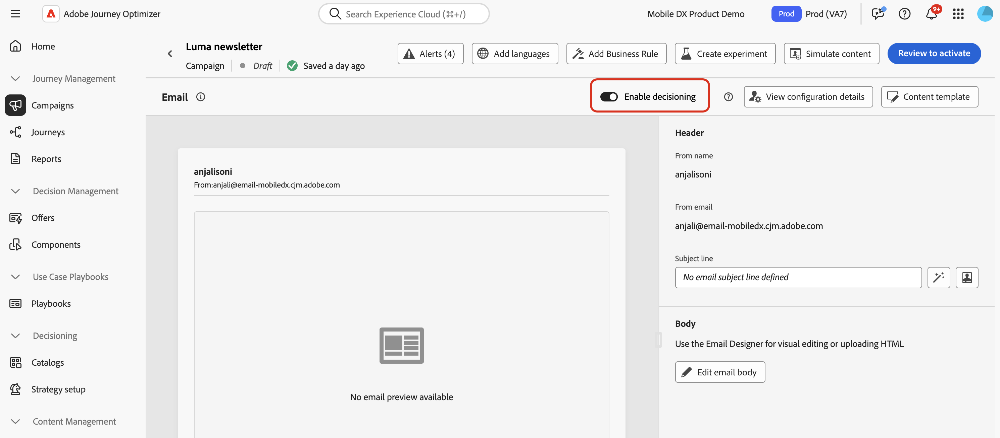

   >[!IMPORTANT]
   >
   >啟用決策功能會清除現有的電子郵件內容。 如果您已設計電子郵件，請務必預先將內容儲存為範本。
   >
   >請注意，在電子郵件中設定的任何決定原則將不會儲存在範本中。 如果您將範本套用至其他電子郵件，則需要重新設定原則。

1. 您可使用個人化編輯器，在電子郵件和程式碼型體驗中建立原則。 您也可以在電子郵件Designer的專用功能表的電子郵件中建立這些篩選器。 請展開下列各節以取得詳細資訊。

   +++Personalization編輯器

   1. 開啟個人化編輯器並選取&#x200B;**[!UICONTROL 決定原則]**。
   1. 按一下&#x200B;**[!UICONTROL 新增決定原則]**&#x200B;按鈕以建立新原則。

      

   +++

   +++透過電子郵件傳送Designer **[!UICONTROL 決策]**&#x200B;功能表

   1. 選取元件，按一下工具列或屬性窗格中的&#x200B;**[!UICONTROL 決策]**&#x200B;圖示，然後選取&#x200B;**[!UICONTROL 新增原則]**。

   1. 選取&#x200B;**[!UICONTROL 重複使用決定輸出]**&#x200B;以重複使用已在此電子郵件中建立的決定原則。

      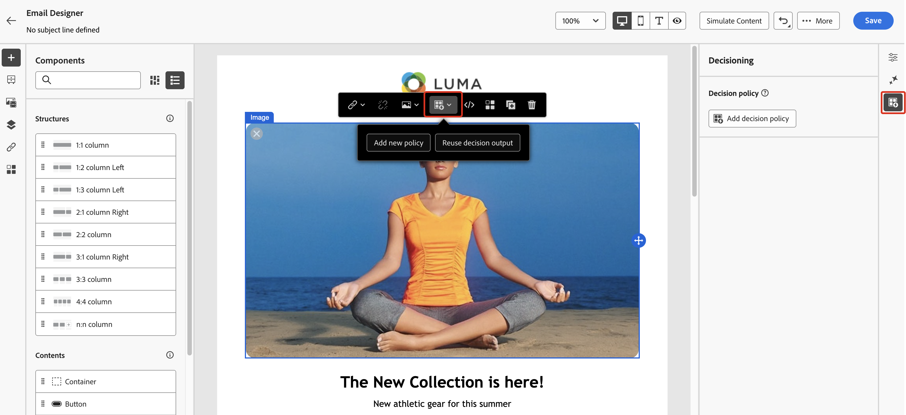

   +++

1. 提供名稱並選取目錄（目前僅限於預設&#x200B;**[!UICONTROL 選件]**&#x200B;目錄）。

1. 選取要傳回的專案數。 例如，如果您選取 2，則目前設定將顯示最佳的 2 個符合資格的產品建議。

   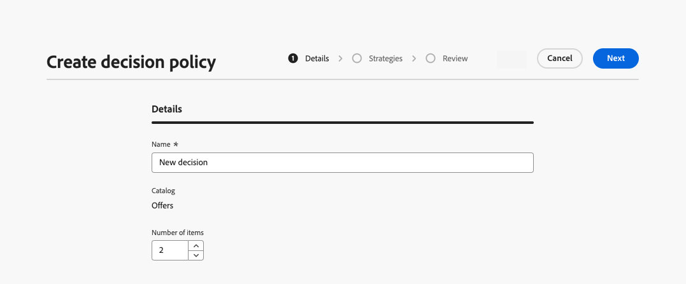

   對於電子郵件，只能在&#x200B;**[!UICONTROL 重複網格]**&#x200B;內容元件中傳回多個專案。 展開下列區段以取得詳細資訊：

   +++ 在電子郵件中傳回多個決定專案

   1. 將&#x200B;**[!UICONTROL 重複格線]**&#x200B;元件拖曳至畫布，並使用&#x200B;**[!UICONTROL 設定]**&#x200B;窗格視需要加以設定。

      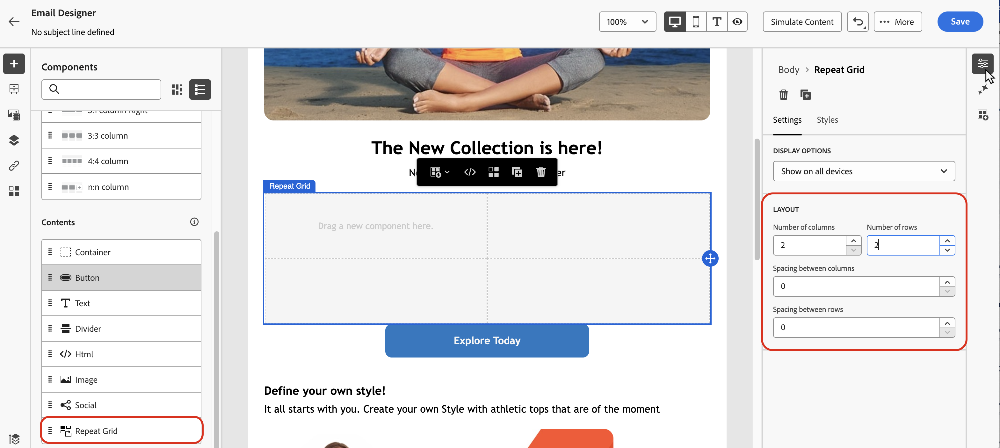

   1. 按一下畫布工具列中的&#x200B;**[!UICONTROL 決策]**&#x200B;圖示，或開啟&#x200B;**[!UICONTROL 決策]**&#x200B;窗格並選取&#x200B;**[!UICONTROL 新增決策原則]**。

   1. 在&#x200B;**[!UICONTROL 專案數]**&#x200B;欄位中指定要傳回的專案數，然後設定決定原則，如下所述。 您可以選取的專案數目上限受&#x200B;**[!UICONTROL 重複網格]**&#x200B;元件中定義的圖磚數目限制。

   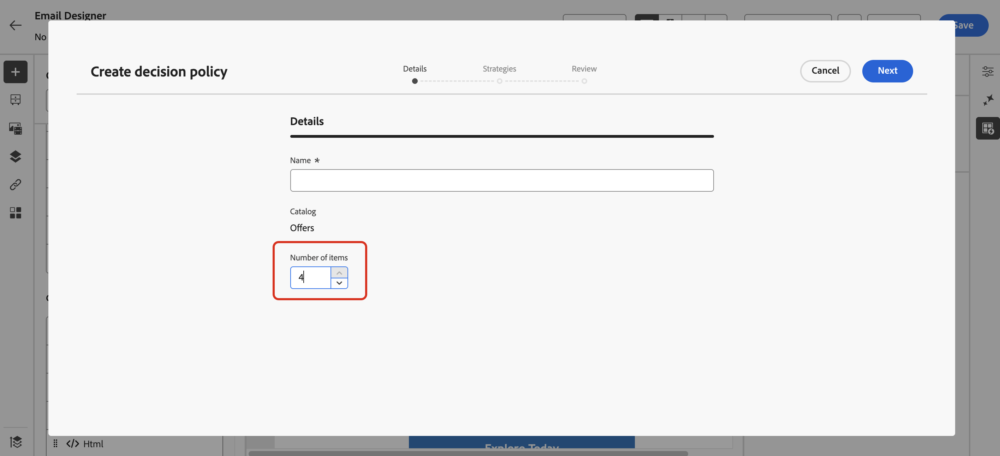

   +++

1. 按一下&#x200B;**[!UICONTROL 下一步]**。

### 選取專案與選取策略 {#select}

**[!UICONTROL 策略順序]**&#x200B;區段可讓您選取要與決策原則一起呈現的決定專案與選取策略。

1. 按一下&#x200B;**[!UICONTROL 新增]**，然後選擇要包含在原則中的物件型別：

   * **[!UICONTROL 選取策略]**：新增一或多個選取策略。 決策策略會運用與適用性限制和排名方法相關的集合，以決定要顯示的專案。 您可以選取現有的選取策略，或使用&#x200B;**[!UICONTROL 建立選取策略]**&#x200B;按鈕建立新的選取策略。 [瞭解如何建立選擇策略](selection-strategies.md)

   * **[!UICONTROL 決定專案]**：新增單一決定專案以呈現，而不需執行選取策略。 您一次只能選取一個決定專案。 任何針對專案設定的適用性限制都會套用。

   

   >[!NOTE]
   >
   >決策原則可支援最多10個合併的選擇策略和決策專案。 [進一步瞭解Decisioning護欄和限制](gs-experience-decisioning.md#guardrails)

1. 新增多個決定專案和/或策略時，將會以特定順序評估它們。 將先評估新增至序列的第一個物件，依此類推。 若要變更預設順序，請拖放物件和/或群組以視需要重新排序。 展開以下區段以取得詳細資訊。

   +++管理決定原則中的評估順序

   將決定專案和選取策略新增到原則之後，您可以安排它們的順序以決定它們的評估順序，並將選取策略組合在一起以一起評估。

   每個物件或物件群組左邊會以數字表示要評估專案與策略的&#x200B;**循序順序**。 若要在序列中移動選取策略（或一組策略）的位置，請將其拖放到另一個位置。

   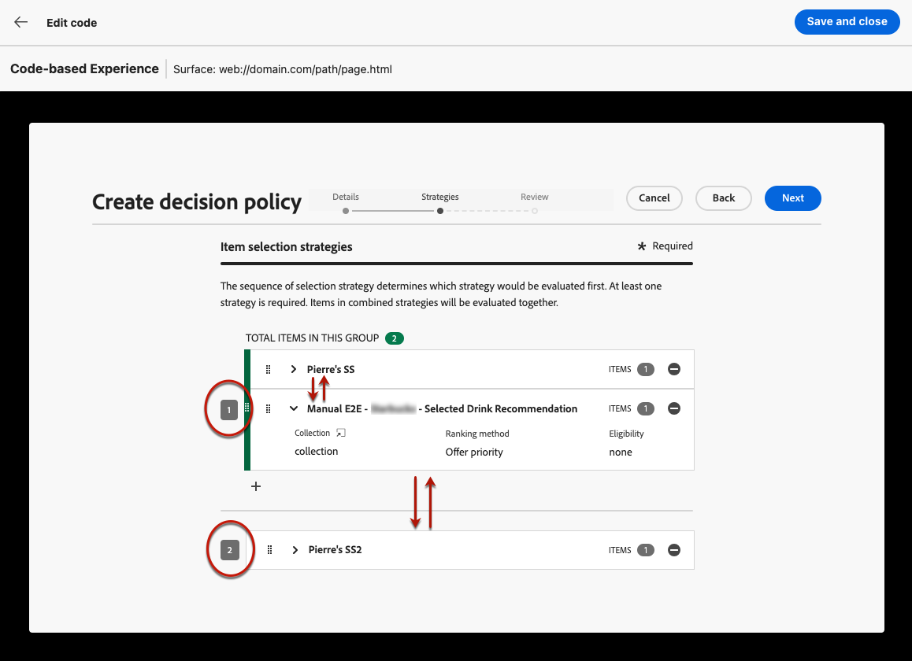

   >[!NOTE]
   >
   >在序列中只能拖放選取策略。 若要變更決定專案的位置，您必須移除它，並在新增您之前要評估的其他專案之後，使用&#x200B;**[!UICONTROL 新增]**&#x200B;按鈕將其重新新增。

   您也可以&#x200B;**將**&#x200B;多個選取策略組合成群組，以便一起評估而不是分別評估。 若要這麼做，請按一下選取策略下方的&#x200B;**`+`**&#x200B;按鈕，將其與另一個策略結合。 您也可以將選取策略拖放至另一個策略上，將兩個策略組成群組。

   >[!NOTE]
   >
   >決策專案無法與其他專案或選取策略一起分組。

   多個策略及其分組決定策略的優先順序以及合格優惠的排名。 第一個策略具有最高優先順序，且在相同群組內合併的策略具有相同優先順序。

   例如，您有兩個集合，一個在策略A中，另一個在策略B中。此請求是為了傳回兩個決定專案。 假設有兩個來自策略A的合格優惠方案和三個來自策略B的合格優惠方案。

   * 如果兩個策略&#x200B;**未合併**&#x200B;或依序順序（1和2），則第一列中會傳回第一個策略中前兩個符合資格的優惠。 如果第一個策略沒有兩個符合資格的優惠，決定引擎會依序移至下一個策略，以找出仍需要多少優惠方案，最終在需要時傳回遞補。

     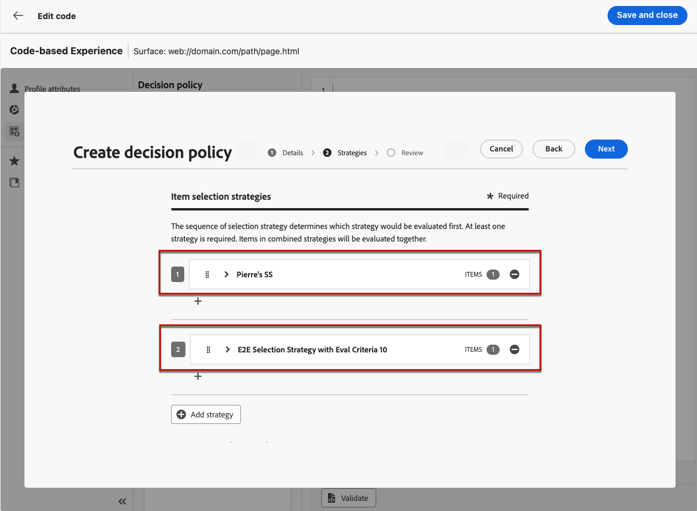

   * 如果兩個集合約時進行&#x200B;**評估**，因為有來自策略A的兩個合格優惠和來自策略B的三個合格優惠，這五個優惠都將根據各自排名方法決定的值棧疊在一起。 已要求兩個優惠方案，因此將傳回這五個優惠方案中的前兩個合格優惠方案。

     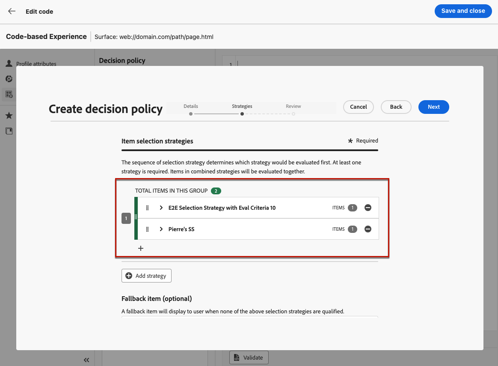

   具有多個策略的&#x200B;**範例**

   現在，讓我們舉一個例子，您有劃分為不同群組的多個策略。 您定義了三種策略。 策略1和策略2在群組1中結合，而策略3是獨立的（群組2）。 每個策略的合格優惠方案及其優先順序（用於排名函式評估）如下：

   * 群組1：
      * 策略1 - （選件1、選件2、選件3） — 優先順序1
      * 策略2 - （選件3、選件4、選件5） — 優先順序1

   * 群組2：
      * 策略3 - （選件5、選件6） — 優先順序0

   系統會先評估最高優先順序的策略選件，並將其新增至排名選件清單。

   * **反複專案1：**

     策略1和策略2選件會一起評估（選件1、選件2、選件3、選件4、選件5）。 假設結果為：

     選件1 - 10
選件2 - 20
策略1的優惠3 - 30，策略2的優惠45。 兩者中的最高會納入考量，因此會考慮45。
選件4 - 40
選件5 - 50

     排名優惠方案現在如下：優惠方案5、優惠方案3、優惠方案4、優惠方案2、優惠方案1。

   * **反複專案2：**

     已評估策略3選件（選件5、選件6）。 假設結果為：

      * 選件5 — 將不進行評估，因為它已存在於上述結果中。
      * 選件6 - 60

     排名優惠方案現在如下：優惠方案5 、優惠方案3、優惠方案4、優惠方案2、優惠方案1、優惠方案6。

   +++

1. 按一下&#x200B;**[!UICONTROL 下一步]**

### 新增遞補優惠 {#fallback}

選取決定專案和/或選取策略後，如果上述專案或選取策略皆不合格，您可以新增遞補優惠以顯示。

您可以從清單中選取任何專案，這會顯示在目前沙箱上建立的所有決定專案。 如果沒有合格的選取策略，則無論套用至所選專案<!--nor frequency capping when available - TO CLARIFY-->的日期和適用性限制，都會對使用者顯示遞補。

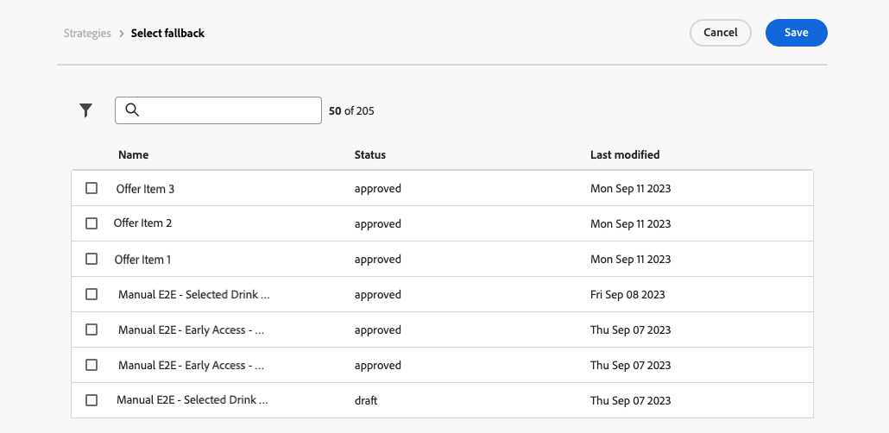

>[!NOTE]
> 遞補內容為選用。 最多可以選取請求的專案數。 如果沒有符合資格且未設定遞補內容，則不會顯示任何內容。

### 儲存和管理決定原則 {#save}

當您的決定原則準備就緒時，請儲存並按一下&#x200B;**[!UICONTROL 建立]**。

對於電子郵件，您需要定義與決定原則相關元件的位置。 若要這麼做，請按一下元件屬性窗格中的&#x200B;**[!UICONTROL 決策]**&#x200B;按鈕，然後選取&#x200B;**[!UICONTROL 指派位置]**。 [瞭解如何使用版位](../experience-decisioning/placements.md)

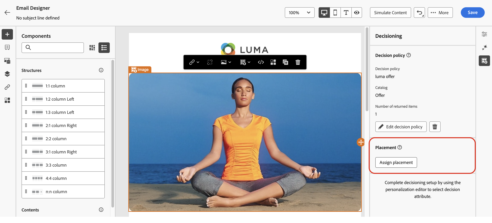

您可以隨時使用個人化編輯器中的省略符號按鈕，或元件屬性窗格中的&#x200B;**[!UICONTROL 決策]**&#x200B;選單來編輯或刪除決定原則。

>[!BEGINTABS]

>[!TAB 從個人化編輯器編輯或刪除原則]

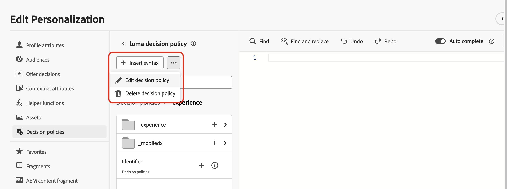

>[!TAB 編輯或刪除元件屬性中的原則]

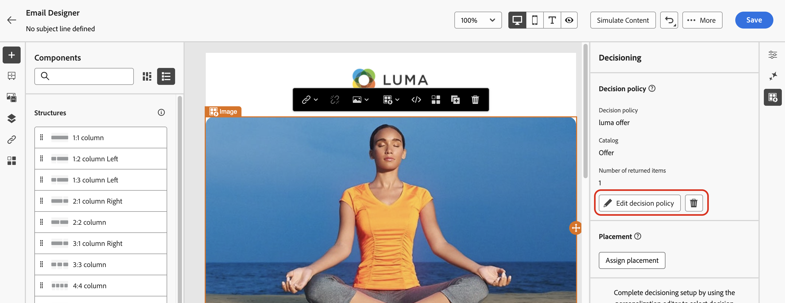

>[!ENDTABS]

## 在您的內容中使用決定原則 {#use-decision-policy}

建立後，決策原則以及連結至傳回決策專案的屬性即可用於您的內容，以個人化您的內容。 請依照下列步驟以執行此操作。

### 插入決定原則代碼 {#insert-code}

1. 開啟個人化編輯器並存取&#x200B;**[!UICONTROL 決定原則]**&#x200B;功能表。

1. 針對電子郵件，按一下&#x200B;**[!UICONTROL 插入語法]**&#x200B;以新增與決定原則對應的程式碼。 針對程式碼型體驗，按一下&#x200B;**[!UICONTROL 插入原則]**。

   +++在電子郵件中插入決定原則代碼

   

   對於電子郵件，如果尚未預先將位置與元件相關聯，請從清單中選取一個位置，然後按一下&#x200B;**[!UICONTROL 指派]**。

   

   +++

   +++在程式碼型體驗中插入決定原則程式碼

   

   +++

   >[!NOTE]
   >
   >如果未顯示程式碼插入按鈕，表示可能已針對上層元件設定決定原則。

1. 已新增決定原則的程式碼。 此序列將重複執行您想要傳回決定原則的次數。 例如，如果您選擇在[建立決定](#add-decision)時傳回2個專案，則相同的順序將重複兩次。

### 利用決策專案屬性 {#attributes}

現在，您可以在該程式碼中新增所有需要的決定屬性。 可用的屬性儲存在&#x200B;**[!UICONTROL 選件]**&#x200B;目錄的結構描述中。 自訂屬性儲存在&#x200B;**`_<imsOrg`>**&#x200B;資料夾中，而標準屬性儲存在&#x200B;**`_experience`**&#x200B;資料夾中。 [進一步瞭解優惠方案目錄的結構描述](catalogs.md)


>[!NOTE]
>
>針對決定原則專案追蹤，決策原則內容需要新增`trackingToken`屬性，如下所示：
>>`trackingToken: {{item._experience.decisioning.decisionitem.trackingToken}}`

1. 按一下每個資料夾以展開。 將滑鼠游標置於所需位置，然後按一下您要新增的屬性旁的+圖示。 您可以對程式碼新增任意數量的屬性。

   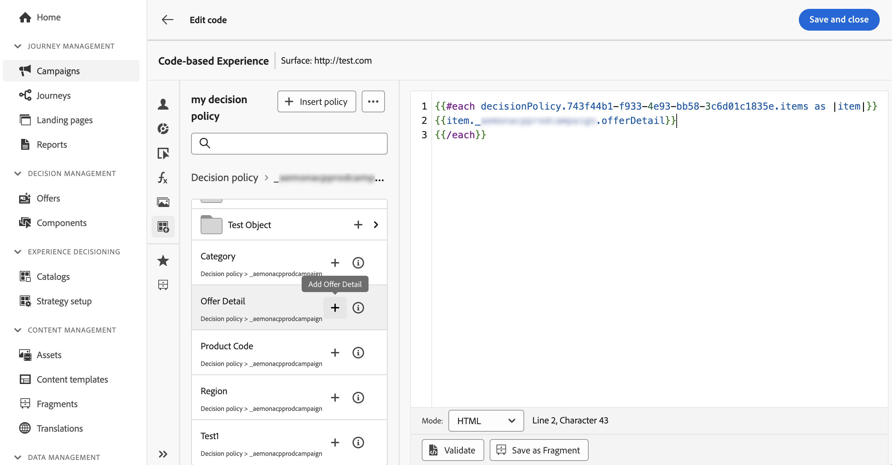

1. 請務必將`#each`回圈包裝在一對方括弧`[ ]`內，並在結尾的`/each`前加上逗號。

   

1. 您也可以新增個人化編輯器中可用的任何其他屬性，例如設定檔屬性。

   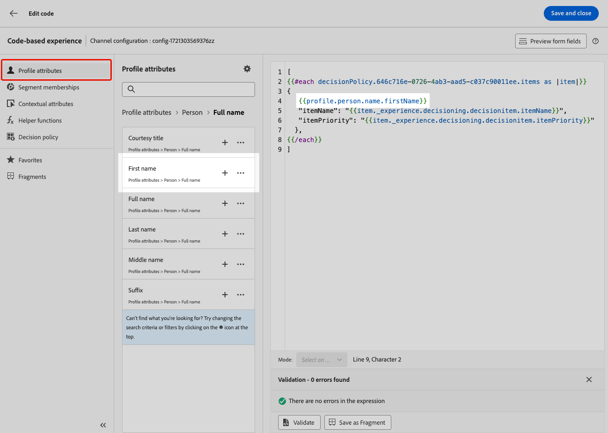

### 利用片段 {#fragments}

如果您的決定原則包含決定專案（包括片段），您可以在決定原則程式碼中利用這些片段。 [進一步瞭解片段](../content-management/fragments.md)

>[!AVAILABILITY]
>
>此功能目前僅適用於一組組織（可用性限制）。 如需詳細資訊，請聯絡您的 Adobe 代表。

例如，假設您想針對多種行動裝置型號顯示不同的內容。 請務必將與這些裝置對應的片段新增至您在決定原則中使用的決定專案。 [瞭解如何進行](items.md#attributes)。

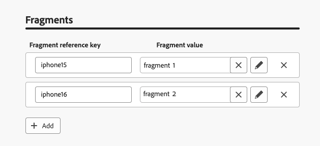{width=70%}

完成後，您可以使用下列其中一種方法：

>[!BEGINTABS]

>[!TAB 直接插入代碼]

只要將下方的程式碼區塊複製並貼到決定原則程式碼中即可。 以片段ID取代`variable`，並以片段參考索引鍵取代`placement`：

```

{{fragment id = variable}}
```

>[!TAB 遵循詳細步驟]

1. 導覽至&#x200B;**[!UICONTROL 協助程式函式]**，並將&#x200B;**Let**&#x200B;函式` {{variable}}`新增至程式碼窗格，您可以在其中宣告片段的變數。

   

1. 使用&#x200B;**Map** > **Get**&#x200B;函式``來建置您的運算式。 對應是決策專案中參考的片段，而字串可以是您在決策專案中輸入的裝置模型，做為&#x200B;**[!UICONTROL 片段參考索引鍵]**。

   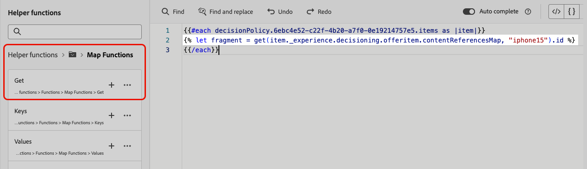

1. 您也可以使用包含此裝置型號ID的內容屬性。

   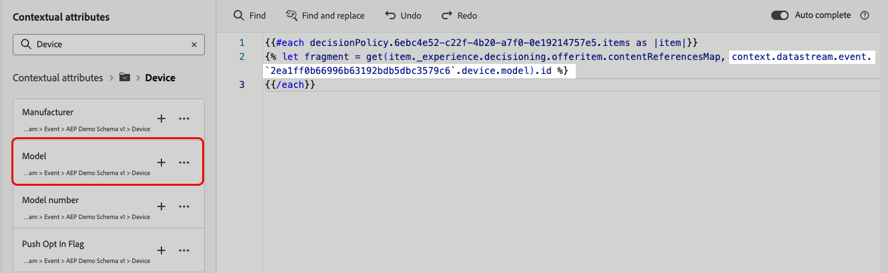

1. 新增您為片段選擇的變數作為片段ID。

   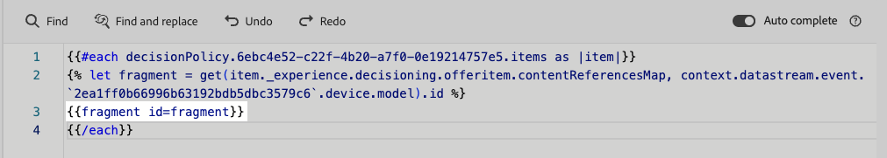

>[!ENDTABS]

將會從決定專案的&#x200B;**[!UICONTROL 片段]**&#x200B;區段中選取片段ID和參考索引鍵。

>[!WARNING]
>
>如果片段索引鍵不正確或片段內容無效，呈現將會失敗，而導致Edge呼叫中的錯誤。

#### 使用片段時的護欄 {#fragments-guardrails}

**決定專案與內容屬性**

[!DNL Journey Optimizer]片段預設不支援決定專案屬性和內容屬性。 不過，您可以改用全域變數，如下所述。

假設您要在片段中使用&#x200B;*sport*&#x200B;變數。

1. 在片段中參照此變數，例如：

   ```
   Elevate your practice with new {{sport}} gear!
   ```

1. 在決定原則區塊中使用&#x200B;**Let**&#x200B;函式定義變數。 在下列範例中，*sport*&#x200B;是以決定專案屬性定義：

   ```
   {#each decisionPolicy.13e1d23d-b8a7-4f71-a32e-d833c51361e0.items as |item|}}
   
   {{fragment id = get(item._experience.decisioning.offeritem.contentReferencesMap, "placement1").id }}
   {{/each}}
   ```

**決定專案片段內容驗證**

* 由於這些片段的動態性質，當用於行銷活動時，會針對決策專案中所參照的片段，略過行銷活動內容建立期間的訊息驗證。

* 片段內容的驗證僅在片段建立和發佈期間進行。

* 至於JSON片段，無法確保JSON物件是否有效。 請確定運算式片段內容是有效的JSON，以便用於決定專案。

在執行階段，會驗證行銷活動內容（包括決策專案中的片段內容）。 萬一驗證失敗，行銷活動將不會呈現。

## 最後步驟 {#final-steps}

準備好您的內容後，請檢閱並發佈您的行銷活動或歷程：

* [發佈歷程](../building-journeys/publishing-the-journey.md)
* [檢閱啟動行銷活動](../campaigns/review-activate-campaign.md)
* [發佈並啟用程式碼型體驗](../code-based/publish-code-based.md)

針對程式碼型體驗，當您的開發人員發出API或SDK呼叫，擷取您頻道設定中定義之表面的內容時，變更就會套用至您的網頁或應用程式。

>[!NOTE]
>
>目前您無法在[程式碼型體驗](../code-based/create-code-based.md)促銷活動或歷程中使用決定，從使用者介面模擬內容。 [此區段](../code-based/code-based-decisioning-implementations.md)中有因應措施。

若要檢視決策的執行方式，您可以建立自訂[Customer Journey Analytics報告控制面板](cja-reporting.md)。
