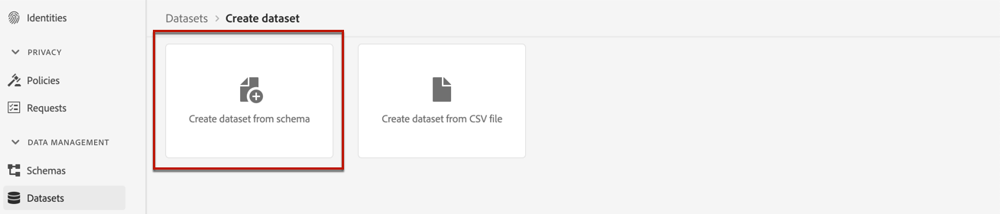

# 建立資料集以收集事件 {#create-dataset}

若要收集體驗事件，您必須先建立要傳送這些事件的資料集。

首先，請建立要在資料集中使用的結構描述：

1. 從&#x200B;**[!UICONTROL 資料管理]**&#x200B;功能表中，選取&#x200B;**[!UICONTROL 結構描述]**。

1. 按一下&#x200B;**[!UICONTROL 建立結構描述]**，在右上角選取&#x200B;**[!UICONTROL 體驗事件]**，然後按一下&#x200B;**下一步**。

   

   >[!NOTE]
   >
   >在[XDM系統總覽檔案](https://experienceleague.adobe.com/docs/experience-platform/xdm/home.html?lang=zh-Hant){target="_blank"}中進一步瞭解XDM結構描述和欄位群組。

1. 輸入結構描述的名稱和描述，然後按一下&#x200B;**完成**。
   

1. 從左側的&#x200B;**[!UICONTROL 欄位群組]**&#x200B;區段中，選取&#x200B;**[!UICONTROL 新增]**。

   

1. 在&#x200B;**[!UICONTROL 搜尋]**&#x200B;欄位中，輸入「主張互動」。

1. 選取&#x200B;**[!UICONTROL 體驗事件 — 主張互動]**&#x200B;欄位群組，然後按一下&#x200B;**[!UICONTROL 新增欄位群組]**。

   

   >[!CAUTION]
   >
   >將在您的資料集中使用的結構描述必須有關聯的&#x200B;**[!UICONTROL 體驗事件 — 主張互動]**&#x200B;欄位群組。 否則，您將無法在AI模型中使用它。

1. 儲存結構。

>[!NOTE]
>
>深入瞭解如何在[結構描述組合基本概念](https://experienceleague.adobe.com/docs/experience-platform/xdm/schema/composition.html?lang=zh-Hant#understanding-schemas){target="_blank"}中建置結構描述。

您現在已準備好使用此結構描述建立資料集。 請依照下列步驟執行此操作：

1. 從&#x200B;**[!UICONTROL 資料管理]**&#x200B;功能表，選取&#x200B;**[!UICONTROL 資料集]**，並移至&#x200B;**[!UICONTROL 瀏覽]**&#x200B;標籤。

1. 按一下&#x200B;**[!UICONTROL 建立資料集]**，然後選取&#x200B;**[!UICONTROL 從結構描述建立資料集]**。

   

1. 從清單中選取您剛建立的結構描述，然後按一下&#x200B;**[!UICONTROL 下一步]**。

1. 在&#x200B;**[!UICONTROL 名稱]**&#x200B;欄位中為資料集提供唯一的名稱，然後按一下&#x200B;**[!UICONTROL 完成]**。

   

>[!NOTE]
>
>建立[AI模型](../ranking/create-ai-models.md)時，現在可以選取此資料集來收集事件資料。
