# 透過內容實驗在程式碼型體驗中使用決策 {#experience-decisioning-uc}

此使用案例提供將Decisioning與[!DNL Journey Optimizer]程式碼型管道搭配使用所需的所有步驟。

>[!NOTE]
>
>程式碼型體驗管道不支援舊版決定管理功能。

在此範例中，您不確定特定排名公式的效能是否優於預先指派的優惠方案優先順序。 若要測量哪個對象對您的目標對象執行得最好，您可以使用[內容實驗](../content-management/content-experiment.md)來建立行銷活動，其中您可定義兩個傳遞處理方式：

* 第一個處理使用&#x200B;**優先順序**&#x200B;作為排名方法。
* 第二個處理使用&#x200B;**公式**&#x200B;作為排名方法。

>[!NOTE]
>
>如需在程式碼型體驗中使用決策時有關測試和重複資料刪除的實作詳細資料，請參閱[此頁面](../code-based/code-based-decisioning-implementations.md)。

## 建立選擇策略

首先，您需要建立兩個選取策略：一個使用優先順序作為排名方法，另一個使用公式作為排名方法。

>[!NOTE]
>
>您也可以建立單一決定專案，而無需執行選取策略。 將套用為每個專案設定的優先順序。

### 使用優先順序建立策略

若要建置優先順序為排名方法的第一個選取策略，請遵循下列步驟。

1. 建立決定專案。 [了解作法](items.md)

1. 將決策專案的&#x200B;**[!UICONTROL 優先順序]**&#x200B;設定為與其他專案比較。 如果設定檔符合多個專案的資格，則較高的優先順序會授予專案優先於其他專案的優先順序。

   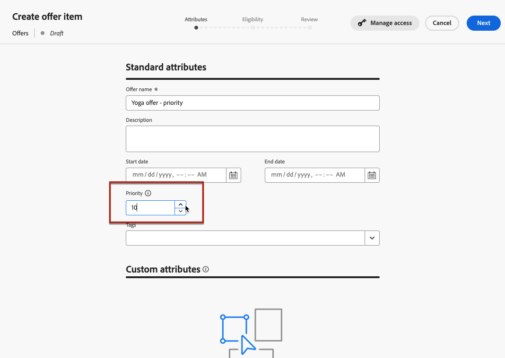{width="90%"}

   >[!NOTE]
   >
   >優先順序是整數資料型別。 整數資料型別的所有屬性都應包含整數值（無小數）。

1. 設定決定專案的資格：

   * 定義對象或規則，將專案限製為僅限特定設定檔。 [了解更多](items.md#eligibility)

   * 設定上限規則以定義可顯示優惠方案的最大次數。 [了解更多](items.md#capping)

1. 如有需要，請重複上述步驟以建立其他決定專案。

1. 建立包含決策專案的&#x200B;**集合**。 [了解更多](collections.md)

1. 建立[選取策略](selection-strategies.md#create-selection-strategy)，並選取包含要考慮之選件的[集合](collections.md)。

1. [選擇排名方法](#select-ranking-method)，用來為每個設定檔選取最佳優惠方案。 在此情況下，請選取&#x200B;**[!UICONTROL 優惠方案優先順序]**：如果多個優惠方案符合此策略的資格，決定引擎會在優惠方案中使用設定為&#x200B;**[!UICONTROL 優先順序]**&#x200B;的值。 [了解更多](selection-strategies.md#offer-priority)

   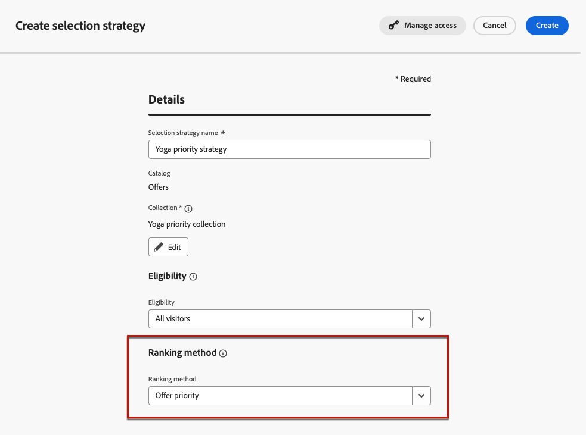{width="90%"}

### 使用公式建立另一個策略

若要建立第二個選取策略，並選取公式作為排名方法，請遵循下列步驟。

1. 建立決定專案。 [了解作法](items.md)

   <!--Do you need to set the same **[!UICONTROL Priority]** as for the first decision item, or it won't be considered at all?-->

1. 設定決定專案的資格：

   * 定義對象或規則，將專案限製為僅限特定設定檔。 [了解更多](items.md#eligibility)

   * 設定上限規則以定義可顯示優惠方案的最大次數。 [了解更多](items.md#capping)

1. 如有需要，請重複上述步驟以建立其他決定專案。

1. 建立包含決策專案的&#x200B;**集合**。 [了解更多](collections.md)

1. 建立[選取策略](selection-strategies.md#create-selection-strategy)，並選取包含要考慮之選件的[集合](collections.md)。

1. [選擇您要用來為每個設定檔選取最佳優惠方案的排名方法](#select-ranking-method)。 在此情況下，請選取&#x200B;**[!UICONTROL 公式]**&#x200B;以使用特定的計算分數來決定要傳遞的合格優惠方案。 [了解更多](selection-strategies.md#ranking-formula)

   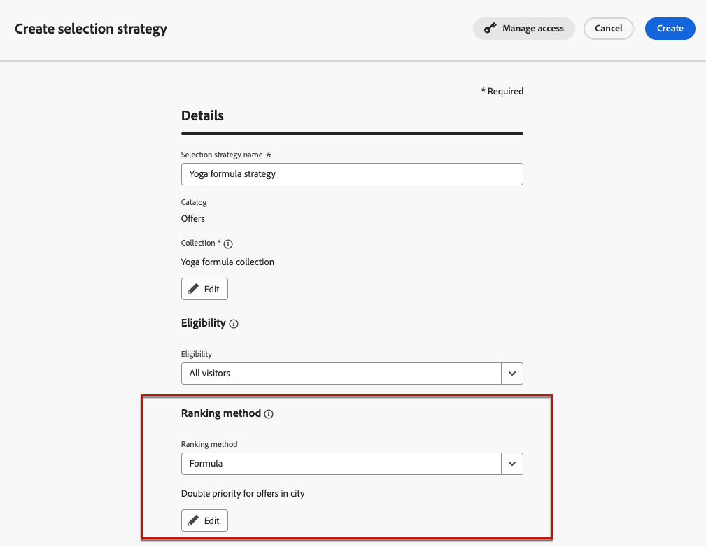{width="90%"}

## 建立程式碼型體驗行銷活動

<!--To present the best dynamic offer and experience to your visitors on your website or mobile app, add a decision policy to a code-based campaign.

Define two delivery treatments each containing a different decision policy.-->

設定兩個選取策略後，請建立程式碼型體驗行銷活動，針對每個策略定義不同的處理方式，以比較哪個策略的效能最佳。

1. 建立行銷活動，並選取&#x200B;**[!UICONTROL 程式碼型體驗]**&#x200B;動作。 [了解更多](../code-based/create-code-based.md)

1. 從行銷活動摘要頁面，按一下&#x200B;**[!UICONTROL 建立實驗]**&#x200B;以設定您的內容實驗。 [了解作法](../content-management/content-experiment.md)

   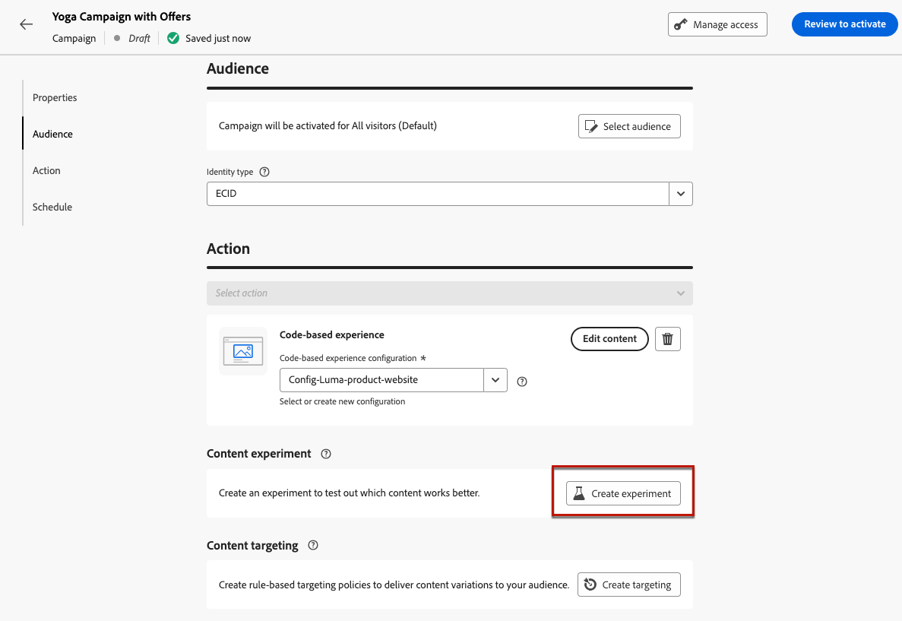{width="90%"}

1. 從行銷活動摘要頁面，選取程式碼型設定，然後按一下&#x200B;**[!UICONTROL 編輯內容]**。

   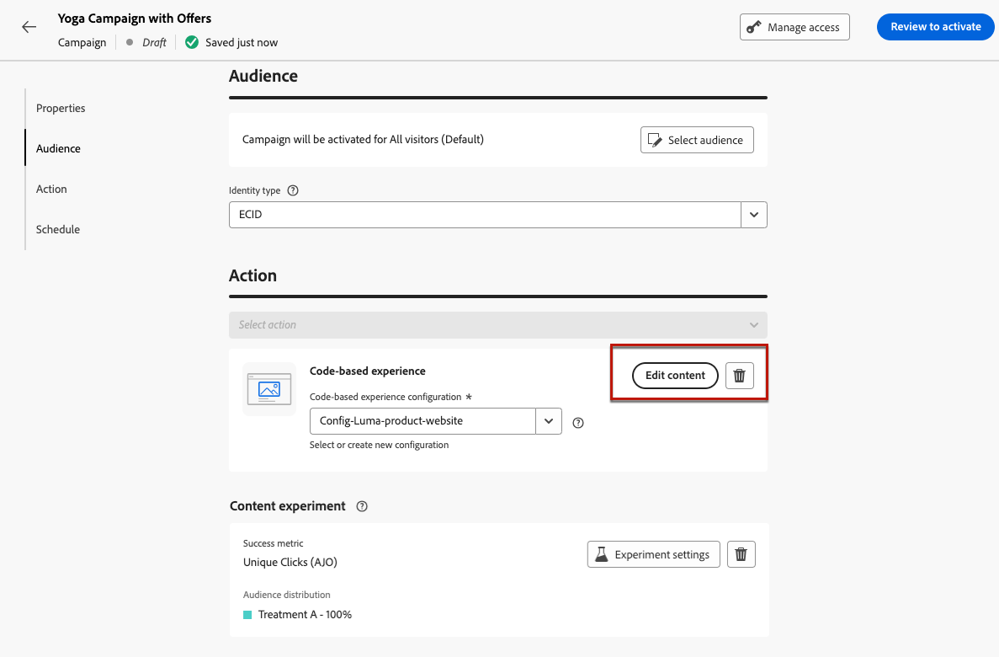{width="90%"}

1. 從內容版本視窗，若要開始個人化&#x200B;**處理A**，請按一下&#x200B;**[!UICONTROL 編輯代碼]**。

   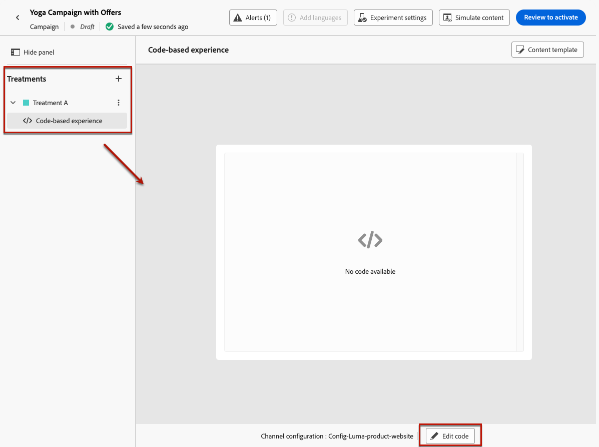{width="90%"}

1. 從[程式碼編輯器](../code-based/create-code-based.md#edit-code)，選取&#x200B;**[!UICONTROL 決定原則]**，按一下&#x200B;**[!UICONTROL 新增決定原則]**&#x200B;並填寫決定詳細資料。 [了解更多](create-decision.md#add)

   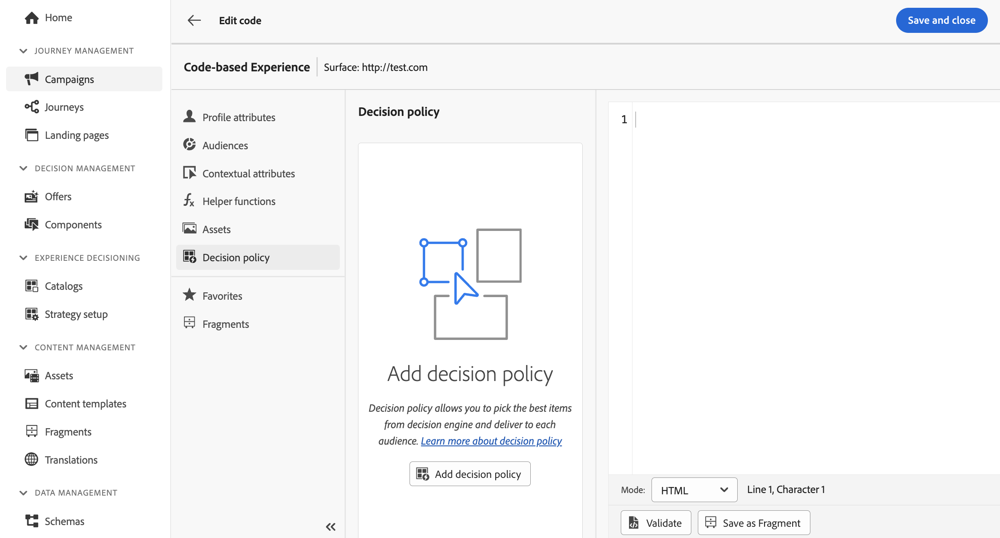{width="90%"}

1. 在&#x200B;**[!UICONTROL 策略順序]**&#x200B;區段中，按一下&#x200B;**[!UICONTROL 新增]**&#x200B;按鈕，然後選擇&#x200B;**[!UICONTROL 選取策略]**。 [了解更多](create-decision.md#select)

   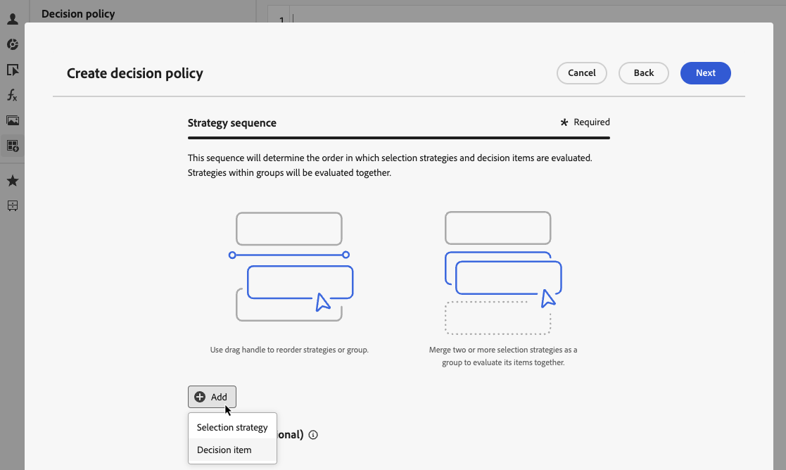{width="80%"}

   >[!NOTE]
   >
   >您也可以選取&#x200B;**[!UICONTROL 決定專案]**&#x200B;來新增單一專案，而不需執行選取策略。 將套用為每個專案設定的優先順序。

1. 選取您建立的第一個策略 — 具有優先順序的策略，作為排名方法。

   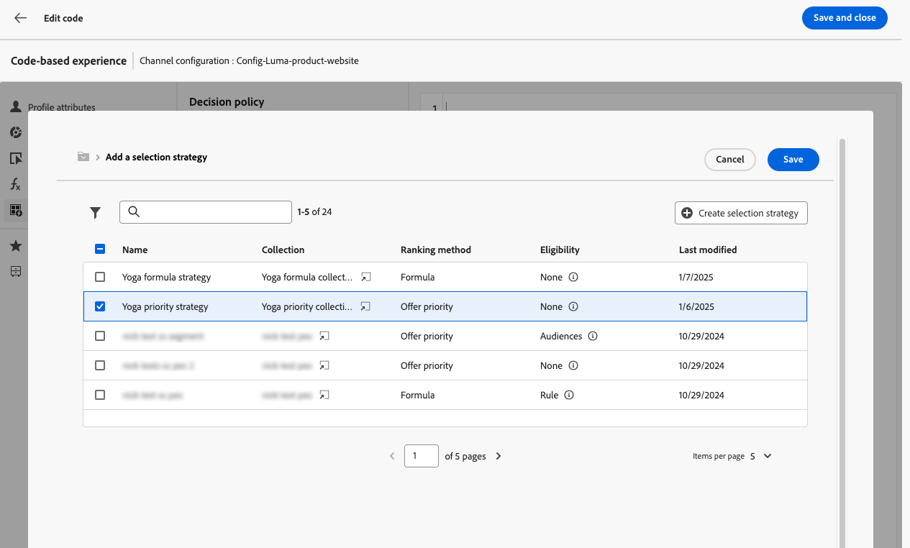{width="90%"}

1. 儲存您的變更，然後按一下[建立]。**&#x200B;** 新決定已新增至&#x200B;**[!UICONTROL 決定原則]**&#x200B;下。

1. 按一下&#x200B;**[!UICONTROL 插入原則]**&#x200B;按鈕。 已新增與決定原則對應的程式碼。 然後將您想要的所有屬性新增至程式碼，包括設定檔屬性。 [了解更多](create-decision.md#create-decision)

   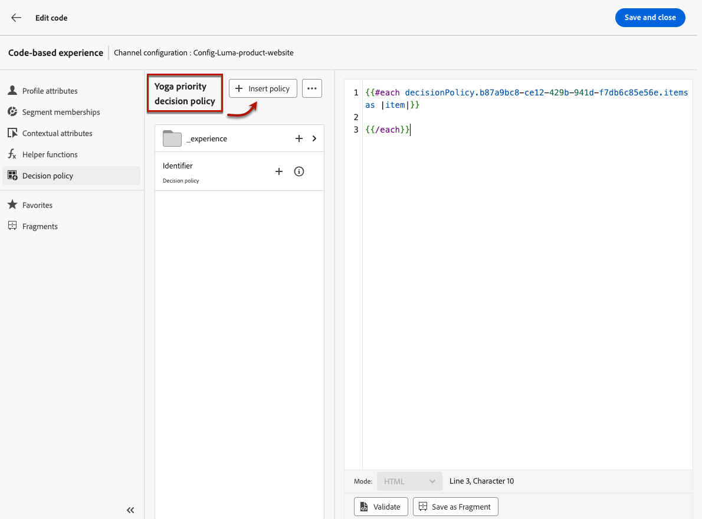{width="90%"}

1. 儲存您的變更。

1. 返回內容版本視窗，選取+按鈕以新增&#x200B;**處理B**，選取它並按一下&#x200B;**[!UICONTROL 編輯代碼]**。

   {width="90%"}

1. 重複上述步驟5和6以建立另一個決定原則，並選取您建立的第二個選取原則 — 使用公式作為排名方法的策略。<!--Do you need to create exactly the same content to compare only the ranking method?-->

   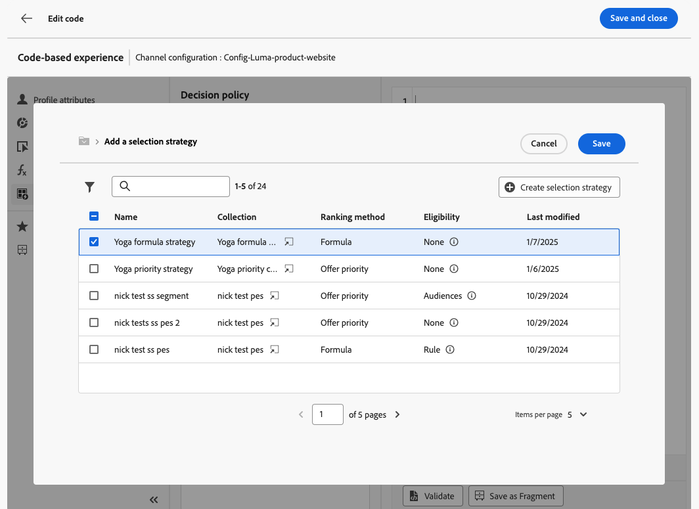{width="90%"}

1. 依需要編輯您的決定原則（請參閱上述步驟8和9）。

1. 儲存您的變更並[發佈您的程式碼型體驗行銷活動](../code-based/publish-code-based.md)。

執行實驗後，透過[實驗行銷活動報告](../reports/campaign-global-report-cja-experimentation.md)追蹤行銷活動處理的成效。<!-- and [report on decisioning](cja-reporting.md).-->您就可以解譯實驗的結果。 [了解作法](../content-management/get-started-experiment.md#interpret-results)

如果結果已有定論：

* 您可以將績效最佳的排名推送給所有客戶。
* 或者，您也可以使用選取策略來建立新的行銷活動，並複製表現最佳的排名方法。