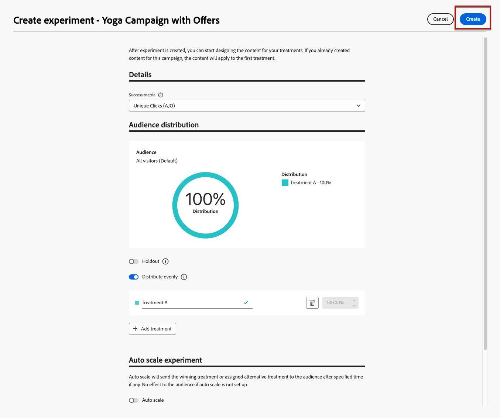

# Decisioning 使用案例 {#experience-decisioning-uc}

此使用案例提供將Decisioning與[!DNL Journey Optimizer]程式碼型管道搭配使用所需的所有步驟。

<!--In this use case, you create a campaign where you define two delivery treatments - each containing a different decision policy in order to measure which one performs best for your target audience.-->

在此使用案例中，您不確定特定排名公式的效能是否優於預先指派的優惠優先順序。

若要測量哪個對象對您的目標對象執行得最好，請使用[內容實驗](../content-management/content-experiment.md)建立行銷活動，您可在此定義兩個傳遞處理：

<!--Set up the experiment such that:-->

* 第一個處理包含一個選擇策略，優先順序作為排名方法。
* 第二個處理包含不同的選取策略，其排名方法為公式。

## 建立選擇策略

首先，您需要建立兩個選取策略：一個使用優先順序作為排名方法，另一個使用公式作為排名方法。

### 建立第一個選取策略

在第一個選取策略中，選取優先順序作為排名方法。 請遵循下列步驟。

1. 建立決定專案。 [了解作法](items.md)

1. 將決策專案的&#x200B;**[!UICONTROL 優先順序]**&#x200B;設定為與其他專案比較。 如果設定檔符合多個專案的資格，則較高的優先順序會授予專案優先於其他專案的優先順序。

   

   >[!NOTE]
   >
   >優先順序是整數資料型別。 整數資料型別的所有屬性都應包含整數值（無小數）。

1. 設定決定專案的資格：

   * 定義對象或規則，將專案限製為僅限特定設定檔。 [了解更多](items.md#eligibility)

   * 設定上限規則以定義可顯示優惠方案的最大次數。 [了解更多](items.md#capping)

1. 如有需要，請重複上述步驟以建立其他決定專案。

1. 建立包含決策專案的&#x200B;**集合**。 [了解更多](collections.md)

1. 建立[選取策略](selection-strategies.md#create-selection-strategy)，並選取包含要考慮之選件的[集合](collections.md)。

1. [選擇排名方法](#select-ranking-method)，用來為每個設定檔選取最佳優惠方案。

   在此情況下，請選取&#x200B;**[!UICONTROL 優惠方案優先順序]**：如果多個優惠方案符合此策略的資格，決定引擎會在優惠方案中使用設定為&#x200B;**[!UICONTROL 優先順序]**&#x200B;的值。 [了解更多](selection-strategies.md#offer-priority)

   

### 建立第二個選取策略

在第二個選取策略中，選取公式作為排名方法。 請遵循下列步驟。

1. 建立決定專案。 [了解作法](items.md)

<!--1. Set the same **[!UICONTROL Priority]** as for the first decision item. TBC?-->

1. 設定決定專案的資格：

   * 定義對象或規則，將專案限製為僅限特定設定檔。 [了解更多](items.md#eligibility)

   * 設定上限規則以定義可顯示優惠方案的最大次數。 [了解更多](items.md#capping)

1. 如有需要，請重複上述步驟以建立其他決定專案。

1. 建立包含決策專案的&#x200B;**集合**。 [了解更多](collections.md)

1. 建立[選取策略](selection-strategies.md#create-selection-strategy)，並選取包含要考慮之選件的[集合](collections.md)。

1. [選擇您要用來為每個設定檔選取最佳優惠方案的排名方法](#select-ranking-method)。

   在此情況下，請選取&#x200B;**[!UICONTROL 公式]**，以使用特定計算分數來選擇要傳遞的合格優惠。 [了解更多](selection-strategies.md#ranking-formula)

   

## 建立程式碼型體驗行銷活動

<!--To present the best dynamic offer and experience to your visitors on your website or mobile app, add a decision policy to a code-based campaign.

Define two delivery treatments each containing a different decision policy.-->

設定兩個選取策略後，請建立程式碼型體驗行銷活動，針對每個策略定義不同的處理方式，以比較哪個策略的效能最佳。

1. 建立行銷活動，並選取&#x200B;**[!UICONTROL 程式碼型體驗]**&#x200B;動作。 [了解更多](../code-based/create-code-based.md)

1. 從行銷活動摘要頁面，按一下&#x200B;**[!UICONTROL 建立實驗]**&#x200B;以開始設定您的內容實驗。 [了解更多](../content-management/content-experiment.md)

   

1. 按一下&#x200B;**[!UICONTROL 編輯內容]**。

<!--1. Sart personalizing **Treatment A** by clicking **[!UICONTROL Create]**.

    -->

1. 在內容版本視窗中，按一下&#x200B;**[!UICONTROL 編輯代碼]**，開始個人化&#x200B;**處理A**。

   

1. 選取&#x200B;**[!UICONTROL 決定原則]**，按一下&#x200B;**[!UICONTROL 新增決定原則]**&#x200B;並填寫決定詳細資料。 [了解更多](create-decision.md)

   

1. 選取您建立的第一個策略。 按一下&#x200B;**[!UICONTROL 新增策略]**。

1. 按一下 **[!UICONTROL 建立]**。新決定已新增至&#x200B;**[!UICONTROL 決定]**&#x200B;下。

   

1. 按一下「更多動作」圖示（三個點）並選取「**[!UICONTROL 新增]**」。 現在，您可以在此新增所有需要的決定屬性。

   

1. 您也可以新增個人化編輯器中可用的任何其他屬性，例如設定檔屬性。

   

1. 從內容版本視窗中，選取&#x200B;**處理B**，然後重複上述步驟以建立另一個決定原則，並選取您建立的第二個選擇原則。

   

1. 儲存您的內容。
