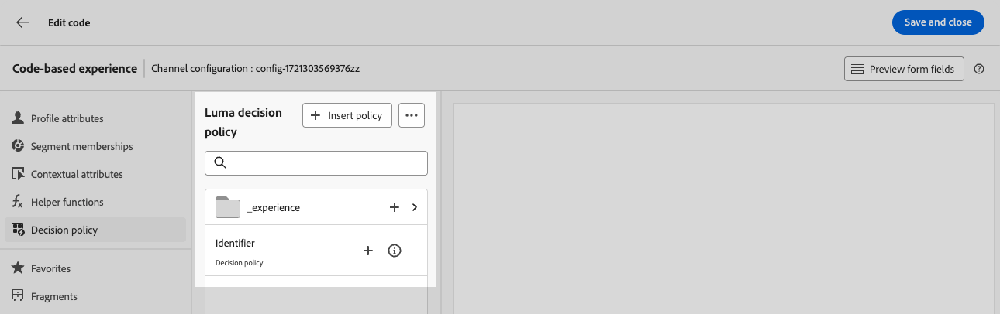

# Decisioning 使用案例 {#experience-decisioning-uc}

您不確定特定排名公式的效能是否優於預先指派的優惠優先順序。

在此使用案例中，您會建立行銷活動，在此定義兩個傳送處理 — 每個都包含不同的決定原則，以衡量哪個原則最適合您的目標對象。

設定實驗，讓：

* 第一個處理包含一個選擇策略，優先順序作為排名方法。
* 第二個處理包含不同的選取策略，其排名方法為公式。

## 建立決定專案和選取策略

您首先需要建立專案、在集合中將它們分組、設定規則和排名方法。 這些元素可讓您建置選取策略。

1. 導覽至&#x200B;**[!UICONTROL 決策]** > **[!UICONTROL 目錄]**&#x200B;並建立數個決策專案。 使用對象或規則設定限制，將每個專案限製為僅限特定設定檔。 [了解更多](items.md)

   <!--
   1. From the items list, click the **[!UICONTROL Edit schema]** button  and edit the custom attributes if needed. [Learn how to work with catalogs](catalogs.md)-->

1. 建立&#x200B;**集合**&#x200B;以根據您的偏好設定將您的決定專案分類並分組。 [了解更多](collections.md)

1. 建立&#x200B;**決定規則**，以決定可向誰顯示決定專案。 [了解更多](rules.md)

1. 建立&#x200B;**排名方法**，並在決定策略中套用這些方法，以決定選取決定專案的優先順序。 [了解更多](ranking.md)

1. 建置&#x200B;**選擇策略**，這些策略會運用集合、決定規則和排名方法來識別適合顯示給設定檔的決定專案。 [了解更多](selection-strategies.md)

## 建立決定原則

若要在您的網站或行動應用程式上向訪客呈現最佳動態優惠和體驗，請將決定原則新增至程式碼型行銷活動。

<!--Define two delivery treatments each containing a different decision policy.-->

1. 建立行銷活動，並選取&#x200B;**[!UICONTROL 程式碼型體驗]**&#x200B;動作。 [了解更多](../code-based/create-code-based.md)

1. 從&#x200B;**[!UICONTROL 編輯內容]**&#x200B;視窗，開始個人化處理A。

1. 選取&#x200B;**[!UICONTROL 決定]**&#x200B;圖示，按一下&#x200B;**[!UICONTROL 建立決定]**&#x200B;並填寫決定詳細資料。 [了解更多](create-decision.md)

   

1. 為您的決定定義選取策略。 按一下&#x200B;**[!UICONTROL 新增策略]**。

1. 按一下 **[!UICONTROL 建立]**。新決定已新增至&#x200B;**[!UICONTROL 決定]**&#x200B;下。

   

1. 按一下「更多動作」圖示（三個點）並選取「**[!UICONTROL 新增]**」。 現在，您可以在此新增所有需要的決定屬性。

   

1. 您也可以新增個人化編輯器中可用的任何其他屬性，例如設定檔屬性。

   

1. 從行銷活動摘要頁面，按一下&#x200B;**[!UICONTROL 建立實驗]**&#x200B;以開始設定您的內容實驗。 [了解更多](../content-management/content-experiment.md)

1. 從&#x200B;**[!UICONTROL 編輯內容]**&#x200B;視窗中，選取您的處理B以變更內容，並重複上述步驟以建立另一個決定。

1. 儲存您的內容。
