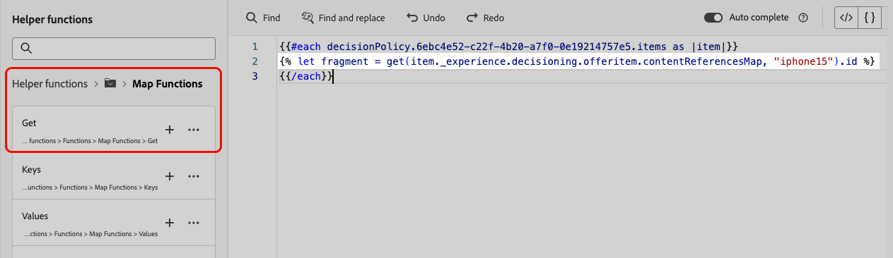

# 在決策原則中善用片段 {#fragments}

決策專案支援兩種型別的片段內容，在決策原則內編寫訊息時可運用這些內容：

* **Journey Optimizer內容片段** — 在Journey Optimizer中建立且可重複使用的運算式片段，並新增至決定專案的&#x200B;**[!UICONTROL 片段]**&#x200B;區段。 [進一步瞭解AJO內容片段](../content-management/fragments.md)
* **AEM內容片段** — 在Adobe Experience Manager中撰寫的內容、對應至決定專案的屬性，以及透過索引鍵名稱在個人化編輯器中選取的內容。 [瞭解如何將AEM內容片段連結至決定專案](items.md#aem-fragments)

## Journey Optimizer內容片段 {#ajo-fragments}

如果您的決策原則包含決策專案，包括AJO內容片段，您可以在決策原則內的所有可用決策管道（程式碼型體驗、電子郵件、推播、簡訊和歷程）中製作訊息時，利用這些片段。

例如，假設您想針對多種行動裝置型號顯示不同的內容。 將每個屬於不同電話型號的指定片段新增至您在決定原則中使用的決定專案。 [瞭解如何新增片段至決定專案](items.md#attributes)。

{width=70%}

完成後，您可以使用下列其中一種方法：

>[!BEGINTABS]

>[!TAB 直接插入代碼]

只要將下方的程式碼區塊複製並貼到決定原則程式碼中即可。 以片段ID取代`variable`，並以片段參考索引鍵取代`placement`：

```handlebars

{{fragment id = variable required=false}}
```

>[!TAB 遵循詳細步驟]

1. 導覽至&#x200B;**[!UICONTROL 協助程式函式]**，並將&#x200B;**Let**&#x200B;函式` {{variable}}`新增至程式碼窗格，您可以在其中宣告片段的變數。

   

1. 使用&#x200B;**Map** > **Get**&#x200B;函式``來建置您的運算式。 對應是決定專案中參照的片段。 字串可以是您在決定專案中輸入的裝置模型，做為&#x200B;**[!UICONTROL 片段參考索引鍵]**。

   

1. 您也可以使用包含此裝置型號ID的內容屬性。

   

1. 新增您為片段選擇的變數作為片段ID。

   

>[!ENDTABS]

將會從決定專案的&#x200B;**[!UICONTROL 片段]**&#x200B;區段中選取片段ID和參考索引鍵。

>[!WARNING]
>
>如果片段索引鍵不正確或片段內容無效，轉譯可能會失敗並在Edge呼叫中導致錯誤。
>
>為了避免片段暫時無法使用時失敗，請使用`required=false`標幟，以取代略過片段。 [進一步瞭解暫時無法使用的片段](#temporary-unavailable-fragments)

### 使用情況和護欄 {#fragments-guardrails}

以下護欄特別適用於決策專案中使用的&#x200B;**AJO內容片段**。

+++類比電子郵件中的內容和運算式片段

對於&#x200B;**電子郵件**&#x200B;頻道，當您&#x200B;**[!UICONTROL 傳送校樣]**&#x200B;或促銷活動啟動時，與決定專案相關聯的運算式片段會正確顯示。 但是，**[!UICONTROL 模擬內容]**&#x200B;不會顯示決定專案中的運算式片段。

+++

+++電子郵件中的視覺片段和決定專案

您無法將&#x200B;**[!UICONTROL 視覺化片段]**&#x200B;指派給決定專案，此內容中僅支援&#x200B;**運算式片段**。

+++

+++決定專案與內容屬性

[!DNL Journey Optimizer]片段預設不支援決定專案屬性和內容屬性。 不過，您可以改用全域變數，如下所述。

假設您要在片段中使用&#x200B;*sport*&#x200B;變數。

1. 在片段中參照此變數，例如：

   ```text
   Elevate your practice with new {{sport}} gear!
   ```

1. 在決定原則區塊中使用&#x200B;**Let**&#x200B;函式定義變數。 在下列範例中，*sport*&#x200B;是以決定專案屬性定義：

   ```handlebars
   {#each decisionPolicy.13e1d23d-b8a7-4f71-a32e-d833c51361e0.items as |item|}}
   
   {{fragment id = get(item._experience.decisioning.offeritem.contentReferencesMap, "placement1").id }}
   {{/each}}
   ```

+++

+++決定專案片段內容驗證

* 由於這些片段的動態性質，當用於行銷活動時，會針對決策專案中所參考的片段略過行銷活動內容建立期間的訊息驗證。

* 片段內容的驗證僅在片段建立和發佈期間進行。

* 對於JSON型別運算式片段，在儲存片段時會語法驗證內容。 驗證錯誤會顯示為警示。

在執行階段，會驗證行銷活動內容（包括決策專案中的片段內容）。 萬一驗證失敗，行銷活動將不會呈現。

+++

+++暫時無法使用的片段已略過{#temporary-unavailable-fragments}

當歷程或行銷活動參考附加到決策專案的片段時，可能會有短暫的同步延遲，更新的片段才能在Edge上使用。

為避免片段暫時不可用時失敗，片段現在會將`required`標幟預設為`false`，以便略過這些標幟，而非導致歷程或行銷活動失敗。

這表示如果片段在Edge上暫時無法使用，則會忽略該片段。 如果片段可用，則會正常轉譯。

**範例**

如果您的決策原則符合兩個優惠方案的資格，且每個方案都有片段 — 例如「20%優惠」和「30%優惠」 — 而第二個片段暫時無法使用，因為`required=false`系統會呈現可用的優惠方案（20%優惠）並略過另一個片段（30%優惠），而不是讓歷程或行銷活動失敗。 如此可改善內容仍在同步處理時的可靠性。

+++

>[!NOTE]
>
>您仍然可以將`required`標幟設定為`true`，將片段標示為必要。 但是，如果片段暫時遺失，可能會導致歷程或行銷活動轉譯失敗。

## AEM內容片段 {#aem-fragments-decisioning}

>[!AVAILABILITY]
>
>此功能在具有Decisioning支援的輸出管道的「有限可用性」中可用。 如欲請求存取權，請和您的 Adobe 代表聯絡。

在決定原則中運用AEM內容片段之前，請確定您具備：

* 已在Adobe Experience Manager中建立您的內容片段，並以`ajo-enabled:{OrgId}/{SandboxName}`標籤，以便可供Journey Optimizer探索。 [瞭解如何建立和指派標籤](../integrations/aem-fragments.md#create-tag)
* 透過指派唯一的參考名稱，將片段繫結至選件專案的&#x200B;**[!UICONTROL AEM片段]**&#x200B;區段。 [瞭解如何將AEM內容片段連結至決定專案](items.md#attributes)

在個人化編輯器中，與原則選取的決策專案相關聯的所有AEM內容片段都可供使用。 每個片段索引鍵名稱都會顯示一個資料夾。

在此範例中，決定原則包含兩個決定專案，這些決定專案有AEM片段透過其參考名稱繫結至它們。


1. 按一下+按鈕，將所需的片段新增至運算式中。

   由於單一參考名稱可能具有多個跨不同優惠方案專案繫結至它的片段，Decisioning會根據決定原則的排名條件決定要提供給每個客戶的最佳片段。

1. 選取片段後，您可以利用其屬性（例如影像URL、文字欄位或其他內容），並使用「決策」在適當的時間將適當的內容呈現給適當的客戶。

   

1. 在啟用行銷活動或歷程之前，您可以使用&#x200B;**[!UICONTROL 模擬內容]**&#x200B;來預覽AEM內容片段欄位值將如何針對特定測試設定檔呈現。 [進一步瞭解模擬內容](../content-management/preview-test.md)
