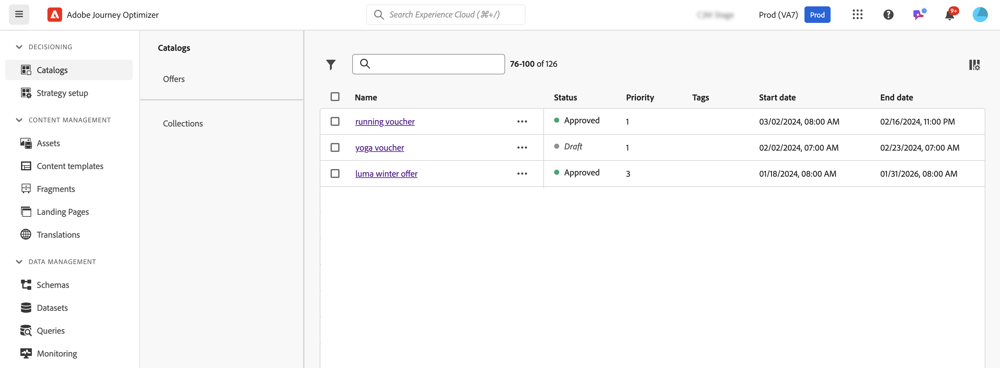
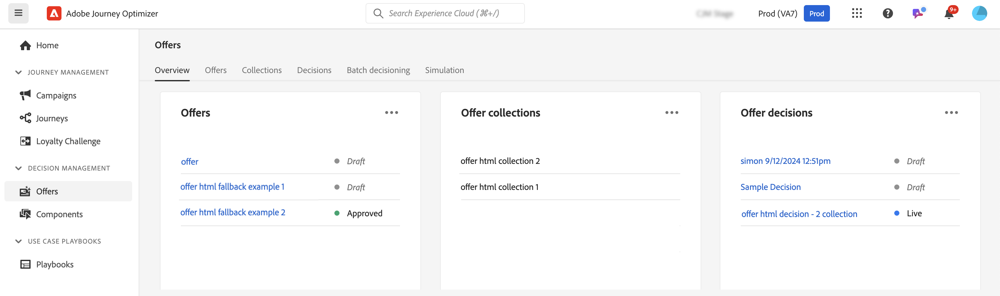

# 開始使用[!DNL Journey Optimizer]中的決定功能 {#gs-decision}

[!DNL Journey Optimizer]中的決策功能可讓您在正確的時間為所有接觸點的客戶提供最佳優惠和個人化體驗。 這些功能透過集中行銷產品建議目錄和進階決策引擎簡化個人化，該引擎使用規則和排名條件為每個人提供最相關的內容。

主要優點：

* 透過跨多管道提供個人化產品建議，改善行銷活動績效；
* 改善工作流程：行銷團隊可以建立單一傳遞，並在範本的不同部分提供不同產品建議，藉此改善工作流程，而無須建立多個傳遞或行銷活動；
* 控制在電子郵件行銷活動中和向客戶顯示產品建議的次數。

目前，[!DNL Journey Optimizer]提供下列兩個核心解決方案。

## 決策 {#decisioning}

我們新一代的決策架構，專門整合現有的Journey Optimizer工作流程，為管理其他內容目錄奠定基礎。 決策選件：

* 結構描述型專案目錄管理：將自訂中繼資料與每個優惠方案建立關聯，以提高彈性
* 彈性的收集規則：根據各種條件輕鬆將優惠方案分組，以供日後評估
* 更新決定原則和選擇策略設定：允許決定元件重複使用
* 實驗功能：針對其他內容元件測試決策邏輯以測量效能

**程式碼型體驗**、**推播通知**&#x200B;和&#x200B;**簡訊**&#x200B;管道的所有客戶都可以使用決策。 **電子郵件**&#x200B;管道的決策功能在「有限可用性」中提供。 若要請求存取電子郵件決策，請聯絡您的Adobe代表。 深入瞭解[可用性標籤](../rn/releases.md#availability-labels)。

➡️ [開始使用決策](../experience-decisioning/gs-experience-decisioning.md)

>[!NOTE]
>
>若要從決定管理移轉至決策，請參閱[移轉檔案](../experience-decisioning/migrate-to-decisioning.md)與[移轉API指南](../experience-decisioning/decisioning-migration-api.md)。

## 決策管理 {#decision-management}

我們在Journey Optimizer中建立的功能決定管理使用中央行銷優惠資料庫和決定引擎，該引擎將規則和限制套用至即時客戶設定檔，並利用Adobe Experience Platform資料在適當的時間提供適當的優惠。

決策管理支援以下通道：電子郵件、應用程式內傳訊、推播通知、簡訊和直接郵件。

➡️ [開始使用決定管理](../offers/get-started/starting-offer-decisioning.md)
