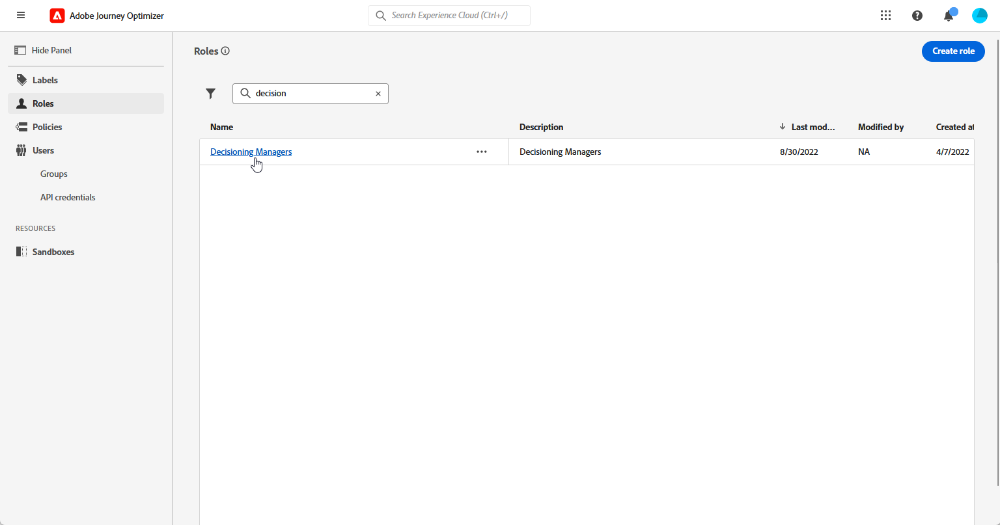
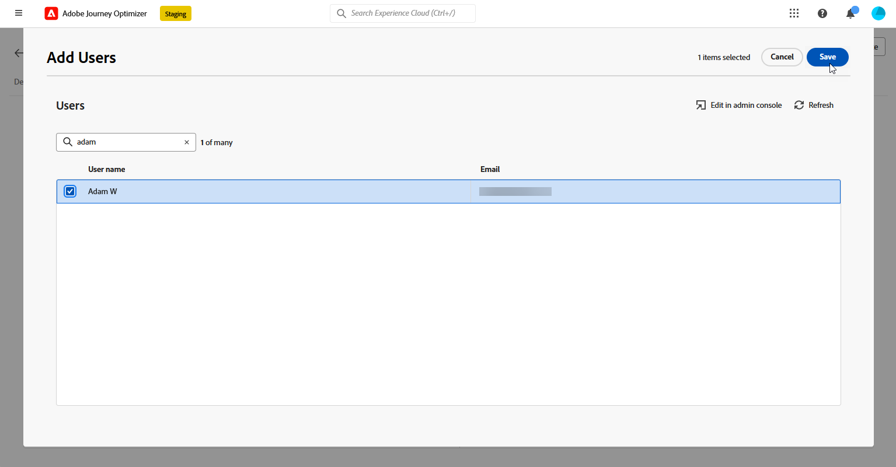

# 開始使用決策 {#get-started-experience-decisioning}

>[!CONTEXTUALHELP]
>id="ajo_email_enable_experience_decisioning"
>title="什麼是決策?"
>abstract="決策是決策管理以外的新工具，從決定引擎中挑選出最好的項目並傳送給每個個體。要使用決策必須額外進行設定。"

## 什麼是決策 {#about}

Decisioning 會透過提供集中行銷產品建議目錄，又稱為「決策項目」，還有複雜的決策引擎，設法簡化個人化。 此引擎運用規則與排名標準來選取並呈現最相關的決定項目給每個人。

這些決定專案會透過[新的程式碼型體驗管道](../code-based/get-started-code-based.md) (可在Journey Optimizer促銷活動中存取)，順暢地整合至廣泛的傳入介面。

>[!IMPORTANT]
>
>決策決策政策僅適用於程式碼型體驗行銷活動。

➡️在[本節](experience-decisioning-uc.md)中呈現了一個端對端使用案例，說明如何透過程式碼型體驗管道建立決定並用於內容實驗。

## 決策關鍵步驟 {#steps}

使用決策的主要步驟如下：

1. **指派適當的許可權**。 決策僅適用於具有決策相關&#x200B;**[!UICONTROL 角色]**&#x200B;存取權的使用者，例如決策管理員。 如果您無法存取決策，則必須擴充您的許可權。

   +++瞭解如何指派決策管理員角色

   1. 若要在[!DNL Permissions]產品中將角色指派給使用者，請瀏覽至&#x200B;**[!UICONTROL 角色]**&#x200B;標籤，並選取決策管理員。

      

   1. 在&#x200B;**[!UICONTROL 使用者]**&#x200B;標籤中，按一下&#x200B;**[!UICONTROL 新增使用者]**。

      

   1. 輸入您的使用者名稱或電子郵件地址，或從清單中選擇使用者，然後按一下&#x200B;**[!UICONTROL 儲存]**。

      如果之前未建立使用者，請參閱[新增使用者文件](https://experienceleague.adobe.com/zh-hant/docs/experience-platform/access-control/ui/users)。

      

   接著，使用者應會收到一封電子郵件，並重新導向至您的執行個體。

   +++

1. **設定自訂屬性**：將自訂屬性設定到目錄的結構描述中，根據您的特定需求量身打造專案目錄。

   ➡️ [瞭解如何設定專案目錄](catalogs.md)

1. **建立決策專案**&#x200B;以向您的目標對象顯示。

   ➡️ [瞭解如何在使用者介面（以及](items.md)API檔案[）中建立決定專案](api-reference/decisions-items/create.md)

1. **使用集合組織**：使用集合根據屬性型規則將決定專案分類。 將集合併入您的選擇策略，以決定應考慮的決定專案集合。

   ➡️ [瞭解如何在使用者介面（以及](collections.md)API檔案[）中管理專案集合](api-reference/items-collections/create.md)

1. **建立決定規則**：決定專案和/或選擇策略中會使用決定規則來決定決定可以向誰顯示決定專案。

   ➡️ [瞭解如何建立決定規則](rules.md)

1. **實作排名方法**：建立排名方法，並在選取策略中套用這些方法，以決定選取決定專案的優先順序。

   ➡️ [瞭解如何建立排名方法](ranking/ranking.md)

1. **建立選擇策略**：建置使用集合、決定規則和排名方法的選擇策略，以識別適合顯示給設定檔的決定專案。

   ➡️ [瞭解如何在使用者介面的使用者介面中建立選擇策略](selection-strategies.md) （以及在[API檔案](api-reference/selection-strategies/create.md)中）

1. **建立決定原則並將其內嵌至您的程式碼型行銷活動**：決定原則會結合多個選取策略，以決定要顯示給目標對象的合格決定專案。

   ➡️ [瞭解如何使用決定原則](create-decision.md)
➡️若要透過程式碼型體驗通道成功傳遞優惠方案，請依照[本節](../code-based/code-based-implementation-samples.md)中的實作步驟操作。

