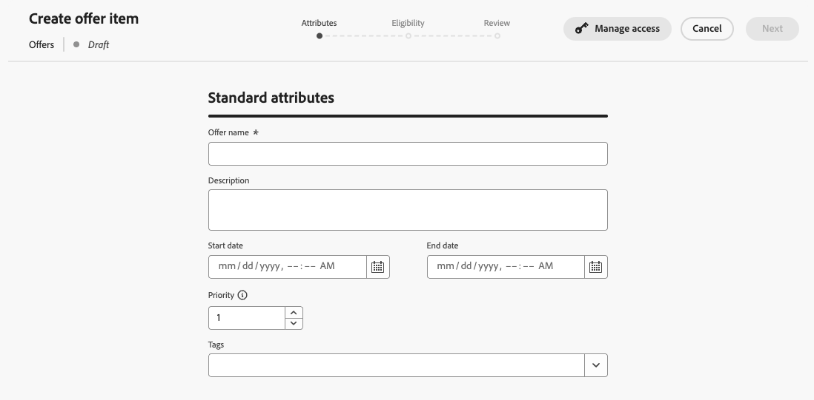
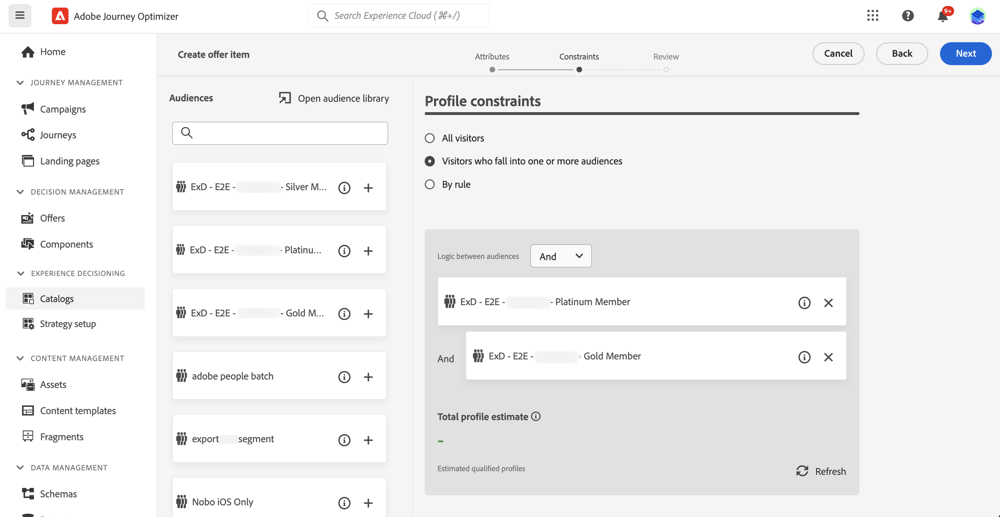
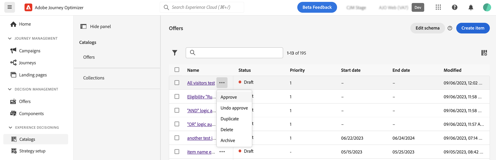

# 決定專案 {#items}

>[!BEGINSHADEBOX]

本文件指南會提供以下內容：

* [開始使用 Experience Decisioning](gs-experience-decisioning.md)
* 管理決定項目
   * [設定項目目錄](catalogs.md)
   * **[建立決定項目](items.md)**
   * [管理項目集合](collections.md)
* 設定項目的選取範圍
   * [建立決定規則](rules.md)
   * [建立排名方法](ranking.md)
* [建立選擇策略](selection-strategies.md)
* [建立決定原則](create-decision.md)

>[!ENDSHADEBOX]

Journey Optimizer可讓您建立行銷優惠方案（稱為決定專案），您可以建立這些優惠方案並將其組織成集中式目錄和集合。 這些範本由標準和自訂屬性組成，旨在精確符合您的需求。 此外，它們納入設定檔限制，可讓您定義決策專案可顯示給誰。

在建立決定專案之前，請確定您已建立 **決定規則** 如果要設定條件以決定要向誰顯示決策專案。 [瞭解如何建立決定規則](rules.md).

## 建立您的第一個決定專案

若要建立決定專案，請遵循下列步驟：

1. 瀏覽至 **[!UICONTROL 體驗決策]** > **[!UICONTROL 專案]**.

1. 定義決定專案的標準屬性：

   1. 提供名稱和說明。
   1. 指定開始和結束日期。 在此日期內，決策引擎僅會考慮該專案。
   1. 設定 **[!UICONTROL 優先順序]** 與其他專案比較，如果設定檔符合多個專案的資格。 較高的優先順序會授予專案優先於其他專案的優先順序。

   

1. 自訂屬性是根據您的需求量身打造的特定屬性，可指派給決策專案。 它們會在決定專案的目錄結構描述中定義。 [瞭解如何使用目錄](catalogs.md)

1. 定義決定專案的屬性後，按一下 **[!UICONTROL 下一個]** 以設定料號的設定檔限制。

   依預設，所有設定檔都符合接收決定專案的資格，但您可以使用對象或規則將專案限製為僅特定設定檔，這兩個解決方案都對應不同的使用方式。 展開下列區段以取得詳細資訊：

   +++使用對象與決定規則

   基本上，對象的輸出是設定檔清單，而決定規則是在決策流程期間根據單一設定檔執行的函式。

   * **受眾**：一方面，受眾是一組Adobe Experience Platform設定檔，根據設定檔屬性和體驗事件符合特定邏輯。 不過，Offer Management不會重新計算對象，在展示優惠方案時，該對象可能不是最新狀態。

   * **決定規則**：另一方面，決定規則會根據Adobe Experience Platform中的可用資料，並決定可向誰顯示優惠方案。 在優惠或指定位置的決定中選取後，每次做出決定時都會執行規則，以確保每個設定檔取得最新和最佳優惠。

+++

   

   * 若要將決策專案的呈現限制在一或多個Adobe Experience Platform對象的成員中，請選取 **[!UICONTROL 屬於一或多個對象的訪客]** 選項，然後從左窗格新增一或多個對象，並使用 **[!UICONTROL 與]** / **[!UICONTROL 或]** 邏輯運運算元。 [深入瞭解對象](../audience/about-audiences.md).

   * 若要將特定決定規則關聯至決定專案，請選取 **[!UICONTROL 依規則]**，然後將需要的規則從左窗格拖曳到中央區域。 [進一步了解決定規則](rules.md).

   當您選取對象或決定規則時，您可以看到有關預估合格設定檔的資訊。按一下 **[!UICONTROL 重新整理]** 以更新資料。

   >[!NOTE]
   >
   >當規則引數包含不在設定檔中的資料（例如內容資料）時，設定檔預估無法使用。 例如，適用性規則要求目前天氣為≥80度。

1. 定義決定專案的限制後，按一下 **[!UICONTROL 下一個]** 以檢閱並儲存專案。

1. 決定專案現在會出現在清單中，並顯示 **[!UICONTROL 草稿]** 狀態。 當它準備好要呈現給設定檔時，按一下省略符號按鈕並選擇 **[!UICONTROL 核准]**.

   

## 管理決定專案

從決定專案清單中，您可以編輯決定專案、變更其狀態(**草稿**， **已核准**， **已封存**)、複製或刪除它。

若要修改決定專案，請開啟它、進行修改並儲存。

選取決定專案或按一下省略符號按鈕會啟用以下所述的動作。

* **[!UICONTROL 核准]**：將決定專案的狀態設定為「已核准」。
* **[!UICONTROL 還原核准]**：將決定專案的狀態設回 **[!UICONTROL 草稿]**.
* **[!UICONTROL 複製]**：建立具有相同屬性和限制的決定專案。 依預設，新專案具有 **[!UICONTROL 草稿]** 狀態。
* **[!UICONTROL 刪除]**：從清單中移除決定專案。

  >[!IMPORTANT]
  >
  >刪除後，就無法再存取決定專案及其內容。 此動作無法復原。如果決定專案用於集合或決定中，則無法刪除該專案。 您必須先從任何物件中移除決定專案。

* **[!UICONTROL 封存]**：將決定專案狀態設為 **[!UICONTROL 已封存]**. 該決定專案仍然可以從清單中使用，但您不能將其狀態設定回 **[!UICONTROL 草稿]** 或 **[!UICONTROL 已核准]**. 您只能複製或刪除它。
