# 建立您的第一個決定項目 {#items}

>[!CONTEXTUALHELP]
>id="ajo_exd_items"
>title="管理決策項目"
>abstract="Journey Optimizer 可讓您建立行銷產品建議 (稱為決定項目)，您可以將其建立並組織到集中式目錄和集合中。目前，所有建立的決定項目都合併在一個「產品建議」目錄中。在此畫面中，您還可以使用&#x200B;**編輯結構描述**&#x200B;按鈕來存取目錄的結構描述，並為您的決定項目建立自訂屬性。"

Journey Optimizer 可讓您建立行銷產品建議 (稱為決定項目)，您可以將其建立並組織到集中式目錄和集合中。它們由標準屬性和定制屬性組成，旨在與您的需求精確匹配。 此外，它們還合併了配置檔案約束，允許您定義可向其顯示決策項。

在建立決策項之前，如果要設定條件以確定可以向誰顯示決策項，請確保已建立&#x200B;**決策規則**。 [瞭解如何建立決策規則](rules.md)。

若要建立決定專案，請導覽至&#x200B;**[!UICONTROL 決策]** > **[!UICONTROL 目錄]**，然後按一下&#x200B;**[!UICONTROL 建立專案]**，然後遵循下列章節中詳述的步驟。

## 定義決定項目的屬性 {#attributes}

>[!CONTEXTUALHELP]
>id="ajo_exd_item_priority"
>title="定義決定項目的優先順序"
>abstract="如果一個設定檔符合多個項目的條件，則可以透過優先順序將此決定項目與其他決定項目進行比較。 較高的優先順序使該項目優先於其他項目。"

首先定義決定專案的標準和自訂屬性：

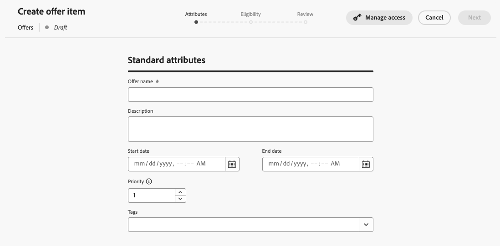

1. 提供名稱和說明。
1. 指定開始和結束日期。 在此日期內，決策引擎僅會考慮該專案。
1. 設定與其他專案比較的決策專案&#x200B;**[!UICONTROL 優先順序]** （如果設定檔符合多個專案的資格）。 較高的優先順序使該項目優先於其他項目。

   >[!NOTE]
   >
   >優先順序是整數資料型別。 整數資料型別的所有屬性都應包含整數值（無小數）。

1. **標籤**&#x200B;欄位可讓您將Adobe Experience Platform統一標籤指派給您的決定專案。 這可讓您輕鬆分類並改善搜尋。 [了解如何使用標籤](../start/search-filter-categorize.md#tags)

1. 使用片段將多個內容新增至決定專案 — 例如，如果您想要為多個行動裝置型號顯示不同的內容。 [進一步瞭解片段](../content-management/fragments.md)

   >[!AVAILABILITY]
   >
   >此功能目前僅適用於程式碼型體驗管道。

   在&#x200B;**[!UICONTROL 片段]**&#x200B;區段中，選取您要使用的已發佈片段，並指派參考索引鍵給他們。 然後，您可以在決策原則中利用這些片段。 [了解作法](fragments-decision-policies.md)

   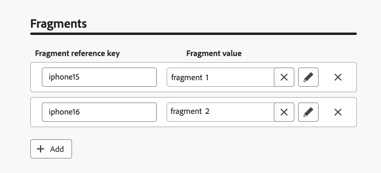{width=70%}

   您只能在決定專案中選取已發佈的片段並最多新增六個片段。

   >[!WARNING]
   >
   >目前僅支援[運算式片段](../personalization/use-expression-fragments.md)。
   >
   >無法使用巢狀片段（參照其他片段的片段）。 如果您新增此類片段，決策專案的[核准](#approve)將會失敗。

1. 指定自訂屬性（選擇性）。 自訂屬性是根據您的需求訂製並且可以指派給決定項目的特定屬性。 它們會在決定專案的目錄結構描述中定義。 [瞭解如何使用目錄](catalogs.md)

1. 定義決定專案的屬性後，按一下&#x200B;**[!UICONTROL 下一步]**。

## 設定決定項目的適用性 {#eligibility}

>[!CONTEXTUALHELP]
>id="ajo_exd_item_constraints"
>title="新增對象或決定規則"
>abstract="預設情況下，所有設定檔都有資格接收決定項目，但您可以使用對象或規則將該項目限制為僅限特定設定檔。"

<!--
>"additional-url="https://experienceleague.adobe.com/en/docs/journey-optimizer/using/audiences-profiles-identities/audiences/about-audiences" text="Use audiences"
>additional-url="https://experienceleague.adobe.com/en/docs/journey-optimizer/using/decisioning/experience-decisioning/rules" text="Use decision rules"
-->

依預設，所有設定檔都符合接收決定專案的資格，但您可以使用對象或規則將專案限製為僅特定設定檔，這兩個解決方案都對應不同的使用方式。 展開下列區段以取得詳細資訊：

+++使用對象與決定規則

基本上，對象的輸出是設定檔清單，而決定規則是在決策流程期間根據單一設定檔執行的函式。

* **對象**：一方面，對象是一組Adobe Experience Platform設定檔，根據設定檔屬性和體驗事件符合特定邏輯。 不過，Offer Management不會重新計算對象，在展示優惠方案時，該對象可能不是最新狀態。

* **決策規則**：另一方面，決策規則基於Adobe Experience Platform可用的資料，並確定可向誰顯示優惠。 一旦在某個要約或某個給定位置的決定中選擇了該規則，則每次作出決定時都會執行該規則，這可確保每個配置檔案都獲得最新和最佳的要約。

+++

* 若要將決策項的演示限制為一個或多個Adobe Experience Platform觀眾的成員，請選擇&#x200B;**[!UICONTROL 屬於一個或多個觀眾的訪問者]**&#x200B;選項，然後從左窗格中添加一個或多個觀眾，然後使用&#x200B;**[!UICONTROL 和]** / **[!UICONTROL 或]**&#x200B;邏輯運算子將它們組合。 [了解更多關於客群](../audience/about-audiences.md)

* 要將特定決策規則與決策項關聯，請選擇&#x200B;**[!UICONTROL 按規則]**，然後將所需規則從左窗格拖到中心區域。 [瞭解有關決策規則的詳細資訊](rules.md)

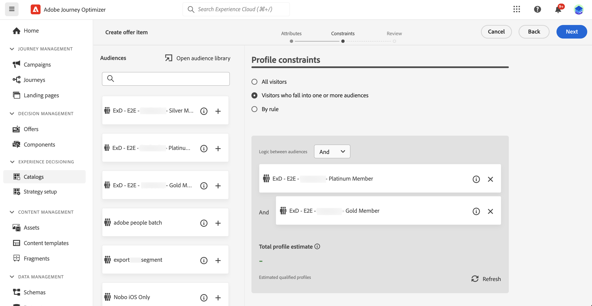

選擇受眾或決策規則時，您可以查看有關估計的限定配置檔案的資訊。 按一下&#x200B;**[!UICONTROL 刷新]**&#x200B;以更新資料。

>[!NOTE]
>
>當規則引數包含不在設定檔中的資料（例如內容資料）時，設定檔預估無法使用。 例如，適用性規則要求目前天氣為≥80度。

## 設定上限規則 {#capping}

>[!CONTEXTUALHELP]
>id="ajo_exd_item_capping_expression"
>title="運算式"
>abstract="您可以定義自己的運算式，而不是使用靜態值作為上限臨界值。這使您可以使用決定屬性和/或 Adobe Experience Platform 資料集中的外部屬性，動態地計算臨界值。  上限規則&#x200B;**運算式**&#x200B;目前做為可用性受限的功能供所有使用者使用。它們僅支援&#x200B;**[!UICONTROL 總計]**&#x200B;上限類型。"

上限會用作限制，以定義優惠方案專案可顯示的最大次數。 限制使用者取得特定優惠方案的次數，可讓您避免過度向客戶提供需求，進而使用最佳優惠方案將每個接觸點最佳化。 您最多可以為特定決定專案建立10個上限。

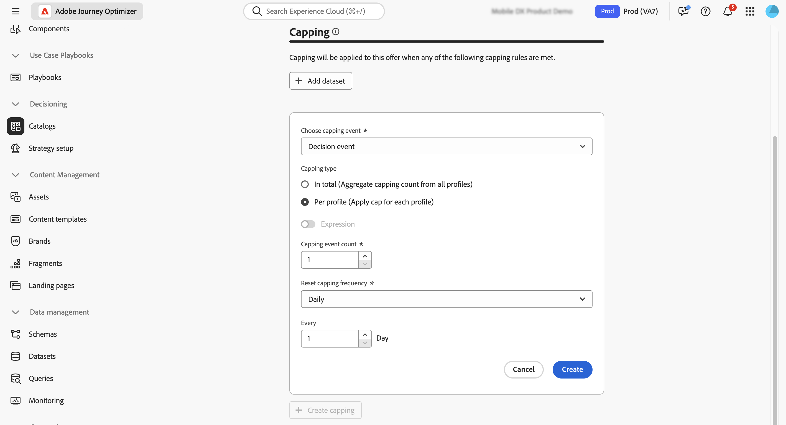

>[!NOTE]
>
>
>更新上限計數器值最多可能需要3秒的時間。 例如，假設您正在網站上顯示可展示優惠方案的網頁橫幅。 如果特定使用者在3秒內瀏覽至您網站的下一個頁面，該使用者的計數器值將不會增加。

設定上限規則時，您可以參照儲存在Adobe Experience Platform資料集中的屬性來定義臨界值。 若要使用資料集，請在&#x200B;**[!UICONTROL 資料集]**&#x200B;節中選擇該資料集。 [瞭解如何使用Adobe Experience Platform資料進行決策](../experience-decisioning/aep-data-exd.md)

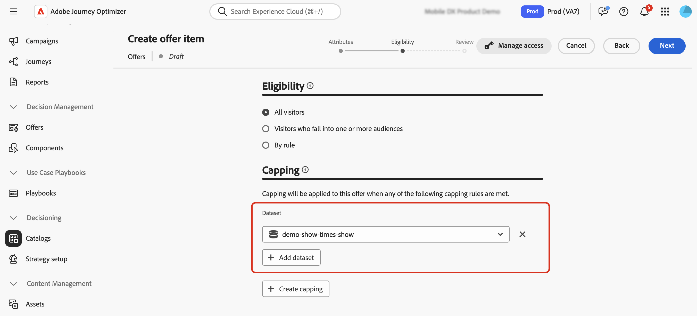

要為決策項設定上限設定規則，請按一下&#x200B;**[!UICONTROL 建立上限設定]**&#x200B;按鈕，然後按照下面詳細介紹的步驟操作。

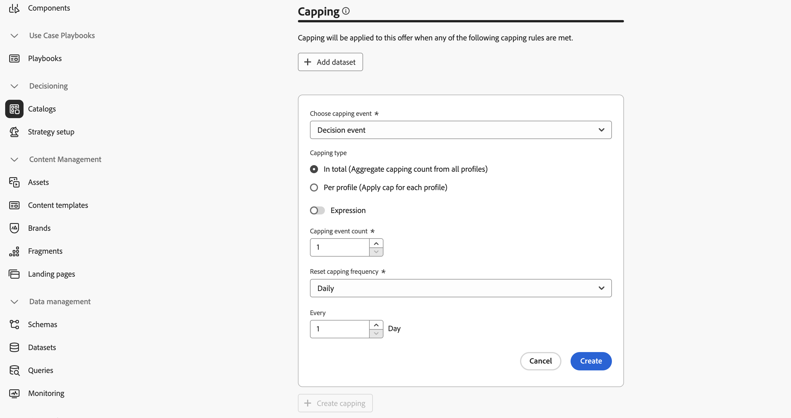

1. 定義將哪些&#x200B;**[!UICONTROL 封閉事件]**&#x200B;考慮在內以增加計數器。

   * **[!UICONTROL 決策事件]**（預設值）：可以提供優惠的最大次數。
   * **[!UICONTROL 曝光次數]** （僅限傳入管道）：可向使用者顯示選件的次數上限。
   * **[!UICONTROL 點按]**：使用者可點按決策專案的次數上限。
   * **[!UICONTROL 自定義事件]**：基於您在Adobe Experience Platform跟蹤的業務或行為體驗事件的上限，例如，贖回、購買或購物車簽出。 自定義事件上限設定使用您攝取的[Adobe Experience PlatformXDM](https://experienceleague.adobe.com/docs/experience-platform/xdm/home.html?lang=zh-Hant){target="_blank"}體驗事件。 在下拉清單中，將映射應驅動上限的特定體驗事件，以便每次接收該事件時，上限計數器都會遞增。 不支援按渠道傳遞事件（如電子郵件發送）設定上限：自定義事件僅適用於您攝取的體驗事件，而不適用於傳遞或發送事件。

   +++推式通道封頂

   推送通道不支援標準&#x200B;**[!UICONTROL 按一下]**&#x200B;和&#x200B;**[!UICONTROL 印象]**&#x200B;上限設定。 若要限制通過推送提供的服務，請使用&#x200B;**[!UICONTROL 自定義事件]**&#x200B;封頂，並將事件類型設定為&#x200B;**已開啟的推送跟蹤應用程式**&#x200B;或&#x200B;**推送跟蹤自定義操作**。

   對於推播通知，來自行動頻道的追蹤事件包含Experience Cloud ID (ECID)。 建議在Campaign或歷程設定中使用ECID來維持身分一致性，並確保上限按預期運作。

   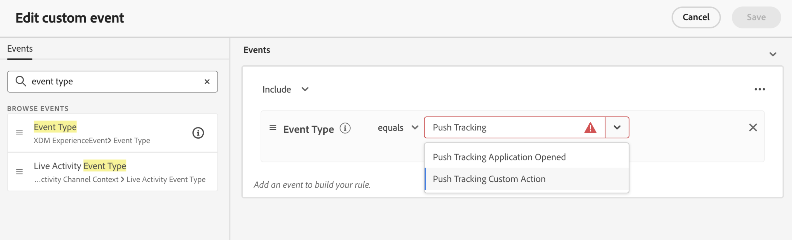

   +++

   +++追蹤上限事件（結構和資料收集）

   對於決策事件以外的所有上限事件，決策管理意見可能不會自動收集，這可能會導致上限計數器未正確增加。 若要確保在上限計數器中已追蹤和說明每個上限事件，請確定用於收集體驗事件的結構描述包含該事件的正確欄位群組。 有關資料收集的詳細資訊，請參閱Journey Optimizer決策管理檔案：
   * [決策管理資料收集](data-collection/data-collection.md)
   * [設定資料彙集](data-collection/schema-requirement.md)

   +++

1. 選擇上限型別：

   * 選取總計&#x200B;**[!UICONTROL 個]**&#x200B;以定義可在合併目標對象中建議多少次該專案，亦即在所有使用者中。 例如，如果您是具有「TV doorbuster deal」的電子產品retailer，您只想讓所有設定檔傳回200次選件。

   * 選取&#x200B;**[!UICONTROL 每個設定檔]**&#x200B;以定義可建議給同一個使用者多少次選件。 例如，如果您是具有「白金信用卡」優惠方案的銀行，您不希望此優惠方案在每個設定檔中顯示超過5次。 事實上，您相信，如果使用者看過5次選件且未採取行動，則他們有較高機會對下一個最佳選件採取行動。

1. 定義上限臨界值。 若要這麼做，您可以輸入靜態值，或使用運算式計算臨界值。 請展開下列各節以取得詳細資訊。

   +++靜態臨界值

   在&#x200B;**[!UICONTROL 上限計數限制]**&#x200B;欄位中，根據選取的上限型別，指定可向所有使用者或每個設定檔顯示優惠方案的次數。 數字必須是大於0的整數。

   例如，您定義了自訂上限事件，例如將結帳次數納入考量。 如果您在&#x200B;**[!UICONTROL 上限計數限制]**&#x200B;欄位中輸入10，則在10次結帳後不會再傳送優惠。

   +++

   +++運算式臨界值

   您可以定義自己的運算式，而不是使用靜態值作為上限臨界值。這使您可以使用決定屬性和/或 Adobe Experience Platform 資料集中的外部屬性，動態地計算臨界值。

   例如，行銷人員可能會決定新增乘數來調整曝光。 例如，他們可以將可用存貨乘以2，讓選件顯示的客戶數量是可用單位的兩倍。 此方法預計並非所有客戶都會轉換，確保獲得更好的觸及率，而不會過度銷售。

   >[!NOTE]
   >
   >上限規則&#x200B;**運算式**&#x200B;目前是所有使用者的有限可用性。 它們僅支援&#x200B;**[!UICONTROL 總計]**&#x200B;上限類型。

   若要使用運算式，請啟用&#x200B;**[!UICONTROL 運算式]**&#x200B;選項，然後視需要編輯運算式。

   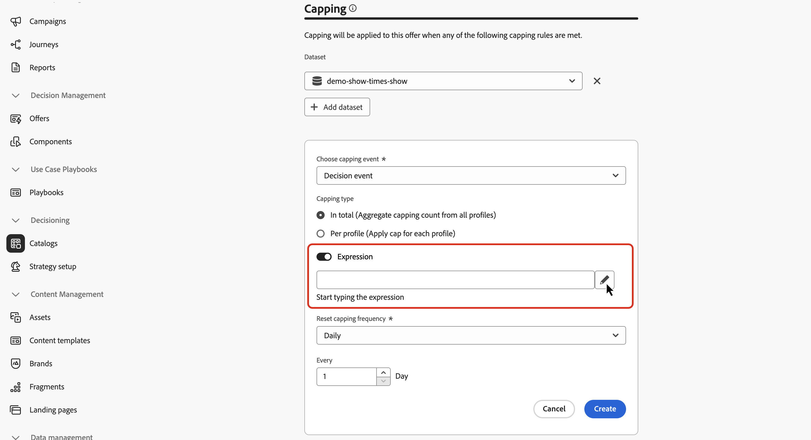

   +++

1. 在&#x200B;**[!UICONTROL 重設上限頻率]**&#x200B;下拉式清單中，設定上限計數器的重設頻率。 若要這麼做，請定義盤點的期間（每日、每週或每月），並輸入您選擇的天數/周數/月數。 例如，如果您希望每兩週重設一次上限計數，請從對應的下拉式清單中選取&#x200B;**[!UICONTROL 每週]**，然後在另一個欄位中輸入&#x200B;**2**。

   * 頻率上限計數器重設會在您定義的當天上午&#x200B;**12UTC**&#x200B;發生，或在一週/月的第一天發生（如適用）。 周開始日是&#x200B;**星期日**。 您選擇的任何期間不能超過&#x200B;**2年** （即對應的月數、周數或天數）。

   * 發佈決定專案後，您將無法變更您為頻率選取的時間期間（每月、每週或每日）。 如果專案具有&#x200B;**[!UICONTROL 草稿]**&#x200B;狀態，而且之前從未發佈並啟用頻率限定，您仍可以編輯頻率限定。

   * 無論是在核准決定專案或建立上限時（取兩者最後發生者），將事件計入頻率上限限制之前，最多可能有15分鐘的緩衝時間。

1. 按一下&#x200B;**[!UICONTROL 建立]**&#x200B;以確認建立上限規則。 您最多可以為單一決定專案建立10個規則。 若要這麼做，請按一下&#x200B;**[!UICONTROL 建立上限]**&#x200B;按鈕，並重複上述步驟。

   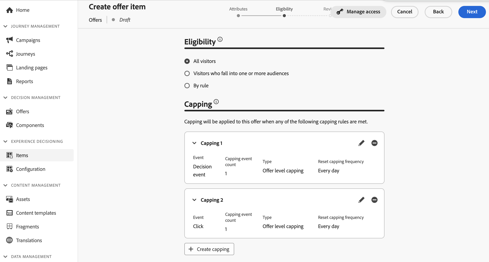

<!--* Identifying how many times a given customer has been shown a decision item. 
If a marketer wants to determine how many times a specific customer has been shown an offer, they can do that. Go to Profiles menu, Attributes tab. You'll see all counter values. The alphanumeric string is associated to the offer. To make the map, go to an item, in the URL check the last alphanumeric strings. D stands for day, w stands for week, m for month. "Ce" custom event-->

## 檢閱並核准決定專案 {#approve}

1. 定義決定專案的資格和上限規則後，按一下&#x200B;**[!UICONTROL 下一步]**&#x200B;以檢閱並儲存專案。

1. 決定專案現在會顯示在清單中，並具有&#x200B;**[!UICONTROL 草稿]**&#x200B;狀態。 當它準備好呈現給設定檔時，按一下省略符號按鈕並選取&#x200B;**[!UICONTROL 核准]**。

   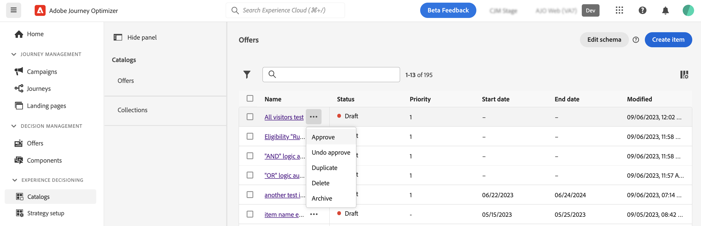

## 管理決策項目 {#manage}

從決定專案清單中，您可以編輯決定專案、變更其狀態（**草稿**、**已核准**、**已封存**）、複製或刪除它。

若要修改決定專案，請開啟它、進行修改並儲存。

選取決定專案或按一下省略符號按鈕會啟用以下所述的動作。

* **[!UICONTROL 核准]**：將決定專案的狀態設定為「已核准」。
* **[!UICONTROL 復原核准]**：將決定專案的狀態設定回&#x200B;**[!UICONTROL 草稿]**。
* **[!UICONTROL 重複]**：建立具有相同屬性和條件約束的決定專案。 依預設，新專案具有&#x200B;**[!UICONTROL 草稿]**&#x200B;狀態。
* **[!UICONTROL 刪除]**：從清單中移除決定專案。

  >[!IMPORTANT]
  >
  >刪除後，就無法再存取決定專案及其內容。 此動作無法還原。

  如果核准的優惠專案用於集合或決定，則無法刪除這些專案。 若要刪除它們，請將它們的狀態變更為「草稿」。 若要這麼做，請按一下省略符號按鈕，然後選取&#x200B;**[!UICONTROL 復原核准]**。

  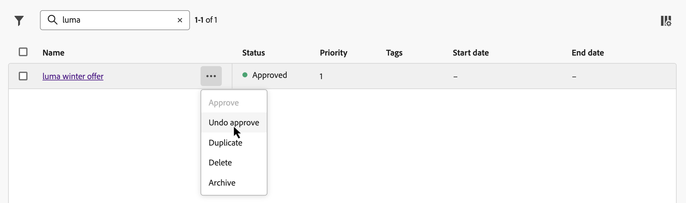

* **[!UICONTROL 封存]**：將決定專案狀態設為&#x200B;**[!UICONTROL 已封存]**。 決定專案仍然可以從清單中使用，但您不能將其狀態設定回&#x200B;**[!UICONTROL 草稿]**&#x200B;或&#x200B;**[!UICONTROL 已核准]**。 您只能複製或刪除它。

