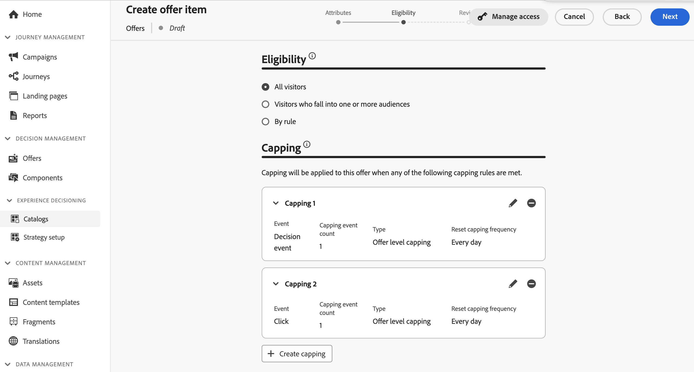

# 建立您的第一個決定項目 {#items}

>[!CONTEXTUALHELP]
>id="ajo_exd_items"
>title="管理決定項目"
>abstract="Journey Optimizer 可讓您建立行銷優惠 (稱為決定項目)，您可以將其建立並組織到集中式目錄和集合中。目前，所有建立的決定項目都合併在一個「優惠」目錄中。在此畫面中，您還可以使用&#x200B;**編輯架構**&#x200B;按鈕來存取目錄的方案，並為您的決定項目建立自訂屬性。"
>additional-url="https://experienceleague.adobe.com/docs/journey-optimizer/using/decisioning/experience-decisioning/decision-items/catalogs.html" text="設定項目目錄"

Journey Optimizer 可讓您建立行銷優惠 (稱為決定項目)，您可以將其建立並組織到集中式目錄和集合中。這些屬性由標準和自訂屬性組成，旨在精確符合您的需求。 此外，它們納入設定檔限制，可讓您定義決策專案可顯示給誰。

在建立決定專案之前，請確定您已建立 **決定規則** 如果要設定條件以決定要向誰顯示決策專案。 [瞭解如何建立決定規則](rules.md).

若要建立決定專案，請導覽至 **[!UICONTROL 體驗決策]** > **[!UICONTROL 目錄]**，然後按一下 **[!UICONTROL 建立專案]** 然後遵循以下各節中詳述的步驟操作。

## 定義決定項目的屬性 {#attributes}

>[!CONTEXTUALHELP]
>id="ajo_exd_item_priority"
>title="定義決定項目的優先順序"
>abstract="如果一個設定檔符合多個項目的條件，則可以透過優先順序將此決定項目與其他決定項目進行比較。 較高的優先順序使該項目優先於其他項目。"

>[!CONTEXTUALHELP]
>id="ajo_exd_item_custom_attributes"
>title="定義自訂屬性"
>abstract="自訂屬性是根據您的需求訂製並且可以指派給決定項目的特定屬性。 它們是在決定項目的目錄方案中建立的。 只有當您已在目錄方案中新增至少一個自訂屬性時，才會顯示此區段。"
>additional-url="https://experienceleague.adobe.com/docs/journey-optimizer/using/decisioning/experience-decisioning/decision-items/catalogs.html" text="設定項目目錄"

首先定義決定專案的標準和自訂屬性：

1. 提供名稱和說明。
1. 指定開始和結束日期。 在此日期內，決策引擎僅會考慮該專案。
1. 設定 **[!UICONTROL 優先順序]** 與其他專案比較，如果設定檔符合多個專案的資格。 較高的優先順序使該項目優先於其他項目。
1. 此 **標籤** 欄位可讓您將Adobe Experience Platform統一標籤指派給您的決定專案。 這可讓您輕鬆分類並改善搜尋。 [了解如何使用標籤](../start/search-filter-categorize.md#tags)

   >[!NOTE]
   >
   >優先順序是整數資料型別。 整數資料型別的所有屬性都應包含整數值（無小數）。

1. 指定自訂屬性（選擇性）。 自訂屬性是根據您的需求訂製並且可以指派給決定項目的特定屬性。 它們會在決定專案的目錄結構描述中定義。 [瞭解如何使用目錄](catalogs.md)

1. 定義決定專案的屬性後，按一下 **[!UICONTROL 下一個]**.

## 設定決定項目的適用性 {#eligibility}

>[!CONTEXTUALHELP]
>id="ajo_exd_item_constraints"
>title="新增對象或決定規則"
>abstract="預設情況下，所有設定檔都有資格接收決定項目，但您可以使用對象或規則將該項目限制為僅限特定設定檔。"
>additional-url="https://experienceleague.adobe.com/docs/journey-optimizer/using/audiences-profiles-identities/audiences/about-audiences.html" text="使用對象"
>additional-url="https://experienceleague.adobe.com/docs/journey-optimizer/using/decisioning/experience-decisioning/selection/rules.html" text="使用決定規則"

依預設，所有設定檔都符合接收決定專案的資格，但您可以使用對象或規則將專案限製為僅特定設定檔，這兩個解決方案都對應不同的使用方式。 展開下列區段以取得詳細資訊：

+++使用對象與決定規則

基本上，對象的輸出是設定檔清單，而決定規則是在決策流程期間根據單一設定檔執行的函式。

* **受眾**：一方面，受眾是一組Adobe Experience Platform設定檔，根據設定檔屬性和體驗事件符合特定邏輯。 不過，Offer Management不會重新計算對象，在展示優惠方案時，該對象可能不是最新狀態。

* **決定規則**：另一方面，決定規則會根據Adobe Experience Platform中的可用資料，並決定可向誰顯示優惠方案。 在優惠或指定位置的決定中選取後，每次做出決定時都會執行規則，以確保每個設定檔取得最新和最佳優惠。

+++

* 若要將決策專案的呈現限制在一或多個Adobe Experience Platform對象的成員中，請選取 **[!UICONTROL 屬於一或多個對象的訪客]** 選項，然後從左窗格新增一或多個對象，並使用 **[!UICONTROL 與]** / **[!UICONTROL 或]** 邏輯運運算元。 [深入瞭解對象](../audience/about-audiences.md).

* 若要將特定決定規則關聯至決定專案，請選取 **[!UICONTROL 依規則]**，然後將需要的規則從左窗格拖曳到中央區域。 [進一步了解決定規則](rules.md).

當您選取對象或決定規則時，您可以檢視有關預估合格設定檔的資訊。 按一下 **[!UICONTROL 重新整理]** 以更新資料。

>[!NOTE]
>
>當規則引數包含不在設定檔中的資料（例如內容資料）時，設定檔預估無法使用。 例如，適用性規則要求目前天氣為≥80度。

## 設定上限規則 {#capping}

上限會用作限制，以定義可顯示優惠方案的次數上限。 限制使用者取得特定優惠方案的次數，可讓您避免過度向客戶提供需求，進而使用最佳優惠方案將每個接觸點最佳化。 您最多可以為特定決定專案建立10個上限。

>[!NOTE]
>
>
>更新上限計數器值最多可能需要3秒的時間。 例如，假設您正在網站上顯示可展示優惠方案的網頁橫幅。 如果特定使用者在3秒內瀏覽至您網站的下一個頁面，該使用者的計數器值將不會增加。

若要設定決定專案的上限規則，請按一下 **[!UICONTROL 建立上限]** 按鈕，然後按照以下步驟操作：

1. 定義哪些 **[!UICONTROL 事件上限]** 將考慮以增加計數器。

   * **[!UICONTROL 決定事件]** （預設值）：可顯示優惠方案的次數上限。
   * **[!UICONTROL 印象]** （僅限傳入頻道）：可向使用者顯示優惠方案的次數上限。
   * **[!UICONTROL 點按次數]**：使用者可點按決策專案的最大次數。
   * **[!UICONTROL 自訂事件]**：您可以定義自訂事件，用於限制傳送專案的次數。 例如，您可以限制贖回次數，直到它們相等10000或直到指定的設定檔已贖回1次。 若要這麼做，請使用 [ADOBE EXPERIENCE PLATFORM XDM](https://experienceleague.adobe.com/docs/experience-platform/xdm/home.html?lang=zh-Hant){target="_blank"} 用於建置自訂事件規則的結構描述。

   >[!NOTE]
   >
   >對於決策事件以外的所有上限事件，決策管理意見可能不會自動收集，這可能會導致上限計數器未正確增加。 若要確保在上限計數器中已追蹤和說明每個上限事件，請確定用於收集體驗事件的結構描述包含該事件的正確欄位群組。 有關資料收集的詳細資訊，請參閱Journey Optimizer決策管理檔案：
   >* [決策管理資料收集](../offers/data-collection/data-collection.md)
   >* [設定資料彙集](../offers/data-collection/schema-requirement.md)

1. 選擇上限型別：

   * 選取 **[!UICONTROL 總計]** 以定義可在合併目標對象中建議多少次專案，這表示適用於所有使用者。 例如，如果您是具有「電視看門人交易」的電子零售商，您只想要在所有設定檔中傳回200次選件。

   * 選取 **[!UICONTROL 每個設定檔]** 以定義可向同一位使用者建議此優惠方案的次數。 例如，如果您是具有「白金信用卡」優惠方案的銀行，您不希望此優惠方案在每個設定檔中顯示超過5次。 事實上，您相信，如果使用者看過5次選件且未採取行動，則他們有較高機會對下一個最佳選件採取行動。

1. 在 **[!UICONTROL 上限計數限制]** 欄位中，根據選取的上限型別，指定可向所有使用者或每個設定檔顯示優惠方案的次數。 數字必須是大於0的整數。

   例如，您定義了自訂上限事件，例如將結帳次數納入考量。 如果您在 **[!UICONTROL 上限計數限制]** 欄位，10次結帳後不會傳送其他優惠。

1. 在 **[!UICONTROL 重設上限頻率]** 下拉式清單，設定上限計數器的重設頻率。 若要這麼做，請定義盤點的期間（每日、每週或每月），並輸入您選擇的天數/周數/月數。 例如，如果您希望每兩週重設一次上限計數，請選取 **[!UICONTROL 每週]** 從對應的下拉式清單及型別 **2** 在另一個欄位中。

   >[!NOTE]
   >
   >頻率限定計數器重設發生於 **UTC上午12點**，日期為您定義的日期，或在一週/月的第一天（若適用）。 周開始日為 **星期日**. 您選擇的任何期間不能超過 **2年** （即對應的月數、周數或天數）。
   >
   >發佈決定專案後，您將無法變更您為頻率選取的時間期間（每月、每週或每日）。 如果專案具有 **[!UICONTROL 草稿]** 狀態且之前從未發佈，並啟用了頻率限定。

1. 按一下 **[!UICONTROL 建立]** 以確認建立上限規則。 您最多可以為單一決定專案建立10個規則。 若要這麼做，請按一下 **[!UICONTROL 建立上限]** 按鈕並重複上述步驟。

   

1. 定義決定專案的資格和上限規則後，按一下 **[!UICONTROL 下一個]** 以檢閱並儲存專案。

1. 決定專案現在會出現在清單中，並顯示 **[!UICONTROL 草稿]** 狀態。 當它準備好要呈現給設定檔時，按一下省略符號按鈕並選擇 **[!UICONTROL 核准]**.

   

<!--* Identifying how many times a given customer has been shown a decision item. 
If a marketer wants to determine how many times a specific customer has been shown an offer, they can do that. Go to Profiles menu, Attributes tab. You'll see all counter values. The alphanumeric string is associated to the offer. To make the map, go to an item, in the URL check the last alphanumeric strings. D stands for day, w stands for week, m for month. "Ce" custom event-->

## 管理決定項目 {#manage}

從決定專案清單中，您可以編輯決定專案、變更其狀態(**草稿**， **已核准**， **已封存**)、複製或刪除它。

若要修改決定專案，請開啟它、進行修改並儲存。

選取決定專案或按一下省略符號按鈕會啟用以下所述的動作。

* **[!UICONTROL 核准]**：將決定專案的狀態設定為「已核准」。
* **[!UICONTROL 還原核准]**：將決定專案的狀態設回 **[!UICONTROL 草稿]**.
* **[!UICONTROL 複製]**：建立具有相同屬性和限制的決定專案。 依預設，新專案具有 **[!UICONTROL 草稿]** 狀態。
* **[!UICONTROL 刪除]**：從清單中移除決定專案。

  >[!IMPORTANT]
  >
  >刪除後，就無法再存取決定專案及其內容。 此動作無法復原。 如果決定專案用於集合或決定中，則無法刪除該專案。 您必須先從任何物件中移除決定專案。

* **[!UICONTROL 封存]**：將決定專案狀態設為 **[!UICONTROL 已封存]**. 該決定專案仍然可以從清單中使用，但您不能將其狀態設定回 **[!UICONTROL 草稿]** 或 **[!UICONTROL 已核准]**. 您只能複製或刪除它。
