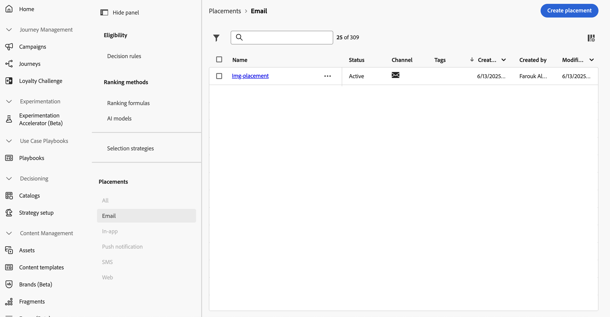
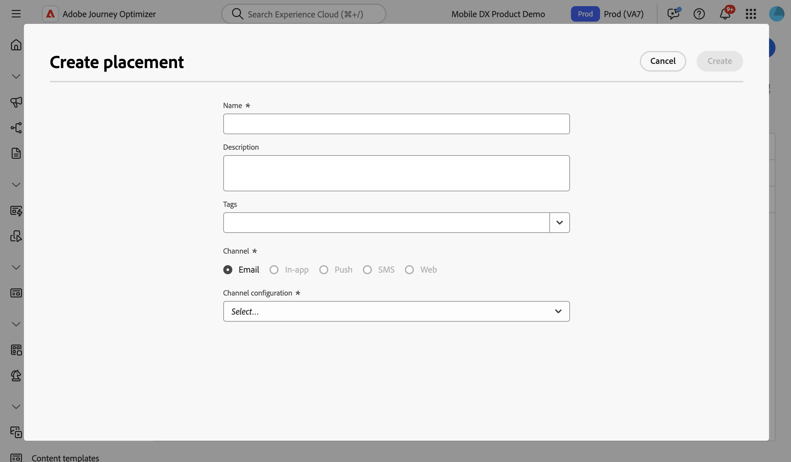
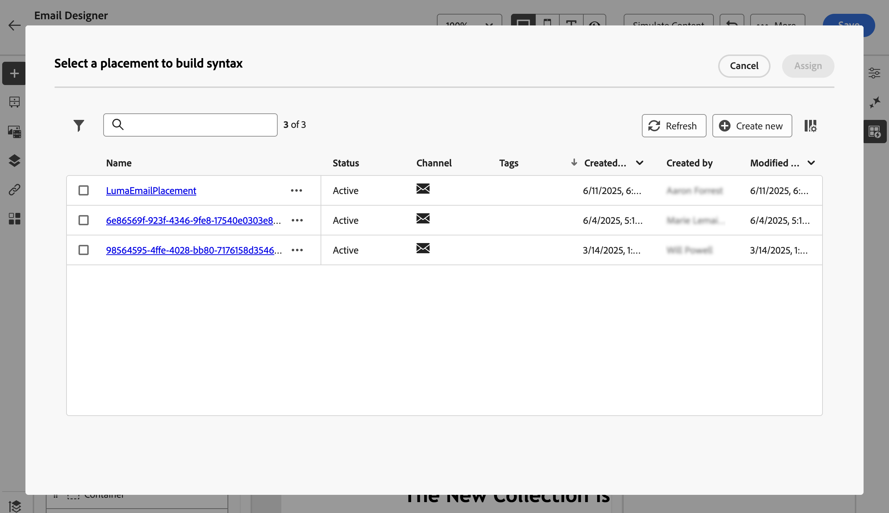

# 使用位置 {#create-decision}

## 關於版位 {#about}

位置是用於展示決定專案的容器。 它有助於確保正確的選件內容顯示在您訊息的正確位置。

當您將決定原則新增到電子郵件時，您需要將版位與將顯示傳回決定專案的元件相關聯。 例如，這可讓您在報告中追蹤不同位置中的決定專案效能。

可在&#x200B;**[!UICONTROL 策略設定]**&#x200B;功能表中存取位置清單。 篩選器可協助您根據特定管道表面或標籤擷取版位。

>[!NOTE]
>
>目前，刊登版位僅適用於電子郵件頻道。

## 建立位置 {#create}

若要建立版位，請依照下列步驟進行：

1. 瀏覽至&#x200B;**[!UICONTROL 策略設定]**&#x200B;功能表，選取&#x200B;**[!UICONTROL 電子郵件]**，然後按一下&#x200B;**[!UICONTROL 建立位置]**&#x200B;按鈕。

   新增決定原則時，您也可以直接從電子郵件設計工具建立版位。 [瞭解如何將位置與電子郵件元件建立關聯](../experience-decisioning/create-decision.md#save)

1. 定義位置的屬性：

   

   * **[!UICONTROL 名稱]**：位置名稱。 請務必定義有意義的名稱，以更輕鬆擷取該名稱。
   * **[!UICONTROL 描述]**：位置的描述。
   * **[!UICONTROL 標籤]**：將Adobe Experience Platform統一標籤指派給位置。 這可讓您輕鬆分類並改善搜尋。 [了解如何使用標籤](../start/search-filter-categorize.md#tags)
   * **[!UICONTROL 頻道]**：將使用位置的頻道。 目前，刊登版位僅適用於電子郵件。
   * **[!UICONTROL 頻道設定]**：將頻道設定與位置建立關聯。 [了解如何設定頻道設定](../configuration/channel-surfaces.md)。

1. 按一下&#x200B;**[!UICONTROL 建立]**。

建立刊登版位後，將決定原則新增至電子郵件時，就會顯示在刊登版位清單中。 您可以選取它以顯示其屬性並加以編輯。 [瞭解如何建立決定原則](../experience-decisioning/create-decision.md)

