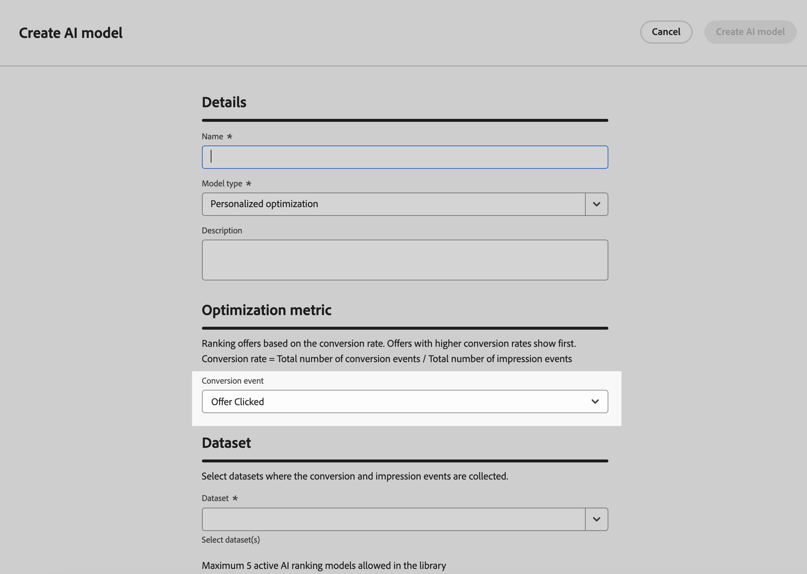

# 排名方法 {#rankings}

排名方法可讓您針對要針對指定設定檔顯示的專案進行排名。 建立排名方法後，您可以將其指派給選擇策略以定義應先選取哪些項目。

有兩種排名方法可供使用：

* **公式**&#x200B;可讓您定義規則，以決定應該先顯示哪個專案，而不是考慮專案的優先順序分數。

* **AI模型**&#x200B;可讓您使用經過訓練的模型系統，這些系統將利用多個資料點來決定應該先顯示哪個專案。

## 建立排名方法 {#create}

若要建立排名方法，請依照下列步驟進行：

1. 導覽至&#x200B;**[!UICONTROL 策略設定]**&#x200B;功能表，然後選取&#x200B;**[!UICONTROL 公式]**&#x200B;或&#x200B;**[!UICONTROL AI模型]**&#x200B;功能表（視您要使用的排名型別而定）。

1. 按一下畫面右上角的&#x200B;**[!UICONTROL 建立公式]**&#x200B;或&#x200B;**[!UICONTROL 建立AI模型]**&#x200B;按鈕。

   

1. 設定公式或AI模型以符合您的需求，然後儲存。

   有關如何建立排名公式和AI模型的詳細資訊，請參閱決策管理檔案：

   * [排名公式](exd-ranking-formulas.md)
   * [AI 模型](../offers/ranking/ai-models.md)

   >[!NOTE]
   >
   >排名公式中的巢狀深度限製為30個層級。 這是透過計算PQL字串中的`)`個右括弧來測量。 規則字串的大小最多可達8KB （UTF-8編碼字元）。 這相當於8,000個ASCII字元（每個1個位元組），或2,000-4,000個非ASCII字元（每個2-4個位元組）。 [進一步瞭解Decisioning護欄和限制](gs-experience-decisioning.md#guardrails)

決策原則可支援最多10個合併的選擇策略和決策專案。 [進一步瞭解Decisioning護欄和限制](gs-experience-decisioning.md#guardrails)

+++ 正在自訂[!DNL Customer Journey Analytics]量度上最佳化模型

>[!NOTE]
>
>此功能僅供具有管理員許可權的[!DNL Customer Journey Analytics]客戶使用。
>
>開始之前，請確定您已將Journey Optimizer與Customer Journey Analytics整合，以便將Journey Optimizer資料集匯出至您的預設資料檢視。 [瞭解如何在 [!DNL Customer Journey Analytics]](../reports/cja-ajo.md)中運用 [!DNL Journey Optmizer] 資料

個人化最佳化模型是一種AI模型，可讓您定義業務目標，並利用客戶資料來訓練業務導向模型，以提供個人化優惠並最大化KPI。 有關如何建立個人化AI模型的詳細資訊，請參閱[決策管理檔案](../offers/ranking/personalized-optimization-model.md)。

依預設，個人化最佳化模型會使用&#x200B;**優惠點按**&#x200B;作為最佳化量度。 如果您正在使用[!DNL Customer Journey Analytics]，[!DNL Decisioning]可讓您運用自己的自訂量度來最佳化您的模型。

若要這麼做，請存取個人化AI模型建立畫面並展開&#x200B;**[!UICONTROL 轉換事件]**&#x200B;下拉式清單。 來自您的預設[!DNL Customer Journey Analytics] [資料檢視](https://experienceleague.adobe.com/zh-hant/docs/analytics-platform/using/cja-dataviews/data-views){target="_blank"}的所有量度都會顯示在清單中。 選取您想要最佳化模型的量度，然後照常完成AI模型建立。

>[!NOTE]
>
>根據預設，[!DNL Customer Journey Analytics]中的量度會使用「上次接觸」歸因模型，將100%的點數指派給轉換前發生的最近一次接觸點。
>
>雖然可修改歸因模型，但並非所有歸因模型都適用於AI模型最佳化。 建議您仔細選取符合您最佳化目標的歸因模型，以確保模型精確度和效能。
>
>如需有關可用歸因模型及其使用指南的詳細資訊，請參閱[[!DNL Customer Journey Analytics] 檔案](https://experienceleague.adobe.com/zh-hant/docs/analytics-platform/using/cja-dataviews/component-settings/attribution){target="_blank"}

+++

## 在公式中善用決定專案屬性 {#items}

排名公式以&#x200B;**PQL語法**&#x200B;表示，而且可以利用各種屬性，例如設定檔屬性、[內容資料](context-data.md)以及與決策專案相關的屬性。

>[!NOTE]
>
>如需如何使用PQL語法的詳細資訊，請參閱[專屬檔案](https://experienceleague.adobe.com/docs/experience-platform/segmentation/pql/overview.html?lang=zh-Hant)

若要在公式中運用與決策專案相關的屬性，請務必遵循排名公式程式碼中的以下語法。 展開每個區段以取得詳細資訊：

+++運用決策專案標準屬性

+++

+++善用決策專案自訂屬性

+++
