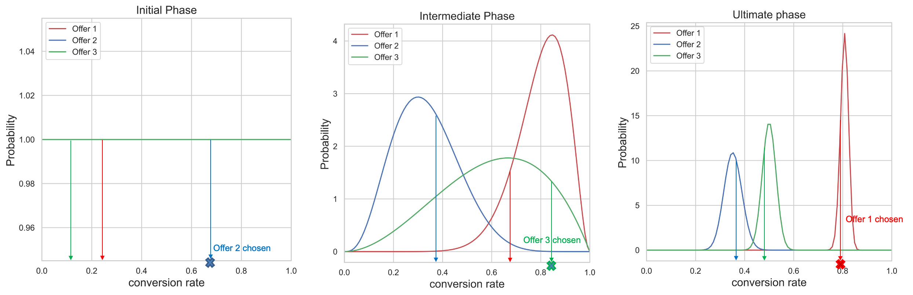

# 自動最佳化模型 {#auto-optimization-model}

[!DNL Adobe Journey Optimizer]的自動最佳化模型是強化學習模型，它會探索所有優惠方案（或內容），然後在套用適用性規則和頻率上限後，根據預測的CTR來排名專案，以最大化優惠方案點進率(CTR)。

## 使用案例和優點 {#use-cases-benefits}

無論您想要快速輕鬆設定、想要尋找整體成功選件，以及想要在單一管道中最大化選件點按次數，隨時都可以使用自動最佳化。 例如：

* 選擇最佳選件以插入至網頁，最大化選件點按次數。
* 選擇要插入電子郵件中的最佳優惠方案，以最大化優惠方案點按次數。
* 選擇要插入行動應用程式畫面的最佳選件，以最大化選件點按次數。

在下列情況下，自動最佳化是很好的選擇：

* 選件會隨著時間或頻率而改變：自動最佳化模型每六小時會重新訓練一次。

## 需求和限制 {#requirements-limitations}

自動最佳化有下列需求和限制：

* 自動最佳化需要包含優惠顯示事件、優惠點按事件和體驗事件 — 主張互動欄位群組的訓練資料集。
* 自動最佳化模型無法用於批次決策API的請求中。
* 自動最佳化一律會針對優惠點選次數進行最佳化。 若要針對優惠點按以外的目標最大化，請使用[個人化最佳化](personalized-optimization-model.md)模型。
* 自動最佳化會嘗試尋找整體成功選件，但找不到每個客戶的個人化排名。 若要尋找每個客戶的個人化排名，請使用[個人化最佳化](personalized-optimization-model.md)模型。

若要訓練自動最佳化模型，資料集必須符合下列最低需求：

* 資料集中至少有2個選件在過去14天內必須具有至少100個顯示事件和5個點選事件。
* 少於100個顯示和/或過去14天內5個點選事件的選件，模型會將視為新選件，且僅符合由Exploration Bandit提供的資格。
* 模型會將過去14天內有超過100個顯示區和5個點選事件的優惠方案視為現有優惠方案，並符合約時接受探索和開發強盜服務的資格。

在首次訓練自動最佳化模型之前，使用自動最佳化模型的選取策略中的選件將會隨機提供。

## 平衡最佳化與學習 {#balancing-optimization-learning}

自動最佳化是[強化學習](https://en.wikipedia.org/wiki/Reinforcement_learning){target="_blank"}模型，可根據真實世界的客戶行為，學習優惠方案的點進效能。 強化學習模型會選擇具有較佳預測結果的動作，以將目標最大化。 然而，一律向每位客戶呈現專案以獲得最佳預測結果的模型，永遠不會瞭解隨時間引入的新專案績效（所謂的「冷啟動問題」），也不會瞭解由於客戶行為隨時間改變而導致的其他現有專案績效變化。 因此，強化學習模型必須管理通常所說的[探索 — 開發權衡](https://en.wikipedia.org/wiki/Exploration%E2%80%93exploitation_dilemma){target="_blank"}，也就是最佳化與學習的平衡。

自動最佳化使用稱為[多臂吃角子老虎機](https://en.wikipedia.org/wiki/Multi-armed_bandit){target="_blank"}的常見方法來管理權衡。 多臂吃角子老虎機根據下列專案做出排名決定：

* 每個專案的預測點進率
* 每個專案的預測點進率的差異
* 模型針對每個專案的預測的不確定程度。

多臂強盜會利用這些資訊以及隨機變化，來選擇要採取的行動。 自動最佳化是[整體演演算法](https://en.wikipedia.org/wiki/Ensemble_learning){target="_blank"}，其中包含多個多臂的綁架，以確保充分探索所有選件，同時最大化整體效能。

回應排名請求時，「監督」多臂吃角子老虎機會先選擇此請求是否應傾向探索或傾向開發。 這個決定是使用「epsilon-greedy」方法做出。

排名第二層是由兩個[Thompson抽樣](https://en.wikipedia.org/wiki/Thompson_sampling){target="_blank"}繫結的其中之一執行：

* 10%的流量會分配給以探索為重點的吃角子老虎機，該老虎機更可能會建議新優惠方案或資料有限的優惠方案，前提是模型將受益於進一步瞭解客戶行為以回應這些優惠方案。
* 90%的流量會分配給以開發為中心的吃角子老虎機，該老虎機更可能隨著時間持續建議高績效的優惠方案，其假設是，在證明有其他情況之前，新資料或低資料優惠方案更有可能表現不佳。

從技術角度來說，這些假設是先前機率分佈的引數，也稱為[先前機率](https://en.wikipedia.org/wiki/Prior_probability){target="_blank"}。 隨著選件收集到更多的顯示和點按資料，所選優先順序的影響會變小，而兩個強盜所做的預測會隨著時間而趨於收斂。

我們合併多個強盜並分配一些專用流量進行探索的方法具備幾個優點：

* 此模式可讓您以最快速度瞭解具有最少資料的最新選件
* 模型會繼續瞭解所有優惠方案，並隨著時間回應客戶行為的變化
* 此模式不會過度偏好CTR較高的優惠方案，但很少觀察到，或是CTR較低但很少觀察到的優惠方案
* 此模型非常健全，可處理具有稀疏點按資料及非常不同歷史資料量的數百個優惠方案的流量分配決策

## Thompson取樣 {#thompson-sampling}

[Thompson取樣](https://en.wikipedia.org/wiki/Thompson_sampling){target="_blank"}或是Bayesian強盜，是多臂強盜問題的貝葉斯方法。 模型會將每個優惠方案的平均獎勵𝛍視為隨機變數，並使用我們目前為止所收集的資料來更新我們對於平均獎勵的「信念」。 這個「信念」用後驗機率分佈數學表示 — 基本上是平均獎勵的值的範圍，以及每個優惠的獎勵具有該值的可能性（或機率）。 接著，針對每項決定，我們都會從每個後方回報分佈中取樣點，並選取取樣回報值最高的優惠方案。

此程式如下圖所示，我們有3個不同的選件。 起初，我們無法從資料中取得任何證據，而且我們假設所有優惠方案都有一個統一的後驗獎勵分佈。 我們會從每個優惠方案的前端回報分佈中抽取樣本。 從選件2的分佈中選取的範例具有最高值。 這是探索的範例。 顯示優惠方案2後，我們會收集任何潛在獎勵（例如轉換/不轉換），並使用貝葉斯定理更新優惠方案2的後驗分佈，如下所述。 我們將繼續此程式，並在每次顯示優惠方案並收集獎勵時更新後續分配。 在第二個數字中，已選取「選件3」 — 儘管選件1的平均報酬最高（其後方的報酬分佈最靠右），從每個分佈取樣的程式已導致我們選擇明顯次優的選件3。 我們藉此機會，進一步瞭解Offer 3的真正回報分配。

當收集到更多的範例時，可信度會提高，並取得可能獎勵的更準確預估（對應於較窄的獎勵分佈）。 這個在更多證據出現時更新我們信念的過程稱為&#x200B;**貝葉斯推斷**。

最終，如果一個選件（例如選件1）是明確的獲勝者，其後驗獎勵分配將與其他選件分開。 此時，對於每個決定，從選件1取得的抽樣獎勵可能是最高的，而我們將以較高的機率選擇它。 這是剝削 — 我們堅信選件1是最好的，因此選擇它是為了最大化回報。

**圖1**： *對於每項決定，我們都會從後驗獎勵分配中取樣一個分數。 將會選擇具有最高範例值（轉換率）的選件。 在初始階段，所有選件具有統一分佈，因為我們沒有任何證據可以證明資料中選件的轉換率。 當我們收集到更多樣本時，後驗分佈會變得更窄且更準確。 最終，每次都會選擇轉換率最高的選件。*

+++ 計算詳細資料

若要計算/更新分佈，請使用&#x200B;**貝葉斯定理**。 我們想要針對每個優惠方案&#x200B;***i***，計算其&#x200B;***P（𝛍i |資料）***，亦即針對每個優惠方案&#x200B;***i***，考慮我們目前就該優惠方案收集的資料，獎勵值&#x200B;**𝛍i**&#x200B;的可能性有多大。

從貝葉斯定理：

***後方=可能性*先前***

**先前機率**&#x200B;是產生輸出機率的初始猜測。 在收集了一些證據之後，此機率稱為&#x200B;**後驗機率**。

自動最佳化的設計會考量二進位獎勵（按一下/不按一下）。 在此案例中，可能性代表N次嘗試的成功次數，並以二項式分佈建模。 對於某些似然函式，如果您選擇特定的前一個，則後一個分佈會與前一個分佈相同。 如此的前置位址稱為&#x200B;**共軛前置**。 這種先驗使後驗分佈的計算非常簡單。 [Beta分佈](https://en.wikipedia.org/wiki/Beta_distribution){target="_blank"}在二項式可能性（二進位獎勵）之前是共軛的，因此對於前後概率分佈來說，這是一個方便而合理的選擇。 Beta分佈需要兩個引數，***α***&#x200B;和&#x200B;***β***。 這些引數可視為成功和失敗的計數，以及下列引數提供的平均值：

上述的似然函式是透過二項式分佈模型化，其中有s成功（轉換）和f失敗（無轉換），而q是具有Beta分佈的隨機變數。

前置式分佈是以Beta分佈為模型，而後置式分佈則採用下列形式：

+++

### 勘探偏誤與開發偏誤 {#exploration-exploitation-bias}

必須為引數&#x200B;***α***，***β***&#x200B;選擇初始值。 自動最佳化包含探索偏向的Thompson取樣Bandit和開發偏向的Thompson取樣Bandit，後者在其Beta分佈中使用不同的初始&#x200B;***α***、***β***&#x200B;前置。

在一般的Thompson取樣方法中，只要將成功和失敗的數目加到現有引數&#x200B;***α***，***β***&#x200B;即可計算後驗數。 自動最佳化會針對新的成功和失敗使用不同的加權因素，以修改新資料與先前資料在勘探偏差和開發偏差頻寬中的影響。

## 參考 {#references}

如需Thompson取樣強盜的更深入探討，請參閱下列研究檔案：

* [Thompson抽樣經驗評估](https://proceedings.neurips.cc/paper/2011/file/e53a0a2978c28872a4505bdb51db06dc-Paper.pdf){target="_blank"}
* [多臂吃角子老虎機問題的Thompson取樣分析](https://proceedings.mlr.press/v23/agrawal12/agrawal12.pdf){target="_blank"}
