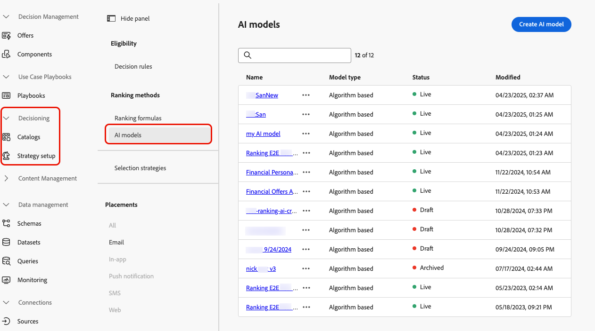
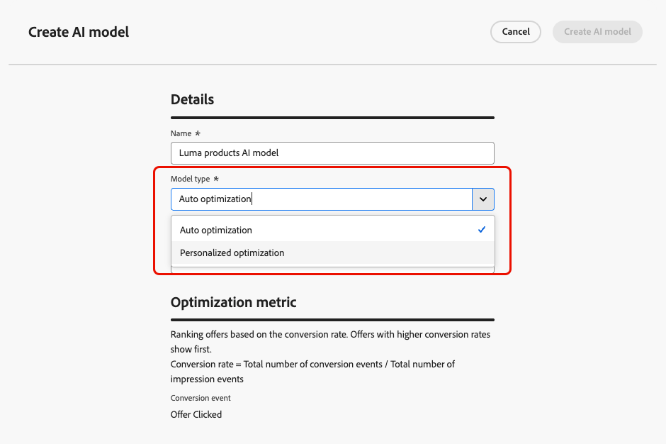
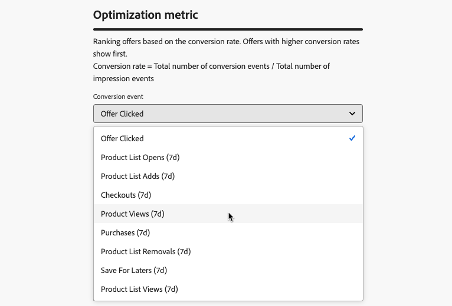
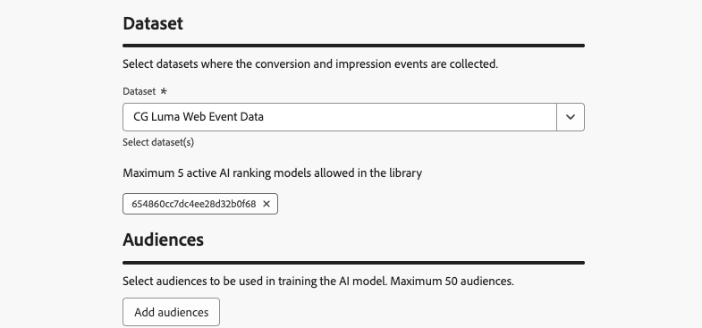

# 建立AI模型 {#create-ai-models}

[!DNL Journey Optimizer]可讓您建立&#x200B;**AI模型**，以根據您的業務目標來排名優惠。

>[!CAUTION]
>
>若要建立、編輯或刪除AI模型，您必須擁有&#x200B;**管理排名策略**&#x200B;許可權。 [了解更多](../../administration/high-low-permissions.md#manage-ranking-strategies)

## 建立 AI 模型 {#create-ranking-strategy}

>[!CONTEXTUALHELP]
>id="ajo_exd_ai_model_metric"
>title="最佳化量度"
>abstract="[!DNL Journey Optimizer] 根據&#x200B;**轉換率**&#x200B;對產品建議進行排名 (轉換率 = 轉換事件總數/曝光事件總數)。轉換率使用兩種類型的量度來計算：**曝光事件** (所顯示的產品建議) 和&#x200B;**轉換事件** (讓使用者透過電子郵件或網頁進行點選的產品建議)。我們會透過所提供的 Web SDK 或 Mobile SDK 來自動擷取這些事件。"

若要建立AI模型，請遵循下列步驟：

1. 建立將會收集轉換事件的資料集。 [了解作法](../data-collection/create-dataset.md)

1. 導覽至&#x200B;**[!UICONTROL 決策]** > **[!UICONTROL 策略設定]**&#x200B;功能表，然後選取&#x200B;**[!UICONTROL AI模型]**。

   

   列出目前為止建立的所有AI模型。

1. 按一下&#x200B;**[!UICONTROL 建立AI模型]**&#x200B;按鈕。

1. 為AI模型指定唯一名稱，並在需要時指定說明。

1. 選取您要建立的AI模型型別：

   * **[!UICONTROL 自動最佳化]**&#x200B;會根據過去的優惠效能來最佳化優惠。 [了解更多](auto-optimization-model.md)
   * **[!UICONTROL 個人化最佳化]**&#x200B;會根據對象和優惠效能來最佳化和個人化優惠。 [了解更多](personalized-optimization-model.md)

   

1. **[!UICONTROL 最佳化量度]**&#x200B;區段提供有關AI模型用來計算優惠排名之轉換事件的資訊。

   [!DNL Journey Optimizer] 根據&#x200B;**轉換率**&#x200B;對產品建議進行排名 (轉換率 = 轉換事件總數/曝光事件總數)。轉換率是使用兩種量度型別來計算：
   * **曝光事件** （顯示的選件）
   * **轉換事件** （透過電子郵件或網頁產生點按的優惠方案）。

   系統會使用所提供的網頁SDK或行動SDK自動擷取這些事件。 進一步瞭解[Adobe Experience Platform Web SDK](https://experienceleague.adobe.com/docs/experience-platform/edge/home.html?lang=zh-Hant)概觀。

   +++ 正在自訂[!DNL Customer Journey Analytics]量度上最佳化模型

   >[!NOTE]
   >
   >此功能僅供具有管理員許可權的[!DNL Customer Journey Analytics]客戶使用。
   >
   >開始之前，請確定您已將Journey Optimizer與Customer Journey Analytics整合，以便將Journey Optimizer資料集匯出至您的預設資料檢視。 [瞭解如何在 [!DNL Journey Optmizer] 中運用 [!DNL Customer Journey Analytics]](../../reports/cja-ajo.md)資料

   **[!UICONTROL 個人化最佳化]**&#x200B;模型是一種AI模型，可讓您定義業務目標，並利用客戶資料來訓練業務導向模型，以提供個人化優惠並最大化KPI。

   依預設，個人化最佳化模型會使用&#x200B;**優惠點按**&#x200B;作為最佳化量度。 如果您正在使用[!DNL Customer Journey Analytics]，[!DNL Decisioning]可讓您運用自己的自訂量度來最佳化您的模型。

   若要這麼做，請選取&#x200B;**[!UICONTROL 個人化最佳化]**&#x200B;模型型別，並展開&#x200B;**[!UICONTROL 轉換事件]**&#x200B;下拉式清單。 來自您的預設[!DNL Customer Journey Analytics] [資料檢視](https://experienceleague.adobe.com/zh-hant/docs/analytics-platform/using/cja-dataviews/data-views){target="_blank"}的所有量度都會顯示在清單中。 選取您想要最佳化模型的量度。

   {width=85%}

   >[!NOTE]
   >
   >根據預設，[!DNL Customer Journey Analytics]中的量度會使用「上次接觸」歸因模型，將100%的點數指派給轉換前發生的最近一次接觸點。
   >
   >雖然可修改歸因模型，但並非所有歸因模型都適用於AI模型最佳化。 建議您仔細選取符合您最佳化目標的歸因模型，以確保模型精確度和效能。
   >
   >如需有關可用歸因模型及其使用指南的詳細資訊，請參閱[[!DNL Customer Journey Analytics] 檔案](https://experienceleague.adobe.com/zh-hant/docs/analytics-platform/using/cja-dataviews/component-settings/attribution){target="_blank"}

   +++

1. 選取轉換和曝光事件收集所在的資料集。 在[本節](../data-collection/create-dataset.md)中瞭解如何建立這類資料集。

   {width=85%}

   >[!CAUTION]
   >
   >下拉式清單中只會顯示從與&#x200B;**[!UICONTROL 體驗事件 — 主張互動]**&#x200B;欄位群組（先前稱為mixin）相關聯的結構描述建立的資料集。

1. 如果您正在建立&#x200B;**[!UICONTROL 個人化最佳化]** AI模型，請選取要用來訓練AI模型的區段。

   <!--➡️ [Discover this feature in video](#video)-->

   >[!NOTE]
   >
   >您最多可以選取5個對象。

1. 儲存並啟動AI模型。

<!--At this point, you must have:

* created the AI model,
* defined which type of event you want to capture - offer displayed (impression) and/or offer clicked (conversion),
* and in which dataset you want to collect the event data.-->

現在，每次顯示和/或按一下優惠時，您都希望&#x200B;**[!UICONTROL 體驗事件 — 主張互動]**&#x200B;欄位群組使用[Adobe Experience Platform Web SDK](https://experienceleague.adobe.com/docs/experience-platform/edge/web-sdk-faq.html?lang=zh-Hant#what-is-adobe-experience-platform-web-sdk%3F){target="_blank"}或Mobile SDK自動擷取對應的事件。

若要能夠在事件型別（顯示優惠或按一下優惠）中傳送，您必須在傳送至Adobe Experience Platform的體驗事件中，為每個事件型別設定正確的值。 [了解作法](../data-collection/schema-requirement.md)

<!--
## How-to video {#video}

Learn how to create a personalized optimization model and how to apply it to a decision.

>[!VIDEO](https://video.tv.adobe.com/v/3445962?captions=chi_hant&quality=12)-->
